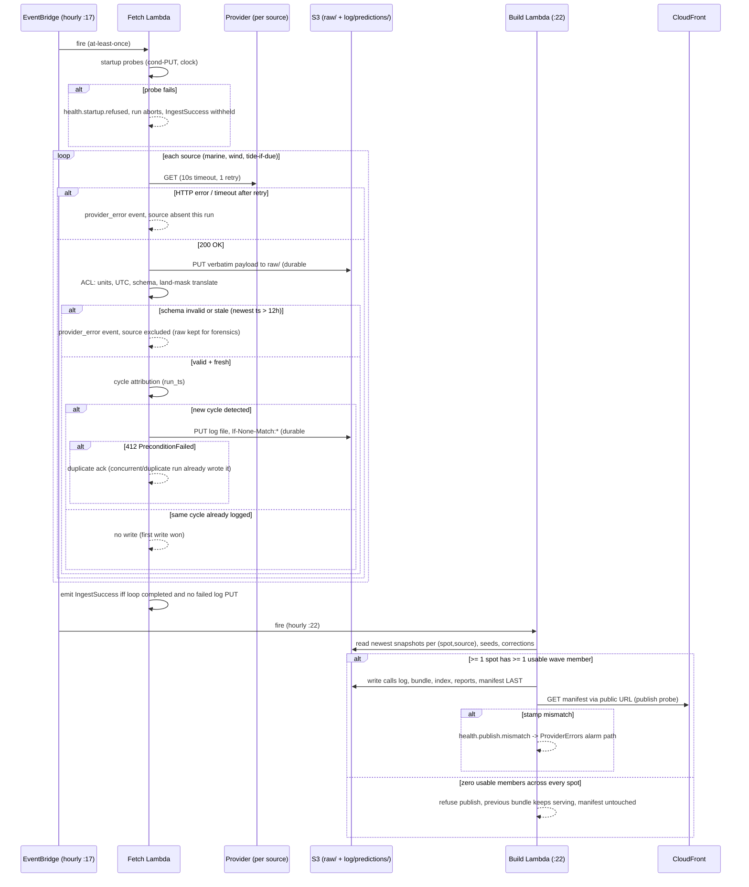

## Ingest Pipeline

Lane: ingest (nw-system-designer, DESIGN round 2). Date: 2026-08-08.
Fact rule: every endpoint, cadence, rate limit and terms claim below cites a file in
`docs/research/raw/` (all accessed 2026-08-08) or a live check run today, marked
**[live 2026-08-08]**. Nothing is stated from memory.
Consumed round-1 contracts: prediction log schema and key layout (Domain Model §5,
`adr-prediction-log-format.md`), PublishedCall log (Domain Model §6), runner and guardrails
(System Architecture §7, §9, `adr-ingest-runner.md`), bucket topology and probes (System
Architecture §5, §10). This document fills those contracts. It does not redefine them.

### Verdict block

| Question | Verdict |
|---|---|
| Primary wave source | **Open-Meteo Marine API, 4 members** (`ncep_gfswave016`, `ncep_gfswave025`, `meteofrance_wave`, `dwd_gwam`), the only members with data at Panama coastal points (research 09 §8.3, measured). ECMWF WAM and DWD EWAM return null at every tested spot and are not fetched. |
| Open-Meteo vs raw GRIB2 | **Open-Meteo for MVP, behind a hard adapter boundary** (`ForecastSourcePort`). Swapping to raw NOAA `gfswave` GRIB2 is a source-registry change plus one adapter, zero pipeline rewrite. Fallback verified live by the infra lane today (grib_filter 200, both Panama grids covered, `global.0p16` exists). Full trade-off: `adr-openmeteo-vs-raw-grib2.md`. |
| Tide source | **NOAA CO-OPS predictions API** (station 9812501 Balboa), free, public domain, live-verified (research 03 §2). WorldTides is the global-scale fallback adapter. Resolves a round-1 discrepancy (Domain Model diagram says CO-OPS, System Architecture says WorldTides): `adr-tide-source-chain.md`. |
| Log write position | **The snapshot is the run's first durable act, satisfying HANDOFF §3's requirement head-on: the first durable side effect of the run is the verbatim raw payload (the snapshot in provider form), and the normalized prediction log file follows immediately in the same function, before scoring, building, or publishing exist anywhere in the run.** Raw-before-log is deliberate: a parser crash after the raw PUT loses nothing (the hour is reconstructible for 30 days), whereas log-before-raw would let a parse bug destroy the hour outright. A crash halfway leaves every already-processed source's snapshot on S3. Section 3. |
| Partial failure rule | Spot publishes with >= 1 usable wave member; missing members recorded as absent log rows + `members_null` in the calls log; confidence downgrade is the scoring lane's f(M). Bundle refuses to publish only when every spot has zero usable members; the previous bundle keeps serving. Section 6. |
| Idempotency | Log files written with **S3 conditional PUT (`If-None-Match: *`)**: first write wins, a duplicate EventBridge fire gets 412 and treats it as a duplicate ack. Natural keys are the domain lane's: row `(spot_id, source, run_ts, valid_ts)`, file `(run_date, source, cycle, partition)`. Section 7. |
| run_ts honesty gap | Open-Meteo responses carry **no model-run metadata** (verified **[live 2026-08-08]**: response has only `generationtime_ms`, timezone, elevation, hourly arrays). `run_ts` for Open-Meteo rows is **inferred** by cycle schedule + a change-detection probe. GRIB2 carries exact run time and fixes this in phase 2. `adr-ingest-cycle-attribution.md`. |
| Cost of this lane | ~962 provider calls/day (9.6% of Open-Meteo's 10,000/day free cap), ~5.4k Lambda GB-s/mo (1.4% of free tier), ~5k S3 PUTs/mo (~$0.03). Inside every one of the eleven guardrails. Section 9. |

### 1. What this pipeline is, in one paragraph

Hourly, EventBridge Scheduler fires a zip-packaged fetch Lambda (512 MB, 60 s, reserved
concurrency 2, all fixed by the infra lane). It fetches 4 wave members + wind + tide for
every spot in the spot list (data, not code), archives the verbatim payloads, normalizes
them through a per-source anti-corruption layer, attributes each series to a model cycle,
and appends immutable snapshot files to `log/predictions/v1/`. A separate build Lambda
(hourly, offset 5 minutes) reads the log plus seeds, corrections and reports, and publishes
the region bundle. The fetch never scores; the build never fetches. The log is the only
contract between them.

Cadence mapping, to prevent a misreading of round 1: the infra lane's cost model already
assumed hourly fetching of both Open-Meteo APIs (its ~960 calls/day figure at 20 spots is
20 x 2 x 24, System Architecture §2/§8), so hourly fetch is a consumption of round 1, not
a change to it. The "4x/day model refresh" schedule maps to the phase-2 GRIB2 dispatch
lane (adr-ingest-runner), not to this loop.

### 2. Source-by-source table

Provider calls at launch (20 spots): marine 20/run, weather 20/run, hourly; tide 1 call/day
per station. Total ~962/day.

| # | Source (log `source` id) | Endpoint | Cadence (model) | Auth | Rate limit | Terms status | On failure |
|---|---|---|---|---|---|---|---|
| 1 | Wave members `ncep_gfswave016`, `ncep_gfswave025` | `marine-api.open-meteo.com/v1/marine?...&models=ncep_gfswave016,ncep_gfswave025,meteofrance_wave,dwd_gwam&timezone=UTC&forecast_days=8` (one call per spot returns all 4 members) | GFS-Wave: 4 cycles/day 00/06/12/18Z, hourly resolution (research 01 §1.5) | none | 600/min, 5,000/hr, 10,000/day, 300,000/mo (research 01 §1.3) | CC-BY-4.0, free tier non-commercial: satisfied (unmonetized, MIT, DISCUSS #29). **Gap: ToS silent on serving derived data to third parties, and as of 2026-08-08 the clarification email has NOT been sent** (HANDOFF §6.2); sending it is System Architecture §18 decision 7 | Retry once (1 s backoff) inside the 60 s budget; then member absent this run: no log rows for that member, `provider_error` event, build proceeds |
| 2 | Wave member `meteofrance_wave` | same call as #1 | MFWAM: 2 cycles/day, 12 h runs (research 01 §1.5) | none | shared with #1 | same as #1 | same as #1 |
| 3 | Wave member `dwd_gwam` | same call as #1 | GWAM: 2 cycles/day 00/12Z (research 05 §8) | none | shared with #1 | same as #1 | same as #1 |
| 4 | Wind (fills `wind_speed_kt`, `wind_dir_deg` on every wave row) | `api.open-meteo.com/v1/forecast?...&hourly=wind_speed_10m,wind_direction_10m,wind_gusts_10m&wind_speed_unit=kn&timezone=UTC` (wind is a separate Open-Meteo API, research 01 §13) | blended, sub-daily updates | none | shared free tier with #1 (research 01 §1.3) | same as #1 | Wave rows written with wind fields **null**; `provider_error` event; scoring lane owns the null-wind branch (§11) |
| 5 | Tide (fills `tide_m`) | `api.tidesandcurrents.noaa.gov/api/prod/datagetter?product=predictions&station=<per-spot ref>&interval=h&units=metric&time_zone=gmt` (research 03 §2, live-verified there) | deterministic harmonics, computed on request; we fetch 1x/day, 8-day window, cached to S3 | none | none published; 1 call/station/day is negligible | US public domain | Cached curve covers >= 7 more days, so tide degrades only after a week dark; then `tide_m` null + `provider_error`; scoring owns the null-tide branch |
| P2 | Raw `gfswave` GRIB2 (phase-2 enrichment AND the verified fallback for #1-#3) | grib_filter template verified **[live 2026-08-08]** by the infra lane (System Architecture §7); or `s3://noaa-gfs-bdp-pds` same-region (research 05 §12) | 4 cycles/day; availability ~3.5-5 h after cycle, wave-specific latency UNVERIFIED (research 05 §14) | none | none (public bucket / NOMADS CGI) | US public domain, redistribution-safe (research 05 §1) | n/a (is the fallback) |

**Fallback map when a member goes permanently dark** (registry swap + deploy, human-applied):

| Dark member | Fallback adapter | Terms | Notes |
|---|---|---|---|
| `ncep_gfswave016`/`025` | gfswave GRIB2 direct (row P2) | public domain | gains exact `run_ts` |
| `meteofrance_wave` | CMEMS `GLOBAL_ANALYSISFORECAST_WAV_001_027` (research 05 §6) | **UNVERIFIED commercial redistribution** (HANDOFF §6.1); read license first | same MFWAM family, ~9 km |
| `dwd_gwam` | DWD opendata GWAM `grib2.bz2` (research 05 §8) | CC-BY-4.0 | adds bz2 + GRIB2 decode |
| wind | GFS `UGRD/VGRD/GUST` via grib_filter (research 05 §2) | public domain | |
| tide | WorldTides v3 (research 01 §4) | explicit caching permission, attribution string required | $4.99/mo tier when needed; `adr-tide-source-chain.md` |

### 3. The run sequence, exactly, with the log write positioned

HANDOFF §3: a missed snapshot is gone permanently. Therefore the snapshot is written by the
fetch Lambda as the run's first business act, and the build is a separate process that can
only ever read it. Ordering per source, inside one fetch run (hourly at :17):

1. **Startup probes** (cold start only): S3 conditional-PUT probe, clock-skew probe
   (section 10). A failed probe refuses the run with `health.startup.refused`.
2. Load spot list and source registry. Mechanism, stated: both are git-owned data files
   (`data/spots/*.json` per Domain Model §11, plus this lane's `data/sources.json`)
   **packaged into the Lambda deployment artifact**, so a run's inputs are frozen by the
   immutable deployment package (a spot change is a PR + human deploy, consistent with
   seed-never-machine-written), the list cannot change mid-run by construction, and no
   runtime dependency on S3/SSM reads exists for configuration. Nothing keyed on country;
   grid and tide-station selection come from per-spot data.
3. Per provider call: fetch with 10 s HTTP timeout, one retry on transient failure
   (timeout, 5xx). Non-transient responses (4xx) are not retried: they are recorded as
   `provider_error` immediately since retrying a permission or contract failure only
   burns the time budget.
4. **Durable side effect #1: PUT the verbatim payload batch to `raw/<provider>/dt=<date>/<HH>/`**,
   before parsing. A parser crash after this point loses nothing: the hour is
   reconstructible from `raw/` for 30 days.
5. ACL normalize: units (kt, m, degrees), UTC timestamps, schema validation, freshness
   probe (newest `valid_ts` in payload < 12 h old, System Architecture §10), and the
   land-mask translation: `H==0 && T==0 && dir==0` on a row becomes `land_masked: true`
   (Domain Model §17, research 09 §8.3 Finding 2). Ships with the unit test the domain
   lane demanded.
6. Cycle attribution per source: assign `run_ts` (section 5). If the attributed cycle's
   file already exists in the log, this fetch confirms it and writes nothing.
7. **Durable side effect #2: gzip JSONL file per `(run_date, source, cycle, partition)`
   PUT to `log/predictions/v1/...` with `If-None-Match: *`.** 168 lead hours per spot per
   source per cycle (Domain Model §5.3 fidelity, D1). This is the prediction log write.
   It happens here, in the fetch Lambda, before any scoring exists, so that no downstream
   failure, build bug, or publish refusal can ever cost a snapshot. Mandate check,
   explicit: HANDOFF §3 demands the snapshot be the first durable side effect, not a step
   after scoring. Steps 4 and 7 together ARE the snapshot (verbatim form, then normalized
   form), they are the only durable writes the fetch run performs, and everything
   downstream of them only reads. Raw precedes log deliberately: reversing the order
   would let a parser defect destroy an hour that the raw archive makes recoverable.
8. Emit `IngestSuccess` iff the source loop completed and every attempted log PUT
   succeeded or was a verified duplicate (412). Provider failures do NOT withhold
   `IngestSuccess`: the dead-man alarm means "the pipeline is broken", `ProviderErrors`
   means "a source is broken". A failed log PUT (non-412) withholds it, so two
   consecutive failures ring the dead-man at 2 h. S3 5xx/throttle on the log PUT gets one
   retry inside the run; a 403 (permission drift) is persistent and fails the run loudly
   with no retry. Finer transient/persistent runbook handling is DEVOPS-wave work.

Build run (hourly at :22, separate Lambda, 1024 MB, 120 s):

9. Read newest usable snapshot per `(spot, source)` with `run_ts <=` build time (member
   selection rule is the domain lane's, Domain Model §6), seeds + `current/` corrections,
   recent reports from DynamoDB.
10. Score (scoring lane's functions), compose region bundle, then write in this order:
    `log/calls/` file, bundle, index, reports, **manifest last**. The manifest is the
    commit marker; TTLs (60 s manifest / 300 s bundle) bound reader skew to ~5 min.
11. Publish probe: GET the manifest back through the public CloudFront URL, compare build
    stamps (infra probe, System Architecture §10). Emit `BuildSuccess`.

Crash behavior: a crash between steps 4 and 7 for source B, after source A completed step
7, leaves A's snapshot durable and B's hour reconstructible from `raw/`. The next hourly
run re-attributes and re-writes idempotently. Each run also lists the previous 24 h of
expected log keys (one cheap S3 LIST): a missing file with surviving `raw/` is rebuilt in
place and emits `health.ingest.log_gap_repaired` (structured log event, no new metric).

### 4. One full run, with failure branches

### 5. Cycle attribution: filling `run_ts` honestly

The log's natural key needs the model cycle time, and its most important derived dimension
(`lead_h`) is computed from it. Verified **[live 2026-08-08]**: an Open-Meteo marine
response contains no run/cycle field, and no metadata endpoint for it surfaced in the
research corpus or a live probe (404). So for Open-Meteo rows, `run_ts` must be inferred.
Mechanism (full ADR: `adr-ingest-cycle-attribution.md`):

1. The source registry declares each model's cycle schedule and a conservative
   availability latency (GFS ~3.5-5 h per research 05 §2; MFWAM/GWAM latencies UNVERIFIED,
   default 6 h until measured).
2. Candidate cycle = latest cycle where `now >= cycle + latency`.
3. **Change-detection probe**: before writing the candidate cycle's file, compare the
   fetched series against the previously logged cycle's file on the overlapping
   `valid_ts` hours. Identical series means the provider has not swapped runs yet:
   attribute to the previous cycle, write nothing, retry next hour. Differing series
   means the new run landed: write the new cycle file.
4. Residual risk, stated: two consecutive runs could theoretically produce identical
   values at every compared point (treated as "no new run", costs one hour of latency,
   never a mislabel), and a provider republishing amended values inside one cycle would
   be recorded under first-write-wins (the earliest fetched opinion is kept, which is the
   honest snapshot semantics). The GRIB2 lane carries exact run metadata in the file name
   and GRIB headers, which both fixes attribution for NCEP members in phase 2 and lets us
   measure retroactively how often inference was wrong.

Hourly polling (not 4x/day) is what makes this work: the poll is the observation mechanism
for cycle arrival, and it is also why the pipeline picks up a new model run within ~1 h of
Open-Meteo serving it instead of at the next fixed slot. The infra lane's 4x/day schedule
maps to the phase-2 GRIB2 dispatch, not to this loop.

### 6. Partial failure: the exact rule

Partial failure is the normal case: 3 of 7 Open-Meteo models are null at every Panama
point on a good day (research 09 §8.3 Finding 1).

| Situation (per run) | Log effect | Publish effect |
|---|---|---|
| Wave member absent/stale/garbage at all spots | No rows for that member this cycle | Spot scores from remaining members; `members_used`/`members_null` recorded in calls log (Domain Model §6); confidence downgrade via the scoring lane's f(M) and C_fresh |
| Member land-masked at some spots | Rows written with `land_masked: true`, excluded from blends downstream | Per-(spot, source) unusability accrues to C3's scorecard |
| Wind down | Wave rows written, wind fields null | Scoring lane's null-wind branch; sub-score honesty is theirs |
| Tide down > 7 days (cache exhausted) | `tide_m` null | Scoring lane's null-tide branch |
| Spot has zero usable wave members | No usable rows for that spot | Spot enters the bundle in its no-data state (frontend day-one empty state), never a fabricated score |
| **Zero usable members, every spot** | Whatever rows arrived (possibly none) are still logged | **Build refuses to publish.** Previous bundle keeps serving via its S3 objects + `stale-if-error`; manifest stamp does not advance, so the user-facing staleness display stays honest |

The refusal rule is asymmetric on purpose: a stale-but-correct bundle beats an empty one
(System Architecture §5), and the manifest stamp advancing ONLY on a real publish is what
makes staleness visible instead of silently lying fresh.

### 7. Idempotency: what a duplicate run actually does

EventBridge Scheduler is at-least-once and the async invoke config is retry 0 + DLQ
(research 08 §10.5, fixed by infra). A duplicate fire:

| Surface | What happens | Why it is safe |
|---|---|---|
| Provider calls | Repeated (~42 calls) | 2x one hour's calls is 0.4% of the daily cap |
| `raw/` | Keyed `(provider, dt, HH)`: second write overwrites with an equivalent payload | raw/ is forensic, not the record of truth |
| `log/predictions/` | Conditional PUT returns **412**; treated as duplicate ack; the log is untouched | First write wins = insert-only enforced by the substrate, not by convention |
| `log/calls/` + bundle | Same `build_id` key (`b_<date>T<HH>Z`) overwritten with content derived from the same log state | Deterministic scoring (no LLM at launch, System Architecture §18 decision 4); a report arriving between the two runs changes reports.json only, both states valid |
| DynamoDB | Untouched: ingest writes no DynamoDB | The write path is a different lane (07) |

The row-level natural key `(spot_id, source, run_ts, valid_ts)` and file-level key
`(run_date, source, cycle, partition)` are the domain lane's, consumed as-is.

### 8. A source going dark quietly

The dangerous case is 200-with-garbage, not 500. Validation ladder, applied per source per
run, each rung emitting a `provider_error` structured event (counted by the existing
ProviderErrors metric filter, alarm at >= 3/h):

| Rung | Detects | Test | Action |
|---|---|---|---|
| ERROR | Network, HTTP >= 400, timeout | transport | absent this run |
| MALFORMED | 200 + schema-invalid JSON | ACL schema check | absent; raw kept |
| STALE | 200 + old data re-served | newest payload timestamp < 12 h (infra provider probe) | excluded as stale |
| MASKED | 200 + fake flat sea | `H==0 && T==0 && dir==0` per row | row flagged `land_masked`, never averaged (the verified live defect, research 09 §8.3) |
| ZOMBIE | 200, fresh-looking, but all members null or 100% masked | per-run usability ratio = usable rows / expected rows == 0 for a source | `health.ingest.source_dark` event + provider_error; source contributes nothing |
| FROZEN | provider stuck on one cycle | change-detection probe attributes every fetch to the old cycle for > 24 h | `health.ingest.source_dark`; confidence decays via C_fresh because no new rows exist |

Long-dark behavior needs no special machinery: absent rows mean the build's freshest
snapshot for that member ages, C_fresh falls, the scorecard's per-source unusability rate
(C3) records it, and the operator decides from the runbook whether to flip the registry to
the fallback adapter (table in section 2; config change, human-deployed per the
agents-read-only rule).

### 9. Guardrail and budget arithmetic (this lane's usage)

All inside the fixed values from System Architecture §9. No new metrics, no new alarms, no
schedule changes, no concurrency or timeout increases requested.

| Budget | Guardrail / allowance | This lane's usage | % |
|---|---|---|---|
| Open-Meteo calls | 10,000/day free (research 01 §1.3) | 480 marine + 480 weather + 2 tide-adjacent = ~962/day | 9.6% |
| Fetch Lambda time | 60 s timeout, conc 2 | ~15 s typical (42 calls, 4-way parallel, ~300 ms each + gzip/PUT) | 25% of timeout |
| Lambda compute | 400k GB-s/mo free | 24 x 30 x 15 s x 0.5 GB ≈ 5.4k GB-s/mo | 1.4% |
| S3 PUTs | infra costed ~20k/mo total | raw 1,440 + log writes ~480 + conditional attempts ~2,880 + tide 30 ≈ 4.8k/mo (+ build's ~2.9k) | ~$0.025/mo |
| raw/ size | <= 5 MB/hour cap (System Architecture §14 req 5) | ~0.5-1 MB/hour (2 batched payload objects) | <= 20% |
| Log growth | `predictions/` exempt from expiry | 0.36 GB/yr gz at 20 spots (Domain Model §5.3, measured) | $0.008/mo |
| CloudWatch | 5 metrics of 10, 4 alarms | 0 new; new events are log-only or ride ProviderErrors | 0 added |

Scale note, with the arithmetic: at 5,000 spots, hourly per-spot calls are 5,000 x 24 =
120,000/day against a 10,000/day cap: a 12x breach, not a margin problem. The infra
lane's global row (2,000-4,000/day) is **contingent on multi-coordinate batching that is
UNVERIFIED** (section 12); until a live batching test passes, the honest position is that
**raw GRIB2 (uncapped, public domain) is the global-scale wave path**, and the Open-Meteo
lane is launch-scale only. This does not touch launch: 20 spots run at 9.6% of cap.

### 10. Substrate probes (Earned Trust)

Existing infra probes consumed as-is: scheduler dead-man (alarm 1), provider freshness,
publish round-trip, IaC guardrail suite. This lane adds two, both in the fetch Lambda's
cold-start `probe()`:

| Probe | Substrate claim tested | Mechanism | On failure |
|---|---|---|---|
| Conditional-PUT probe | "S3 enforces `If-None-Match: *`" (the log's insert-only guarantee rides on it; local stacks and S3 clones often accept the header and ignore it) | PUT a sentinel under `probes/`, PUT it again, require 412 | `health.startup.refused`, run aborts, dead-man rings within 2 h |
| Clock-skew probe | "the Lambda clock is sane" (cycle attribution computes `now >= cycle + latency` from it) | compare local clock to the `Date` header of the first provider response; refuse if skew > 60 s | same refusal path |

The change-detection probe (section 5) is the third: it verifies the provider actually
swapped runs instead of trusting a schedule, which is the substrate lie this pipeline is
most exposed to.

### 11. Contract notes for other lanes

- **Scoring (05):** wave rows can carry `wind_speed_kt`/`wind_dir_deg` null (wind source
  down) and `tide_m` null (tide dark > 7 days). Your S_wind/S_tide need an explicit
  null branch; say what the sub-score does. `land_masked` rows reach you excluded already.
- **Learning (06):** `lead_h` fidelity differs by member: NCEP members produce 4
  cycles/day, MFWAM/GWAM only 2 (research 01 §1.5, 05 §8), so lead-bucket sample counts
  will be ~2x sparser for those sources. Also: Open-Meteo `run_ts` is inferred, not
  observed (section 5); treat pre-phase-2 lead buckets for non-NCEP members as +-1 cycle
  soft. The domain model's volume math (4 src x 4 runs) is an upper bound, not a promise.
- **Domain (data architecture): DELIVER BLOCKER.** The spot seed schema (Domain Model
  §11) has no tide station reference; this lane needs one datum per spot (e.g. a CO-OPS
  station id or a WorldTides flag). Named consumer: the tide adapter, joining on
  `spot_id`. The field's home and shape are the domain lane's to define (not invented
  here, question 12.6), but the tide adapter cannot be implemented until it exists:
  it must land before the first ingest slice in DELIVER.
- **Frontend:** per-spot data age is not in the bundle schema; the manifest stamp is the
  only staleness surface. If per-spot "forecast from 06Z run" display is wanted, that is
  a domain payload change with you as the named consumer.
- **Write path (07):** untouched by this lane; ingest writes no DynamoDB.

### 12. What I am unsure about

1. **Open-Meteo same-cycle value drift.** First-write-wins assumes a cycle's values are
   stable once served. If Open-Meteo re-blends mid-cycle, we keep the earliest opinion
   (defensible snapshot semantics) but nobody has measured how often that happens.
2. **Wave-specific gfswave availability latency** is UNVERIFIED (research 05 §14, assumed
   ~4 h from the coupled GFS cycle). Registry defaults are conservative until the phase-2
   lane measures real arrival times.
3. **MFWAM and GWAM latency behind Open-Meteo** is unmeasured; wrong estimates cost
   attribution latency (hours), not mislabels, because of the change-detection probe.
4. **Open-Meteo multi-coordinate batching** for the 5,000-spot call budget: UNVERIFIED.
   Irrelevant at launch, load-bearing at global scale unless GRIB2 takes over first.
5. **Change-detection false "no new run"**: two cycles with byte-identical series over the
   compared window would delay attribution by an hour per occurrence. Considered
   vanishingly rare over 48+ float comparisons; not proven.
6. **Tide station mapping as data** (section 11): the right home (seed file vs a separate
   ingest config keyed by `spot_id`) is the domain lane's call; the pipeline only needs
   the join key to exist. Nothing hardcoded to Panama either way: Balboa is row data.
7. **CO-OPS coverage outside US-operated stations** at global scale: Panama works because
   the Balboa/Cristobal harmonic stations exist (research 03 §2); an arbitrary future
   country may not have one, which is exactly why the WorldTides adapter is specified now.

**Launch verification owed to DELIVER/DEVOPS** (each closes an UNVERIFIED item above):

| # | Verification | Closes | Pass rule |
|---|---|---|---|
| V1 | Measure real arrival latency per model over the first 7 days (cycle transition times observed by the change-detection probe, from structured events) | unsure 2, 3 | Update registry latencies from measurement; any measured latency exceeding its registry estimate by > 2 h is a registry fix before trusting attribution |
| V2 | Count probe "no new run" streaks longer than the model's cycle interval | unsure 5 | Streak rate > 1% of cycles means the comparison window needs widening |
| V3 | Live multi-coordinate batching test against Open-Meteo (100 coords) before any region past ~200 spots ships | unsure 4 | Fail means GRIB2 becomes the declared global wave path (section 9) |
| V4 | Phase-2 GRIB2 cutover: compare observed run_ts against inferred run_ts retroactively for NCEP members | unsure 1, §5 risk | Mislabel rate > ~1% triggers §13 decision 3 option (b) |

### 13. Decisions needing Andres

| # | Decision | Options | My recommendation |
|---|---|---|---|
| 1 | Launch posture if Open-Meteo has not answered the redistribution email by launch | (a) Launch on Open-Meteo under the CC-BY-4.0 reading, attribution rendered in UI, adapter ready; (b) hold launch for the reply; (c) pull GRIB2 into the MVP and skip the question for waves | **(a).** Unmonetized + MIT satisfies the non-commercial tier; CC-BY-4.0 "permits redistribution and derivative works with attribution" (research 01 §1.8). The adapter boundary caps the blast radius of a "no" at one registry change. (c) buys legal certainty at the cost of eccodes/container complexity the MVP does not need. |
| 2 | Tide source at launch | (a) NOAA CO-OPS Balboa, $0, public domain; (b) WorldTides day one, $4.99/mo eventually, global from the start | **(a)** — `adr-tide-source-chain.md`. The WorldTides adapter ships as spec so going global is config, not code. Also resolves the round-1 doc discrepancy in favor of CO-OPS. |
| 3 | run_ts attribution for Open-Meteo rows | (a) Inferred cycle + change-detection probe, GRIB2 fixes NCEP members in phase 2; (b) pull gfswave GRIB2 forward to MVP for exact run_ts on the primary member | **(a)** — `adr-ingest-cycle-attribution.md`. (b) is the first thing to revisit if phase-2 measurement shows inference mislabeled cycles more than ~1% of the time. |
| 4 | Fetch cadence | (a) Hourly poll (the design above); (b) 4x/day aligned to cycles, ~76% fewer provider calls | **(a).** The calls are free at 9.6% of cap, the poll IS the cycle-arrival observation mechanism, and the dead-man alarm wants an hourly heartbeat. (b) saves nothing that is scarce. |

### ADR index (this lane)

| ADR | Decision |
|---|---|
| `adr-openmeteo-vs-raw-grib2.md` | Open-Meteo primary behind ForecastSourcePort; GRIB2 the verified fallback and phase-2 enrichment |
| `adr-tide-source-chain.md` | CO-OPS harmonics primary, WorldTides global fallback; station ref is per-spot data |
| `adr-ingest-cycle-attribution.md` | Inferred run_ts + change-detection probe; S3 conditional PUT enforces insert-only |
