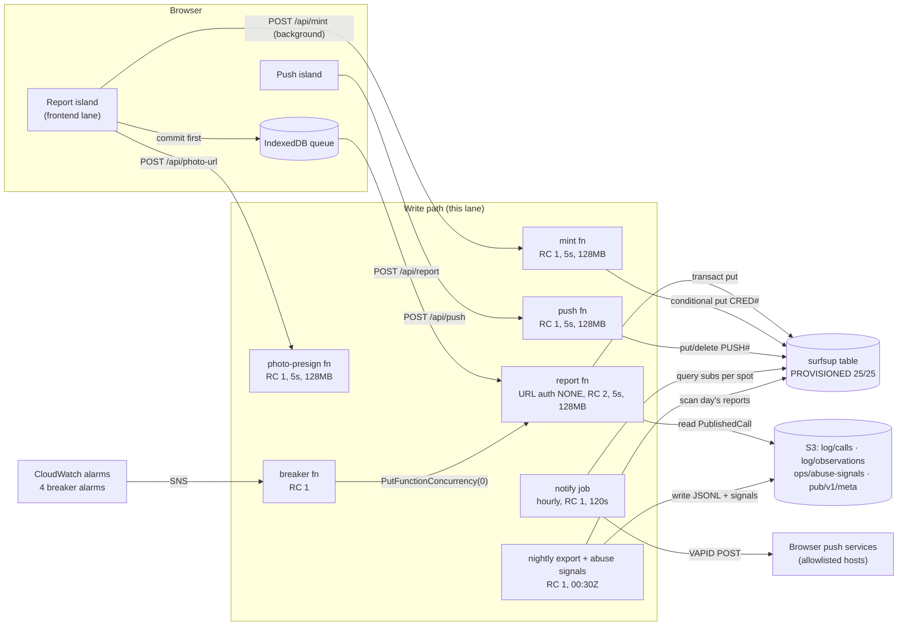
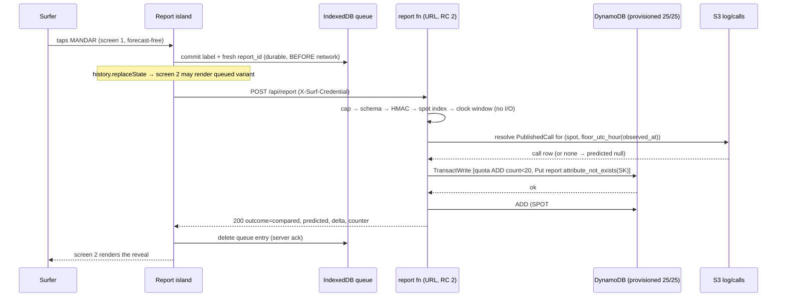
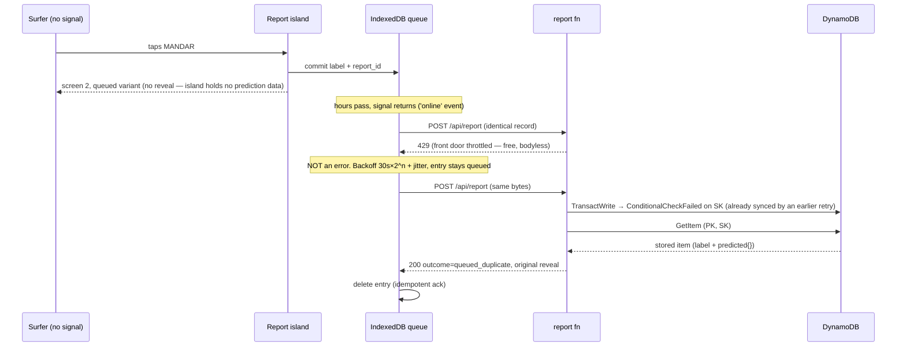
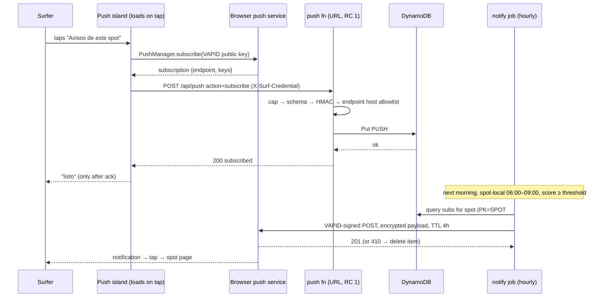

## Write Path

**Lane:** DESIGN round 2, write path (C2 ingest surface, C5 mint, push subscriptions). **Status:** PROPOSED, 2026-08-08. **Owner file.** Consumes, never redesigns: `domain-model.md` (§7 observation record, §8 identity, §12 store keys), `adr-report-label-immutability.md`, `adr-identity-claim-merge.md`, `adr-write-store-single-table.md` (keys honored; billing mode superseded, see ADR), `application-architecture.md` §7–§8 (payload contracts P2–P7), `adr-report-flow-leak-isolation.md`, `06-learning-layer.md` §3, `system-architecture.md` guardrails, and `docs/research/raw/15-anonymous-write-path-abuse-protection.md` — the settled abuse analysis. Its layered defence table is implemented here, not re-derived. Greenfield repo, no `src/`, no reuse candidates beyond the settled round-1/round-2 designs listed above.

**Verdict up front:**

| Question | Verdict |
|---|---|
| Front door | **Four bare Lambda Function URLs (report, mint, push, photo-presign), auth type `NONE`, CORS locked to the site origin, NOT behind CloudFront.** Contradicts `system-architecture.md` §5/§6/guardrail 6. Resolution owned by this lane per dispatch; `adr-write-path-off-cloudfront.md` |
| Rate limiter | Reserved concurrency: report **2**, mint **1**, push **1**, presign **1**. A 429 at the front door is free (research 15 §5.1) and reads to the user as "still queued", never an error |
| Store | The settled single table, keys verbatim from domain model §12 — but **provisioned 25 WCU / 25 RCU, never on-demand**. Fails closed, $0 under attack; `adr-write-store-provisioned-capacity.md` |
| Identity | `device_id` stays client-minted (settled). The server **countersigns it at first sight**: HMAC credential with a signed `issued_at`. Verification is a stateless HMAC check, no database read; `adr-anonymous-credential-trust-tiers.md` |
| Trust vs display | A report is **accepted, stored and displayed instantly** (decisions 4, 11 intact). Whether it counts toward the learned correction and the scorecard is gated by credential age/history — **config shipped at zero** (no gate at launch), flippable retroactively because every record carries `credential_issued_at` and `received_at` from day one |
| The scorecard finding | Research 15 §15.1a is **partially closed already**: round 1 shipped `claim_ok` (n ≥ 10, ≥ 5 distinct, \|b\| > 2·se) as a display gate. The residual — distinctness is attacker-mintable, and the significance gate rewards coordinated lying — is closed here (trust-eligible distinctness) and flagged to the learning lane (se floor). §7 |
| Push | Direct Web Push (VAPID over HTTPS) from a scheduled notify Lambda, endpoint host allowlist, 1 notification/spot/day + one afternoon solicitation follow-up. Worst-case abuse cost $0.00; math in §8.5; `adr-push-vapid-direct.md` |
| Worst-case dollars | Breaker works: **< $1/mo**. Breaker broken: **≈ $14/mo** (under the $20 alarm). The only path to a large bill is the **unverified** 429-egress question (research 15 §15.3), carried forward in §13, not laundered into certainty |
| Blocking precondition | The account's Lambda `Concurrent executions` quota must allow reserved concurrency at all (research 15 §5.0, UNVERIFIED on this 3-day-old account). If the applied quota is ≤ 102, the rate limiter, the breaker and the mint cap **do not exist**. First launch-checklist item, before anything else |

---

### 1. Contradictions with settled docs — owned resolutions, stated for the round-3 coherence review

Two independent lanes flagged #1; the dispatch assigns the resolution here. None of the settled docs is edited by this lane; each row names what must change there.

| # | Settled doc says | This lane says | Why | What the other doc must change |
|---|---|---|---|---|
| 1 | `system-architecture.md` §5 (behavior table `/api/*` → Function URL via CloudFront OAC + `AWS_IAM`), §6, guardrail 6 | Write endpoints on **bare Function URLs, auth `NONE`**, never behind CloudFront | A rejected request behind CloudFront bills $1.00–$2.20/M and eats the read path's 10M free requests; at a bare URL a throttled 429 bills nothing (research 15 §5.1, §7 — 25–55× per rejected request). OAC "hiding" protects nothing: the URL ships in a public repo's client bundle | Remove the `/api/*` CloudFront behavior; amend guardrail 6's CDK assert from "`AuthType: AWS_IAM` on every Function URL" to "`AuthType: NONE` + `AllowOrigins` = exact site origin on the four write URLs" |
| 2 | `system-architecture.md` §3/§8 and `adr-write-store-single-table.md` say **on-demand** DynamoDB | **Provisioned 25 WCU / 25 RCU** (exactly the free tier) | On-demand fails open: an attack past Lambda is served and billed at $0.625/M writes ($32/mo at the N=2 ceiling). Provisioned throttles for free (research 15 §9). Keys, item types, GSIs untouched | Billing-mode note in both docs; the CDK assert gains `BillingMode: PROVISIONED` on the table |
| 3 | `system-architecture.md` §6 layer 3 + guardrail 7: **per-IP daily quotas** via `CloudFront-Viewer-Address` | **No IP-based quotas, ever** | Panama runs carrier-grade NAT: one mobile IP is a whole town at the beach; an attacker rotates cloud IPs for cents. Wrong on both sides (research 15 §11). Also mechanical: off CloudFront the header does not exist | Drop guardrail 7's per-IP rows. Device quotas stay (extended in §7.2) |
| 4 | `system-architecture.md` guardrail 2: report API timeout **10 s** | **5 s** on all four write functions | Handler duration is roughly proportional to the worst-case bill (research 15 §5.4). 5 s is still 100× the 50 ms target. Compatible with the existing ≤ 120 s assert | Optional tightening of the guardrail text; no assert change needed |
| 5 | `application-architecture.md` P2: `report_uuid`, "client-minted v4" | Field name **`report_id`**, shape **ULID** | Domain model §7.3/§12 settled the record and the SK on a client-minted ULID; P2's names are declared placeholders. One idempotency datum, one shape: `^[0-9A-HJKMNP-TV-Z]{26}$` | Frontend renames the island's field; no behavior change |
| 6 | `application-architecture.md` P2 sends `queued_offline` and `lang` on report submission | **Accepted on the wire, not persisted** | No named consumer (clause `data:consumer-known-before-produced`): offline-ness is derivable from `received_at − observed_at` (domain model §7.3 says so); reveal copy is rendered client-side, so report `lang` has no server reader. (`lang` on push subscriptions IS stored — the notify job composes payload copy; §8) | Round 3: either name a consumer or drop the two fields from P2 |
| 7 | `06-learning-layer.md` G2 / domain model §9 `claim_ok`: distinctness = `distinct(reporter_key)` | Distinctness input becomes **distinct trust-eligible** `reporter_key` (eligibility per §7.3; identical behavior at launch since the gate ships at zero) | "5 distinct reporters" over freely mintable ids is not an anti-gaming control (research 15 §11.2) | Learning lane consumes `data/config/trust-gate.json` (§7.3) in G2 and in the scorecard's `distinct_reporters`; interface renegotiation per its own §3 rule |
| 8 | `06-learning-layer.md` G3: `\|b\| > 2·se` | Unchanged here, but **flagged: as written it rewards coordination** — consistent lies have smaller sample se than honest noisy reports (research 15 §15.1) | A gate must not get easier to pass as the input gets more suspicious | Proposal to the learning lane: floor the se at physical noise, `se := max(se_sample, 0.5·σ_eff/√n)` with σ_eff = 0.48 m (their §8 prior), so zero-variance coordination cannot buy significance below plausibility. Their call, their file |

Alignment, not contradiction: `adr-identity-claim-merge.md` rejected *server-issued* device ids. This lane keeps ids client-minted; the server only **countersigns** first sight. The rejection stands.

### 2. Topology



| Function | URL | Reserved conc. | Timeout | Memory | Why separate |
|---|---|---|---|---|---|
| `report` | POST `/api/report` | **2** | 5 s | 128 MB | The hot path; its own blast radius and breaker |
| `mint` | POST `/api/mint` | **1** | 5 s | 128 MB | Second open write path (research 15 §14.1a); minting is once per device, 10 RPS = 864k devices/day |
| `push` | POST `/api/push` | **1** | 5 s | 128 MB | Third anonymous write surface (research 15 §15.5, analysed in §8.4) |
| `photo-presign` | POST `/api/photo-url` | **1** | 5 s | 128 MB | Handing a presigned PUT to a stranger is the most expensive grant on this list (§9) |
| `notify` | none (scheduled hourly :25) | 1 | 120 s | 256 MB | Send fan-out; never on the request path |
| `export` | none (scheduled 00:30 UTC) | 1 | 120 s | 512 MB | AP13 observation export + abuse signals (§7.4) |
| `breaker` | none (SNS-invoked) | 1 | 10 s | 128 MB | `PutFunctionConcurrency(0)` on the alarmed function; EventBridge one-shot restores after 6 h |

CORS on each URL: `AllowOrigins` = the exact site origin (IaC config value, never `*`), `AllowMethods: POST`, `AllowHeaders: content-type, x-surf-credential`, `MaxAge 86400`. CORS is browser-only discipline, not a defence (research 15 §4) — it stops casual embedding, nothing else. Reserved-concurrency total across all lanes ≈ 16 of the ≥ 900 available at the default quota; the §5.0 precondition check covers the reduced-quota case.

No GET endpoints exist anywhere on the write path. The reveal is the POST response and nothing else (`adr-report-flow-leak-isolation.md` decision 2 — honored server-side: there is no URL from which a reveal can be fetched, prefetched, or cached). No share endpoint exists: decision 30's WhatsApp card is client-only composition.

### 3. Anonymous identity: mint and credential

Design detail and rejected alternatives: `adr-anonymous-credential-trust-tiers.md`. Summary:

- **Credential** = `v1.<device_id>.<issued_at_epoch>.<sig>` where `sig = base64url(HMAC-SHA256(key, "v1." + device_id + "." + issued_at))`. ~110 chars, sent as `X-Surf-Credential` on report, push and presign calls.
- `device_id` stays the client-minted `d_` + 128-bit-random of domain model §8 (shape `^d_[0-9a-f]{32}$` — §8's "128-bit" is authoritative; the §7.3 example is display-truncated). The server never generates ids; it attests **when it first saw one**.
- **`issued_at` is server-set and signed** — the one thing an attacker cannot mint: age. Client cannot backdate it; re-minting returns the *original* `issued_at` (conditional put on `CRED#<device_id>`; if the item exists, re-sign with the stored timestamp). Losing browser storage = new device = fresh age, the settled cost of anonymity.
- **Verification is stateless**: recompute the HMAC, compare, check shape. No table read, so the report handler stays inside its 60 ms budget (research 15 §5.4 — handler duration is the bill).
- **Mint ledger** (research 15 §14.1a): one item per mint — `PK = CRED#<device_id>`, `SK = MINT` (the composite key enforces one ledger entry per device, which is what makes re-mint idempotence checkable), attrs `{issued_at: ISO8601, src_hash: <32 hex>}`. **No TTL** — the ledger is append-only forensics; ~100 B/item, tens of millions fit the free 25 GB. `src_hash = hex(HMAC-SHA256(key, source_ip))[:32]` (first 128 bits) — mint-burst forensics without storing an IP; raw IP is never persisted (the write path's no-PII property holds). Consumer: the §7.4 coordination detector, join key `src_hash` across MINT items. Without the ledger, mass minting is invisible and credentials are uncountable and unrevocable.
- **Key**: 256-bit, SSM `SecureString` `/surfsuppanama/prod/credential-hmac-key` (per `adr-secrets-public-repo.md`), read at cold start, self-tested at startup (§10). Rotation: the `v1` prefix versions the scheme; rotation = add `v2` signing while verifying both, runbook entry.

**Endpoint contract — POST `/api/mint`:**

| | Value |
|---|---|
| Request | `{"device_id": "d_<32 hex>"}` ≤ 1 KB. Tier-2 active: second call adds `{"pow": {"salt": "...", "counter": n}}` |
| 200 | `{"credential": "v1.d_….<epoch>.<sig>", "issued_at": "<ISO8601>"}` — idempotent; age never resets |
| 400 | `{"error":{"code":"device_id_malformed","what":"device_id does not match ^d_[0-9a-f]{32}$","why":"the credential binds to this exact id","how":"re-mint the id per domain model §8 and retry"}}` |
| 403 (tier 2 only) | `{"error":{"code":"pow_required","challenge":{"salt":"<signed, 5-min expiry>","complexity":40000},"what":"proof of work is active","why":"scripted mass minting was detected","how":"solve in the worker and re-POST"}}` |
| 429 | Front-door throttle, may be bodyless. Client backs off (base 30 s, ×2, cap 1 h, jitter) and retries; reports stay queued meanwhile |

**PoW tier 2, built dormant** (research 15 §14.2): server flag in SSM (`/surfsuppanama/prod/mint-pow-enabled`, default `false`). Challenge = server-random salt HMAC-signed with a 5-minute expiry, bound to `device_id`; verify = `SHA-256(salt + counter)` under target + signature + expiry. Complexity tuned to ≈ 1 s on a Galaxy A14 (≈ 40,000 given ALTCHA's 100k = 2.5 s benchmark, research 15 §10.2). Client side is the frontend lane's: hand-rolled `crypto.subtle` in a Web Worker, < 1 KB, **never the 30 KB ALTCHA widget** (research 15 §10.3). Replay inside the 5-minute window is accepted: mint is idempotent, a replay mints nothing new.

**Client contract**: mint fires in the background at first page load, while the user reads the forecast. A report POSTed without a valid credential gets 401 (`credential_missing` / `credential_invalid`, each with WHAT/WHY/HOW naming `/api/mint` as the fix); the island mints and retries silently. No user-visible step exists anywhere in this flow — decision 11's zero friction is preserved because the *user* never waits on minting, only the queue does.

### 4. Report submission

#### 4.1 Request contract — POST `/api/report`

One report per POST. Batch submission is rejected as an option: it breaks the one-reveal-per-report shape of P3, misaligns WCU consumption per invocation (research 15 §9 caveat), and buys nothing — a 10-report flush is 10 free invocations.

```json
{
  "report_id": "01J4QZK8Y3E9RWM2P7T6B1XCVN",
  "spot_id": "playa-venao",
  "observed_at": "2026-08-08T12:41:00Z",
  "submitted_at": "2026-08-08T12:44:12Z",
  "size_band": "waist_chest",
  "size_band_schema": 1,
  "wind": "clean",
  "quality": "good",
  "trigger": "organic"
}
```

Headers: `X-Surf-Credential` required, `Content-Type: application/json`. Field mapping to P2: `report_id`←`report_uuid` (§1 row 5), `observed_at`←`captured_at`, `size_band`←`size_category`, `wind`←`wind_category`; `queued_offline`/`lang` accepted, not persisted (§1 row 6). `trigger` is the learning lane's required field (its §3, D1 option (a) adopted): `"organic"` default; `"push_solicited"` set by the island when the flow was opened from a solicitation push deep link (`/spots/{slug}/reportar?t=ps`, §8.3).

#### 4.2 Handler pipeline — cheapest check first (spam handling at ingest, layer by layer)

| # | Check | Cost | On failure |
|---|---|---|---|
| 1 | Body ≤ 4 KB, before JSON parse | ~0 | 413 `payload_too_large` |
| 2 | JSON parses; schema (fields, enums, `size_band_schema` = current) | ~0 | 400 `schema_invalid` (names the field) |
| 3 | Credential HMAC + shape | ~0 (no I/O) | 401 `credential_missing` / `credential_invalid` |
| 4 | `spot_id` in the spot index (cold-start-cached `pub/v1/meta/spot-index.json`, §4.5) | ~0 warm | 400 `unknown_spot` — junk-spot writes never reach the table |
| 5 | Clock plausibility: `received_at − 12 h 15 m ≤ observed_at ≤ received_at + 15 m` (domain: back-dating ≤ 12 h; 15 m skew) | ~0 | 400 `observed_at_out_of_range` (carries both bounds and the server time so the client can correct) |
| 6 | Resolve `predicted{}` from `log/calls/` (§4.5) | 1 S3 GET on cache miss | proceed with `predicted: null` (settled, domain model §15.4) |
| 7 | **TransactWriteItems**: quota `ADD` with condition + report `PutItem` with `attribute_not_exists(SK)`. Quota item is the settled `(DEV#<device_id>, QUOTA#<yyyy-mm-dd>)` TTL item (domain §12), extended with **one counter attribute per surface** — `{reports, presigns, subs}`, each `ADD`ed under its own `< limit` condition, TTL 2 days (guardrail 7) | 4 WCU | quota branch → 429 `quota_exceeded` + `Retry-After`; dedup branch → §4.4 duplicate path |
| 8 | Counter `ADD 1` on `(SPOT#<id>, COUNTER)`, `ReturnValues: UPDATED_NEW` | 1 WCU | reveal counter falls back to stored scorecard `n`; drift is one-directional undercount, display-only (authoritative `n_obs` is C3's) |

Invalid traffic (steps 1–5) costs < 5 ms and zero I/O beyond the warm cache — an attacker who gets past the free 429s buys us almost nothing in duration. Steps 7's transaction makes quota-vs-dedup atomic: a duplicate retry never burns quota, and an over-quota report is never stored. The `(SPOT#, COUNTER)` item and the `CRED#` items are **additive item types** to the settled §12 table — no settled key changes.

Write arithmetic against provisioned capacity: accepted report = 4 WCU (transact) + 1 (counter) = **5 WCU** → the 25 WCU table sustains ≈ 5 accepted reports/s, below the Lambda 20 RPS cap, so DynamoDB throttles first during a genuine mass sync. That ordering is safe by construction: a throttled write returns 429 and the report **stays queued on the device** — never dropped (research 15 §9 caveat, honored).

#### 4.3 Response contract (P3 honored exactly)

```json
{
  "outcome": "compared",
  "report_id": "01J4QZK8Y3E9RWM2P7T6B1XCVN",
  "predicted": {"score_q": 82, "size_band": "chest_head", "size_range_m": [1.1, 1.6],
                 "wind_state": "clean", "conf_level": "medium"},
  "delta": {"score_points": 12, "size_bands": 1},
  "counter": {"n_reports": 8, "threshold": 30}
}
```

| `outcome` | When | Payload |
|---|---|---|
| `compared` | A PublishedCall existed for `(spot_id, floor_utc_hour(observed_at))` | As above. `delta.score_points = predicted.score_q − q_obs(quality)` using the canonical anchors (learning §8: 20/45/70/90 — one constants file, two consumers: this reveal and C3's score residual); `delta.size_bands` = predicted band index − observed band index. Both signed, positive = we ran big |
| `no_snapshot` | No call logged for that hour (builder down) | `predicted: null`, no `delta`, counter present. Screen 2 says so plainly — never fabricate (research 09 §14.4) |
| `queued_duplicate` | `report_id` already stored | **The original reveal**, rebuilt from the stored item's `predicted{}` + label — byte-equivalent rendering (P3/P4). Not double-counted, quota untouched |

Error responses, all shaped `{"error": {"code", "what", "why", "how"}}` (clause `gate:self-explaining-what-why-how`): `payload_too_large` 413, `schema_invalid` 400, `unknown_spot` 400, `observed_at_out_of_range` 400, `credential_missing`/`credential_invalid` 401, `quota_exceeded` 429 + `Retry-After`, `throttled` 429 (may be bodyless from the front door), `store_unavailable` 503. Client behavior per P2: 4xx → show the reason, keep the label locally, never silently drop; 5xx/timeout/429 → stays queued, backoff (base 30 s, ×2, cap 1 h, jitter). **429 is not an error state in the UI** — same pending state as no signal, no toast, no red (research 15 §5.5, hard constraint).

#### 4.4 Dedup on re-sync (decision 26, P4)

Dedup key is **`report_id` alone**, as P4 requires. Implementation is the settled §7.4 conditional put: PK+SK contains `report_id`, and the client invariant "retry re-sends the identical record, never re-mints" (settled) makes the PK+SK condition equivalent to id-alone dedup. `observed_at` is preserved as the observation time and joined against the prediction log; sync time never overwrites it. On the transaction's dedup cancellation the handler issues one `GetItem` (1 RCU, rare path) and returns `queued_duplicate` with the original reveal.

#### 4.5 `predicted{}` resolution (settled §7.4, implementation stated)

The build live at `observed_at` = the latest `log/calls/v1/dt=<date>/build=<HH>Z/<region>.jsonl.gz` with `HH ≤ hour(observed_at)`, walking back ≤ 3 hours on 404. Region and geohash4 tile come from `pub/v1/meta/spot-index.json` — a **new small build artifact this lane requires from the builder** (producer: site build; consumers: this handler for S3 key construction, spot validation and GSI2 tile computation at write time; join key `spot_id`; ~1 KB). The handler caches the index and the last ~13 hourly call files in module scope; a cold start pays one S3 GET, warm requests pay none. Falls to `predicted: null` on any miss — degrade documented, never a 5xx.

#### 4.6 Sequence — report submitted online



The label committed at step 2 — before any network — is what makes the reveal safe: no response, timeout or retry can reopen the form (`adr-report-flow-leak-isolation.md`).

### 5. Offline queue and sync

Client-side queue mechanics (IndexedDB, flush triggers, sentinel probe) are the frontend lane's (`application-architecture.md` §12). This lane's contract with it:

- Retry re-sends the **byte-identical** record. Never re-mint `report_id`, never touch `observed_at`.
- Flush order: mint completes before the queue flushes (a queued report needs a credential; the mint is idempotent so this never blocks more than one round trip).
- Any 429 or 5xx → the entry stays queued, exponential backoff with jitter. Any 200 (`compared`, `no_snapshot`, `queued_duplicate`) → delete the entry.
- 4xx other than 429 → surface the reason, keep the label locally (P2), do not retry mechanically: the record will not become valid by waiting.
- Bursts from one device on re-sync are **normal traffic** (decision 26). Nothing in this design treats per-device burst as an abuse signal; the quota (20/day) is the only per-device bound and a full day's honest queue sits far under it.

#### Sequence — report queued offline, then synced



### 6. The report record, field by field

Settled shape = domain model §7.3, verbatim. This lane adds **three fields** (bold), each with a named consumer and join key. This is the day-one requirement the whole trust design rests on: the gate can be flipped **retroactively** only because these fields exist on every record from the first report.

| Field | Set by | Consumers | Join key |
|---|---|---|---|
| `PK/SK` = `SPOT#<spot>` / `REP#<observed_at_utc>#<report_id>` | server from body | dedup natural key; builder AP2; export AP13 | PK+SK |
| `report_id` (ULID, client-minted at commit) | client | dedup; photo attach ref; learning `trigger` join | `report_id` |
| `device_id` | server, **from the credential** (never from the body) | C5 resolution; per-user offsets `u_r`; quota; GSI1 | `device_id` |
| `observed_at` (UTC) | client (≤ 12 h back-datable) | verification join `floor_utc_hour(observed_at) = valid_ts`; SK ordering | `(spot_id, hour)` |
| `submitted_at` | client, at send | offline-latency derivation (with `received_at`) | — |
| **`received_at`** | **server clock, authoritative** | trust gate (credential age at receipt); clock-plausibility audit vs `observed_at`/`submitted_at`; coordination detector cadence (§7.4) | `report_id` |
| **`credential_issued_at`** | **server, from the verified credential** | trust gate: `age = received_at − credential_issued_at`; cohort analysis in the detector | `device_id` |
| **`trigger`** (`organic` \| `push_solicited`) | client (from the `?t=ps` deep link) | learning §6.3 propensity weights; monthly imbalance metric | `report_id` |
| `size_band`, `size_band_schema`, `wind`, `quality` | client | C3 residuals + Brier label; C4 recent-reports feed | `(spot_id, hour)` |
| `build_id` + `predicted{}` | server, authoritative at accept (§4.5) | reveal (this doc §4.3); Brier pairing; drift audit | `report_id` |
| `photo_ids[]` | resize pipeline, append-only (§9) | photo display; C3 dispute checks | `report_id` |
| GSI1/GSI2 keys | server (tile from spot index, never from country) | AP3/AP4/AP13 | per §12 |

What each downstream layer needs, cross-checked: the **learning layer** gets its residual join (`observed_at`), its reporter key (`device_id` → C5), its solicited flag (`trigger`), and its trust inputs (`credential_issued_at`, `received_at`). The **scorecard** gets `n` and distinctness from the same records via the incremental updater — no new fields needed there because eligibility is computed at aggregation time, late-resolved exactly like `reporter_key` (adr-identity-claim-merge pattern: store the fact, resolve late). The **reveal** gets `predicted{}` captured at accept. Nothing is stored without a reader.

### 7. Spam handling at ingest, and the trust gate

#### 7.1 Threat priorities (research 15 §3, adopted verbatim)

Cost attack first (the only one that can end the project), poisoning second (bounded, reversible), nuisance junk **explicitly accepted** — 25 GB free storage is tens of millions of reports; not one unit of user friction is spent on it.

#### 7.2 The tier table as implemented (triggers named)

Tier 0 ships with the write path. Everything in it is free and invisible to an honest user.

| # | Control | Concrete value here | Threat |
|---|---|---|---|
| 0.1 | Bare Function URLs, auth `NONE`, CORS exact-origin | §2; ADR | 1 |
| 0.2 | Reserved concurrency | report 2 · mint 1 · push 1 · presign 1 | 1 |
| 0.3 | Handler budget | 5 s timeout, 128 MB, < 60 ms billed target, no outbound HTTP inside any URL handler | 1 |
| 0.4 | Payload caps before parse | report 4 KB · mint 1 KB · push 2 KB · presign 1 KB | 1, 3 |
| 0.5 | DynamoDB **provisioned 25/25** | ADR; fails closed, queue-safe | 1 |
| 0.6 | Circuit breakers | 4 alarms on free `Invocations` (Sum/5 min): report > 3,000 · mint > 300 · push > 300 · presign > 200 → SNS → breaker → `PutFunctionConcurrency(0)` → EventBridge one-shot restore +6 h | 1 |
| 0.7 | Log discipline | Nothing logged on a successful write; rejections sampled; 14-day retention (infra guardrail 3; the binding meter is ingestion $0.50/GB, which "log nothing on success" controls) | 1 |
| 0.8 | Budgets backstop | Infra guardrail 8's $18 action budget — **flag: scope the deny to `lambda:InvokeFunctionUrl` on the four write functions only** (research 15 §6.1's blast-radius warning: a broad deny that stops the prediction log is worse than the bill) | 1 |
| 0.9 | Server-countersigned credential + mint ledger | §3 | enables 0.11, tiers 2–3 |
| 0.10 | Device quotas (extends settled guardrail 7, minus its IP rows) | 20 reports/day · 10 presigns/day · 20 subscription writes/day, TTL counter items, atomic with the write (§4.2) | 3 |
| 0.11 | **Trust gate plumbing** | `credential_issued_at` + `received_at` on every record; `data/config/trust-gate.json` shipped `{min_credential_age_days: 0, min_prior_reports: 0, min_prior_spots: 2}` | 2 |
| 0.12 | Coordination signals at export | §7.4 nightly detector output | 2 |
| 0.13 | Immutable raw reports + recompute | settled; what makes poisoning recoverable in an afternoon (research 15 §3) | 2 |
| 0.14 | 429-as-queued client contract | §4.3/§5 | — |
| 0.15 | Precondition check | Account `Concurrent executions` quota permits reservation (research 15 §5.0). **If ≤ 102, controls 0.2 and 0.6 do not exist** — fall back per research 15's table and set them the moment the quota rises | — |

Held in reserve, each behind a named trigger (research 15 §14.2, adapted):

| Tier | Control | Trigger | Deploy time | Friction |
|---|---|---|---|---|
| 1 | Report concurrency 2 → 1; breaker thresholds halved | Repeated breaker trips | seconds (one API call) | none |
| 2 | PoW on mint (§3 — built now, dormant behind SSM flag) | Mint-burst evidence in the ledger / a poisoning incident | flip one flag | ≈ 1 s background solve, once per device |
| 3 | Turnstile managed mode **on mint only**, never on report | PoW defeated, sustained gaming | hours | occasional interactive challenge at mint |
| 4 | Delete the Function URL config (runbook step, scripted) | Flood where even free 429s concern us — the unverified egress case (§13) | seconds | writes fully offline; queues keep queueing; reads untouched |
| 5 | CloudFront flat Pro $15/mo, temporarily | Sustained attack surviving tiers 0–4 | minutes | none; breaks the $0 constraint while on, turn off after |
| 6 | Trust gate flipped on (`min_credential_age_days` > 0) | An audience worth gaming exists (§7.3) | one PR + one recompute | **none — invisible to honest users by design** |

Deliberate residual, stated: the breaker is a free self-DoS — anyone can spend 3,000 requests to take writes offline for 6 h (research 15 §15.2). Availability of writes is traded for the budget, and the trade is safe **only because** decision 26 queues reports; if the offline queue is ever descoped this trade must be reopened.

#### 7.3 The trust gate: position taken

**Adopted: research 15 §16.3's separation, shipped with the gate at zero.**

| | Bar | Visible? |
|---|---|---|
| Report accepted, stored, displayed (recent-reports feed, counter) | Anonymous, 3 taps, instant — decisions 4/11 byte-for-byte | Yes, immediately |
| Report counts toward the learned correction and the public scorecard (G1–G3 inputs, `claim_ok` distinctness) | Credential age ≥ `min_credential_age_days` AND ≥ `min_prior_reports` prior reports across ≥ `min_prior_spots` spots — **all zero/inactive at launch** | No. Nobody sees this line |

Why zero at launch, and why that is not a dodge: attack payoff and cold-start pain peak at opposite times (research 15 §16.3) — at launch nobody reads the site so the attack pays nothing, and every honest report is needed for stage 1; by the time an audience worth gaming exists, the gate costs nothing because the honest corpus already exists and aged. The flip is one PR to `data/config/trust-gate.json` plus one recompute — corrections and scorecards are projections of immutable logs (settled), so the gate applies **retroactively to every report ever stored**. That retroactivity is exactly what §6's three day-one fields buy, and it is the whole reason they are non-negotiable now.

Eligibility is computed at aggregation time (learning job, scorecard builder), never at ingest — ingest accepts everything (decision 24: no moderation), consistent with the late-resolution pattern the identity ADR already established. Config consumers and join keys: learning G2 + scorecard `distinct_reporters` (join `reporter_key` → per-report `credential_issued_at`/`received_at`).

**The scorecard finding, disposition:** research 15 §15.1a found the displayed scorecard ungated *in research 09*. Round 1 already closed the display half: `claim_ok` (n ≥ 10, ≥ 5 distinct, |b| > 2·se) gates the headline, and a cold spot with 3 forged reports shows only the counter (domain model §9/§13). What round 1 did **not** close: (a) all three gates pass with 10 reports from 5 freshly minted credentials, and consistency makes G3 *easier* (smaller se); (b) distinctness counts mintable ids. This lane closes (b) via trust-eligible distinctness (§1 row 7) and proposes the se floor for (a) (§1 row 8). The design rule applied throughout, per dispatch: **no gate in this lane gets easier to pass as its input variance drops** — the detector below treats implausible consistency as suspicion, the exact inversion.

#### 7.4 Coordination signals (detection, not prevention — do not overrate it)

The nightly export job (AP13, owned here: it is the write store's data leaving the store) computes, in the same pass that writes `log/observations/v1/dt=<date>/<tile>.jsonl.gz`, one signals file `ops/abuse-signals/v1/dt=<date>.json` per day:

| Signal | Per | What it catches |
|---|---|---|
| `distinct_devices`, `median_credential_age_days` | (spot, local day) | A young-cohort pile-on: five day-old credentials agreeing at a cold spot |
| `band_dispersion` (distinct size bands / reports, across ≥ 3 devices) | (spot, local day) | Implausible consistency — coordinated lies are *flagged* by low variance here, never rewarded |
| `min_interarrival_ms`, burst clusters (< 500 ms gaps) | (spot, local day) | Machine cadence (clause `provenance:a-count-without-a-sender-is-not-attributable`: burst rhythm discriminates where no sender field can) |
| `mints_per_src_hash` over trailing 7 d | src_hash | Mass minting from one host (ledger §3) |

Consumers: Andres's incident review, and the learning lane's `reporter-weights.json` override path (its §6.4 — a PR down-weighting *reporters*, never deleting reports; decision 24 intact). Join keys: `reporter_key`, `(spot_id, date)`, `src_hash`. Honest bounds, stated as research 15 item 10 requires: the repo is public, the thresholds are readable, and an attacker who adds jitter and variance walks past this. It exists to catch the naive script and to make the recovery run (recompute with overrides) start from evidence instead of suspicion. Prevention is the tier table; damage-bounding is the learning lane's clamps; this is only the tripwire between them.

### 8. Push subscription management (decision 12)

#### 8.1 Contracts — POST `/api/push`

| | Value |
|---|---|
| Subscribe | `{"action":"subscribe","spot_id":"playa-venao","subscription":{"endpoint":"https://…","keys":{"p256dh":"…","auth":"…"}},"lang":"es","threshold_score":70}` ≤ 2 KB, credential required. `threshold_score` optional, default 70, range 0–100. Upsert on the settled identity `(spot_id, endpoint_hash)`; `endpoint_hash = sha256(endpoint)` hex-truncated 128-bit |
| 200 | `{"status":"subscribed"}` — the island shows "listo" only after this ack (P6: no false green) |
| Unsubscribe | `{"action":"unsubscribe","spot_id":"…","endpoint":"https://…"}` → delete item → `{"status":"unsubscribed"}`. Idempotent |
| 400 | `endpoint_not_allowed` — endpoint host not on the push-service allowlist (§8.4), or not HTTPS. Body names the host, why (SSRF/relay abuse), and how (subscribe from a supported browser) |
| 401 / 429 | As §4.3. **Subscribe is interactive, not queued**: the island treats 429 like 5xx per P6 — stays "not subscribed", offers retry. No offline queue for subscriptions |

Stored item = settled PushSub (domain §12) + attrs: `lang` (consumer: notify payload copy, join `endpoint_hash`), `threshold_score` (consumer: notify rule), `last_notified_date`, `followup_date` (consumer: 1/day dedup + solicitation, join `(spot_id, endpoint_hash)`), `device_id` from the credential (GSI1 cleanup, settled).

#### 8.2 Notify rule (the send job, hourly at :25, after the :17 build)

For each spot (timezone from the spot seed — nothing Panama-shaped): if local time is in the **morning window 06:00–09:00** and the current bundle score ≥ subscriber's `threshold_score` and `last_notified_date` < today(spot-local) → send one push (title/body in the sub's `lang`, deep link to the spot page, TTL 4 h — a stale surf call is worthless). Max **one notification per spot per subscriber per day** (decision 23: no nagging).

#### 8.3 Solicitation follow-up (the learning lane's hazard-(a) counterpart)

Same job: if local time is in **14:00–17:00** and `last_notified_date` = today and `followup_date` < today → send one "¿Cómo estuvo? / How was it?" push deep-linking `/spots/{slug}/reportar?t=ps`. The island maps `?t=ps` → `trigger: "push_solicited"` (join key `report_id`; consumer learning §6.3). Honest caveat, carried not hidden: a solicited reporter saw the morning score in the push, so their cold capture is cold-screen but not cold-person — that is exactly why the `trigger` flag exists and why the learning lane weights solicited reports separately. Follow-ups fire only on pushed (predicted-good) days; the predicted-bad blind spot stays with the learning lane's D2 tripwire.

#### 8.4 Abuse analysis (research 15 §15.5's named gap, closed)

| Vector | Control |
|---|---|
| SSRF / relay: attacker subscribes with a victim URL; our job POSTs to it daily | **Endpoint host allowlist**: HTTPS only, hostname must match a config list of browser push services (FCM, Apple web push, Mozilla autopush, WNS — a data file, additive by PR, no geographic anything). Reject at subscribe time with WHAT/WHY/HOW. Named incident class: using the notify job as a low-rate booter with our egress |
| Junk-sub flooding (real endpoints, minted credentials) | Quota 20 sub-writes/day/device; mint breaker caps device minting at source; **per-run send cap 10,000 with a LOUD skip event** past it; 404/410/403 responses prune the item on first send |
| Storage flooding | A sub item is ~500 B; 25 GB free absorbs 50M items; accepted nuisance |
| Cost | §8.5 — bounded at $0.00 under all of the above |

#### 8.5 Fan-out cost math (the arithmetic the infra lane flagged as owed)

Assumptions: 150 ms per Web Push POST (TLS to push service), ~2 KB wire per push, 256 MB job (0.25 GB), Lambda prices per research 15 §5.2, ~50 concurrent in-flight HTTP per instance.

| Scenario | Subs | Sends/day (notify + follow-up worst case) | GB-s/mo | % of 400k free | Egress/mo | Run length | $ |
|---|---|---|---|---|---|---|---|
| Launch (500 MAU, 20% opt-in × 2 spots) | 200 | 400 | 450 | 0.1% | 24 MB | < 2 s | **$0.00** |
| Global (20k MAU) | 8,000 | 16,000 | 18,000 | 4.5% | 1 GB | ≈ 24 s worst run | **$0.00** |
| Abuse: 50k junk subs that survive pruning | 50,000 | capped 10,000/run → ≤ 240,000 theoretical, per-spot/day dedup binds far lower | ≤ 56,000 | 14% | ≤ 3 GB | capped by 120 s timeout + cap | **$0.00** |

Worked, launch row: 400 × 0.15 s × 0.25 GB = 15 GB-s/day = 450 GB-s/mo. Invocations: 24 runs/day = 720/mo. Everything sits inside perpetual free allowances with two orders of magnitude of headroom; the binding control under abuse is the per-run cap plus pruning, not a dollar meter. VAPID: keypair human-generated once; private key in SSM `/surfsuppanama/prod/vapid-private-key`; public key ships in the client (public by design); JWT ES256 per push-service origin, `exp` ≤ 24 h, `sub` = the repo URL (no email — no PII); signed once per origin per run.

#### 8.6 Sequence — push subscription



### 9. Photo attach (boundary stated; deep abuse analysis flagged open)

Scope note: photos are decision 9 (optional, after the three taps); the resize pipeline and presign constraints are the infra lane's (guardrails 4, 7); the append-only `photo_ids` delta is the domain's (`adr-report-label-immutability.md`). This lane owns the endpoint contract and its tier-0 bounds, because a presigned PUT is the most expensive thing this system hands an anonymous stranger (research 15 §15.5).

**POST `/api/photo-url`**: `{"report_id","spot_id","content_type"}` ≤ 1 KB, credential required. Handler: validate → `GetItem` the report → refuse unless the report exists **and** its `device_id` matches the credential (403 `not_your_report`) **and** its `photo_presign_count` < 3 (conditional `ADD`, 409 `photo_limit` — the bundle displays ≤ 3 thumbs, so > 3 has no reader). Response: presigned PUT, `content-length-range` ≤ 5 MB, 5-minute expiry, key minted server-side as `photos/incoming/<spot_id>/<report_id>/<ulid>` so the resize pipeline can attach `photo_ids` to the right report with no attach endpoint existing (matches the settled `RS → DDB` edge). Bounds under abuse: presigns ≤ 3 × reports ≤ 60/day/device, presign fn RC 1 + its own breaker (200/5 min) — storage attack dies at a few GB ≈ cents. **Flagged open (not done here): the full research-15-grade re-analysis of the upload surface** — per its §15.5 this lane prices the grant, not the whole photo pipeline.

### 10. Effect isolation, contract shapes, probes

Per component (Functional Core / Imperative Shell; every driven adapter carries a probe — wire, probe, then serve; a failed probe refuses startup with a structured `health.startup.refused` log event):

| Component | Contract shape | Declared effect universe | Probe (cold start) |
|---|---|---|---|
| `decide_report(request, spot_index, published_call, now, credential) → Plan \| Rejection` | **pure-function** | none — returns a Plan value (writes to make + response), never executes | n/a (pure) |
| Same pattern: `decide_mint`, `decide_subscribe`, `decide_presign`, `plan_notifications` | pure-function | none | n/a |
| `ReportStore` adapter | bounded-change | `surfsup` table, exactly: `Put REP#`, `ADD QUOTA#`, `ADD (SPOT#, COUNTER)`. **Complement: no mutation of `CRED#`, `PUSH#`, `SCORE#`, identity items, any S3 prefix, or any other table** | `DescribeTable`: exists **and `BillingMode = PROVISIONED`** — the probe that catches the on-demand drift this design forbids, loudly, at startup |
| `MintStore` / `PushStore` | bounded-change | `CRED#` items only / `PUSH#` items only. **Complement: neither can touch `REP#`, quota, counter, or the other's items** | shares the table probe |
| `CallLogReader` | **read-only port — exposes no write method** (a driven port that only reads must not be able to write) | reads `log/calls/v1/*` and `pub/v1/meta/spot-index.json` only; zero writes, enforced by IAM (the report role holds no `s3:PutObject` at all) | non-fatal: a miss at runtime degrades to `predicted: null`, documented |
| `KeyMaterial` | read-only | none | HMAC sign→verify round trip on the loaded key; empty/malformed key refuses startup |
| `WebPushSender` | effect adapter, **capability-restricted**: constructor takes the allowlist; it cannot POST to a host not on it, by construction | HTTPS POST to allowlisted origins | allowlist non-empty + VAPID key parses + ES256 sign self-test |
| `Clock` | injected — `received_at` is a parameter of the core, never an ambient read (clause `contract:declared-inputs-not-ambient-reads`) | none | n/a |

Enforcement, proportionate to a handful of Lambdas (GDP-10): TypeScript (Node 22, matching the infra skeleton and frontend) with ports as interfaces checked at the composition root; a `dependency-cruiser` rule (the frontend lane already carries the tool) forbidding any `decide_*` module from importing an adapter or the AWS SDK — the pure core stays pure by CI, not discipline. Each adapter probe gets one fault-injection AT that watches it refuse (a table in on-demand mode, an empty key, an empty allowlist) — per clause `check:unfired-is-not-evidence`, a probe never seen failing proves nothing.

### 11. Guardrail and observability deltas owed to the infra lane

| # | Delta | Budget impact |
|---|---|---|
| 1 | Four write Function URLs auth `NONE` (amend guardrail 6 assert), zero CloudFront `/api/*` behavior | §1 row 1 |
| 2 | Table `BillingMode: PROVISIONED`, 25/25 (new assert) | $0.00; removes the on-demand $0.01 line |
| 3 | Guardrail 7 loses its per-IP rows; gains `subs 20/day` device row | — |
| 4 | **+4 alarms** (breakers §7.2 item 0.6) → 8 of 10 free alarm metrics used (4 existing + 4). Tight but inside | $0.00 |
| 5 | +1 metric filter `PushSendFailures` → 6 of 10 custom metrics | $0.00 |
| 6 | Breaker + restore machinery (SNS topic reuse, breaker fn, EventBridge one-shot `at()` restores) as IaC | $0.00 |
| 7 | Budgets action deny scope narrowed to `lambda:InvokeFunctionUrl` on the four write functions (never the ingest/build roles — a guardrail that stops the prediction log is worse than the bill it prevents) | — |
| 8 | Runbook entries: delete-Function-URL-config script (tier 4); concurrency restore; PoW flag flip; credential key rotation | — |
| 9 | Launch checklist: (a) the §5.0 quota precondition check **first**; (b) the 429-egress load test (§13) | — |
| 10 | New build artifact from the site builder: `pub/v1/meta/spot-index.json` (§4.5) | ~1 KB, 1 PUT/build |

### 12. Worst-case dollars, whole write path

| Scenario | $/mo | Working |
|---|---|---|
| Normal traffic | **$0.00** | Every meter ≥ 2 orders of magnitude inside perpetual free allowances; DynamoDB provisioned at the free tier by construction |
| Report flood, breakers work (120 six-hour episodes/mo) | **< $1** | ~7 min × 20 RPS ≈ 8,400 billed/episode ≈ 1.0M/mo, edge of the free tier (research 15 §14.3) |
| Report flood, breaker **permanently** broken, sustained at ceiling for a full month | **≈ $14** | The ceiling is 20 RPS (10 × reserved concurrency 2 — research 15 §4; everything above is a free 429). 20 × 2,592,000 s = 51.84M billed invocations; (51.84M − 1M free) × $0.20/M = **$10.17**, + ~$4 log ingestion, + $0 DynamoDB (provisioned), + $0 duration at the 50 ms handler (research 15 §5.3, §14.3). The 60 ms handler budget is a control, not a nicety: at 200 ms the same attack adds ~$15. This row is the *permanent* control-failure bound; a transient failure (one 7-min episode) is the < $1 row above |
| Mint/push/presign floods | **cents** | RC 1 halves the report arithmetic; breakers far more sensitive (300/200 per 5 min) |
| Push abuse | **$0.00** | §8.5 |
| 429 response bytes turn out to be metered egress | **potentially hundreds** | The one open question that can move the answer — §13 item 1; tier 4 is the working control |

### What the seams make unobservable

- **Stateless credential verify** means a post-incident *revoked* credential still verifies at ingest — revocation is applied at aggregation (learning excludes it in recompute), never at the hot path. Chosen deliberately for the 60 ms budget; the mint ledger is what makes revocation possible at all.
- **429-as-queued** makes a write-path outage invisible to users — and therefore also to us, except through the breaker alarms. If SNS email silently breaks, writes can be dead for hours with zero signal anywhere. The dead-man pattern covers ingest, not writes; accepted, named.
- ATs will exercise `WebPushSender` against a fake push service: green attests to our protocol framing, **not** to real FCM/APNs acceptance, aes128gcm interop, or TTL semantics. One real-device push smoke (iOS installed-PWA and Android) belongs on the launch checklist.
- The reveal counter is best-effort (one-directional undercount on a crash between two writes); the authoritative `n_obs` is C3's. A test asserting counter == row count will flake; assert `≤` instead.
- The coordination detector observes only what the day's records carry; an attacker reading this public repo evades it by construction. Its green is "no naive script fired", never "no attack happened".

### What I am unsure about

1. **Whether AWS meters egress for a front-door 429** (research 15 §15.3, UNVERIFIED, confidence explicitly not launderable). Bounded both ways there; the pessimistic bound still favors this design 40× over CloudFront-fronted writes. Pre-launch action: one load-generator test + Cost Explorer read. Until verified, tier 4 (delete the URL config) is a real runbook step, not theory.
2. **The account concurrency quota** (research 15 §5.0, UNVERIFIED, account is 3 days old). If reservation is impossible, the entire tier-0 rate-limiting story is fiction until the quota rises — hence launch-checklist item 1.
3. **150 ms per Web Push POST** in §8.5 is an engineering estimate, not a benchmark; push-service latency from us-east-1 is unmeasured. The math has ~100× headroom at launch, so only the abuse row could move, and the per-run cap binds it regardless.
4. **`threshold_score` default 70** is an unfit prior; no research names the right default. It is per-subscription data, so changing the default never touches existing rows.
5. **The morning/afternoon windows (06:00–09:00, 14:00–17:00 spot-local)** are judgment values. Consumers (notify rule only) make them one-line config changes.
6. **Push endpoint allowlist completeness**: browser push hosts change; a new browser's users silently cannot subscribe until a PR adds its host. The rejection is loud and names the host, so the gap self-reports.
7. **Clock-window rejects (±15 min skew)** will lose reports from devices with badly wrong clocks — surfaced to the user per P2 (4xx shows the reason), but the label cannot be salvaged server-side without trusting a clock we know lies.

### Decisions needing Andres

| # | Decision | Options | Recommendation |
|---|---|---|---|
| D1 | Trust gate launch value | (a) ship at 0/0, flip by PR when there is an audience worth gaming; (b) ship active (e.g. 14 days / 3 reports) | **(a)** — §7.3's curves argument; the record shape makes (b) reachable retroactively at any time, which is what makes (a) safe |
| D2 | Solicitation follow-up push at launch | (a) ship (§8.3 — the learning lane's hazard-(a) mitigation depends on solicited labels existing); (b) hold with the learning lane's D2 tripwire | **(a)** — without it `trigger=push_solicited` never fires and the selection-bias mitigation is a field with no data; max 1/day, only to prior opt-ins, inside decision 23's no-nagging line |
| D3 | Mint PoW | (a) build now behind the flag (tier 2 dormant); (b) build when triggered | **(a)** — research 15 §14.2: building during an incident is the wrong time; < 1 KB client, one flag |
| D4 | 429-egress verification | (a) load-test before launch; (b) accept the bound and verify on first incident | **(a)** — an afternoon settles the only open question that can produce a real bill |
| D5 | Per-run send cap value | 10,000 (proposed) / other | **10,000** — ≥ 25× launch worst case, bounds the abuse row, LOUD skip event names what was deferred |

### ADR index (this lane)

| ADR | Contested decision recorded |
|---|---|
| `adr-write-path-off-cloudfront.md` | Bare Function URLs auth `NONE`; supersedes system-architecture's `/api/*`-behind-CloudFront and guardrail 6's `AWS_IAM` assert for write URLs |
| `adr-write-store-provisioned-capacity.md` | Provisioned 25/25, never on-demand; supersedes the billing mode in `adr-write-store-single-table.md` (keys untouched) |
| `adr-anonymous-credential-trust-tiers.md` | Server-countersigned client id, signed `issued_at`, mint ledger, trust gate at zero, PoW dormant, Turnstile tier 3 |
| `adr-push-vapid-direct.md` | Direct VAPID Web Push, endpoint allowlist, 1/day + follow-up, per-run cap; SNS and Firebase rejected |
