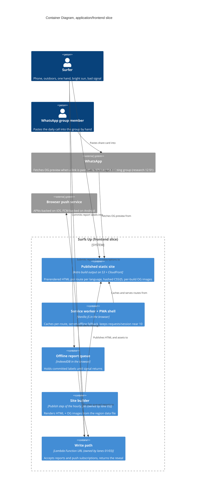
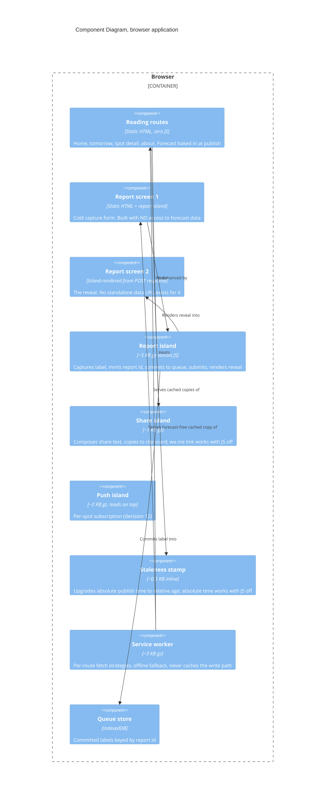

## Application Architecture

Lane: application/frontend. Author: solution-architect (Morgan), DESIGN round 1, 2026-08-08.
Binding inputs: `HANDOFF.md` §3-§7, `BRIEF.md`, `docs/DISCUSS-decisions.md` (cited by number),
`domain-model.md` §13 + `adr-two-day-ranking.md` (schema authority for P1/P5, adopted 2026-08-08
coherence round, second pass),
`docs/research/raw/09-ai-forecast-methodology.md` (§7, §13.2, §13.3, §14), `docs/research/raw/12-community-whatsapp-ugc.md` (§1, §4),
`docs/research/raw/08-aws-architecture-and-cost.md` (§4.4, §12.4 request guardrail).
ADRs: `adr-publish-time-html-rendering.md`, `adr-report-flow-leak-isolation.md`, `adr-performance-budget-cuts.md`.

Verdict up front: a static Astro site whose forecast content is rendered into HTML at each hourly
publish, zero JS on every reading route, three small islands totalling ~11 KB gz that never all load
on one page, a service worker tuned to the CloudFront request guardrail, and a report flow that is
physically incapable of showing the forecast before the label commits. Home page first visit: ~26 KB
wire, well under the 100 KB cap (decision 27). Nothing below is Panama-specific: every spot, region,
coast and string comes from config and content files keyed by `region_id`.

### 1. Rendering model (the one structural call)

**Forecast content is rendered into static HTML at publish time, once per publish build. The browser
fetches pages, not forecast JSON.** Full reasoning and the two rejected alternatives in
`adr-publish-time-html-rendering.md`.

(Terminology amended, 2026-08-08 coherence round: the hourly publish stamp is **`build_id`**
(shape `b_<YYYY-MM-DDTHH>Z`, domain model §6), and this document now says "build" for it
everywhere. "Cycle" is reserved for the model-run concept, 00/06/12/18Z, which is a different
thing; this document previously used `cycle_id` for the publish stamp and was the only one of
the seven docs doing so.)

Why it is the call: decision 21 (Astro, near-zero JS) plus decision 27 (100 KB, 3G under 2 s) plus
the CloudFront request guardrail (research 08 §12.4: requests per session, not bytes, are the
binding cost constraint) all point the same way. Client-side rendering would require shipping JS
plus the region bundle before first paint. (Bundle figure amended 2026-08-08 coherence round: the
domain lane measured 27.5 KB gz at 20 spots, ~31 KB after the two-day restructure — domain model
§13; research 08 §4.4's ~100 KB was an estimate. Smaller than round 1 assumed, but it grows
linearly with spot count, lands on top of a framework runtime plus hydration, and adds exactly
the requests the guardrail counts, so the call stands unchanged.)

Consequence owed to the infrastructure lane (03): the hourly publish job regenerates the HTML
routes, not only JSON. Cache headers per research 08 §4.4 (`max-age=300, stale-while-revalidate=3600`
on HTML, immutable on hashed assets) avoid paid invalidations. Consequence owed to the domain lane
(01): the region data file becomes the **builder's input**, not a browser payload. Research 08 §4.4's
sentence "one fetch returns everything the client needs" assumed a JS client; under this design the
client never fetches it. (Resolved 2026-08-08 coherence round: domain model §13 now states this
consumption model explicitly — every published artifact is builder input, none ships to a browser.)

### 2. C4 Container



### 3. C4 Component (browser application)



### 4. Route map and language routing

Spanish is the default at the root, English is a mirrored tree under `/en/` (decision 8). Slugs are
language-neutral so a shared spot URL works in both trees; the slug IS `spot_id` — one value, one
home, no separate `slug` field anywhere (domain model §13, amended 2026-08-08 coherence round). The toggle is a plain link to the twin
URL (top of page, 44 px target), `hreflang` alternates on every page, `lang` attribute set per page.
No JS locale sniffing and no redirects: both break caching and surprise people on bad signal.

| Route (es) | Route (en) | What it is | Doc budget (gz) | JS on route |
|---|---|---|---|---|
| `/` | `/en/` | Home: ranked list, today. Top spot is the call (decisions 1, 3) | 14 KB | ~1.5 KB inline |
| `/manana` | `/en/tomorrow` | Same list for tomorrow (decision 10) | 14 KB | ~1.5 KB inline |
| `/spots/{slug}` | `/en/spots/{slug}` | The breakdown: sub-scores, weakest link, scorecard, map, reports (decisions 13, 17, 20) | 14 KB + lazy images | ~3.5 KB |
| `/spots/{slug}/ayer` | `/en/spots/{slug}/yesterday` | Prior Panama civil day's **dawn-build** receipt. It renders that receipt's exact `published_at`, never a later hourly revision. No receipt yet is a Spanish empty state; a refused current build leaves the prior dated receipt in place, visibly stale rather than freshly scored. | 14 KB | ~0.3 KB inline stamp |
| `/spots/{slug}/reportar` | `/en/spots/{slug}/report` | Report screen 1, cold capture. Forecast-free by construction | 6 KB | 5 KB island |
| `/spots/{slug}/reportado` | `/en/spots/{slug}/reported` | Report screen 2 shell. Reveal rendered from POST response only | 4 KB | (island already loaded) |
| `/404` | `/en/404` | Not-found page. A mistyped spot address must land on words, never a raw origin error (slice-06 charter negative). Reading route: no render-blocking subresource | 4 KB | 0 |
| `/sin-senal` | `/en/offline` | Offline fallback, precached | 3 KB | 0 |
| `/acerca` | `/en/about` | What this is, the honesty statement, MIT license | 8 KB | 0 |

Today and tomorrow are separate prerendered routes, not a JS tab, so each stays inside its own
budget and the refusal to go further than tomorrow is visible in the information architecture
itself: there is no third route to navigate to, and the home footer says so in words (copy in §10).

**Slice-01 scope.** Although this architecture records the eventual mirrored language map, the
first delivery ships only the Spanish root tree. `/en/` and every English twin above are deferred
to F-READ-IT-IN-YOUR-LANGUAGE. The archive route is therefore `/spots/{slug}/ayer` in slice-01.
This is a release-scope rule, not an alternate route decision (HANDOFF §6 items 2 and 3).

**Render source per route** (amended 2026-08-08 coherence round, second pass: the bundle is
two-day shaped — `days[0]`/`days[1]` ranked day-summary arrays plus an unordered `spot_detail`
map, `adr-two-day-ranking.md`. Round 1's `/manana` had **no bundle source for any value it
renders**: every day-scoped field existed exactly once, implicitly today. Closed — each route now
names its source):

| Route | Reads from the bundle |
|---|---|
| `/` , `/en/` | `days[0].spots` in array order (position = rank; no `rank` field); `name` and the last-report line joined from `spot_detail[spot_id]` |
| `/manana` , `/en/tomorrow` | `days[1].spots`, same joins. Tomorrow's `score_q`, `call`, `size_band`, `size_range_m`, `wind_state`, `conf_level`, `confidence_reason`, `best_window`, `weakest_link`, `damages` are that array's own values — genuinely different from today's (confidence drops with lead) |
| `/spots/{slug}` | `spot_detail[spot_id]` (slug = spot_id) + that spot's summary object from each of the two day arrays; breakdown bars derived per the §7 sub-scores decision |
| `/spots/{slug}/ayer` | `log/calls/v1` receipt for the prior Panama civil date's dawn build. The receipt carries its own immutable `published_at`; no receipt produces the explicit empty document, never a synthetic score. |

Flagged for the domain lane, not silently diverged: domain §13's route-read table lists only
`name` as the home routes' `spot_detail` join, but the home top card also renders the last-report
freshness line, so the home read widens to `spot_detail[spot_id].reports` — a read-contract
widening over data already in the bundle, not a schema ask.

### 5. The byte budget, with the arithmetic

**Read this before any arithmetic below. The browser downloads pages, never forecast data.**
Every reading route is finished HTML the moment it leaves the builder. The region bundle
(27.5 KB gz measured at 20 spots, +3–4 KB after the two-day restructure — domain model §13,
`adr-two-day-ranking.md`; research 08 §4.4's ~100 KB was an estimate) is the **builder's input,
consumed server-side at publish time**; no request for it, or for any forecast JSON, exists
anywhere in the client. Stated explicitly so no reader has to assume it (amended 2026-08-08
coherence round, second pass): the two-day restructure moves **zero bytes** in this section —
its +3–4 KB lands on builder input, and every wire ceiling and line item below is unchanged. If a page-weight
number includes the bundle, the number is wrong: the bundle never crosses the wire to a
browser. (Restated unmissably, 2026-08-08 coherence round: two sibling documents carried
arithmetic assuming the browser downloads the bundle; both are being corrected to match this.)

**The enforced envelope.** "3G" is pinned to a CI-emulated profile of 400 kbps down / 400 ms RTT
(slow-3G class). The arithmetic that follows is what makes 2 s reachable at all:

```
Connection setup (DNS + TCP + TLS 1.3, cold):  3 RTT           = 1.20 s
Request + first byte:                          1 RTT           = 0.40 s
HTML transfer at ~50 KB/s:                     14 KB           = 0.28 s
                                               first render   ~= 1.88 s
```

Two hard implications, both enforced: (a) the HTML document, with critical CSS inlined, must stay at
or under **14 KB gz**, which also fits the typical initial TCP congestion window (RFC 6928, ~10
segments), so the document lands in the first flight; (b) **zero render-blocking subresources**.
Everything else arrives after first render on the warm connection. On the fast-3G class profile
(1.6 Mbps / 150 ms RTT) the full home page loads in about 1.1 s.

**Home page, first visit, cold cache (wire bytes, gz):**

| # | Line item | Budget | What it buys |
|---|---|---:|---|
| 1 | HTML document: 20 ranked rows, top-card `call` text, critical CSS, inline SVG glyphs, staleness + SW-registration inline JS | 14.0 KB | First render under 2 s on slow 3G, readable with JS off |
| 2 | Full stylesheet (async, content-hashed, cached forever) | 6.0 KB | Both themes, non-critical styles |
| 3 | Share island JS (deferred) | 1.0 KB | Copy-the-call button (decision 5) |
| 4 | Service worker script (registered after load) | 3.0 KB | Offline + request-count discipline |
| 5 | Web app manifest + favicon | 1.5 KB | PWA install (decision 25) |
| 6 | App icons (192/512, fetched on install only) | 0 on this visit | A2HS |
| | **Total, home first visit** | **25.5 KB** | **74.5 KB of headroom, deliberately unspent here** |

**Spot detail page** adds: static map WebP ~12 KB lazy (decision 20), up to 3 report photo
thumbnails at ~8 KB each lazy and capped, push island 2 KB on tap. Worst case ~51 KB. **Report
screen 1** is ~11 KB total. Every route stays under half the 100 KB cap; the cap is per route,
first visit, everything on the wire.

**What the budget rules out (details and rejected alternatives in `adr-performance-budget-cuts.md`):**

| Cut | Why |
|---|---|
| Webfonts | 0 KB. System font stack. A webfont is 15-40 KB and a render risk on 3G; the audience reads in sunlight, not in a type specimen |
| Map tiles / any JS map library | A tile library is 40-150 KB before the first tile. Decision 20 needs one small static image per spot, pre-rendered at build |
| Analytics / tag scripts | 0 KB. Nothing to sell (BRIEF constraint 3) |
| Client-side framework runtime on reading routes | Astro static output ships none |
| Forecast JSON to the browser | Rendering is publish-time; the region bundle never reaches the client (its ~31 KB gz two-day measured size is an S3/builder figure, never a page figure) |
| Hero/lifestyle photography | This is an instrument, not a beach postcard (vision deck) |

**CI enforcement (decision 27).** A build step walks the emitted `dist/`, computes gz bytes per
route document and per referenced first-visit asset, and fails the build over the ceilings above.
The failure message names the route, the measured bytes, the ceiling, and the largest three
contributors (gate states WHAT/WHY/HOW; clause `gate:self-explaining-what-why-how`). Budgets in
this table are ceilings the gate enforces, not measurements; the first real build produces the
measured column beside them. DELIVER gate criterion, explicit: the first build must come in under
every ceiling, and if the home document does not fit 14 KB, the cut is `call` text length on rows
2-20, never the honesty elements (stamp, confidence, the today-and-tomorrow-only footer).

### 6. Island inventory (hard push to zero JS)

| Island | Routes | KB gz | JS off behaviour (declared, not implied) |
|---|---|---:|---|
| Report flow (screens 1+2, queue, submit) | `/…/reportar`, `/…/reportado` | 5.0 | `<noscript>` shows the form disabled with plain copy: reporting needs JS; reading never does. See Decisions needing Andres #2 |
| Share card | home, spot | 1.0 | `wa.me/?text=` prefilled link still works as a plain anchor (needs the one verification in §13) |
| Push subscribe | spot, loads only on tap | 2.0 | Button absent without JS; push is impossible without SW anyway |
| Staleness stamp | all reading routes | 0.3 inline | Absolute publish time always rendered in HTML |
| SW registration | all routes | 0.2 inline | Site works fully unregistered; SW is enhancement only |
| A2HS iOS hint | spot, home footer | 0 | Pure `<details>` disclosure, no JS |
| Confidence reason on tap (decision 7) | home, spot | 0 | Pure `<details>` disclosure, no JS |

Total JS authored: ~11.5 KB gz. Maximum on any single route: ~9 KB (report screens). Reading
routes carry only the two inline snippets (~0.5 KB). Vanilla JS or Astro islands both fit these
caps; the crafter chooses inside them.

### 7. Payload requirements — owed by the domain lane

The domain lane (01) owns the bundle schema (P1, P5, P7); the write-path lane
(`07-write-path.md`) owns the wire contracts (P2, P3, P4, P6). These are the frontend's
requirements against those contracts. (Amended, 2026-08-08 coherence round: field names are **no longer
placeholders — they are the canonical names** settled in `domain-model.md` and the write-path
request schema, `07-write-path.md` §4.1. The receiving contract wins because it is what the
server parses. Renames applied throughout this document: `report_uuid`→**`report_id`** (a
client-minted **ULID**, `^[0-9A-HJKMNP-TV-Z]{26}$` — the server rejects a v4 UUID by shape),
`captured_at`→**`observed_at`**, `size_category`→**`size_band`**, `wind_category`→**`wind`**,
`cycle_id`→**`build_id`**. `queued_offline` and `lang` are dropped from P2 — see the P2 note
below.) (Second pass, same day — `adr-two-day-ranking.md` + domain model §13 settle the bundle
names this lane had proposed: `slug` and `rank` cease to exist as fields (`spot_id` IS the slug;
array position IS the rank, per day), `conf_reason_es`/`conf_reason_en`→
**`confidence_reason{es,en}`**, `narration_es`/`narration_en`→**`call{es,en}`**, the P5 scorecard
block adopts **`scorecard{n_obs, n_reporters, counter, claim_ok, headline}`**,
`best_window{start,end}` is settled, and this document never used bare `confidence` as a field
name — checked, nothing to retire.) Per clause `data:consumer-known-before-produced`, each row
names its consumer and join key. Every contract row declares its failure behaviour; a contract that only describes success
leaves the failure branch to be invented silently downstream.

**The published score on the wire is `score_q`, an integer 0 to 100 — never a 0-to-1 float.**
Every `{score}` placeholder in §10 copy and §14 wireframes renders that integer as-is;
`delta.score_points` (P3) is a signed integer difference of two `score_q` values; no frontend
code multiplies, divides or rounds a score. (Confirmed explicitly, 2026-08-08 coherence round.)

| # | Payload | Producer → Consumer | Semantic fields required (canonical names) | Byte budget (gz) | Join key | Failure behaviour |
|---|---|---|---|---:|---|---|
| P1 | Publish-build render input | domain bundle (`region-bundle/1`, two-day shape — `adr-two-day-ranking.md`) → site builder | Header once per bundle: `region_id`, `build_id`, `published_at`. Per day: `days[d].spots[]` day-summary objects, **array order = that day's rank**. Per spot: `spot_detail[spot_id]`, day-independent. Field-by-field table below (restructured 2026-08-08 coherence round, second pass) | build-side, no wire cap (the region bundle — 27.5 KB gz measured, +3–4 KB two-day — is builder input, never a client payload — §5) | `spot_id` + `build_id`; day arrays ↔ `spot_detail` joined on `spot_id` | Per field, declared in the P1 table below, plus the domain lane's three LOUD bundle invariants (day/detail referential integrity, same spot set both days, consecutive dates — domain §13). Load-bearing fields missing → builder fails the publish LOUD, names the spot and field; never publishes a page with invented data. Display enrichments missing → page degrades per the table, defect logged |
| P2 | Report submission request | report island → write path (POST `/api/report`; wire SSOT `07-write-path.md` §4.1) | Body: `report_id` (ULID, minted at commit, idempotency key), `spot_id` (string, spot seed id), `observed_at` (ISO8601 UTC, device clock at commit, back-datable ≤ 12 h), `submitted_at` (ISO8601 UTC, device clock at send), `size_band` (v1 7-band enum, domain model §7.2), `size_band_schema` (int, currently `1`), `wind` (3-value enum ← Q2), `quality` (4-value enum ← Q3), `trigger` (`organic` default; `push_solicited` when opened from the `?t=ps` deep link). Header: `X-Surf-Credential` | ≤ 1 KB (island discipline; server hard cap 4 KB) | `report_id` | 4xx other than 401/429: island shows the reason, keeps the label locally, never silently drops, no mechanical retry. 401 `credential_missing`/`credential_invalid`: island mints via `/api/mint` in the background and retries — no user-visible step. 429/5xx/timeout: label stays queued, backoff with jitter; **429 is never an error state in the UI** — same pending state as no signal (research 15 §5.5) |
| P3 | Reveal response | write path → report screen 2 | `outcome` enum: `compared` \| `no_snapshot` \| `queued_duplicate`; `report_id`; when `compared`: `predicted{score_q, size_band, size_range_m, wind_state, conf_level}`, `delta{score_points, size_bands}` (both signed ints, positive = we ran big), `counter{n_reports, threshold}` (decision 19) | ≤ 2 KB | `report_id` | `no_snapshot` (no prediction was logged for that spot+hour): `predicted: null`, no `delta`, counter present; screen 2 thanks the reporter and says plainly there is nothing to compare, per research 09 §14.4 never fabricate. Duplicate `report_id` on re-sync: server returns the original reveal, screen renders it identically (idempotent) |
| P4 | Server-side dedup on re-sync | queue flush → write path | Dedup key is `report_id` **alone**; `observed_at` is preserved as the observation time and is the value joined against the prediction log, never the sync time | n/a | `report_id`; reveal joins prediction log on `(spot_id, floor_utc_hour(observed_at))` | Replay of an acked id: acknowledged, not double-counted, original reveal returned |
| P5 | Scorecard display block | domain scorecard → builder → spot page | Canonical shape **`scorecard{n_obs, n_reporters, counter, claim_ok, headline}`** in `spot_detail` (domain §13; renamed 2026-08-08 coherence round second pass from this row's `n_reports`/`n_distinct_reporters`/window — the 30-day window is fixed by domain §9, never a payload field). `claim_ok: true` → render `headline`, the display-ready claim. `claim_ok: false` → `headline` is null; render the empty/insufficient state from `counter` (decision 19's `"7 / 30"` string — its `"N / M"` shape is contractual, and the two integers in §10's empty-state sentence are its two numbers; a shape change fails the build LOUD, never a page silently). Frontend renders, never computes statistics; the claim gate (`n ≥ 10 AND distinct_reporters ≥ 5 AND |bias| > 2·se_gate`, domain §9) is the domain lane's to enforce **before** the datum reaches the builder | inside P1 | `spot_id` | `claim_ok: false` or block absent → page renders the day-one empty state (§10), never a blank or a stale claim |
| P6 | Push subscription | push island → write path (POST `/api/push`; wire SSOT `07-write-path.md` §8.1) | `action` (`subscribe` \| `unsubscribe`), `spot_id`, `subscription{endpoint, keys{p256dh, auth}}`, `lang` (kept HERE: the notify job composes push copy from it — a named server-side consumer, unlike report `lang`), `threshold_score` (optional int 0-100, default 70). Header: `X-Surf-Credential` | ≤ 2 KB (server cap) | `(spot_id, endpoint_hash)` | 400 `endpoint_not_allowed`: UI says the browser is unsupported, names no jargon. 401: background mint + retry as P2. 429/5xx: UI stays "not subscribed", offers retry — subscribe is interactive, never queued; UI says "listo" only after server ack (no false green) |
| P7 | Share/OG inputs | domain lane → builder | Per spot per build: OG title + description strings es/en, and the structured fields for the OG image: `score_q`, `size_band` + `size_range_m`, `wind_state`, `conf_level` — all from that spot's `days[0]` summary; the share card pitches today (source named 2026-08-08 coherence round, second pass) | build-side | `spot_id` + `build_id` | Missing → builder emits the static generic OG card, logs the gap |

**P1 field table** (added 2026-08-08 coherence round — Fix: a requirement stated as a concept
instead of a field is how the earlier name mismatches happened. **Restructured same day, second
pass: every name below is settled in domain model §13 — the (p) proposals are resolved, adopted
or superseded; this table adopts, it does not propose.**) "FAIL" = builder refuses the publish
LOUD, naming spot + field; "degrade" = page renders without that element, defect logged.

Header, once per bundle (P1's per-spot asks for these are satisfied at bundle grain — every spot
in the file shares them):

| Field | Type / unit | Page behaviour when absent |
|---|---|---|
| `region_id` | string, e.g. `pa-pacific` | FAIL |
| `build_id` | string `b_<YYYY-MM-DDTHH>Z` | FAIL (join key + share cache-buster) |
| `published_at` | ISO8601 UTC | FAIL (the staleness stamp is an honesty element) |

Day summary, one object per spot per day in `days[d].spots[]` (`d`=0 today, `d`=1 tomorrow;
**array position IS that day's rank — no `rank` field exists**; a missing or empty day array is
FAIL, the ranked list is the product):

| Field | Type / unit | Page behaviour when absent |
|---|---|---|
| `spot_id` | string; IS the URL slug (language-neutral kebab, enforced at seed PR review) — no separate `slug` field | FAIL |
| `score_q` | **int 0-100** | FAIL |
| `conf_level` | enum `low` \| `medium` \| `high` | FAIL (decision 7) |
| `confidence_reason` | one `{es,en}` object, ≤ 160 chars each | degrade: `<details>` reason omitted |
| `call` | one `{es,en}` object, ≤ 280 chars each; both members are composed by the producer from this day summary's structured facts | FAIL for a current publish when the object or either locale is absent. Reading routes render the selected member verbatim and never compose or translate it. The immutable legacy-receipt exception applies only to the yesterday route. |
| `size_band` | v1 7-band enum (domain §7.2) | FAIL |
| `size_range_m` | `[lo, hi]` metres, always rendered with "≈", never a point | FAIL (decision 18) |
| `wind_state` | 3-value wind enum | degrade: wind word + glyph omitted |
| `weakest_link` | enum `dir` \| `size` \| `wind` \| `tide` \| `null` (null = perfect day, no callout rendered — scoring ADR) | degrade: callout omitted |
| `damages` | array `{factor, damage}` sorted desc (scoring §4) | degrade: weakest-link callout omitted |
| `best_window` | `{start, end}` spot-local `HH:MM` strings (client renders, never computes — domain §14) | degrade: window line omitted; breakdown bars for that day also omitted (they derive at this hour — see below) |

Spot detail, one entry per spot in the unordered `spot_detail` map (day-independent; joined to
both day arrays on `spot_id`):

| Field | Type / unit | Page behaviour when absent |
|---|---|---|
| `name` | string, display name (proper noun, language-neutral) | FAIL |
| `coast` | enum `pacific` \| `caribbean` | degrade: coast badge omitted |
| `scorecard` | `{n_obs, n_reporters, counter, claim_ok, headline}` — the P5 shape | degrade: day-one empty state (§10) |
| `reports` | `{last_ts, count_24h, distinct_24h}` (supersedes the round-1 `last_report_at`/`last_report_n` proposal) | degrade: last-report line omitted (normal on day one) |
| `hourly[]` | 48 points spanning both days; frontend reads only `t` + `sub` per point, solely for the derived bars below | degrade: breakdown bars omitted |

(`spot_detail` also carries `tide{…}` and `members[]`; no frontend surface renders either at
launch, so they are not P1 requirements — named here so their absence from this table reads as
deliberate, not missed.)

**Day-level sub-scores — the one open reconciliation, closed (2026-08-08 coherence round, second
pass).** Round-1 P1 asked for `sub`, the four sub-scores, per spot per day; the bundle carries
`sub` hourly only (`spot_detail[].hourly[].sub`), and the settled day summary does not add it.
Decided: **derive, don't ask.** The breakdown bars for day `d` render the `sub{dir, size, wind,
tide}` of the single hourly point whose spot-local timestamp falls in the hour containing
`days[d].spots[i].best_window.start` — the hour that day's call is about. The builder computes
exactly that: one array lookup, no averaging, no invention. `best_window` absent → bars omitted
(the degrade declared in the day-summary table). The "what killed it" callout (decision 17)
renders from the day summary's `weakest_link` + `damages` only — authoritative, never re-derived
from the bars — and the callout arrow anchors on the `weakest_link` factor, never on the visually
lowest bar, so the two surfaces cannot disagree about which factor killed the day.

**P2 fields dropped, decided (2026-08-08 coherence round, answering `07-write-path.md` §1 row
6):** `queued_offline` and `lang` are **removed** from P2, not defended. `queued_offline` had no
consumer: offline-ness is derivable server-side from `received_at − submitted_at` (domain model
§7.3 says so explicitly — "gap derivable, no separate offline flag needed"), and P2 now carries
`submitted_at`. Report-side `lang` had no consumer either: the reveal is rendered client-side
from P3's structured fields, so the server never composes report copy. `lang` **stays on P6**,
where it has a named consumer (the notify job composes push copy from it, join
`endpoint_hash`). A field in a published contract that nothing reads teaches the next person to
assume it matters; both are gone.

**Anti-leak payload contract (correctness requirement, not preference):** no payload delivered to
the `/…/reportar` route family may contain any forecast field for any spot. The reveal exists only
as a POST response (P3); there is no GET-able reveal URL keyed by spot or build. The report island
never holds prediction data, so an offline client *cannot* compute a reveal locally, by
construction. Enforcement in §9.

### 8. The two-screen report flow

Resolved anchoring item, bottom of `docs/DISCUSS-decisions.md`: screen 1 is cold and absolute,
screen 2 reveals. The label **commits before the reveal screen renders** — committed means either
acked by the write path or durably written to the IndexedDB queue, whichever happens first.

Note for the domain lane, flagged: research 09 §13.2 field 1 ("Compared to the forecast?") predates
the anchoring resolution and cannot be asked cold. Screen 1 asks absolute size, wind, quality; the
residual §13.2 wanted is computed server-side by joining the cold label to the prediction log on
`(spot_id, floor_utc_hour(observed_at))`. (Field names aligned to the wire contract, 2026-08-08
coherence round.)

**The four leak paths, and how each is closed** (mechanism detail in `adr-report-flow-leak-isolation.md`):

| # | Leak path | Closure |
|---|---|---|
| L1 | The page the flow opened from (spot page DOM contains the forecast) | Screen 1 is its own route, a static document whose template is built with **no access to forecast data** (it imports spot identity only, and does not change per build). The report button is a plain link. Nothing of the spot page's DOM survives the navigation |
| L2 | A prefetched payload | Nothing on screen 1 prefetches: no `rel=prefetch/preload` toward the write path, no speculation rules, and the reveal has no URL to prefetch — it exists only as the POST response to the submission itself |
| L3 | The back stack | Strict ordering: (1) the label commits (queue write or server ack), (2) `history.replaceState` swaps screen 1's history entry for the `/reportado` URL, (3) screen 2 renders. Because the swap precedes the render, there is no mid-render window where Back returns to an editable form; Back from the reveal, at any moment, lands on the spot page. Screen 2 has no edit affordance (the resolution's "never let the reveal round-trip back"). Re-opening screen 1 later starts a blank report with a fresh `report_id` |
| L4 | A service-worker cached response | The cached copy of screen 1 is the same forecast-free static document, so serving it stale leaks nothing. The write path is a network-only SW route: POST responses are never `cache.put`, and the write path sends `Cache-Control: no-store`. The spot page's cached copy is never rendered inside the flow |

Offline: the label commits to the queue, screen 2 renders its **queued variant with no reveal**
(copy in §10). The reveal happens only when the server has the report. The island holds no
prediction data, so there is nothing on the device to leak (anti-leak payload contract, §7).

`observed_at` comes from the device clock, which lies. The write path records its own
`received_at`; the write path owns the plausibility guard between the two (`07-write-path.md`
§4.2 step 5). Frontend requirement only: send `observed_at` (device clock at commit) and
`submitted_at` (device clock at send), and never overwrite either at sync time — the queued
flag is gone, offline-ness is derived server-side from the `received_at − submitted_at` gap.
(Amended 2026-08-08 coherence round.)

### 9. Enforcement (rules without tooling erode)

| Rule | Tooling recommendation (all OSS, MIT/ISC unless noted) |
|---|---|
| Report-flow source may not import any module that touches forecast data | `dependency-cruiser` forbidden-dependency rule from `src/report/**` to the forecast/content layer, CI-blocking |
| Built `/…/reportar` HTML contains zero forecast markers | CI grep gate over `dist/` for score patterns and forecast data attributes on those routes. Per clause `check:unfired-is-not-evidence`, the gate's fixture suite must include one deliberately poisoned page and watch the gate refuse it, at gate-authoring time |
| Per-route byte ceilings (§5) | Custom build script (a `size-limit` config cannot see per-route HTML); fails with WHAT/WHY/HOW |
| Accessibility floor | `axe-core` CLI over built routes in CI, plus `html-validate` |
| SW never caches the write path | Unit test on the SW router table plus the poisoned-fixture rule above |

### 10. Copy, exact, both languages

Plain surfer voice. No em dashes anywhere in UI strings. Body-height words first, metre **ranges**
second, always with "≈" so the copy never claims more precision than the range carries
(decision 18; ranges themselves are the domain lane's, shown here as placeholders). Size words on
every surface are the **canonical es/en strings of the v1 band table, domain model §7.2** — one
constants file, consumed by the capture form, display, and residual math alike; this document
mints no size vocabulary of its own. (Aligned 2026-08-08 coherence round; the illustrative
wireframe strings in §14 predate the band table and render the same fields.)

**Home.**
- Header: es "¿Dónde se surfea hoy?" / en "Where's it working today?"
- Tabs: es "Hoy · Mañana" / en "Today · Tomorrow"
- Top card verb: es "VE A {SPOT}" / en "GO TO {SPOT}"
- Ranked daily call, composed at publish time from the same `size_band`, `wind_state` and
  `best_window` that the row carries:
  - complete: es "{Tamaño}, viento {viento}, mejor de {inicio} a {fin}." / en "{Size}, {wind} wind, best from {start} to {end}."
  - wind absent: es "{Tamaño}, viento sin datos, mejor de {inicio} a {fin}." / en "{Size}, no wind data, best from {start} to {end}."
  - window absent: es "{Tamaño}, viento {viento}, sin ventana estimada." / en "{Size}, {wind} wind, no estimated window."
  - both absent: es "{Tamaño}, viento sin datos, sin ventana estimada." / en "{Size}, no wind data, no estimated window."

  `{Tamaño}` and `{Size}` are the canonical labels of the row's `size_band` in domain model
  §7.2. `{viento}` is `limpio|picado|destrozado`; `{wind}` is
  `clean|choppy|blown out`, the grammatical lowercase rendering of the exact Q2 labels below.
  The producer composes both locale members in one pass from the structured row. It never
  translates `call.es`, and the page never recomposes either member. An invalid or missing
  `size_band` refuses the publish under P1 instead of falling back to invented prose. Example:
  es "Pecho a cabeza, viento limpio, mejor de 06:00 a 09:30." / en
  "Chest to head, clean wind, best from 06:00 to 09:30."
- Staleness stamp: es "Actualizado 6:04 a.m." / en "Updated 6:04 a.m."; stale (>3 h, JS): es "Viejo. Lo último que vimos fue a las 6:04. No pudimos sacar datos nuevos esta mañana." / en "Old. Last thing we saw was at 6:04. We could not get new data this morning."
- Honesty footer (decision 10 made legible): es "Solo hoy y mañana. Más allá nadie sabe de verdad, y no vamos a inventar." / en "Today and tomorrow only. Past that nobody really knows, so we don't pretend."
- Confidence levels: es "confianza alta / media / baja" / en "high / medium / low confidence"

**Report screen 1 (cold: no score, no prediction, no hint anywhere on this document).**
- Title: es "¿Cómo estuvo {spot}?" / en "How was {spot}?"
- Q1: es "¿Qué tan grande?" opciones: "Plano · Tobillo a rodilla · Rodilla a cintura · Cintura a pecho · Pecho a cabeza · Cabeza a un metro más · Doble o más" / en "How big?" "Flat · Ankle to knee · Knee to waist · Waist to chest · Chest to head · Head to overhead · Double overhead +" — the seven options ARE the v1 `size_band` enum values, es/en strings verbatim from domain model §7.2. (Amended 2026-08-08 coherence round: the previous six anchor-style options could not map 1:1 onto the settled 7-band enum, so the form could not have produced valid `size_band` values. Register check with the cousin's group, Decisions needing Andres #6, now covers these strings)
- Q2: es "¿El viento?" "Limpio · Picado · Destrozado" / en "Wind?" "Clean · Choppy · Blown out"
- Q3: es "¿Cómo estuvo?" "Malo · Normal · Bueno · Épico" / en "How was it?" "Bad · OK · Good · Epic"
- Submit: es "Mandar" / en "Send". After submit, photo prompt (decision 9): es "¿Foto? Si tienes una, súbela. Si no, ya está." / en "Got a photo? Add it if you want. If not, you're done."
- `<noscript>`: es "Para mandar reportes hace falta JavaScript. Para leer el pronóstico no." / en "Sending a report needs JavaScript. Reading the forecast doesn't."

**Report screen 2 (the reveal).**
- Compared: es "Dijimos: {banda} (≈{rango} m), {viento}. {score}. Tú viste: {banda_obs}, {viento_obs}. Nos pasamos {delta} puntos." / en "We said {band} (≈{range} m), {wind}. {score}. You saw {band_obs}, {wind_obs}. We were {delta} too high." — fills from P3: `{banda}`/`{rango}` ← `predicted.size_band`/`size_range_m`, `{viento}` ← `predicted.wind_state`, `{score}` ← `predicted.score_q` (the integer, as-is), `{delta}` ← `delta.score_points` (sign flips the verb: too high/too low). (Template parameterized 2026-08-08 coherence round; the old literal words were example fills)
- Counter (decision 19): es "Reporte {n} de {threshold} en este spot. Gracias." / en "Report {n} of {threshold} at this spot. Thanks."
- Queued (offline): es "Guardado. Cuando vuelva la señal lo mandamos y te decimos cómo nos fue." / en "Saved. When the signal comes back we'll send it and tell you how we did."
- No snapshot: es "Gracias. Esa hora no la teníamos pronosticada, así que no hay comparación." / en "Thanks. We had no forecast logged for that hour, so there's nothing to compare."
- Share prompt: es "Pásalo al grupo" / en "Send it to the group"

**Offline page.** es "Sin señal. Esto es lo último que vimos, de las {hora}. Los reportes que mandes quedan guardados." / en "No signal. This is the last thing we saw, from {time}. Any report you send gets saved."

**Day-one empty state (decision 19, HANDOFF §6 item 12: copy never ahead of the data).**
es "Todavía no podemos decirte si acertamos aquí. Van {n} reportes de los {threshold} que hacen falta." / en "We can't tell you our track record here yet. {n} of the {threshold} reports we need."

**A2HS hint (iOS).** es "¿Quieres avisos? En iPhone: Compartir, y luego Añadir a pantalla de inicio. Sin eso, iPhone no deja avisar." / en "Want alerts? On iPhone: Share, then Add to Home Screen. Without that, iPhone won't allow alerts."

**Share card template (P7 fills it):**
```
es:                                  en:
SURF {fecha}                         SURF {date}
Mejor: {spot}, {score}               Best: {spot}, {score}
{tamaño} y {viento}. {ventana}.      {size} and {wind}. {window}.
Confianza {nivel}.                   {level} confidence.
{url}?b={build_id}                   {url}?b={build_id}
```

Copy risk flagged: "picado" and "destrozado" need a sanity read from the cousin's group before
launch. Regional surf Spanish varies and I am not the authority (Decisions needing Andres #6).

### 11. Sunlight contrast, measured (WCAG 2.x relative-luminance computation, both themes)

Functional requirement, not styling. Targets: body text ≥ 7:1 (AAA, the sunlight margin), all
text ≥ 4.5:1, non-text UI ≥ 3:1. Measured against the real background each token sits on. Numbers
below are computed from the exact hex pairs; the CI axe-core pass re-verifies them against built
pages so a palette drift cannot silently regress.

| Pair (day theme, default) | Ratio | | Pair (dark theme, dawn) | Ratio |
|---|---:|---|---|---:|
| body `#14181D` on bg `#FFFFFF` | 17.82 | | body `#EDF1F4` on bg `#10141A` | 16.26 |
| body on card `#F2F4F6` | 16.17 | | body on card `#1A2029` | 14.42 |
| secondary `#40484F` on bg | 9.30 | | secondary `#AAB4BE` on bg | 8.78 |
| secondary on card | 8.44 | | secondary on card | 7.78 |
| go-green `#0A6A2D` on bg | 6.75 | | green `#57C785` on bg | 8.72 |
| amber `#7A5200` on bg | 6.92 | | amber `#E3A83B` on bg | 8.73 |
| red `#9E1C23` on bg | 7.94 | | red `#F2707A` on bg | 6.49 |
| link `#0B57D0` on bg | 6.39 | | link `#8AB4F8` on bg | 8.76 |
| white on green button `#0A6A2D` | 6.75 | | ink on green chip `#57C785` | 8.72 |

Every pair clears AA at any size; body and secondary text clear AAA with margin. Accent colours
(6.39 to 8.76) are used at ≥ 16 px semibold or as glyph fills beside a text label, never as the only
carrier of meaning: confidence and wind glyphs always pair shape + word, so colour-blind users and
a washed-out screen in direct sun read the same information. Dark theme follows
`prefers-color-scheme` automatically; no manual toggle at launch (0 KB JS; Decisions needing
Andres #5). `prefers-reduced-motion` honoured: the only animations are opacity/transform under
200 ms and all are disabled under the media query. Touch targets ≥ 44 px, report button fixed in
the bottom thumb zone on every spot page (decisions 23, 25). No horizontal scroll at 390 px or at
320 px.

### 12. Service worker, offline, PWA

**Per-route strategy table** (request-count guardrail: with this table a typical session is ~8-10
CloudFront requests, inside research 08 §12.4's target):

| Route class | Strategy | Failure behaviour |
|---|---|---|
| Reading HTML (`/`, `/manana`, `/spots/*`) | Network-first, 3 s timeout, fall back to cache; successful responses re-cached | No network and no cache → precached `/sin-senal` page |
| Report screen 1 HTML | Cache-first (document is static and forecast-free; staleness is harmless by construction) | Not cached and offline → `/sin-senal` with a line saying the report form needs one first online visit |
| Hashed CSS/JS/icons | Cache-first, immutable | Missing → network; failing → page still renders (system fonts, inline critical CSS) |
| Static map + photo thumbs | Cache-first, LRU capped (~5 MB) | Missing offline → alt text renders, layout reserves space (no CLS) |
| Write path (POST) | Network-only. Never cached, never served from cache | Failure → island commits to IndexedDB queue |
| Reveal (P3 response) | Network-only, `no-store` | Offline → queued variant of screen 2, no reveal |

**Staleness stamp.** Every document embeds `published_at`. HTML always shows the absolute time
(true even with JS off, and true for a SW-served stale copy, because the stamp travels inside the
document it describes). The 0.3 KB inline script upgrades it to a relative age and flips the amber
"Viejo" chip past 3 h. The SW adds no header tricks: truth lives in the document.

**Reading states.** Reading routes are completed static documents, so they have no client-side
loading state or forecast fetch to decorate. That is the explicit loading-state exemption: the
first meaningful reading content is in the response HTML. The three materialized states are: a
success receipt, an empty `/ayer` document on the first morning before a prior dawn receipt
exists, and a stale prior receipt after a current no-data refusal. The stale document keeps the
receipt's original machine-readable `published_at` and says both "Viejo" and that no new data
could be obtained that morning. It never labels that old score as a new call.

**Offline report queue.** IndexedDB, records keyed by `report_id`, append at commit, delete on
server ack. Flush triggers: `online` event, page open, SW activation. **Background Sync is
progressive enhancement only**: its availability on iOS is UNVERIFIED in the research corpus, so
the design must not depend on it; the flush triggers above work everywhere. Probe at island start
(Earned Trust): write + read + delete a sentinel record before showing the form; if IndexedDB
refuses (private mode, storage pressure), the island says so plainly and falls back to
submit-only-with-signal. No silent queue that drops labels.

**PWA manifest.** `display: standalone`, `start_url: /`, `lang: es`, both icon sizes, theme
colours per theme. Standalone because iOS requires A2HS for push anyway (below), so the installed
context is the push context.

**iOS versus Android, 2026, from the research corpus, not memory** (research 12 §4, all points
accessed 2026-08-08): Android Chrome has full Web Push from a plain tab, no install step. iOS
supports Web Push **only for PWAs added to the Home Screen** (iOS 16.4+); an open Safari tab
cannot request push, there is **no automatic install prompt**, so the A2HS hint in §10 is the
onboarding, and Safari 18.4's Declarative Web Push is an implementation nicety, not a capability
change. Two iOS behaviours the research does not cover and the design therefore refuses to depend
on: Background Sync support (fallback above) and SW/storage eviction windows (fallback: network-
first HTML plus the in-document stamp mean an evicted cache costs a reload, never a lie).

### 13. WhatsApp share card and Open Graph

The only route into the existing 500-person group is a human pasting a message (research 12 §1:
no official API can join, read or post into a pre-existing group; unofficial clients are a ban
risk, §2). So the product surface is a **paste-optimised text block** (template in §10) behind one
tap: primary action copies it to the clipboard (share island); a plain `wa.me/?text=` anchor
carries the same text with JS off. Anyone can send it from any spot page or the home card
(decisions 5, 30).

**OG strategy for the link preview.** Every spot page and the home page carry `og:title`,
`og:description`, `og:image`, `og:locale` (es_PA + en alternate). The OG image is pre-rendered
per spot per publish build by the builder (P7): 1200×630 **JPEG** ≤ 60 KB showing spot name, score,
size words and confidence. JPEG, not WebP, because WhatsApp's preview handling of WebP is not
covered by the research corpus and a broken preview is worse than 15 extra KB on the sharer's
side (never in the page budget). Share URLs append `?b={build_id}` so each paste is a fresh
URL to the preview crawler; the page canonical tag strips the parameter. (Cache-buster renamed
from `?c={cycle_id}`, 2026-08-08 coherence round — `b` for build, matching the field.) This makes WhatsApp's
preview-caching behaviour (also not in the corpus) irrelevant instead of assumed. Both unknowns
are named in §15 with their fallbacks; neither blocks launch.

### 14. Wireframes, 390 px

Six screens. Ranked-row density is the decision-7 risk solved: two lines per row, glyph + word for
both signals, `<details>` for the reason, no third line ever.

**Home (day theme, es):**
```
┌──────────────────────────────────────────────┐
│ ¿Dónde se surfea hoy?           EN | ⌂ inst. │
│ Actualizado 6:04 a.m.                        │
│ ┌──────────────────────────────────────────┐ │
│ │ VE A SANTA CATALINA                  82  │ │
│ │ Al pecho (≈1.0–1.4 m) y limpio temprano. │ │
│ │ Ventana 6:00–9:30. Se pica después.      │ │
│ │ ●●○ confianza media ▸por qué             │ │
│ │ Último reporte: ayer 4 p.m. · 3 personas │ │
│ │ [ Copiar el llamado ]  [ WhatsApp ]      │ │
│ └──────────────────────────────────────────┘ │
│  Hoy ▾   Mañana                              │
│ ──────────────────────────────────────────── │
│ 2  Playa Venao                          74   │
│    Al pecho · viento ⤳ picado · ●●○ media    │
│ ──────────────────────────────────────────── │
│ 3  Punta Chame                          61   │
│    A la cintura · ⤿ limpio · ●○○ baja        │
│ ──────────────────────────────────────────── │
│ 4  Playa Serena                         55   │
│    A la rodilla · ⤳ picado · ●●● alta        │
│    … (16 filas más, mismo patrón)            │
│ ──────────────────────────────────────────── │
│ Solo hoy y mañana. Más allá nadie sabe de    │
│ verdad, y no vamos a inventar.               │
└──────────────────────────────────────────────┘
```

**Spot detail (decisions 13, 17, 20, 23):**
```
┌──────────────────────────────────────────────┐
│ ← Santa Catalina                 EN          │
│ 82 · Al pecho (≈1.0–1.4 m) · limpio          │
│ ●●○ confianza media ▸por qué                 │
│ Actualizado 6:04 a.m.                        │
│ ┌── El desglose ───────────────────────────┐ │
│ │ Dirección  ████████░░  bien en la ventana│ │
│ │ Tamaño     ███████░░░  un poco chico     │ │
│ │ Viento     █████████░  offshore suave    │ │
│ │ Marea      ██████░░░░  ← el punto débil  │ │
│ │ La marea sube a media mañana y lo tapa.  │ │
│ └──────────────────────────────────────────┘ │
│ ┌── ¿Cómo nos ha ido aquí? ────────────────┐ │
│ │ Todavía no podemos decirte si acertamos  │ │
│ │ aquí. Van 7 reportes de los 30 que hacen │ │
│ │ falta.                                   │ │
│ └──────────────────────────────────────────┘ │
│ [mapa estático del break, 12 KB]             │
│ ▸ Mañana                                     │
│ ▸ Avisos de este spot (activar)              │
│ Reportes recientes: fotos ▢ ▢ ▢              │
│                                              │
│ ┌──────────────────────────────────────────┐ │
│ │       ¿ESTUVISTE? CUÉNTANOS  →           │ │  ← fijo, zona del pulgar
│ └──────────────────────────────────────────┘ │
└──────────────────────────────────────────────┘
```

**Report screen 1 (cold — this document contains no forecast, by construction):**
```
┌──────────────────────────────────────────────┐
│ ← ¿Cómo estuvo Santa Catalina?               │
│                                              │
│ ¿Qué tan grande?                             │
│ ( ) Plano                                    │
│ ( ) Tobillo a rodilla                        │
│ ( ) Rodilla a cintura                        │
│ (•) Cintura a pecho                          │
│ ( ) Pecho a cabeza                           │
│ ( ) Cabeza a un metro más                    │
│ ( ) Doble o más                              │
│                                              │
│ ¿El viento?                                  │
│ (•) Limpio   ( ) Picado   ( ) Destrozado     │
│                                              │
│ ¿Cómo estuvo?                                │
│ ( ) Malo  ( ) Normal  (•) Bueno  ( ) Épico   │
│                                              │
│ ┌──────────────────────────────────────────┐ │
│ │                MANDAR                    │ │
│ └──────────────────────────────────────────┘ │
│ Nota: aquí no te mostramos el pronóstico.    │
│ Primero lo tuyo, después el nuestro.         │
└──────────────────────────────────────────────┘
```
This document carries ZERO forecast data: no score, no sub-scores, no size words for today, no
weakest link. Its template is built without access to forecast data (§8 L1), so the property holds
per publish build without anyone remembering to hold it.

**Report screen 2 (the reveal, rendered from the POST response):**
```
┌──────────────────────────────────────────────┐
│ Gracias. Así nos fue:                        │
│ ┌──────────────────────────────────────────┐ │
│ │ Dijimos   82 · al pecho · limpio         │ │
│ │ Tú viste       a la cintura · picado     │ │
│ │ Nos pasamos 14 puntos.                   │ │
│ └──────────────────────────────────────────┘ │
│ Reporte 8 de 30 en este spot. Gracias.       │
│                                              │
│ ¿Foto? Si tienes una, súbela. Si no, ya está.│
│ [ Subir foto ]                               │
│                                              │
│ [ Pásalo al grupo ]      [ Volver al spot ]  │
└──────────────────────────────────────────────┘
```

**Offline:**
```
┌──────────────────────────────────────────────┐
│ ⚠ Sin señal.                                 │
│ Esto es lo último que vimos, de las 6:04.    │
│                                              │
│ 1 Santa Catalina 82 · al pecho · ●●○         │
│ 2 Playa Venao    74 · al pecho · ●●○         │
│ 3 Punta Chame    61 · a la cintura · ●○○     │
│   (lista cacheada, misma estampa de hora)    │
│                                              │
│ Los reportes que mandes quedan guardados.    │
│ ┌──────────────────────────────────────────┐ │
│ │ 1 reporte guardado. Se manda al volver   │ │
│ │ la señal.                                │ │
│ └──────────────────────────────────────────┘ │
└──────────────────────────────────────────────┘
```

**Day-one empty state (home, first weeks):**
```
┌──────────────────────────────────────────────┐
│ ¿Dónde se surfea hoy?                        │
│ Actualizado 6:04 a.m.                        │
│ ┌──────────────────────────────────────────┐ │
│ │ VE A SANTA CATALINA                  82  │ │
│ │ Al pecho (≈1.0–1.4 m) y limpio temprano. │ │
│ │ ●●○ confianza media ▸por qué             │ │
│ │ Aún sin reportes de gente aquí. El       │ │
│ │ puntaje es solo de los modelos, por      │ │
│ │ ahora.                                   │ │
│ └──────────────────────────────────────────┘ │
│ 2  Playa Venao                          74   │
│    Al pecho · ⤳ picado · ●●○ media           │
│    Reportes: 0 de 30                         │
│ ──────────────────────────────────────────── │
│ ¿Surfeaste hoy? Tu reporte es lo que hace    │
│ que esto aprenda. Van 12 en todo el país.    │
└──────────────────────────────────────────────┘
```

No accuracy claim appears anywhere in these states until the domain lane's P5 block says the claim
is earnable (10-30 reports per spot, HANDOFF §6 item 12). The empty state asks for reports without
nagging (decision 23: the persistent button is the prompt; no notification nagging).

### 15. What the seams make unobservable, and remaining unknowns

Costs of the seams, declared here rather than discovered downstream: the CI byte gate observes an
**emulated** 3G profile, so a green budget attests to bytes and round trips, not to real Panama
cell performance; one field smoke test on a real phone on a real 3G/edge connection belongs in the
launch checklist. The SW unit tests exercise a router table against synthetic fetch events, not
Safari's real eviction behaviour. The poisoned-fixture leak gate attests that built HTML is clean,
not that a future runtime feature could not inject forecast data client-side; the
dependency-cruiser rule covers that half.

## What I am unsure about

- **The gz estimates.** The §5 table is ceilings from comparable page structures, not measurements
  of a build that does not exist yet. The CI gate makes them binding; the first build produces the
  measured column. If 20 rows plus call text will not fit 14 KB, the cut is `call` length on
  rows 2-20, never the honesty elements.
- **`wa.me/?text=` with no phone number** as a zero-JS share anchor. Research 12 §1 verifies the
  `wa.me` deep-link pattern with a number; the number-less share variant needs one live check.
  Fallback if it fails: share island only, clipboard copy (already designed).
- **WhatsApp preview behaviour**: WebP acceptance and preview caching are not in the research
  corpus. Design already assumes the worst (JPEG, per-build cache-busting param), so both unknowns
  are moot rather than risky.
- **iOS Background Sync and SW/storage eviction windows**: UNVERIFIED in the corpus; the design
  does not depend on either (flush triggers and network-first + in-document stamp). Verifying them
  later can only upgrade behaviour, never break it.
- **Surfer Spanish**: "picado" / "destrozado" / "pasada de cabeza" need the cousin's read. Wrong
  register here costs trust with exactly the 500 people who matter.
- **Hourly HTML republish volume**: ~45-90 small PUTs per build against lane 03's S3/CloudFront
  guardrails. Research 08 §4.4 prices the same order of regeneration at ~$0.15/month, so I expect
  a non-issue, but lane 03 owns the number.
- **Astro islands versus hand-rolled vanilla islands** for the three islands: both fit the KB caps;
  the crafter should pick during DELIVER inside the caps, and I have no evidence to force it.

## Decisions needing Andres

| # | Decision | Options | My recommendation |
|---|---|---|---|
| 1 | Rendering model | A: publish-time HTML (hourly republish of routes). B: static shell + client fetch of region JSON. C: hybrid (HTML home, JSON detail) | **A.** B ships the region bundle (~31 KB gz two-day measured at 20 spots, growing linearly with spot count) + framework JS before first paint and breaks decision 27; C pays both complexity bills. Full trade-offs in `adr-publish-time-html-rendering.md` |
| 2 | Report flow without JS | A: island-only, honest `<noscript>` message. B: progressive enhancement, plain form POST fallback with server-rendered reveal | **A for v1.** B doubles the write-path surface (HTML + JSON responses) for a user who cannot queue offline anyway. B stays open as v1.1 if field data shows JS-off traffic |
| 3 | PWA display mode | A: `standalone`. B: `minimal-ui` | **A.** iOS push requires the installed context anyway (research 12 §4); standalone is that context |
| 4 | OG image freshness | A: per-spot per-build OG image + `?b=` cache-buster. B: one static generic card | **A.** The preview IS the product's pitch inside the group; a stale preview of a surf call is a small lie. B is the automatic fallback when P7 data is missing |
| 5 | Dark theme control | A: `prefers-color-scheme` only. B: manual toggle (adds JS + storage) | **A at launch.** The dawn use case is exactly when phones are already in dark mode; a toggle adds JS and state for a preference the OS already expresses |
| 6 | Copy sign-off | Send §10 Spanish strings to the cousin's group for a register check before DISTILL freezes them | Do it; it is one WhatsApp message, and it is the cheapest trust insurance in this document |
