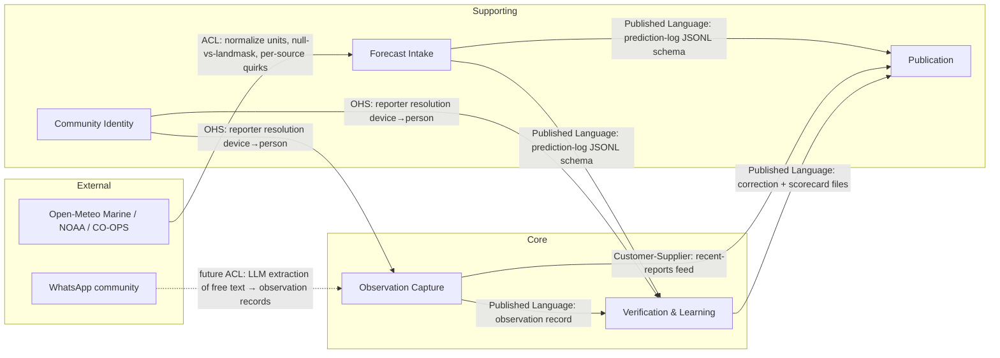
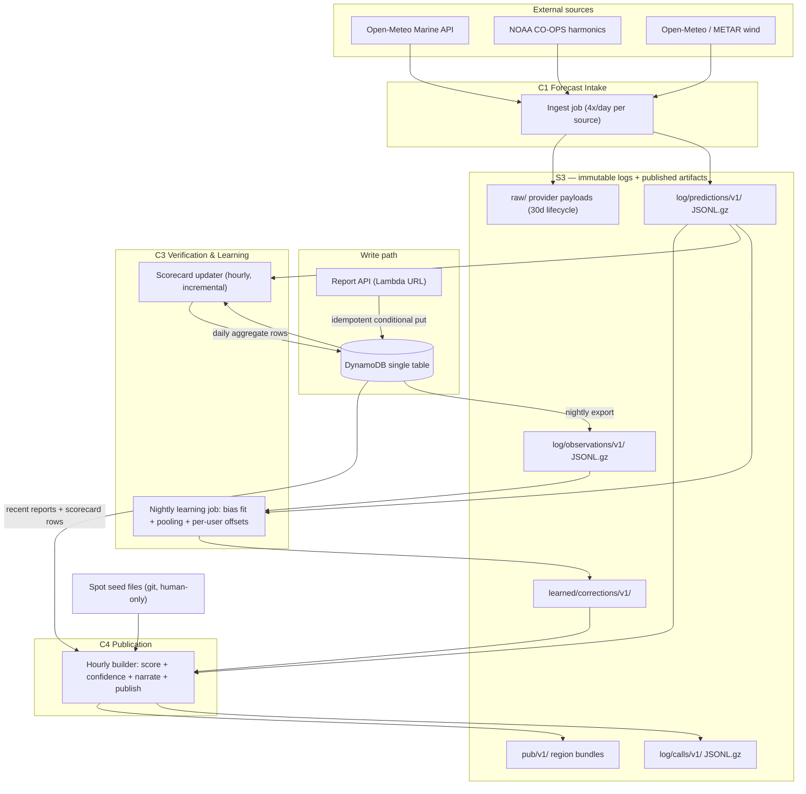

## Domain Model

**Lane:** domain/data (DESIGN round 1). **Status:** PROPOSED, 2026-08-08. **Owner file** — application and system architecture live in their own sections; this section owns every data contract: prediction log, observation record, identity, scorecard, spot files, DynamoDB keys, published payloads.

**Verdict up front:**

- Five bounded contexts; the core subdomain is the **Verification Loop** (prediction log + observation record + scorecard). Everything else is supporting or generic.
- The write path fits one small DynamoDB table (10 item types, 2 GSIs) derived from 15 enumerated access patterns.
- All published payloads for 20 spots fit in **27.5 KB gzipped** for the full region bundle — measured on a representative sample, not estimated. The frontend's 100 KB budget is safe.
- Prediction log at full fidelity (4 sources × 4 runs/day × 168 lead hours, hourly) costs **0.36 GB/year gzipped at 20 spots** — storage is a non-issue; fidelity is not compromised.
- Nothing below is keyed on "Panama". Spots, regions, tiles, timezones, tide sensitivity and coast are all data.

All byte counts in this document were produced by building representative sample records and measuring raw + `gzip -9` output (script run 2026-08-08). Real forecast series are smoother than the random samples used, so gzip figures are **upper bounds**.

---

### 1. Bounded contexts and subdomain classification

Discovered by language divergence (the primary heuristic), consistency boundaries, and the research corpus. Evidence column cites the file that forced the boundary.

| # | Context | Subdomain | Why this classification | Boundary evidence |
|---|---|---|---|---|
| C1 | **Forecast Intake** | Supporting | Fetch + snapshot is commodity plumbing; the *log it writes* is the asset | "Prediction" here = *a model's statement at a run time*; in C4 "prediction" = *our published call*. Same word, two meanings → boundary (research 09 §13.1) |
| C2 | **Observation Capture** | **Core** | The labels are the scarce asset — no public human-rated surf dataset exists anywhere (research 09 §4.3) | "Report" here = a committed, immutable label; in C4 it is a freshness signal ("3 people, yesterday 4pm") |
| C3 | **Verification & Learning** | **Core** | The differentiator (decision 13, BRIEF constraint 6). Joins C1+C2 output; owns scorecard and corrections | "Bias" here = statistical residual mean with a standard error; nowhere else does the word exist |
| C4 | **Publication** | Supporting | Deterministic scoring + static JSON build. Valuable but reproducible by any competitor; the moat is C2+C3's data | "Score"/"call"/"confidence" live only here and in copy |
| C5 | **Community Identity** | Supporting | Anonymous device → claimable name. Enables C3's per-reporter calibration; not itself differentiating | "Reporter" here = device or person; C3 consumes only an opaque `reporter resolution` |
| — | Photo storage, web push delivery, magic-link auth | Generic | Commodity (S3 blobs, Web Push protocol, SES) — integrate, don't model | — |

Scoring physics (research 09 §7) is a **domain service inside C4** (pure functions over spot constants + intake data), not its own context: it shares C4's language and has no state.

### 2. Context map



Pattern notes: C1 wraps every upstream provider behind an **anti-corruption layer** — the land-mask defect (`H==0 && T==0` returned as a fake flat sea, research 09 §8.3 Finding 2) is exactly the upstream quirk an ACL must translate to `land_masked: true` before anything downstream sees it. C1→C3/C4 and C3→C4 are **published-language** file contracts (schemas in §5–§9 below) — no shared database, ever. C5 is an **open-host service**: one operation (`resolve(device_id) → reporter_key`), so C2/C3 never learn identity internals.

### 3. C4 component diagram — data layer



### 4. Ubiquitous language (per context)

| Term | Context | Meaning — precise |
|---|---|---|
| **PredictionSnapshot** | C1 | One (spot, source, run, valid-hour) row: what one model said, captured at fetch time. Immutable fact |
| **run_ts / cycle** | C1 | The model's cycle time (00/06/12/18Z) — never the fetch time |
| **lead_h / lead bucket** | C1, C3 | `valid_ts − run_ts` in hours; buckets `[0,12) [12,24) [24,48) [48,96) [96,∞)` — left-inclusive, right-exclusive. First-class dimension everywhere (research 09 §13.1) |
| **land_masked** | C1 | Simultaneous `H=0,T=0,dir=0` from a source — a masked grid cell, recorded, never averaged |
| **SurfReport** | C2 | A human's committed label for (spot, observed hour): size band + wind + quality. Immutable after commit |
| **size band** | C2 | Body-height category mapped to a metre **range** (§7.2), versioned |
| **cold capture / reveal** | C2 | Screen 1 (label, no forecast visible) / screen 2 (comparison). The label commits before the reveal renders — hard constraint (decision 28) |
| **reporter_key** | C5, C3 | `person_id` if the device is claimed, else `device_id`. Resolved late, at aggregation time |
| **verified pair** | C3 | (PredictionSnapshot, SurfReport) joined on spot + UTC hour — one residual sample per source per lead bucket |
| **bias / bias_se** | C3 | Mean signed residual and its standard error; displayed only when `|bias| > 2·bias_se` (research 09 §13.3) |
| **correction** | C3 | Learned per-spot adjustment file; never touches the seed |
| **PublishedCall** | C4 | What we actually showed: score, confidence, sub-scores, corrections applied — snapshotted per build |
| **confidence level** | C4 | high/medium/low projection of continuous `C_total = C_spread × C_track × C_fresh` (research 09 §14.3) |
| **region / tile** | C4 | `region_id` = publication unit (launch: `pa-pacific`); `geohash4` tile = scaling unit past ~40 spots per region |

Spanish is the product language; these are code/schema names. UI copy maps 1:1 (e.g. size bands §7.2 carry `es`/`en` display strings in one canonical constants file).

---

### 5. The immutable prediction log (C1)

**The single most important artifact in the system** (HANDOFF §3). Written from day one, slice one. Insert-only; no UPDATE, no DELETE, no exceptions.

#### 5.1 Record schema — concrete example (one JSONL line, 342 B measured)

```json
{"spot_id":"playa-venao","source":"ncep_gfswave016","run_ts":"2026-08-08T06:00Z","valid_ts":"2026-08-09T18:00Z","lead_h":36,"fetched_ts":"2026-08-08T11:02:14Z","swell_h_m":0.64,"swell_t_s":15.5,"swell_dir_deg":206,"swell2_h_m":0.31,"swell2_t_s":8.2,"swell2_dir_deg":78,"wind_speed_kt":7.0,"wind_dir_deg":40,"tide_m":2.31,"land_masked":false}
```

Field consumers (every field has a named reader — none is speculative):

| Field | Consumer | Join key it is read on |
|---|---|---|
| `spot_id, valid_ts` | C3 verification join; C4 scoring | `(spot_id, floor_utc_hour(observed_at)) = (spot_id, valid_ts)` |
| `source, run_ts, lead_h` | C3 per-source per-lead scorecard | `(spot_id, source, lead_bucket)` |
| `swell_*`, `swell2_*` | C4 scoring (`H_eff`, `S_dir`); C3 residuals | same |
| `wind_*` | C4 `S_wind`; C3 wind-variable scorecard | same |
| `tide_m` | C4 `S_tide` (deterministic — logged so a replay needs no re-fetch) | same |
| `land_masked` | C1→C4 exclusion; C3 per-source unusability rate (research 09 §13.1) | `(spot_id, source)` |
| `fetched_ts` | audit/debug only | — |

Deviation from research 09 §13.1's sketch, deliberate: `score_q`/`score_confidence` do **not** live in per-source rows (they are not per-source facts). They live in the **PublishedCall log** (§6), which is the honest home for "what we showed".

#### 5.2 S3 key layout, partitioning, format

```
s3://<data-bucket>/log/predictions/v1/dt=<run_date>/src=<source>/cyc=<HH>Z/<partition>.jsonl.gz
      <partition> = "all" at ≤40 spots per region; geohash4 tile past that
s3://<data-bucket>/raw/<provider>/dt=YYYY-MM-DD/<HH>/...        # verbatim payloads, 30-day lifecycle
```

- **Partitioned by run date first** — retention, backfill and learning-job scans are all date-scoped (research 09 §13.1).
- **Format: gzipped JSONL now, Parquet compaction when a region exceeds ~500 spots** — see `adr-prediction-log-format.md`. DuckDB/pandas read both.
- **Idempotency:** the natural key of a record is `(spot_id, source, run_ts, valid_ts)`; the natural key of a *file* is `(run_date, source, cycle, partition)`. Re-running ingest for the same cycle rewrites the same key with content derived from the same upstream run → idempotent overwrite. The `raw/` archive makes any file reconstructible for 30 days without re-hitting providers.
- **Timestamps: UTC everywhere in logs.** Local time is a display concern derived from the spot's `timezone` field.

#### 5.3 Volume math (measured, gzip JSONL, full fidelity: 4 sources × 4 runs/day × 168 lead-hours, hourly)

| Spots | Rows/day | One (src,cyc) file gz | Per day gz | Per year gz | S3 cost end of yr 1 ($0.023/GB-mo) | % of $20 alarm |
|---|---|---|---|---|---|---|
| **20** | 53,760 | 62 KB | 1.0 MB | **0.36 GB** | **$0.008/mo** | 0.04% |
| **500** | 1.34 M | 1.5 MB | 24.5 MB | **8.95 GB** | $0.21/mo | 1.0% |
| **5,000** | 13.4 M | 15.3 MB | 245 MB | **89.5 GB** | $2.06/mo (→ ~$0.55/mo with Parquet ÷3 + Glacier IR $0.004/GB past 90 d) | 10% → 2.8% |

S3 has **no verified perpetual free allowance** (research 08 §12.3) — figures are dollars, not free-tier percentages. Conclusion unchanged from research 09: do not compromise fidelity to save storage.

---

### 6. The PublishedCall log (C4 → C3)

What we showed, per build, per spot, per valid hour — required by every evaluation metric (research 09 §10.3: "log … for every spot, every day, whether or not anyone looked"). Snapshotted because recomputing history with a later formula is a lie (research 09 §13.1).

```json
{"spot_id":"playa-venao","build_id":"b_2026-08-08T11Z","built_at":"2026-08-08T11:00:00Z","valid_ts":"2026-08-09T12:00Z","lead_h":25,"score_q":74,"confidence":0.31,"conf_level":"low","sub":{"dir":1.0,"size":0.81,"wind":0.66,"tide":0.92},"h_eff_m":1.1,"size_band":"waist_chest","bias_applied":0.0,"bias_gate":"n_lt_10","baseline_rank_raw":3,"our_rank":1,"members_used":4,"members_null":3}
```

| Field | Consumer |
|---|---|
| `score_q, conf_level, sub, size_band` | reveal screen (server-side authoritative capture, §7.4); Brier + calibration check (research 09 §10.2) |
| `baseline_rank_raw, our_rank` | B1 skill metric — pairwise ranking vs raw model, THE metric. Baseline = rank spots by raw significant wave height, formula per research 09 §10.1–10.2; the scoring lane implements it | 
| `conf_level` | display projection of continuous `confidence`; **thresholds are the round-2 scoring lane's to set** — both values are logged so thresholds can change without losing history |
| `bias_applied, bias_gate` | C3 audit: which correction was live when; scorecard honesty guard |
| `members_used, members_null` | per-source availability tracking; confidence `f(M)` audit |

Layout: `log/calls/v1/dt=<date>/build=<HH>Z/<region>.jsonl.gz`. One file per hourly build per region. Member selection when several runs cover the same `valid_ts`: the builder uses **the latest run per source with `run_ts ≤ build time`** (freshest opinion wins; older runs stay in the prediction log for the lead-time skill curve). Any blend beyond that is the round-2 scoring lane's decision. Measured: 392 B/line; **20 spots: 0.19 MB/day gz → 0.07 GB/yr ($0.002/mo)**; 500: 1.58 GB/yr; 5,000: 15.8 GB/yr (same Parquet/Glacier levers as §5.3).

---

### 7. The observation record (C2)

#### 7.1 Two-screen flow — the domain invariant

Decision 28 (resolved): **screen 1 captures the label cold** (no score, no prediction, no hint anywhere on the screen or its back stack — frontend lane owns the leak-proofing); **the commit happens before screen 2 renders**. There is no command in this domain that edits a label. The reveal is a read of the PublishedCall, never an input.

The label is **absolute** (how big / how was the wind / worth it) — not "vs forecast". Research 09 §13.2 prefers asking the residual directly; decision 28 overrides it because the residual question requires showing the forecast, which re-introduces anchoring. The residual is **derived** server-side: `observed band vs predicted H_eff` per verified pair. Per-user offset estimation (research 09 §13.2) recovers most of the personal-constant cancellation the direct question would have bought. Binding, not relitigated; noted in §15.

#### 7.2 Size bands — ranges, not points (canonical, versioned: `size_band_schema: 1`)

| Band | Metre range (breaking face) | es | en |
|---|---|---|---|
| `flat` | 0 – 0.1 | Plano | Flat |
| `ankle_knee` | 0.1 – 0.4 | Tobillo a rodilla | Ankle to knee |
| `knee_waist` | 0.4 – 0.7 | Rodilla a cintura | Knee to waist |
| `waist_chest` | 0.7 – 1.1 | Cintura a pecho | Waist to chest |
| `chest_head` | 1.1 – 1.6 | Pecho a cabeza | Chest to head |
| `head_overhead` | 1.6 – 2.4 | Cabeza a un metro más | Head to overhead |
| `double_overhead_plus` | 2.4 + | Doble o más | Double overhead + |

Range edges are **v1 convention (unfit priors)** — they live in ONE canonical constants file consumed by C2 (form), C4 (display) and C3 (residual math). Changing an edge requires bumping `size_band_schema`, because old observations become incomparable otherwise. C3 treats a band as an **interval**, never a point — the residual math on intervals (midpoint vs distance-to-edge vs interval regression) is the learning lane's decision (design doc 06), but the *fact stored* is the band.

#### 7.3 The record — concrete example (DynamoDB item, 654 B measured)

```json
{"PK":"SPOT#playa-venao","SK":"REP#2026-08-08T12:41:00Z#01J4QZK8Y3E9RWM2P7T6B1XCVN",
 "report_id":"01J4QZK8Y3E9RWM2P7T6B1XCVN","device_id":"d_9f83bc2a71e04c55",
 "observed_at":"2026-08-08T12:41:00Z","submitted_at":"2026-08-08T12:44:12Z",
 "size_band":"waist_chest","size_band_schema":1,"wind":"clean","quality":"good",
 "photo_ids":[],
 "build_id":"b_2026-08-08T11Z",
 "predicted":{"score_q":82,"size_band":"chest_head","wind_state":"clean","conf_level":"medium"},
 "GSI1PK":"DEV#d_9f83bc2a71e04c55","GSI1SK":"2026-08-08T12:41:00Z",
 "GSI2PK":"TILE#d1u0","GSI2SK":"2026-08-08T12:41:00Z"}
```

| Field | Consumer | Notes |
|---|---|---|
| `size_band, wind, quality` | C3 residuals + Brier label; C4 recent-reports feed | The label. Immutable |
| `observed_at` (UTC) | verification join `floor_utc_hour(observed_at) = valid_ts`; SK ordering | Client sets it (defaults to now, adjustable back ≤12 h for "this morning" reports) |
| `submitted_at − observed_at` | C3 staleness/trust weighting; offline-sync latency metric | Gap derivable — no separate offline flag needed |
| `report_id` (client-minted ULID) | dedup (§7.4); photo attach ref | Minted ONCE at commit, before any network attempt |
| `build_id` + `predicted{}` | reveal render audit; Brier "probability we emitted"; anti-drift check between client-cached and server-current build | Server-side authoritative capture at accept time (§7.4) |
| `device_id` | C5 resolution; per-user offsets; quota | Join key `device_id` |
| `photo_ids` | photo pipeline; C3 dispute/spam checks | Appended later — the ONLY mutable slot (§10) |

Vision-model annotations, if ever added, go in a **separate** `annotations` item — never into label fields. Human says it, model annotates it, never the reverse (research 09 §9.3).

#### 7.4 Offline queue and server-side dedup

- Client: at commit, the full record + freshly minted `report_id` is written to a durable local queue (IndexedDB) **before** any network attempt. The reveal renders from the committed local record + cached bundle. Retry re-sends the identical record — never re-mints.
- Server: `PutItem` with `ConditionExpression: attribute_not_exists(SK)`. Dedup natural key = **`(spot_id, observed_at_utc, report_id)`** = PK+SK. A duplicate conditional-put failure returns HTTP 200 with `{status:"duplicate"}` — idempotent ack, the client clears its queue entry.
- Server attaches `predicted{}` authoritatively at accept time: it resolves the PublishedCall for `(spot_id, floor_utc_hour(observed_at))` from the build that was live at `observed_at` (lookup in `log/calls/`, keyed by hour). The client's cached `build_id` is stored for drift audit but is not trusted.
- Quota backstop: `QUOTA#<date>` counter per device (e.g. 20/day) — abuse control, not moderation; consistent with decision 24 (statistical down-weighting only, no queue).

---

### 8. Anonymous identity and claim-and-merge (C5)

**Design rule that makes merge safe by construction: reports are keyed by `device_id` forever; identity is a pointer layer resolved late; all per-person statistics are projections recomputed from immutable logs + the current mapping.** Merge is a pointer write, never a history rewrite.

- `device_id`: `d_` + 128-bit random, minted client-side on first visit, stored in IndexedDB + localStorage. Lost storage = new device = fresh reporter (accepted cost of zero-friction anonymity; per-user offsets just start over).
- **Claim** (`ClaimName`): creates `PERSON#<ulid>` with a handle, writes `person_id` onto the device item and a membership item. Ships later; the schema ships now.
- **Merge** (`LinkDevice`): a second device joins via link-code or magic link → same two writes. Monotonic append; no unlink in v1 (manual fix path; flagged §15).
- **Resolution** (the C5 OHS): `reporter_key(device_id) = person_id ?? device_id`. C3's per-user offsets `u_user` and the scorecard's `distinct_reporters` gate both key on `reporter_key` — and both are computed at aggregation time, so a merge yesterday changes today's aggregates correctly with zero migration. This is why scorecard daily rows store raw `device_id` sets (§9), not resolved counts: store the fact, resolve late.

### 9. The per-source per-spot scorecard (C3) — incremental, never recomputed

Grain: `(spot_id, source, lead_bucket, variable)` where `variable ∈ {swell_h, wind, score}`. Two-level incremental design (`adr-scorecard-incremental.md`):

**Deployment constraint: exactly one scorecard-updater instance runs at a time** — the cursor gives exactly-once only under single-writer; parallelism requires the per-(report, key) idempotency-marker variant in the ADR.

1. **Hourly scorecard updater**: for each new report (cursor-tracked, exactly-once), pair against prediction-log rows for `(spot_id, valid_ts = floor_utc_hour(observed_at))` across sources and lead buckets → for each residual sample, one atomic `ADD` on a **daily aggregate item**: `{n, sum_err, sum_abs_err, sum_sq_err, device_ids[]}`.
2. **Builder, hourly**: sums ≤90 daily items per key into windowed stats (`30d/90d`), monthly rollup items for `all`. Derives `bias`, `mae`, `bias_se = σ/√n`, `distinct_reporters = |resolve(device_ids)|`.

Honesty guards carried as domain invariants: a scorecard claim renders **only** when `n ≥ 10 AND distinct_reporters ≥ 5 AND |bias| > 2·bias_se` (research 09 §13.3–13.4); below that the payload carries the counter (`"7 / 30"`, decision 19) and `claim_ok: false`. Recovery path: the whole scorecard is a projection of two immutable logs — rebuildable from `log/predictions/` + `log/observations/`, so a defect in the updater is repairable without data loss.

### 10. Aggregate designs — invariants and bounded-change contracts

Vernon's rules applied: every aggregate below is rule-2 small (root + values — the ~70% case); cross-aggregate references are by id only (rule 3); C2→C3→C4 propagation is eventually consistent (rule 4); the only transactional boundaries (rule 1) are the two conditional writes marked below.

| Aggregate | Observable state (snapshot) | Commands → declared delta | Complement invariant (what must NOT change) |
|---|---|---|---|
| **SurfReport** (C2) | label fields, `photo_ids`, `predicted{}`, timestamps | `CommitLabel` → creates whole record (conditional put, txn boundary). `AttachPhoto` → append to `photo_ids` ONLY | Label fields, `observed_at`, `predicted{}`, keys: frozen at commit. No edit command exists — anchoring cannot re-enter via API |
| **DeviceIdentity** (C5) | `device_id`, `person_id?`, `created_at` | `ClaimName`/`LinkDevice` → set `person_id` once (conditional: only if null; txn boundary with membership item) | `device_id`, `created_at`; `person_id` never overwritten once set (no re-merge in v1) |
| **Person** (C5) | handle, membership set | `ClaimName` → create; `LinkDevice` → add membership | handle immutable v1; memberships append-only |
| **ScorecardDay** (C3) | counters + device set for one (key, day) | `RecordVerifiedPair` → `ADD n/sums`, append device_id | Key fields, prior days' items untouched — the log-universe complement: appending pairs never mutates any previously written item |
| **SpotDefinition** (C4/C3) | seed file + correction file + derived effective values | `ReviseSeed` (human PR only) → seed file. `UpdateCorrection` (learning job only) → correction file | **Seed is never written by any machine path; correction is never written by any human path.** Effective = f(seed, correction) computed at build, both inputs auditable (git history / S3 history) |
| **PushSubscription** | endpoint, keys, spot, threshold | `Subscribe`/`Unsubscribe` → create/delete whole item | (spot_id, endpoint_hash) identity |

PredictionSnapshot and PublishedCall are **not aggregates** — they are immutable facts in append-only logs; their entire contract is "insert-only, natural-key idempotent" (§5, §6).

### 11. Spot definition files (C4 input)

**Seed** — human knowledge, git-versioned (`data/spots/<spot_id>.json`), edited only by PR (decision 22; adding a country = a PR against data files, research 08 §15.1). Concrete example (742 B measured):

```json
{"spot_id":"playa-venao","schema":"spot-seed/1","name":"Playa Venao",
 "lat":7.434,"lon":-80.188,"country":"PA","region_id":"pa-pacific",
 "timezone":"America/Panama","coast":"pacific","break_type":"beach",
 "shore_normal_deg":175,"swell_window_deg":[150,210],
 "h_ref_m":1.3,"s_size":0.5,"t_min_s":11,
 "tide":{"optimum":"mid_falling","sigma":"wide","range_class":"macrotidal"},
 "wind_optimum":{"u_off_kt":5,"k_on":6,"k_off":15,"k_cross":12},
 "hazards":["rips"],"skill":"all",
 "season_note":{"es":"Abril–octubre para tamaño; diciembre más limpio.","en":"April–October for size; December cleanest."},
 "sources":[{"url":"https://www.surf-forecast.com/breaks/Playa-Venao","accessed":"2026-08-08"}],
 "confidence":"2+sources"}
```

Every physical constant maps to a scoring term in research 09 §7 (θ_n → `shore_normal_deg`, window → `S_dir`, `H_ref`/`s_size` → `S_size`, wind constants → `S_wind`, tide → `S_tide`). `sources` + `confidence` carry research-10's per-spot evidence grade — spots like Punta Barco ship as `"1source-thin"`, and Playa Duartes does not ship at all until located (research 10 gap #1). `tide.range_class` per spot is what keeps Caribbean microtidal spots from inheriting Pacific tide sensitivity (research 10 §5.5) — a global-readiness field, not a Panama field.

**Correction** — learning-job output, written to `learned/corrections/v1/current/<spot_id>.json`, with every prior version appended under `learned/corrections/v1/history/dt=<date>/`. Concrete example (476 B measured):

```json
{"spot_id":"playa-venao","schema":"spot-correction/1","computed_at":"2026-09-30T02:00:00Z",
 "score_delta":{"b":-4.1,"se":1.8,"n":22,"reporters":7,"applied":true,"shrunk_from_global":0.35},
 "bias":{"swell_h_m":{"per_source":{"ncep_gfswave016":{"lead_0_12":{"b":-0.18,"se":0.05,"n":22,"reporters":7,"applied":true}}}}},
 "clamp":{"max_abs_h_frac":0.4},
 "inputs":{"obs_export_through":"2026-09-29","pred_log_through":"2026-09-29"}}
```

The builder reads **`current/<spot_id>.json` as of build start** (history is audit-only) and computes `effective = apply(seed, correction)` per run with the four overfitting gates + clamp (research 09 §13.4) applied at read time — so a bad correction file can never produce an absurd public number, and deleting a correction file cleanly reverts a spot to pure seed.

---

### 12. Write-path store — access patterns first, then keys

#### 12.1 Enumerated access patterns

| AP | Who | Pattern | Frequency (20 spots / 5,000 spots) |
|---|---|---|---|
| AP1 | Report API | Insert report, idempotent on `(spot, observed_at, report_id)` | ~10–200/day / ~250k/day |
| AP2 | Builder | Recent reports for one spot, newest first, limit N | 20/hr / per-tile instead (AP3) |
| AP3 | Builder + nightly export | Reports for a tile since T | hourly + nightly |
| AP4 | Claim UI + user history | All reports by one device, newest first | rare |
| AP5 | Report API, C5 | Resolve device → person | every write |
| AP6 | C5 | List devices of a person | rare |
| AP7 | Report API | Per-device daily quota check/increment | every write |
| AP8 | Notification job | Push subscriptions for a spot | per notification run |
| AP9 | Client | Upsert/delete own subscription; list by device | rare |
| AP10 | Builder | All scorecard rows for a spot (daily + monthly) | 20/hr |
| AP11 | Scorecard updater | Atomic increment of one (key, day) aggregate | per verified pair |
| AP12 | Offline re-sync | Same as AP1 — conditional put rejects duplicate | with every sync |
| AP13 | Nightly export | Previous day's reports per tile → S3 JSONL | 1/day/tile |
| AP14 | Auth (later) | Magic-link session token lookup, TTL | rare |
| AP15 | Scorecard updater | Read/advance processing cursor | hourly |

#### 12.2 Single-table design (on-demand). Every key justified against an AP

```
Table: surfsup            GSI1 (GSI1PK, GSI1SK)          GSI2 (GSI2PK, GSI2SK)

Item            PK                  SK                                   GSI1PK / GSI1SK              GSI2PK / GSI2SK
Report          SPOT#<spot_id>      REP#<observed_at_utc>#<report_id>    DEV#<device>/<observed_at>   TILE#<geohash4>/<observed_at>
ScorecardDay    SPOT#<spot_id>      SCORE#<src>#<lead>#<var>#D#<date>    —                            —
ScorecardMonth  SPOT#<spot_id>      SCORE#<src>#<lead>#<var>#M#<month>   —                            —
Device          DEV#<device_id>     IDENTITY                             —                            —
Person          PER#<person_id>     PROFILE                              —                            —
Membership      PER#<person_id>     DEV#<device_id>                      —                            —
Quota (TTL)     DEV#<device_id>     QUOTA#<yyyy-mm-dd>                   —                            —
PushSub         SPOT#<spot_id>      PUSH#<endpoint_hash>                 DEV#<device>/PUSH#<spot_id>  —
Session (TTL)   SES#<token_hash>    TOKEN                                —                            —
JobCursor       JOB#<job_name>      CURSOR#<scope>                       —                            —
```

| Key decision | Satisfies | Why this shape |
|---|---|---|
| `PK=SPOT#`, `SK=REP#<utc>#<ulid>` | AP1, AP2, AP12 | One Query per spot returns reports newest-first (`ScanIndexForward=false`); UTC in SK makes lexicographic = chronological; ULID suffix disambiguates same-second reports; PK+SK **is** the dedup natural key, so idempotency costs one condition, zero extra reads |
| Reports + Scorecard share `PK=SPOT#` | AP2+AP10 | The builder issues ONE Query per spot (`SK begins_with` filters), not three |
| GSI1 `DEV#` | AP4, AP9 | Device history and subscription cleanup without scans |
| GSI2 `TILE#<geohash4>` | AP3, AP13 | Builder and export query per tile, not per spot — the access unit that stays O(tiles) as the spot count grows (research 08 §15.5). Tile is computed from lat/lon at write time; never from country |
| Quota/Session as TTL items | AP7, AP14 | Native expiry, no cleanup job |
| JobCursor | AP11, AP15 | `ADD` increments are not idempotent on retry; a cursor conditional-update gives the updater exactly-once processing over the report stream |

Costs: report item 654 B measured → 1 WCU per write. Launch volumes round to $0.00; at 5,000 spots / 250k reports/day ≈ $4.7/mo writes — the audience axis, not the spot axis, and outside this lane's envelope concern (research 08 §15.4). DynamoDB 25 GB free storage: 0.1% used at launch; past ~30 GB of accumulated reports (multi-year, global scale), TTL live reports at 180 days — safe because the nightly S3 export (AP13) is the archival system of record and runs before any TTL horizon.

---

### 13. Published static JSON payloads — measured bytes

Contract: **this section is the schema authority; frontend states requirements, infra states delivery.** All sizes measured on representative 20-spot samples (random-valued — real data compresses better).

| Payload | Path | Raw | **Gzip (wire)** | Consumer |
|---|---|---|---|---|
| **Region bundle** — full detail, all spots, 48 h hourly | `pub/v1/regions/pa-pacific/bundle.json` | 217,783 B | **27,510 B** | Home ranked list + every spot detail view, one fetch (research 08 §4.4: bundle, never per-spot files) |
| Region index — list only, no hourly | `pub/v1/regions/pa-pacific/index.json` | 5,469 B | **1,030 B** | Optional fast-first-paint variant; frontend's call whether to use it |
| Recent reports | `pub/v1/regions/pa-pacific/reports.json` | 5,694 B | **675 B** | Freshness lines, report counters (30 most recent) |
| Manifest | `pub/v1/manifest.json` | 199 B | **146 B** | Build stamp + content hashes; the staleness indicator and cache-buster |
| 3-hourly bundle variant (16 pts/spot) | measured for reference | 86,791 B | 10,875 B | Fallback lever if frontend needs the wire cost cut ~2.5× |

Budget arithmetic for the frontend lane: bundle 27.5 KB + reports 0.7 KB + manifest 0.15 KB ≈ **28.4 KB of the 100 KB page budget**, leaving ~70 KB for HTML/CSS/JS. Decompressed bundle is 218 KB of JSON in memory — trivial to parse, but stated so nobody is surprised. Today+tomorrow only (decision 10) is what makes this fit; a 7-day bundle would be ~3.5×.

Bundle shape per spot (concrete, abridged — full sample in the measurement script):

```json
{"spot_id":"playa-venao","name":"Playa Venao","score":74,"confidence":"low",
 "confidence_reason":{"es":"Los modelos difieren 40% en el período y el último reporte fue el martes.","en":"..."},
 "call":{"es":"Pecho a cabeza y limpio temprano. Terral hasta las 10, después se arruina.","en":"..."},
 "size_band":"waist_chest","size_range_m":[0.8,1.4],
 "best_window":{"start":"06:00","end":"09:30"},"wind_state":"clean",
 "tide":{"next_high":"11:04","next_high_m":4.3,"next_low":"17:21","next_low_m":0.9},
 "scorecard":{"n_obs":22,"n_reporters":7,"counter":"22 / 30","claim_ok":false,"headline":null},
 "reports":{"last_ts":"2026-08-07T16:12:00-05:00","count_24h":3,"distinct_24h":3},
 "members":[{"source":"ncep_gfswave016","h":0.64,"t":15.5,"dir":206},{"source":"dwd_gwam","h":0.86,"t":10.05,"dir":203}],
 "hourly":[{"t":"2026-08-08T05:00-05:00","q":74,"h_eff_m":1.1,"swell_h_m":0.8,"swell_t_s":15.5,"swell_dir_deg":206,"wind_kt":6,"wind_dir_deg":30,"tide_m":2.3,"sub":{"dir":1.0,"size":0.81,"wind":0.66,"tide":0.92}}]}
```

Every element traces to a binding decision: `score`+`call` (decisions 2–3), three-level `confidence` with reason (7), `scorecard` inline with counter and `claim_ok` honesty gate (13, 19, research 09 §13.3), `size_band` primary + metres secondary (18), sub-scores exposed for the breakdown page (17), `members` for "models split on period" transparency (research 09 §8.4), local-time strings precomputed from the spot's timezone (mobile clients render, never compute).

Regeneration: hourly build rewrites 4 objects per region (bundle, index, reports, manifest) = ~2,900 S3 PUTs/mo at one region; scales O(tiles) with per-tile model-cycle stamps past 40 spots/region (research 08 §15.5).

---

### 14. ES/CQRS assessment (per context, honest)

| Context | Recommendation | Rationale — trade-offs stated |
|---|---|---|
| C1 Forecast Intake | **Append-only fact log — yes (it IS the domain)** | Not "event sourcing an aggregate": there is no aggregate to rehydrate. The log is the product asset (HANDOFF §3). No replay complexity because nothing replays into state — jobs scan partitions |
| C2 Observation Capture | **Insert-only records; no ES machinery** | A SurfReport never transitions state (photo append is the one delta). Event-sourcing a write-once record buys nothing and costs a framework |
| C3 Verification & Learning | **CQRS-lite: immutable logs → incrementally-updated projections** | Scorecard and corrections are projections, deliberately rebuildable from the two logs. This is the honest form of "audit trail + temporal queries" that would normally argue for ES — we get both properties from the logs without an event store |
| C4 Publication | **Pure read-model build; no ES, no CQRS vocabulary needed** | Static artifact regenerated hourly. State lives nowhere |
| C5 Identity | **Plain state-based CRUD** | Tiny, low-churn, simple invariants. ES here would be résumé-driven design |

Net: the system is "two immutable logs + one small CRUD table + derived projections". No event-store product, no saga framework. The audit/temporal/learning requirements that usually justify ES are satisfied by the logs' append-only discipline — at $0.01/month.

### 15. What I am unsure about

1. **Size-band range edges (§7.2)** are convention, not sourced — no citable mapping from body-height words to metres exists in the research. They are versioned so a revision is survivable, but v1 edges are my judgment.
2. **The absolute-label vs residual-label trade** (§7.1): decision 28 wins and is right about anchoring, but research 09 §13.2's warning stands — absolute size estimates carry per-user inflation constants, so C3 leans harder on per-user offsets, which need each reporter to have several reports before their labels calibrate. Cold-start label noise will be higher than the research's residual-question design assumed.
3. **Scorecard exactly-once via job cursor** (§9): sound at these volumes, but it serializes the updater. If reports ever arrive faster than one updater pass can process, the design needs idempotency keys per (report, scorecard-key) instead. Not a launch risk; flagged for the round-2 write-path doc.
4. **`predicted{}` capture for offline reports** (§7.4): server resolves the call live at `observed_at` from `log/calls/`. If the builder was down that hour, there is no call to attach — record ships with `predicted: null` and C3 skips the Brier pairing (verification against the prediction log still works). Rare, but the null path must be in the ATs.
5. **Geohash4 tile size** (~20 km): Panama's Pacific spots cluster acceptably, but Santa Catalina's 4 breaks land in one tile while Azuero spots spread across several. Tiling only matters past ~40 spots/region; if real-world regions produce degenerate tiles (1 spot each), precision 3 is the documented fallback (research 08 §15.5).
6. **No unlink/unmerge in v1 identity** (§8): a wrong merge is repairable only by manual mapping edit. Acceptable for launch volume; needs a real command before any public "claim" UI ships at scale.
7. **Bundle size at 40+ spots per region**: 27.5 KB measured at 20 spots scales ~linearly (≈55 KB at 40). Still inside budget, but the tile split should trigger on measured bundle size, not spot count alone.

### 16. Decisions needing Andres

| # | Decision | Options | My recommendation |
|---|---|---|---|
| D1 | Prediction-log fidelity | (a) full: 4 src × 4 runs × 168 h hourly; (b) lean: 1 run/day, 8 lead buckets | **(a) full** — 0.36 GB/yr at 20 spots is $0.008/mo; fidelity can never be backfilled, thrift can be applied later |
| D2 | Log format day one | (a) gzip JSONL, Parquet compaction at ~500 spots; (b) Parquet from day one | **(a)** — zero dependencies in the ingest job, DuckDB reads JSONL fine at this scale; ADR records the compaction trigger. (b) is defensible if the ingest runner is GitHub Actions where pyarrow is free — infra lane's runner choice may flip this |
| D3 | PublishedCall cadence | (a) every hourly build; (b) only when inputs changed | **(a) every build** — 0.07 GB/yr; evaluation joins stay trivial ("what was live at hour H" = one key), dedup logic avoided |
| D4 | Corrections storage | (a) S3 current+history (machine lane, no PR noise); (b) git via nightly PR (everything auditable in one place) | **(a) S3** — keeps the seed/correction write-path separation physical: git = human lane, S3 = machine lane. History prefix preserves auditability |
| D5 | Scorecard windows | (a) daily+monthly aggregate items summed at build; (b) EWMA single-item (cheaper, no true windows) | **(a)** — the scorecard headline ("25% too big for 30 days") needs a real window; ≤90-item sums are trivial |
| D6 | Report retention in DynamoDB | (a) keep forever until 25 GB pressure; (b) TTL at 180 d once exports proven | **(a) now, (b) later** — flip only after the nightly export has run verified for months; the export is the archive of record either way |
| D7 | Size-band edges (§7.2) | ship v1 edges as proposed / have the cousin's crew sanity-check the Spanish labels + edges first | **Sanity-check with locals before DISTILL** — costs one WhatsApp message, protects the label vocabulary the entire learning loop is built on |

### 17. Contract notes for the other lanes

- **Frontend**: consume §13's measured bytes; the bundle is the single data fetch for home + detail. Screen-1 leak-proofing (no forecast in the DOM, back stack, or cached route of the report flow) is yours; the domain guarantees no API supports label edit after commit. The 3-hourly variant exists if your budget math needs it.
- **Infrastructure**: S3 prefixes in §5–§6, PUT counts in §5.3/§13; the DynamoDB table in §12 is the only stateful store; research 08 §4.4's DynamoDB sketch (rating/height_ft fields, SESSION#) is **superseded** by §12 — do not copy it. Lifecycle rules needed: `raw/` 30 d, `log/*` → Glacier IR at 90 d (only matters ≥500 spots).
- **Round-2 ingest (04)**: the `land_masked` translation (`H==0 && T==0 && dir==0` → flag, exclude from blends) is a C1 ACL obligation with a unit test — the already-verified defect of research 09 §8.3.
- **Round-2 scoring (05)**: consumes `effective = apply(seed, correction)`; every constant name in §11's seed maps 1:1 to research 09 §7 symbols.
- **Round-2 learning (06)**: owns residual-on-interval math (§7.2), pooling, per-user offsets; its inputs are exactly `log/predictions/`, `log/observations/`, and the C5 resolution — nothing else.
- **Round-2 write path (07)**: implements §7.4 and §12 verbatim; push threshold rule lives on the PushSub item.

### 18. ADR index (decisions live there, cited here)

| ADR | Decision |
|---|---|
| `adr-prediction-log-format.md` | JSONL.gz now, Parquet compaction trigger; partition-by-run-date |
| `adr-report-label-immutability.md` | Commit-before-reveal as an aggregate invariant; photo-append the only delta |
| `adr-identity-claim-merge.md` | Pointer-layer identity, late resolution, projections-recompute merge |
| `adr-write-store-single-table.md` | Single-table DynamoDB, keys derived from §12.1 access patterns |
| `adr-scorecard-incremental.md` | Daily/monthly aggregate items + cursor exactly-once; rejected EWMA and full recompute |
| `adr-published-payload-region-bundle.md` | One region bundle vs per-spot files; measured-bytes governance |
