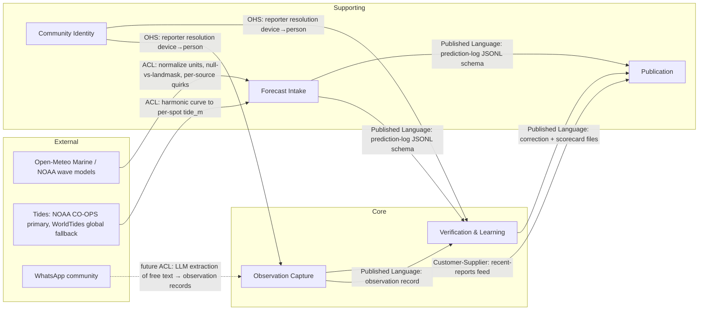
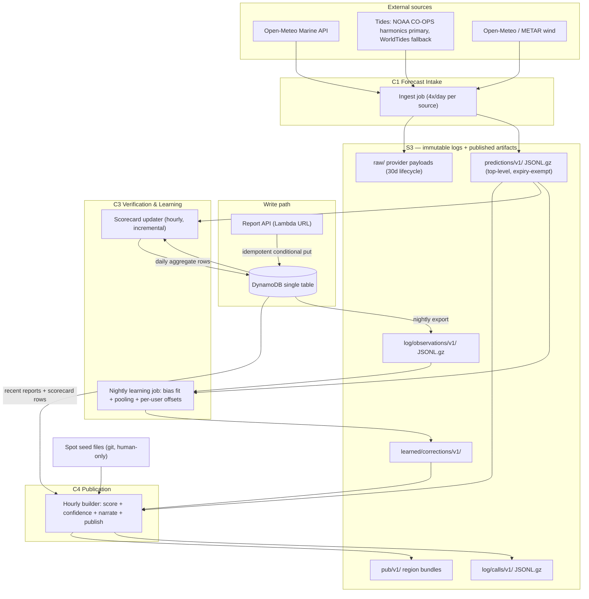

## Domain Model

**Lane:** domain/data (DESIGN round 1). **Status:** PROPOSED, 2026-08-08; **amended 2026-08-08 coherence round** (prediction-log prefix isolation, missing consumer fields, round-2 supersessions; second pass same day: two-day ranking representation `adr-two-day-ranking.md`, `conf_value`/`conf_level` split, §7.3 wind-consumer staleness; each amendment carries an inline note). **Owner file** — application and system architecture live in their own sections; this section owns every data contract: prediction log, observation record, identity, scorecard, spot files, DynamoDB keys, published payloads.

**Verdict up front:**

- Five bounded contexts; the core subdomain is the **Verification Loop** (prediction log + observation record + scorecard). Everything else is supporting or generic.
- The write path fits one small DynamoDB table (10 item types, 2 GSIs) derived from 15 enumerated access patterns.
- All published payloads for 20 spots fit in **27.5 KB gzipped** for the full region bundle — measured on a representative sample, not estimated. The bundle is **builder input, never a browser payload** (`adr-publish-time-html-rendering.md`); the figure sizes S3 and the publish job, not the page. (Amended 2026-08-08 coherence round: round-1 text framed this against the frontend's 100 KB page budget, which round 2 superseded.)
- Prediction log at full fidelity (4 sources × 4 runs/day × 168 lead hours, hourly) costs **0.36 GB/year gzipped at 20 spots** — storage is a non-issue; fidelity is not compromised.
- Nothing below is keyed on "Panama". Spots, regions, tiles, timezones, tide sensitivity and coast are all data.

All byte counts in this document were produced by building representative sample records and measuring raw + `gzip -9` output (script run 2026-08-08). Real forecast series are smoother than the random samples used, so gzip figures are **upper bounds**.

---

### 1. Bounded contexts and subdomain classification

Discovered by language divergence (the primary heuristic), consistency boundaries, and the research corpus. Evidence column cites the file that forced the boundary.

| # | Context | Subdomain | Why this classification | Boundary evidence |
|---|---|---|---|---|
| C1 | **Forecast Intake** | Supporting | Fetch + snapshot is commodity plumbing; the *log it writes* is the asset | "Prediction" here = *a model's statement at a run time*; in C4 "prediction" = *our published call*. Same word, two meanings → boundary (research 09 §13.1) |
| C2 | **Observation Capture** | **Core** | The labels are the scarce asset — no public human-rated surf dataset exists anywhere (research 09 §4.3) | "Report" here = a committed, immutable label; in C4 it is a freshness signal ("3 people, yesterday 4pm") |
| C3 | **Verification & Learning** | **Core** | The differentiator (decision 13, BRIEF constraint 6). Joins C1+C2 output; owns scorecard and corrections | "Bias" here = statistical residual mean with a standard error; nowhere else does the word exist |
| C4 | **Publication** | Supporting | Deterministic scoring + static JSON build. Valuable but reproducible by any competitor; the moat is C2+C3's data | "Score"/"call"/"confidence" live only here and in copy |
| C5 | **Community Identity** | Supporting | Anonymous device → claimable name. Enables C3's per-reporter calibration; not itself differentiating | "Reporter" here = device or person; C3 consumes only an opaque `reporter resolution` |
| — | Photo storage, web push delivery, magic-link auth | Generic | Commodity (S3 blobs, Web Push protocol, SES) — integrate, don't model | — |

Scoring physics (research 09 §7) is a **domain service inside C4** (pure functions over spot constants + intake data), not its own context: it shares C4's language and has no state.

### 2. Context map



(Tide node amended 2026-08-08 coherence round: round-1 named "NOAA / CO-OPS" only while system-architecture named WorldTides; `adr-tide-source-chain.md` settled CO-OPS primary, WorldTides global fallback.)

Pattern notes: C1 wraps every upstream provider behind an **anti-corruption layer** — the land-mask defect (`H==0 && T==0` returned as a fake flat sea, research 09 §8.3 Finding 2) is exactly the upstream quirk an ACL must translate to `land_masked: true` before anything downstream sees it. C1→C3/C4 and C3→C4 are **published-language** file contracts (schemas in §5–§9 below) — no shared database, ever. C5 is an **open-host service**: one operation (`resolve(device_id) → reporter_key`), so C2/C3 never learn identity internals.

### 3. C4 component diagram — data layer



### 4. Ubiquitous language (per context)

| Term | Context | Meaning — precise |
|---|---|---|
| **PredictionSnapshot** | C1 | One (spot, source, run, valid-hour) row: what one model said, captured at fetch time. Immutable fact |
| **run_ts / cycle** | C1 | The model's cycle time (00/06/12/18Z) — never the fetch time |
| **lead_h / lead bucket** | C1, C3 | `valid_ts − run_ts` in hours; buckets `[0,12) [12,24) [24,48) [48,96) [96,∞)` — left-inclusive, right-exclusive. First-class dimension everywhere (research 09 §13.1) |
| **land_masked** | C1 | Simultaneous `H=0,T=0,dir=0` from a source — a masked grid cell, recorded, never averaged |
| **SurfReport** | C2 | A human's committed label for (spot, observed hour): size band + wind + quality. Immutable after commit |
| **size band** | C2 | Body-height category mapped to a metre **range** (§7.2), versioned |
| **cold capture / reveal** | C2 | Screen 1 (label, no forecast visible) / screen 2 (comparison). The label commits before the reveal renders — hard constraint (decision 28) |
| **reporter_key** | C5, C3 | `person_id` if the device is claimed, else `device_id`. Resolved late, at aggregation time |
| **verified pair** | C3 | (PredictionSnapshot, SurfReport) joined on spot + UTC hour — one residual sample per source per lead bucket |
| **bias / bias_se** | C3 | Mean signed residual and its standard error; displayed only under §9's claim gate, `|bias| > 2·se_gate` with `se_gate = max(bias_se, 0.5·σ_eff/√n)` (research 09 §13.3; 06-learning-layer §7 G3, amended 2026-08-08 coherence round) |
| **correction** | C3 | Learned per-spot adjustment file; never touches the seed |
| **PublishedCall** | C4 | What we actually showed: score, confidence, sub-scores, corrections applied — snapshotted per build |
| **confidence level** | C4 | high/medium/low projection of continuous `C_total = C_spread × C_track × C_fresh` (research 09 §14.3). Field names pinned 2026-08-08 coherence round second pass: the level is **`conf_level`** everywhere it is published or logged (§6, §7.3 `predicted{}`, §13); the continuous value is **`conf_value`**, PublishedCall log only (§6). Bare `confidence` is retired as a C4 field name — round 1 used it for both types (§13 canonical-names table) |
| **region / tile** | C4 | `region_id` = publication unit (launch: `pa-pacific`); `geohash4` tile = scaling unit past ~40 spots per region |

Spanish is the product language; these are code/schema names. UI copy maps 1:1 (e.g. size bands §7.2 carry `es`/`en` display strings in one canonical constants file).

---

### 5. The immutable prediction log (C1)

**The single most important artifact in the system** (HANDOFF §3). Written from day one, slice one. Insert-only; no UPDATE, no DELETE, no exceptions.

#### 5.1 Record schema — concrete example (one JSONL line, 342 B measured)

```json
{"spot_id":"playa-venao","source":"ncep_gfswave016","run_ts":"2026-08-08T06:00Z","valid_ts":"2026-08-09T18:00Z","lead_h":36,"fetched_ts":"2026-08-08T11:02:14Z","swell_h_m":0.64,"swell_t_s":15.5,"swell_dir_deg":206,"swell2_h_m":0.31,"swell2_t_s":8.2,"swell2_dir_deg":78,"wind_speed_kt":7.0,"wind_dir_deg":40,"tide_m":2.31,"land_masked":false}
```

Field consumers (every field has a named reader — none is speculative):

| Field | Consumer | Join key it is read on |
|---|---|---|
| `spot_id, valid_ts` | C3 verification join; C4 scoring | `(spot_id, floor_utc_hour(observed_at)) = (spot_id, valid_ts)` |
| `source, run_ts, lead_h` | C3 per-source per-lead scorecard | `(spot_id, source, lead_bucket)` |
| `swell_*`, `swell2_*` | C4 scoring (`H_eff`, `S_dir`); C3 residuals | same |
| `wind_*` | C4 `S_wind`; stage-2 wind verification would recompute from this log (research 09 §13.4, not built). Amended 2026-08-08 coherence round: round-1 named a "C3 wind-variable scorecard" reader here; void, §9 dropped wind from the scorecard grain | same |
| `tide_m` | C4 `S_tide` (deterministic — logged so a replay needs no re-fetch) | same |
| `land_masked` | C1→C4 exclusion; C3 per-source unusability rate (research 09 §13.1) | `(spot_id, source)` |
| `fetched_ts` | audit/debug only | — |

Deviation from research 09 §13.1's sketch, deliberate: `score_q`/`score_confidence` do **not** live in per-source rows (they are not per-source facts). They live in the **PublishedCall log** (§6), which is the honest home for "what we showed".

#### 5.2 S3 key layout, partitioning, format

```
s3://<data-bucket>/predictions/v1/dt=<run_date>/src=<source>/cyc=<HH>Z/<partition>.jsonl.gz
      <partition> = "all-window-<16 hex>" at ≤40 spots per region; geohash4 tile past that
                    the hex is sha256 over that member's sorted valid_ts set: the
                    forecast window the cycle had published when the fetch saw it
                    (amended 2026-08-13, adr-prediction-log-format.md decision 6)
s3://<data-bucket>/raw/<provider>/dt=YYYY-MM-DD/<HH>/spot=<spot_id>/run=YYYY-MM-DDTHH-mm-ss.sssZ/execution=<execution_id>.json.gz
                                                              # verbatim gzip bytes, 30-day lifecycle
```

**Amended 2026-08-08 coherence round: the prediction log moved from `log/predictions/v1/` to the top-level `predictions/v1/` prefix** (`adr-prediction-log-prefix-isolation.md`). Three specs converge on the top-level form and none covered the nested one: system-architecture's guardrail asserts no expiration rule overlaps the literal `predictions/`, its context diagram shows ingest writing `raw/ + predictions/`, and the ingest IAM role grants `s3:PutObject` on `raw/*` and `predictions/*` only. `log/` now holds exactly the two derived logs (`calls/`, `observations/`), so a `log/*` lifecycle rule can never reach the one artifact HANDOFF §3 calls impossible to add later.

- **Partitioned by run date first** — retention, backfill and learning-job scans are all date-scoped (research 09 §13.1).
- **Format: gzipped JSONL now, Parquet compaction when a region exceeds ~500 spots** — see `adr-prediction-log-format.md`. DuckDB/pandas read both.
- **Idempotency:** the natural key of a record is `(spot_id, source, run_ts, valid_ts)`; the natural key of a *file* is `(run_date, source, cycle, partition)`. Ingest creates a file with conditional PUT (`If-None-Match: *`). A duplicate returns a verified already-exists acknowledgement and leaves the first bytes untouched. Gap repair may create an absent key from `raw/`, but may never replace an existing prediction receipt.
- **Amended 2026-08-13 (production defect): the partition carries the forecast window, and insert-only is enforced at the record grain too.** The upstream window advances at UTC midnight while the attributed cycle holds until the next cycle clears its latency, so one cycle can emit hours it had not emitted an hour earlier. Addressed by run alone those new hours hashed onto the first fetch's key, the conditional PUT answered already-exists, and a whole forecast day was discarded — the site could not publish for a day. The partition token now names the window (above), so a widened window files its own object and nothing is overwritten. Because a new address could otherwise carry a contradiction, ingest additionally refuses any write whose rows would restate an already-archived `(spot_id, source, run_ts, valid_ts)` with a different **wave forecast** (`lead_h`, `swell_*`, `swell2_*`, `land_masked`). `fetched_ts` and the joined `wind_*`/`tide_*` columns are excluded from that comparison on purpose: they are audit metadata and contemporaneous joins from providers on their own cycles, and counting them as history would refuse every legitimate rollforward. Reasoning and rejected alternatives: `adr-prediction-log-format.md`.
- **Raw provenance:** a raw key identifies `(provider, spot_id, capture_run_ts, execution_id)`. `capture_run_ts` is the UTC instant the HTTP response was received by ingest, rendered with colon-safe time separators as the `run=` directory; `execution_id` is the Scheduler/Lambda delivery identity. This keeps all spot-specific response bodies distinct even when a provider call is retried within the same capture instant, while preserving the existing provider/date/hour partition. The raw body is gzip-compressed verbatim bytes; no parser or validator may run before that archive write.
- **Timestamps: UTC everywhere in logs.** Local time is a display concern derived from the spot's `timezone` field.

#### 5.3 Volume math (measured, gzip JSONL, full fidelity: 4 sources × 4 runs/day × 168 lead-hours, hourly)

| Spots | Rows/day | One (src,cyc) file gz | Per day gz | Per year gz | S3 cost end of yr 1 ($0.023/GB-mo) | % of $20 alarm |
|---|---|---|---|---|---|---|
| **20** | 53,760 | 62 KB | 1.0 MB | **0.36 GB** | **$0.008/mo** | 0.04% |
| **500** | 1.34 M | 1.5 MB | 24.5 MB | **8.95 GB** | $0.21/mo | 1.0% |
| **5,000** | 13.4 M | 15.3 MB | 245 MB | **89.5 GB** | $2.06/mo (→ ~$0.6/mo with Parquet ÷3 + optional Glacier IR **transition** at 90 d per system-architecture §5 topology + guardrail 4 (§9) allowlist; §12's cost math computes against 90 d — a storage-class transition only, never expiry; re-amended 2026-08-08 coherence round second pass: an earlier same-day amendment set 180 d citing system-architecture §8, which never carried that number) | 10% → ~3% |

S3 has **no verified perpetual free allowance** (research 08 §12.3) — figures are dollars, not free-tier percentages. Conclusion unchanged from research 09: do not compromise fidelity to save storage.

---

### 6. The PublishedCall log (C4 → C3)

What we showed, per build, per spot, per valid hour — required by every evaluation metric (research 09 §10.3: "log … for every spot, every day, whether or not anyone looked"). Snapshotted because recomputing history with a later formula is a lie (research 09 §13.1).

```json
{"spot_id":"playa-venao","build_id":"b_2026-08-08T11Z","built_at":"2026-08-08T11:00:00Z","valid_ts":"2026-08-09T12:00Z","lead_h":25,"score_q":74,"conf_value":0.31,"conf_level":"low","sub":{"dir":1.0,"size":0.81,"wind":0.66,"tide":0.92},"h_eff_m":1.1,"size_band":"waist_chest","bias_applied":0.0,"bias_gate":"n_lt_10","baseline_rank_raw":3,"our_rank":1,"members_used":4,"members_null":0}
```

| Field | Consumer |
|---|---|
| `score_q, conf_level, sub, size_band` | reveal screen (server-side authoritative capture, §7.4); Brier + calibration check (research 09 §10.2) |
| `baseline_rank_raw, our_rank` | B1 skill metric — pairwise ranking vs raw model, THE metric. Baseline = rank spots by raw significant wave height, formula per research 09 §10.1–10.2; the scoring lane implements it | 
| `conf_level` | display projection of continuous `conf_value` (renamed from `confidence` 2026-08-08 coherence round second pass — the bare name also held §13's string level, one name naming two types; split per §13's canonical-names table); **thresholds are the round-2 scoring lane's to set** — both values are logged so thresholds can change without losing history |
| `bias_applied, bias_gate` | C3 audit: which correction was live when; scorecard honesty guard |
| `members_used, members_null` | availability across the declared four-member source registry; confidence `f(M)` audit |

Layout: `log/calls/v1/dt=<date>/build=<HH>Z/<region>.jsonl.gz`. One file per hourly build per region. Member selection when several runs cover the same `valid_ts`: the builder uses **the latest run per source with `run_ts ≤ build time`** (freshest opinion wins; older runs stay in the prediction log for the lead-time skill curve). Any blend beyond that is the round-2 scoring lane's decision. Measured: 392 B/line; **20 spots: 0.19 MB/day gz → 0.07 GB/yr ($0.002/mo)**; 500: 1.58 GB/yr; 5,000: 15.8 GB/yr (same Parquet/Glacier levers as §5.3).

---

### 7. The observation record (C2)

#### 7.1 Two-screen flow — the domain invariant

Decision 28 (resolved): **screen 1 captures the label cold** (no score, no prediction, no hint anywhere on the screen or its back stack — frontend lane owns the leak-proofing); **the commit happens before screen 2 renders**. There is no command in this domain that edits a label. The reveal is a read of the PublishedCall, never an input.

The label is **absolute** (how big / how was the wind / worth it) — not "vs forecast". Research 09 §13.2 prefers asking the residual directly; decision 28 overrides it because the residual question requires showing the forecast, which re-introduces anchoring. The residual is **derived** server-side: `observed band vs predicted H_eff` per verified pair. Per-user offset estimation (research 09 §13.2) recovers most of the personal-constant cancellation the direct question would have bought. Binding, not relitigated; noted in §15.

#### 7.2 Size bands — ranges, not points (canonical, versioned: `size_band_schema: 1`)

| Band | Metre range (breaking face) | es | en |
|---|---|---|---|
| `flat` | 0 – 0.1 | Plano | Flat |
| `ankle_knee` | 0.1 – 0.4 | Tobillo a rodilla | Ankle to knee |
| `knee_waist` | 0.4 – 0.7 | Rodilla a cintura | Knee to waist |
| `waist_chest` | 0.7 – 1.1 | Cintura a pecho | Waist to chest |
| `chest_head` | 1.1 – 1.6 | Pecho a cabeza | Chest to head |
| `head_overhead` | 1.6 – 2.4 | Cabeza a un metro más | Head to overhead |
| `double_overhead_plus` | 2.4 + | Doble o más | Double overhead + |

**Display format, settled 2026-08-09 (shared-contract lane, before slices 06 and 07 ran in parallel).** The canonical formatter is `formatSizeEs(size_band, size_range_m)` in `src/publish/display-format.ts`, and every surface calls it rather than composing its own sentence: **body-height word first, approximate metre range second, always carrying `≈`** (application-architecture §10, decision 18). `Cintura a pecho ≈0.7–1.1 m`. A bare exact metre such as `1.2 m` is a contract violation, not a style choice — it claims a precision four models do not agree on — and a property test makes it unreachable for any band and any published range. Two edges settled with it: the open band reads `Doble o más ≈2.4 m o más`, because §7.2's `2.4 +` has no honest ceiling to name; and the range never renders below zero, because `flat`'s lower edge is a classification sentinel that opens just under 0, not a wave height. The parenthesised form in application-architecture §14's wireframes (`Al pecho (≈1.0–1.4 m)`) is superseded on both counts: §10 already declared those strings to predate this band table, and "Al pecho" is not one of the seven canonical words.

**Best window, same lane, same date.** `best_window{start,end}` stays `HH:MM` spot-local on the wire, and `formatBestWindowEs(best_window)` in the same module renders it as `Ventana 6:00–9:30` — one range, both edges, leading zero dropped from the hour only (application-architecture §14). A single hour never ships: it would tell a surfer when to arrive and never when it stops working.

Range edges are **v1 convention (unfit priors)** — they live in ONE canonical constants file consumed by C2 (form), C4 (display) and C3 (residual math). Changing an edge requires bumping `size_band_schema`, because old observations become incomparable otherwise. C3 treats a band as an **interval**, never a point — the residual math on intervals (midpoint vs distance-to-edge vs interval regression) is the learning lane's decision (design doc 06), but the *fact stored* is the band.

#### 7.3 The record — concrete example (DynamoDB item, 654 B measured)

```json
{"PK":"SPOT#playa-venao","SK":"REP#2026-08-08T12:41:00Z#01J4QZK8Y3E9RWM2P7T6B1XCVN",
 "report_id":"01J4QZK8Y3E9RWM2P7T6B1XCVN","device_id":"d_9f83bc2a71e04c55",
 "observed_at":"2026-08-08T12:41:00Z","submitted_at":"2026-08-08T12:44:12Z",
 "size_band":"waist_chest","size_band_schema":1,"wind":"clean","quality":"good",
 "photo_ids":[],
 "build_id":"b_2026-08-08T11Z",
 "predicted":{"score_q":82,"size_band":"chest_head","wind_state":"clean","conf_level":"medium"},
 "GSI1PK":"DEV#d_9f83bc2a71e04c55","GSI1SK":"2026-08-08T12:41:00Z",
 "GSI2PK":"TILE#d1u0","GSI2SK":"2026-08-08T12:41:00Z"}
```

| Field | Consumer | Notes |
|---|---|---|
| `size_band, quality` | C3 residuals (`size_band` → height residual, `quality` → score residual, 06 §5.1) + Brier event (`quality ∈ {good, epic}`, 06 §10); C4 recent-reports feed | The label. Immutable |
| `wind` | C4 recent-reports feed only — **no C3 residual reader** (amended 2026-08-08 coherence round second pass: wind is out of the residual formation and scorecard grain, §9 / 06 §8; a stage-2 categorical wind model — research 09 §13.4, not built — would define its own consumer and aggregate shape) | The label. Immutable |
| `observed_at` (UTC) | verification join `floor_utc_hour(observed_at) = valid_ts`; SK ordering | Client sets it (defaults to now, adjustable back ≤12 h for "this morning" reports) |
| `submitted_at − observed_at` | C3 staleness/trust weighting; offline-sync latency metric | Gap derivable — no separate offline flag needed |
| `report_id` (client-minted ULID) | dedup (§7.4); photo attach ref | Minted ONCE at commit, before any network attempt |
| `build_id` + `predicted{}` | reveal render audit; Brier "probability we emitted"; anti-drift check between client-cached and server-current build | Server-side authoritative capture at accept time (§7.4) |
| `device_id` | C5 resolution; per-user offsets; quota | Join key `device_id` |
| `photo_ids` | photo pipeline; C3 dispute/spam checks | Appended later — the ONLY mutable slot (§10) |

Vision-model annotations, if ever added, go in a **separate** `annotations` item — never into label fields. Human says it, model annotates it, never the reverse (research 09 §9.3).

#### 7.4 Offline queue and server-side dedup

- Client: at commit, the full record + freshly minted `report_id` is written to a durable local queue (IndexedDB) **before** any network attempt. The online reveal renders from the POST response (application-architecture route table); there is no client-side bundle to render from (amended 2026-08-08 coherence round — round-1 said "cached bundle", superseded by publish-time HTML). What the offline reveal shows is the frontend lane's call; the domain invariant is only commit-before-reveal. Retry re-sends the identical record — never re-mints.
- Server: `PutItem` with `ConditionExpression: attribute_not_exists(SK)`. Dedup natural key = **`(spot_id, observed_at_utc, report_id)`** = PK+SK. A duplicate conditional-put failure returns HTTP 200 with `{status:"duplicate"}` — idempotent ack, the client clears its queue entry.
- Server attaches `predicted{}` authoritatively at accept time: it resolves the PublishedCall for `(spot_id, floor_utc_hour(observed_at))` from the build that was live at `observed_at` (lookup in `log/calls/`, keyed by hour). The client's cached `build_id` is stored for drift audit but is not trusted.
- Quota backstop: `QUOTA#<date>` counter per device (e.g. 20/day) — abuse control, not moderation; consistent with decision 24 (statistical down-weighting only, no queue).

---

### 8. Anonymous identity and claim-and-merge (C5)

**Design rule that makes merge safe by construction: reports are keyed by `device_id` forever; identity is a pointer layer resolved late; all per-person statistics are projections recomputed from immutable logs + the current mapping.** Merge is a pointer write, never a history rewrite.

- `device_id`: `d_` + 128-bit random, minted client-side on first visit, stored in IndexedDB + localStorage. Lost storage = new device = fresh reporter (accepted cost of zero-friction anonymity; per-user offsets just start over).
- **Claim** (`ClaimName`): creates `PERSON#<ulid>` with a handle, writes `person_id` onto the device item and a membership item. Ships later; the schema ships now.
- **Merge** (`LinkDevice`): a second device joins via link-code or magic link → same two writes. Monotonic append; no unlink in v1 (manual fix path; flagged §15).
- **Resolution** (the C5 OHS): `reporter_key(device_id) = person_id ?? device_id`. C3's per-user offsets `u_user` and the scorecard's `distinct_reporters` gate both key on `reporter_key` — and both are computed at aggregation time, so a merge yesterday changes today's aggregates correctly with zero migration. This is why scorecard daily rows store raw `device_id` sets (§9), not resolved counts: store the fact, resolve late.

### 9. The per-source per-spot scorecard (C3) — incremental, never recomputed

Grain: `(spot_id, source, lead_bucket, variable)` where `variable ∈ {swell_h, score}` (**amended 2026-08-08 coherence round: wind dropped from the grain and the aggregate**). The daily aggregate below holds signed numeric error terms; a categorical wind label (Clean / Bumpy / Blown out) has no signed error, and no residual model for categorical wind exists anywhere in the design (06 §8), so wind rows had no defined content and no reader: the same know-the-consumer-before-you-produce-the-data rule every schema table in this document applies. Nothing is lost by dropping them: the scorecard is a projection of the two immutable logs, so if a stage-2 categorical wind model ever ships (research 09 §13.4, not built), it defines its own aggregate shape in that model's terms (state-match or confusion-pair counts, not signed errors) plus its own `σ_eff` per 06 §8's binding precondition, and backfills by full recompute from `predictions/` + `log/observations/`, the settled recovery path. Two-level incremental design (`adr-scorecard-incremental.md`):

**Deployment constraint: exactly one scorecard-updater instance runs at a time** — the cursor gives exactly-once only under single-writer; parallelism requires the per-(report, key) idempotency-marker variant in the ADR.

1. **Hourly scorecard updater**: for each new report (cursor-tracked, exactly-once), pair against prediction-log rows for `(spot_id, valid_ts = floor_utc_hour(observed_at))` across sources and lead buckets → for each residual sample, one atomic `ADD` on a **daily aggregate item**: `{n, sum_err, sum_abs_err, sum_sq_err, device_ids[]}`.
2. **Builder, hourly**: sums ≤90 daily items per key into windowed stats (`30d/90d`), monthly rollup items for `all`. Derives `bias`, `mae`, `bias_se = σ/√n`, `distinct_reporters = |resolve(device_ids)|`.

Honesty guards carried as domain invariants: a scorecard claim renders **only** when `n ≥ 10 AND distinct_reporters ≥ 5 AND |bias| > 2·se_gate` (research 09 §13.3–13.4; both gate upgrades adopted from 06-learning-layer §7 G2/G3, amended 2026-08-08 coherence round):

- `distinct_reporters` counts distinct **trust-eligible** `reporter_key` only, eligibility exactly 06 §7 G2's predicate over `data/config/trust-gate.json` (owned by 07 §7.3): age clause (`received_at − credential_issued_at ≥ min_credential_age_days`, frozen at receipt) and history clause (≥ `min_prior_reports` earlier stored reports spanning ≥ `min_prior_spots` distinct spots at `received_at`). Raw distinctness counted freely mintable client-minted credentials; five distinct reporters were free to an attacker (research 15 §11.2). Config ships all-zero: a proven launch no-op (eligible set = full set, every count bit-identical), flippable retroactively by full recompute because every record carries `credential_issued_at` and `received_at`.
- `se_gate = max(bias_se, 0.5·σ_eff/√n)` per key, per claim-bearing variable: height and score, exactly the two for which `σ_eff` exists; **wind is claim-exempt and the gate never evaluates for it** (06 §7 G3 / §8, mirrored 2026-08-08 coherence round; with wind out of the grain above, the exemption also holds structurally, not only by rule). Otherwise exactly 06 §7 G3 (the `bias_se = σ/√n` derived above is 06's `se_sample`; `σ_eff` has one home, 06 §8: height 0.48 m, score 25 pts). The unfloored `2·bias_se` test rewarded coordinated lying: fabricated reports agree with each other, agreement shrinks `bias_se`, so the significance test got easier to pass the more coordinated the lie (research 15 §15.1). **Stated plainly: unlike the G2 change, this is NOT a launch no-op.** The floor binds whenever sample sd < `0.5·σ_eff` (roughly 1% of honest keys at n = 10, and every zero-variance fabrication), so it will suppress some claims the old formula would have displayed. That suppression is the point.

Below the gate the payload carries the counter (`"7 / 30"`, decision 19) and `claim_ok: false`. Recovery path: the whole scorecard is a projection of two immutable logs — rebuildable from `predictions/` + `log/observations/`, so a defect in the updater is repairable without data loss.

### 10. Aggregate designs — invariants and bounded-change contracts

Vernon's rules applied: every aggregate below is rule-2 small (root + values — the ~70% case); cross-aggregate references are by id only (rule 3); C2→C3→C4 propagation is eventually consistent (rule 4); the only transactional boundaries (rule 1) are the two conditional writes marked below.

| Aggregate | Observable state (snapshot) | Commands → declared delta | Complement invariant (what must NOT change) |
|---|---|---|---|
| **SurfReport** (C2) | label fields, `photo_ids`, `predicted{}`, timestamps | `CommitLabel` → creates whole record (conditional put, txn boundary). `AttachPhoto` → append to `photo_ids` ONLY | Label fields, `observed_at`, `predicted{}`, keys: frozen at commit. No edit command exists — anchoring cannot re-enter via API |
| **DeviceIdentity** (C5) | `device_id`, `person_id?`, `created_at` | `ClaimName`/`LinkDevice` → set `person_id` once (conditional: only if null; txn boundary with membership item) | `device_id`, `created_at`; `person_id` never overwritten once set (no re-merge in v1) |
| **Person** (C5) | handle, membership set | `ClaimName` → create; `LinkDevice` → add membership | handle immutable v1; memberships append-only |
| **ScorecardDay** (C3) | counters + device set for one (key, day) | `RecordVerifiedPair` → `ADD n/sums`, append device_id | Key fields, prior days' items untouched — the log-universe complement: appending pairs never mutates any previously written item |
| **SpotDefinition** (C4/C3) | seed file + correction file + derived effective values | `ReviseSeed` (human PR only) → seed file. `UpdateCorrection` (learning job only) → correction file | **Seed is never written by any machine path; correction is never written by any human path.** Effective = f(seed, correction) computed at build, both inputs auditable (git history / S3 history) |
| **PushSubscription** | endpoint, keys, spot, threshold | `Subscribe`/`Unsubscribe` → create/delete whole item | (spot_id, endpoint_hash) identity |

PredictionSnapshot and PublishedCall are **not aggregates** — they are immutable facts in append-only logs; their entire contract is "insert-only, natural-key idempotent" (§5, §6).

### 11. Spot definition files (C4 input)

**Seed** — human knowledge, git-versioned (`data/spots/<spot_id>.json`), edited only by PR (decision 22; adding a country = a PR against data files, research 08 §15.1). Concrete example (742 B measured):

```json
{"spot_id":"playa-venao","schema":"spot-seed/1","name":"Playa Venao",
 "lat":7.434,"lon":-80.188,"country":"PA","region_id":"pa-pacific",
 "timezone":"America/Panama","coast":"pacific","break_type":"beach",
 "shore_normal_deg":175,"swell_window_deg":[150,210],
 "h_ref_m":1.3,"s_size":0.5,"t_min_s":11,
 "tide":{"optimum":"mid_falling","sigma":"wide","range_class":"macrotidal"},
 "tide_station":{"source":"coops","station_id":"9812501"},
 "wind_optimum":{"u_star_kt":5,"k_on_kt":6,"k_off_kt":15,"k_cross_kt":12},
 "hazards":["rips"],"skill":"all",
 "season_note":{"es":"Abril–octubre para tamaño; diciembre más limpio.","en":"April–October for size; December cleanest."},
 "sources":[{"url":"https://www.surf-forecast.com/breaks/Playa-Venao","accessed":"2026-08-08"}],
 "confidence":"2+sources"}
```

`tide_station` (added 2026-08-08 coherence round; `04-ingest-pipeline.md` §11 named it a DELIVER blocker) is the per-spot tide source reference the tide adapter joins on `spot_id` (`adr-tide-source-chain.md`: stations are data, not code). **Optional, with a declared fallback chain**: absent or unusable → the WorldTides adapter resolves by `lat`/`lon` when activated for the region → otherwise `tide_m` is null and scoring takes its null-tide branch (04 §7). A spot without a nearby station still ships. `source ∈ {coops, worldtides}`; `station_id` required iff `source = "coops"`.

Every physical constant maps to a scoring term in research 09 §7 (θ_n → `shore_normal_deg`, window → `S_dir`, `H_ref`/`s_size` → `S_size`, wind constants → `S_wind`, tide → `S_tide`). `sources` + `confidence` carry research-10's per-spot evidence grade — spots like Punta Barco ship as `"1source-thin"`, and Playa Duartes does not ship at all until located (research 10 gap #1). `tide.range_class` per spot is what keeps Caribbean microtidal spots from inheriting Pacific tide sensitivity (research 10 §5.5) — a global-readiness field, not a Panama field.

**Correction** — learning-job output, written to `learned/corrections/v1/current/<spot_id>.json`, with every prior version appended under `learned/corrections/v1/history/dt=<date>/`. Concrete example (476 B measured):

```json
{"spot_id":"playa-venao","schema":"spot-correction/1","computed_at":"2026-09-30T02:00:00Z",
 "score_delta":{"b":-4.1,"units":"display_points","se":1.8,"n":22,"reporters":7,"applied":true,"shrunk_from_global":0.35},
 "bias":{"swell_h_m":{"per_source":{"ncep_gfswave016":{"lead_0_12":{"b":-0.18,"se":0.05,"n":22,"reporters":7,"applied":true}}}}},
 "clamp":{"max_abs_h_frac":0.4},
 "inputs":{"obs_export_through":"2026-09-29","pred_log_through":"2026-09-29"}}
```

`score_delta.units` (added 2026-08-08 coherence round, requested by the scoring lane): **`"display_points"` is the only legal value in `spot-correction/1`** — `b: -4.1` means minus 4.1 points on the published 0-100 score, exactly as `05-scoring-engine.md` §5 pins it. The pin lives in the artifact so a Q-unit misread (a silent 100x error) fails loudly at read time: the scoring reader rejects any other value. `bias.*` values need no units field; the variable name carries the unit (`swell_h_m` = metres).

The builder reads **`current/<spot_id>.json` as of build start** (history is audit-only) and computes `effective = apply(seed, correction)` per run with the four overfitting gates + clamp (research 09 §13.4) applied at read time — so a bad correction file can never produce an absurd public number, and deleting a correction file cleanly reverts a spot to pure seed.

---

### 12. Write-path store — access patterns first, then keys

#### 12.1 Enumerated access patterns

| AP | Who | Pattern | Frequency (20 spots / 5,000 spots) |
|---|---|---|---|
| AP1 | Report API | Insert report, idempotent on `(spot, observed_at, report_id)` | ~10–200/day / ~250k/day |
| AP2 | Builder | Recent reports for one spot, newest first, limit N | 20/hr / per-tile instead (AP3) |
| AP3 | Builder + nightly export | Reports for a tile since T | hourly + nightly |
| AP4 | Claim UI + user history | All reports by one device, newest first | rare |
| AP5 | Report API, C5 | Resolve device → person | every write |
| AP6 | C5 | List devices of a person | rare |
| AP7 | Report API | Per-device daily quota check/increment | every write |
| AP8 | Notification job | Push subscriptions for a spot | per notification run |
| AP9 | Client | Upsert/delete own subscription; list by device | rare |
| AP10 | Builder | All scorecard rows for a spot (daily + monthly) | 20/hr |
| AP11 | Scorecard updater | Atomic increment of one (key, day) aggregate | per verified pair |
| AP12 | Offline re-sync | Same as AP1 — conditional put rejects duplicate | with every sync |
| AP13 | Nightly export | Previous day's reports per tile → S3 JSONL | 1/day/tile |
| AP14 | Auth (later) | Magic-link session token lookup, TTL | rare |
| AP15 | Scorecard updater | Read/advance processing cursor | hourly |

#### 12.2 Single-table design (provisioned 25 WCU / 25 RCU — see cost note below). Every key justified against an AP

```
Table: surfsup            GSI1 (GSI1PK, GSI1SK)          GSI2 (GSI2PK, GSI2SK)

Item            PK                  SK                                   GSI1PK / GSI1SK              GSI2PK / GSI2SK
Report          SPOT#<spot_id>      REP#<observed_at_utc>#<report_id>    DEV#<device>/<observed_at>   TILE#<geohash4>/<observed_at>
ScorecardDay    SPOT#<spot_id>      SCORE#<src>#<lead>#<var>#D#<date>    —                            —
ScorecardMonth  SPOT#<spot_id>      SCORE#<src>#<lead>#<var>#M#<month>   —                            —
Device          DEV#<device_id>     IDENTITY                             —                            —
Person          PER#<person_id>     PROFILE                              —                            —
Membership      PER#<person_id>     DEV#<device_id>                      —                            —
Quota (TTL)     DEV#<device_id>     QUOTA#<yyyy-mm-dd>                   —                            —
PushSub         SPOT#<spot_id>      PUSH#<endpoint_hash>                 DEV#<device>/PUSH#<spot_id>  —
Session (TTL)   SES#<token_hash>    TOKEN                                —                            —
JobCursor       JOB#<job_name>      CURSOR#<scope>                       —                            —
```

| Key decision | Satisfies | Why this shape |
|---|---|---|
| `PK=SPOT#`, `SK=REP#<utc>#<ulid>` | AP1, AP2, AP12 | One Query per spot returns reports newest-first (`ScanIndexForward=false`); UTC in SK makes lexicographic = chronological; ULID suffix disambiguates same-second reports; PK+SK **is** the dedup natural key, so idempotency costs one condition, zero extra reads |
| Reports + Scorecard share `PK=SPOT#` | AP2+AP10 | The builder issues ONE Query per spot (`SK begins_with` filters), not three |
| GSI1 `DEV#` | AP4, AP9 | Device history and subscription cleanup without scans |
| GSI2 `TILE#<geohash4>` | AP3, AP13 | Builder and export query per tile, not per spot — the access unit that stays O(tiles) as the spot count grows (research 08 §15.5). Tile is computed from lat/lon at write time; never from country |
| Quota/Session as TTL items | AP7, AP14 | Native expiry, no cleanup job |
| JobCursor | AP11, AP15 | `ADD` increments are not idempotent on retry; a cursor conditional-update gives the updater exactly-once processing over the report stream |

Costs (amended 2026-08-08 coherence round — round-1 figures here were on-demand arithmetic; `07-write-path.md` + `adr-write-store-provisioned-capacity.md` switched the table to **provisioned 25 WCU / 25 RCU, fixed, no autoscaling**): report item 654 B measured → 1 WCU per item write; an accepted report costs 5 WCU end to end (write-path §4.2), so the table sustains ≈5 accepted reports/s and throttles fail-closed past that (queue-safe: the client's offline queue retries). Launch cost is $0.00, and **that holds only while capacity is never raised above 25/25** — raising it is the deliberate, priced scaling decision, owned by the write-path lane. The old on-demand figure ($4.7/mo at 5,000 spots / 250k reports/day) is void; at that volume the capacity decision reopens (research 08 §15.4: the audience axis, not the spot axis). DynamoDB 25 GB free storage: 0.1% used at launch; past ~30 GB of accumulated reports (multi-year, global scale), TTL live reports at 180 days — safe because the nightly S3 export (AP13) is the archival system of record and runs before any TTL horizon.

---

### 13. Published static JSON payloads — measured bytes

Contract: **this section is the schema authority; frontend states requirements, infra states delivery.** All sizes measured on representative 20-spot samples (random-valued — real data compresses better). **Consumption model (amended 2026-08-08 coherence round): every artifact below is input to the publish-time HTML builder** (`adr-publish-time-html-rendering.md`, application-architecture rendering model A) — **none of it ships to a browser**. Sizes govern S3, PUT counts and builder memory, never page weight.

| Payload | Path | Raw | **Gzip (wire)** | Consumer |
|---|---|---|---|---|
| **Region bundle** — full detail, all spots, 48 h hourly | `pub/v1/regions/pa-pacific/bundle.json` | 217,783 B | **27,510 B** | Site builder: render input for home + every spot route (P1). Research 08 §4.4's "one client fetch" framing is superseded — the bundle stays server-side |
| Region index — list only, no hourly | `pub/v1/regions/pa-pacific/index.json` | 5,469 B | **1,030 B** | Builder fast path only; as a client artifact it is superseded by publish-time HTML |
| Recent reports | `pub/v1/regions/pa-pacific/reports.json` | 5,694 B | **675 B** | Builder: freshness lines, report counters (30 most recent) |
| Manifest | `pub/v1/manifest.json` | 199 B | **146 B** | Build stamp + content hashes; consumed by the builder and (its call) the frontend lane's service worker. The user-facing staleness stamp is the in-document `published_at` |
| 3-hourly bundle variant (16 pts/spot) | measured for reference | 86,791 B | 10,875 B | Reference measurement only; its round-1 rationale (cutting client wire cost) is void since the bundle never reaches a client |

Size framing (amended 2026-08-08 coherence round — the round-1 "28.4 KB of the 100 KB page budget" arithmetic implied a browser download and is void): bundle 27.5 KB + reports 0.7 KB + manifest 0.15 KB ≈ **28.4 KB gz of builder input per region per cycle** — trivial for the publish job to fetch, and the measurement still governs S3 storage/PUT sizing. Page weight is owned by application-architecture's per-route figures (14 KB documents under the 100 KB cap). Decompressed bundle is 218 KB of JSON in builder memory — trivial. Today+tomorrow only (decision 10) keeps it small; a 7-day bundle would be ~3.5×.

Bundle shape (amended 2026-08-08 coherence round: top-level header + P1 fields added — round-1 showed only a per-spot object, and a builder could not satisfy application-architecture P1 as written. **Re-amended same day, second pass — `adr-two-day-ranking.md`: round-1's single flat `spots` array had exactly one order, which encoded exactly one ranking (today's), while the route table renders `/manana` / `/en/tomorrow` and P1 asks for its render fields per spot per day. Day-scoped fields now split from spot-scoped fields; "order is rank" survives, per day**):

```json
{"schema":"region-bundle/1","region_id":"pa-pacific","build_id":"b_2026-08-08T11Z",
 "published_at":"2026-08-08T11:00:00Z",
 "days":[
   {"date":"2026-08-08","spots":[
     {"spot_id":"playa-venao","score_q":74,"conf_level":"low",
      "confidence_reason":{"es":"Los modelos difieren 40% en el período y el último reporte fue el martes.","en":"..."},
      "call":{"es":"Pecho a cabeza y limpio temprano. Terral hasta las 10, después se arruina.","en":"..."},
      "size_band":"waist_chest","size_range_m":[0.8,1.4],
      "weakest_link":"wind","weakest_link_subscore":0.66,
      "counterfactual_score_q":89,
      "damages":[{"factor":"wind","damage":0.190},{"factor":"size","damage":0.095},{"factor":"tide","damage":0.016},{"factor":"dir","damage":0.0}],
      "best_window":{"start":"06:00","end":"09:30"},"wind_state":"clean"},
     ...19 more day-summary objects, array order = today's rank... ]},
   {"date":"2026-08-09","spots":[ ...same 20 spot_ids, tomorrow's values, array order = tomorrow's rank... ]}],
 "spot_detail":{
   "playa-venao":{"name":"Playa Venao","coast":"pacific",
     "tide":{"next_high":"11:04","next_high_m":4.3,"next_low":"17:21","next_low_m":0.9},
     "scorecard":{"n_obs":22,"n_reporters":7,"threshold":30,"counter":"22 / 30","claim_ok":false,"headline":null},
     "reports":{"last_ts":"2026-08-07T16:12:00-05:00","count_24h":3,"distinct_24h":3},
     "members":[{"source":"ncep_gfswave016","h":0.64,"t":15.5,"dir":206},{"source":"dwd_gwam","h":0.86,"t":10.05,"dir":203}],
     "hourly":[{"t":"2026-08-08T05:00-05:00","score_q":74,"h_eff_m":1.1,"swell_h_m":0.8,"swell_t_s":15.5,"swell_dir_deg":206,"wind_kt":6,"wind_dir_deg":30,"tide_m":2.3,"sub":{"dir":1.0,"size":0.81,"wind":0.66,"tide":0.92}}]},
   ...one entry per spot_id... }}
```

- **`region_id`, `build_id`, `published_at` live once in the header** — P1's per-spot asks, satisfied at bundle grain since every spot in the file shares them. Join key for P1: `spot_id` + `build_id`.
- **`spot_id` IS the slug** (URL-safe lowercase kebab, enforced at seed PR review). No separate `slug` field: one value, one home, nothing to diverge.
- **Order is rank, per day**: `days[d].spots` is that day's ranked list — `days[d].spots[0]` is rank 1 for that day. Still no `rank` field anywhere: one order per day, each order in its own array, so order and rank cannot contradict each other and today's ranking cannot be conflated with tomorrow's. Exactly two days (decision 10): `days[0]` = the civil date containing `published_at` in the region's timezone, `days[1]` = the next civil date. `spot_detail` is a JSON **object** keyed by `spot_id` — an object has no order, so no second ranking exists that could disagree with the day arrays.
- **Validity invariants — builder fails the publish LOUD on violation (P1's failure contract):** every `days[*].spots[*].spot_id` appears exactly once as a `spot_detail` key; both day arrays contain the same spot set (each is a permutation of it — every spot carries 48 h of hourly data, so both days are always rankable); `days[1].date` = `days[0].date` + 1 day.
- **`build_id` is the canonical per-publish stamp.** The frontend doc briefly called it `cycle_id`, which collided with this document's own "cycle" term for the model run (00/06/12/18Z). Renamed there in the 2026-08-08 coherence round; `cycle_id` no longer exists anywhere as a live field name.

**Day-summary object — complete field list (exhaustive, nothing abridged):** `spot_id` · `score_q` (int 0–100) · `conf_level` (`low|medium|high`) · `confidence_reason{es,en}` · `call{es,en}` · `size_band` · `size_range_m` (`[lo,hi]` metres) · `weakest_link` (nullable) · `weakest_link_subscore?` (finite raw 0–1, present iff a freshly produced `weakest_link` is named) · `counterfactual_score_q?` (integer 0–100, present only when strictly greater than that row's `score_q`) · `counterfactual_suppression?` (`"rounded_equal"`, the mutually exclusive fresh-row marker for a valid rounded equality) · `damages[]` (sorted descending) · `best_window{start,end}` (local-time strings) · `wind_state`. A freshly produced named row carries exactly one counterfactual representation: the strictly higher integer or `counterfactual_suppression: "rounded_equal"`; a clean row carries neither. A named row with neither is a legacy compatibility gap, not a clean score. `weakest_link_subscore` is selected from the exact scored row's `sub[weakest_link]`; neither scalar is page-derived. Every value is for that object's day; each may legitimately differ between `days[0]` and `days[1]` (confidence genuinely drops with lead — `C_spread`/`C_track` are lead-dependent). Full rationale and legacy-event discriminator: `adr-weakest-link-scalar-and-counterfactual-projections.md`.

**`spot_detail` value — complete field list (exhaustive):** `name` · `coast` · `tide{next_high, next_high_m, next_low, next_low_m}` (publish-relative "next", rendered on a page built at publish time) · `scorecard{n_obs, n_reporters, threshold, counter, claim_ok, headline}` (§9's gate; `headline` null whenever `claim_ok` is false). **`threshold` is an integer and `counter` is its display string** (added 2026-08-08 coherence round second pass, flagged by the frontend lane): the day-one empty state needs the threshold as a number, and parsing it back out of `"22 / 30"` would make a display string load-bearing. Both ship; `counter` stays because the rendered form is what decision 19 promises and one place should own its formatting · `reports{last_ts, count_24h, distinct_24h}` · `members[]` · `hourly[]` (48 points spanning both days — one series, shared by both days, never split per day).

Route → render input (the builder's whole read contract per route):

| Route | Reads |
|---|---|
| `/` , `/en/` | `days[0].spots` in array order; `name` and `reports` joined from `spot_detail` on `spot_id` (the home top card renders a last-report freshness line, so the join is wider than `name` alone — widened 2026-08-08 coherence round second pass, flagged by the frontend lane) |
| `/manana` , `/en/tomorrow` | `days[1].spots`, same join |
| `/spots/{slug}` | `spot_detail[slug]` + that `spot_id`'s summary object from each of the two day arrays |

**Canonical field names (this section is the schema authority; the frontend payload table adopts these — its guessed names below are renamed, not negotiated):**

| Canonical | Supersedes (guessed / round-1) | Shape |
|---|---|---|
| `spot_id` | `slug` | string; IS the URL slug |
| array position in `days[d].spots` | `rank` | no rank field exists; position 0 = rank 1, per day |
| `conf_level` | round-1 bundle `confidence` (string) | enum `low\|medium\|high`; same name as the §6 log and §7.3 `predicted{}` |
| `conf_value` | round-1 §6 `confidence` (float) | float 0–1, continuous `C_total`; **PublishedCall log only, never in the bundle** — pages show a level, threshold tuning reads the log |
| `confidence_reason` | `conf_reason_es` / `conf_reason_en` | one `{es,en}` object, not two fields |
| `call` | `narration_es` / `narration_en` | one `{es,en}` object, not two fields |
| `scorecard.n_obs` `.n_reporters` `.counter` `.claim_ok` `.headline` | `n_reports`, `n_distinct_reporters`, window | `counter` is decision-19's `"22 / 30"` string; the 30-day window is fixed by §9, never a payload field |
| `build_id` | `cycle_id` | header, once (settled earlier in the 2026-08-08 round) |

**Implemented names plus accepted X7/X8 additions.** The shared-contract lane settled the
existing names on 2026-08-09 so the per-spot-page lane and the per-row-confidence lane could
not each mint a name for the same value (the failure §17 and HANDOFF §7 record twice). X7/X8 add
the three optional fields below, with their fresh-output invariants defined by this section's
complete list and `adr-weakest-link-scalar-and-counterfactual-projections.md`. The bundle type is
`src/publish/region-bundle.ts`; the producer is `src/pipeline/build.ts`:

| Where | Fields, verbatim |
|---|---|
| Bundle header | `schema: "region-bundle/1"` · `region_id` · `build_id` · `published_at` |
| `days[d].spots[i]` | `spot_id` · `score_q` · `conf_level` · `call{es}` · `size_band` · `size_range_m` · `wind_state` · `best_window{start,end}` · `weakest_link` · `weakest_link_subscore?` · `counterfactual_score_q?` · `counterfactual_suppression?` |
| `spot_detail[spot_id]` | `name` |
| PublishedCall log row only | `conf_value` (continuous), beside its `conf_level` |

Two consequences worth stating plainly. **`conf_level` is a DAY field, not a spot field** — it sits in each day summary because confidence genuinely drops with lead, so tomorrow's is legitimately lower than today's and there is no single per-spot confidence to hold in `spot_detail`. **`conf_value` never enters the bundle**: a page prints a level, and keeping the continuous value in the call receipt is what lets a later threshold change be replayed against what was actually shown. The X7/X8 additions are schema-authorized but not asserted to populate an old committed surface; their producer lane must project and prove the fresh-row invariants before delivery. `spot_detail` ships with `name` only; the other §13 members (`tide`, `scorecard`, `reports`, `members`, `hourly`) have no producer yet and are deliberately absent rather than fabricated. `size_range_m` for `double_overhead_plus` is published as `[2.4, 3]`, a finite placeholder with no reader — the display format ignores its upper edge and reads the band as open-ended.

Bare `confidence` is retired as a field name in every C4 artifact (bundle and PublishedCall log): round 1 used it for a float in §6 and a string in §13 — one name, two types in the same document. The `conf_value`/`conf_level` split closes that. The seed's `"confidence":"2+sources"` (§11, `spot-seed/1`) is a different concept (per-spot research evidence grade) in a different schema namespace and keeps its name — flagged, not renamed.

Every element traces to a binding decision: `score_q`+`call` (decisions 2–3; `score_q` is the canonical name of the published 0-100 integer, renamed from round-1 `score`/hourly `q` in the 2026-08-08 coherence round), three-level `conf_level` with `confidence_reason` (7), `scorecard` inline with counter and `claim_ok` honesty gate (13, 19, research 09 §13.3), `size_band` primary + metres secondary (18), sub-scores exposed for the breakdown page (17), `weakest_link` + `damages` (added 2026-08-08 coherence round: first-class scoring-engine output per 05 §4 / law L10 — `weakest_link = argmax(damage)`, null iff all damages are 0, `damages` sorted descending — consumed by decision 17's "what killed it" callout, which round 1 left with no field to render from), `coast` (P1, copied from the seed), `members` for "models split on period" transparency (research 09 §8.4), local-time strings precomputed from the spot's timezone (mobile clients render, never compute). Field additions postdate the byte measurements above; they add under 2 KB raw / well under 1 KB gz at 20 spots, noise against the figures, which remain valid as builder-input sizing. The two-day restructure adds one more day-summary set (~0.7 KB raw per spot, text-dominated): estimated **+3–4 KB gz at 20 spots** on top of the 27.5 KB round-1 measured baseline — every sizing conclusion (S3, PUTs, builder memory) unchanged at any plausible value; re-run the measurement script against the two-day sample before quoting a new figure downstream.

Regeneration: hourly build rewrites 4 objects per region (bundle, index, reports, manifest) = ~2,900 S3 PUTs/mo at one region; scales O(tiles) with per-tile model-cycle stamps past 40 spots/region (research 08 §15.5).

---

### 14. ES/CQRS assessment (per context, honest)

| Context | Recommendation | Rationale — trade-offs stated |
|---|---|---|
| C1 Forecast Intake | **Append-only fact log — yes (it IS the domain)** | Not "event sourcing an aggregate": there is no aggregate to rehydrate. The log is the product asset (HANDOFF §3). No replay complexity because nothing replays into state — jobs scan partitions |
| C2 Observation Capture | **Insert-only records; no ES machinery** | A SurfReport never transitions state (photo append is the one delta). Event-sourcing a write-once record buys nothing and costs a framework |
| C3 Verification & Learning | **CQRS-lite: immutable logs → incrementally-updated projections** | Scorecard and corrections are projections, deliberately rebuildable from the two logs. This is the honest form of "audit trail + temporal queries" that would normally argue for ES — we get both properties from the logs without an event store |
| C4 Publication | **Pure read-model build; no ES, no CQRS vocabulary needed** | Static artifact regenerated hourly. State lives nowhere |
| C5 Identity | **Plain state-based CRUD** | Tiny, low-churn, simple invariants. ES here would be résumé-driven design |

Net: the system is "two immutable logs + one small CRUD table + derived projections". No event-store product, no saga framework. The audit/temporal/learning requirements that usually justify ES are satisfied by the logs' append-only discipline — at $0.01/month.

### 15. What I am unsure about

1. **Size-band range edges (§7.2)** are convention, not sourced — no citable mapping from body-height words to metres exists in the research. They are versioned so a revision is survivable, but v1 edges are my judgment.
2. **The absolute-label vs residual-label trade** (§7.1): decision 28 wins and is right about anchoring, but research 09 §13.2's warning stands — absolute size estimates carry per-user inflation constants, so C3 leans harder on per-user offsets, which need each reporter to have several reports before their labels calibrate. Cold-start label noise will be higher than the research's residual-question design assumed.
3. **Scorecard exactly-once via job cursor** (§9): sound at these volumes, but it serializes the updater. If reports ever arrive faster than one updater pass can process, the design needs idempotency keys per (report, scorecard-key) instead. Not a launch risk; flagged for the round-2 write-path doc.
4. **`predicted{}` capture for offline reports** (§7.4): server resolves the call live at `observed_at` from `log/calls/`. If the builder was down that hour, there is no call to attach — record ships with `predicted: null` and C3 skips the Brier pairing (verification against the prediction log still works). Rare, but the null path must be in the ATs.
5. **Geohash4 tile size** (~20 km): Panama's Pacific spots cluster acceptably, but Santa Catalina's 4 breaks land in one tile while Azuero spots spread across several. Tiling only matters past ~40 spots/region; if real-world regions produce degenerate tiles (1 spot each), precision 3 is the documented fallback (research 08 §15.5).
6. **No unlink/unmerge in v1 identity** (§8): a wrong merge is repairable only by manual mapping edit. Acceptable for launch volume; needs a real command before any public "claim" UI ships at scale.
7. **Bundle size at 40+ spots per region**: 27.5 KB measured at 20 spots scales ~linearly (≈55 KB at 40; ~+3–4 KB gz per 20 spots more after the two-day restructure — same conclusion). Still inside budget, but the tile split should trigger on measured bundle size, not spot count alone.
8. **Region civil-day boundary (§13)**: `days[].date` assumes every spot in a region shares one timezone — true for `pa-pacific`, and implicit rather than enforced. A region spanning timezones would make "today" ambiguous at the boundary hours; the constraint "a region does not span timezones" should become an explicit seed-PR check at the first region where it could bind.

### 16. Decisions needing Andres

| # | Decision | Options | My recommendation |
|---|---|---|---|
| D1 | Prediction-log fidelity | (a) full: 4 src × 4 runs × 168 h hourly; (b) lean: 1 run/day, 8 lead buckets | **(a) full** — 0.36 GB/yr at 20 spots is $0.008/mo; fidelity can never be backfilled, thrift can be applied later |
| D2 | Log format day one | (a) gzip JSONL, Parquet compaction at ~500 spots; (b) Parquet from day one | **(a)** — zero dependencies in the ingest job, DuckDB reads JSONL fine at this scale; ADR records the compaction trigger. (b) is defensible if the ingest runner is GitHub Actions where pyarrow is free — infra lane's runner choice may flip this |
| D3 | PublishedCall cadence | (a) every hourly build; (b) only when inputs changed | **(a) every build** — 0.07 GB/yr; evaluation joins stay trivial ("what was live at hour H" = one key), dedup logic avoided |
| D4 | Corrections storage | (a) S3 current+history (machine lane, no PR noise); (b) git via nightly PR (everything auditable in one place) | **(a) S3** — keeps the seed/correction write-path separation physical: git = human lane, S3 = machine lane. History prefix preserves auditability |
| D5 | Scorecard windows | (a) daily+monthly aggregate items summed at build; (b) EWMA single-item (cheaper, no true windows) | **(a)** — the scorecard headline ("25% too big for 30 days") needs a real window; ≤90-item sums are trivial |
| D6 | Report retention in DynamoDB | (a) keep forever until 25 GB pressure; (b) TTL at 180 d once exports proven | **(a) now, (b) later** — flip only after the nightly export has run verified for months; the export is the archive of record either way |
| D7 | Size-band edges (§7.2) | ship v1 edges as proposed / have the cousin's crew sanity-check the Spanish labels + edges first | **Sanity-check with locals before DISTILL** — costs one WhatsApp message, protects the label vocabulary the entire learning loop is built on |

### 17. Contract notes for the other lanes

- **Frontend**: §13 is the schema your builder renders from at publish time — the bundle never ships to a client (`adr-publish-time-html-rendering.md`; this bullet amended 2026-08-08, round-1 "single data fetch" framing superseded). Second pass, same day: the bundle is **two-day shaped** (`days[0]`/`days[1]` ranked day-summary arrays + unordered `spot_detail` map, `adr-two-day-ranking.md`) — `/manana` / `/en/tomorrow` renders `days[1].spots`; adopt §13's canonical-names table verbatim (your payload table's `slug` / `rank` / `conf_reason_*` / `narration_*` / `n_reports` rows rename to it). Screen-1 leak-proofing (no forecast in the DOM, back stack, or cached route of the report flow) is yours; the domain guarantees no API supports label edit after commit. The 3-hourly variant is a reference measurement only; its wire-cost rationale is void.
- **Infrastructure**: S3 prefixes in §5–§6, PUT counts in §5.3/§13; the DynamoDB table in §12 is the only stateful store (provisioned 25/25, `adr-write-store-provisioned-capacity.md`); research 08 §4.4's DynamoDB sketch (rating/height_ft fields, SESSION#) is **superseded** by §12 — do not copy it. Lifecycle rules (amended 2026-08-08 coherence round): `raw/` expire 30 d; `log/*` (= `calls/` + `observations/` only) → Glacier IR at 90 d (only matters ≥500 spots); **`predictions/` is top-level, outside `log/`, and excluded from every expiration rule** — the guardrail asserts the literal prefix; the only lifecycle action ever permitted on it is the optional Glacier IR **transition** at exactly 90 d, guardrail 4's single allowlisted exception (system-architecture §5 / §9; 180 d corrected to 90 d 2026-08-08 coherence round second pass — the cited §8 never carried 180). Round-1's `log/*` wording would have swept the prediction log; that is the defect `adr-prediction-log-prefix-isolation.md` closes.
- **Round-2 ingest (04)**: the `land_masked` translation (`H==0 && T==0 && dir==0` → flag, exclude from blends) is a C1 ACL obligation with a unit test — the already-verified defect of research 09 §8.3.
- **Round-2 scoring (05)**: consumes `effective = apply(seed, correction)`; every constant name in §11's seed maps 1:1 to research 09 §7 symbols.
- **Round-2 learning (06)**: owns residual-on-interval math (§7.2), pooling, per-user offsets. Input universe widened 2026-08-08 coherence round (round-1's "exactly three, nothing else" was false; 06 §2 carries the exact input-universe table, matched here, not reinvented): residuals form ONLY from `predictions/v1/` + `log/observations/v1/`, keyed by the C5 resolution (`device_id -> reporter_key` at aggregation time); three read-only surfaces are additionally read and never form residuals: `log/calls/v1/` (which score decile was live each morning: 06 §6.3 propensity denominators, §10 monthly metrics), `data/config/trust-gate.json` (G2 eligibility, owned by 07 §7.3), `learned/overrides/v1/reporter-weights.json` (06 §6.4 incident overrides, human PR). Nothing else is read; the job never reads DynamoDB (the nightly export is the boundary).
- **Round-2 write path (07)**: implements §7.4 and §12 verbatim; push threshold rule lives on the PushSub item.

### 18. ADR index (decisions live there, cited here)

| ADR | Decision |
|---|---|
| `adr-prediction-log-format.md` | JSONL.gz now, Parquet compaction trigger; partition-by-run-date |
| `adr-prediction-log-prefix-isolation.md` | Prediction log at top-level `predictions/`, never under `log/` — guardrail literal matches the real path (2026-08-08 coherence round) |
| `adr-report-label-immutability.md` | Commit-before-reveal as an aggregate invariant; photo-append the only delta |
| `adr-identity-claim-merge.md` | Pointer-layer identity, late resolution, projections-recompute merge |
| `adr-write-store-single-table.md` | Single-table DynamoDB, keys derived from §12.1 access patterns |
| `adr-scorecard-incremental.md` | Daily/monthly aggregate items + cursor exactly-once; rejected EWMA and full recompute |
| `adr-published-payload-region-bundle.md` | One region bundle vs per-spot files; measured-bytes governance |
| `adr-two-day-ranking.md` | Two-day bundle shape: per-day ranked summary arrays + unordered `spot_detail` map; order-is-rank preserved per day (2026-08-08 coherence round, second pass) |
