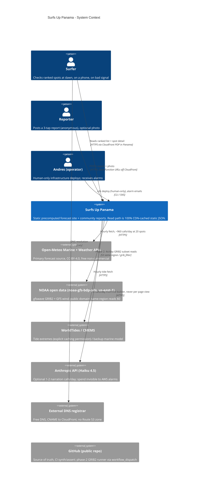
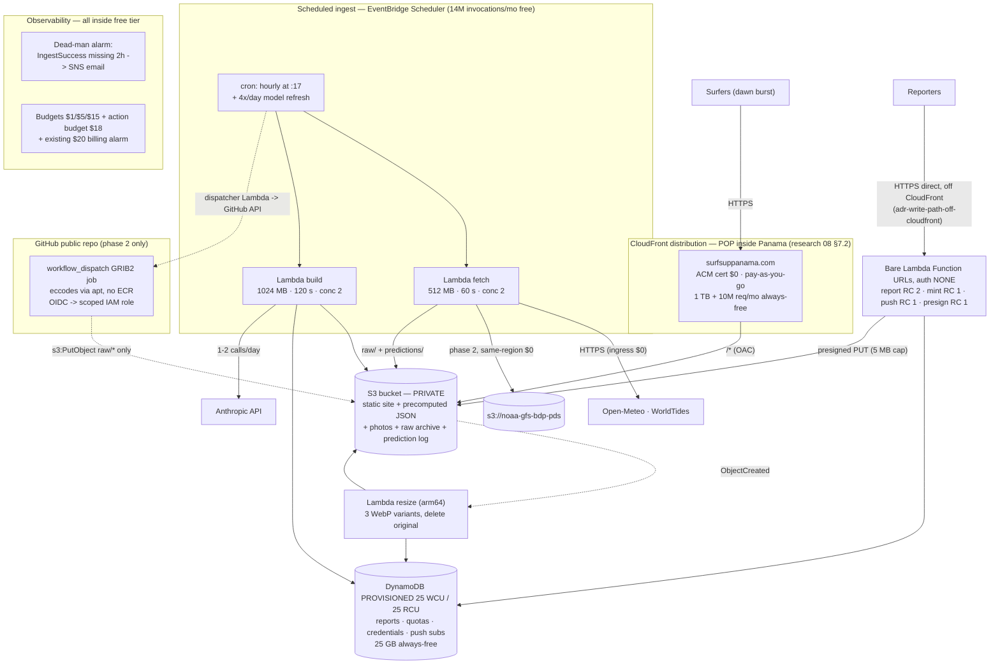

## System Architecture

Lane: infrastructure (nw-system-designer, DESIGN round 1). Date: 2026-08-08.
Fact rule: every AWS price/quota cites `docs/research/raw/08-aws-architecture-and-cost.md`
(all figures there accessed 2026-08-08) or a live check run today, marked **[live 2026-08-08]**.
GitHub Actions reliability facts cite `docs/research/raw/13-github-actions-cron-reliability.md`.
Durable contested decisions live in ADRs in this directory; this document references them by
name and does not restate their rationale.
Amended 2026-08-08 (coherence round): guardrails 2/4/6/7/8 and §3, §5, §6, §8, §12–§15 aligned
to the shipped round-2 write path (`07-write-path.md` + its ADRs) and
`adr-publish-time-html-rendering.md`; S3-at-scale cost corrected against domain-model §5.3;
DynamoDB always-free status verified live (re-opened in the second pass, next note). Each
amendment is marked in place.
Amended 2026-08-08 (coherence round, second pass, cost review): DynamoDB 25/25 perpetuity
pulled back to **UNVERIFIED** (research 08 disputes the live read; both branches priced in §8
and §17 item 9; settled by the §11 step 1 human billing-console check). §12 launch and global
storage re-priced with photos (5.4 GB, flat with audience): launch ≈$0.32/mo, global
≈$2.67–4.85/mo. Prediction-log Glacier IR transition pinned at exactly 90 d (domain-model
§5.3's 180 d cites §8 here, which never said 180; routed for correction). §6.1 correlated
attack now prices its logs (≈$10/mo, ≈$56/mo all-in). Each amendment marked in place.

### Verdict block

| Question | Verdict |
|---|---|
| Ingest runner | **EventBridge Scheduler + Lambda (zip, JSON sources), hourly.** GitHub Actions `schedule` REJECTED as primary: 1–4 h drift, drops growing >30%, 60-day auto-disable with the keepalive workaround TOS-blocked (research 13). Fallback lanes named in ADR-ingest-runner. |
| Monthly cost, launch (20 spots, 500 MAU) | **≈ $0.32/mo** (no LLM narration) / **≈ $0.74/mo** (with ES+EN Haiku narration). Cost table in §12. (Re-derived 2026-08-08 coherence round: adds publish-time HTML render PUTs, drops the on-demand DynamoDB line. Corrected in the second pass: the storage line undercounted photos, which are 5.4 GB alone.) |
| Monthly cost, global (5,000 spots, 20,000 MAU) | **≈ $2.67–4.85/mo, dominated by prediction-log S3 storage** (89.5 GB by end of year 1, measured, domain-model §5.3). Low end assumes the domain lane's Parquet + Glacier IR levers past 500 spots. (Corrected 2026-08-08 coherence round: the prior ≈$0.88–1.30 was ~7× low on S3. Second pass re-priced photos at 5.4 GB, flat with audience.) Audience still owns the CloudFront meter; spots now carry a real storage cost. Table in §12. |
| Unavoidable floor | S3 (**~$0.32/mo** at launch with photos, 90-day retention: ~$0.145 storage + ~$0.17 requests, §12; corrected second pass) + domain registration (~$12/yr, not an AWS bill). Everything else sits inside always-free allowances, with ONE contested line: DynamoDB 25/25 perpetuity is **UNVERIFIED** (§8): $0.00 if perpetual, ~$14.24/mo from month 13 if 12-month. Human check, §11 step 1. |
| Binding constraint | CloudFront **requests** (10M/mo always-free). Enforced answer: ≤10 requests/session at P50 via per-route publish-time HTML (adr-publish-time-html-rendering.md); budget re-derived in §15. (Amended 2026-08-08 coherence round: the bundled-JSON fetch model no longer describes the client.) |
| Region | us-east-1 (NOAA open-data buckets are there; same-region S3→Lambda transfer $0.00 — research 08 §5.1, §7.3). |
| DNS | External registrar DNS, no Route 53 hosted zone ($0.50/mo avoided) — ADR-dns-external. |
| IaC | AWS CDK (TypeScript), guardrails as compile-time-asserted code — ADR-iac-cdk. Skeleton in §11. |
| Secrets in a public repo | Zero long-lived AWS keys anywhere. SSM Parameter Store SecureString (free) for provider keys; GitHub OIDC role only for phase-2 data-plane writes; infrastructure deploys are human-only — ADR-secrets-public-repo. |
| Biggest single risk | **Not architectural: the AWS Free Plan closes the account 6 months after creation OR when credits run out, whichever comes first** (research 08 §1.2, quoting aws.amazon.com/free accessed 2026-08-08). Account created ~2026-08-05, so the calendar clock runs out ~**2027-02-05**. But the credits clause is the one that bites: the same account runs an Amplify + RDS demo, and RDS burns credits fastest, so the real closure date may be much earlier and is not knowable from here. Upgrade to the Paid Plan (§18, decision 1). |

### 1. Scope and traffic model (assumptions stated once, used everywhere)

Two design points, per the mandate: launch and global.

| | **Launch** | **Global** |
|---|---|---|
| Spots | 20 (Pacific coast, DISCUSS #15) | 5,000 |
| MAU | 500 | 20,000 (assumption — stated, not sourced) |
| Sessions/mo (20 visits/user, research 08 §2.1) | 10,000 | 400,000 |
| Requests/session (enforced budget, §15) | ≤10 | ≤10 |
| CloudFront requests/mo | 100,000 | 4,000,000 |
| Egress/session (100 KB page + lazy photos) | 500 KB | 500 KB |
| CloudFront egress/mo | 5 GB | 200 GB |
| Photo uploads/day (research 08 assumption, flat) | 200 | 200 |
| Model refresh | 4×/day (GFS cycle cadence) | 4×/day, per-tile staleness |
| Site rebuild | hourly | hourly (only stale tiles) |

Key structural property (research 08 §2.1): ingestion, build, and AI cost are **flat with
respect to audience**. Only CloudFront requests/egress scale with users. The dawn burst
(5–7 am, everyone at once) is the *best* case for a CDN-cached static site: cache-hit ratio
approaches 99.9% and origin load is independent of audience size (research 08 §4.3).

### 2. C4 System Context



### 3. C4 Container view



Every read is a static file from a CloudFront POP inside Panama; nothing computes on the read
path; ingestion and AI bills are flat with respect to user count (research 08 §12.1).
(Diagram amended 2026-08-08 coherence round: write path moved off CloudFront and DynamoDB to
provisioned 25/25, per adr-write-path-off-cloudfront.md and adr-write-store-provisioned-capacity.md.)

### 4. Region and DNS

- **us-east-1, decisively.** NOAA's `noaa-gfs-bdp-pds` bucket is in us-east-1 and same-region
  S3→Lambda transfer is $0.00 (research 08 §5.1); it is also AWS's cheapest region, has the
  Claude-serving Bedrock region, and is the shortest hop from Panama (research 08 §7.3).
  Confirmed live today: `gfs.20260808/00/wave/gridded/gfswave.t00z.epacif.0p16.f000.grib2`
  (526,583 bytes) + `.idx` sidecar present in that bucket **[live 2026-08-08]**.
- **External DNS, no Route 53 hosted zone.** A hosted zone is $0.50/mo flat with no free tier
  (research 08 §2.5) — the single avoidable AWS floor cost. Registrar's free DNS + CNAME/ALIAS
  to `dxxxx.cloudfront.net`, ACM cert validated by DNS record (free, registrar-agnostic).
  Decision and alternatives: **ADR-dns-external**. Registrar pricing itself is UNVERIFIED
  (research 08 §2.5) — check Porkbun/Cloudflare Registrar before buying.

### 5. Read path — bucket topology, CloudFront behaviors, TTLs, invalidation

I own the *bucket level*; the domain lane owns key layout and payload contents (§14).

**Bucket topology** — ONE private bucket (OAC-only), four lifecycle-distinct prefixes:

| Prefix (name indicative; domain lane owns exact keys) | Contents | Lifecycle rule (IaC-enforced) |
|---|---|---|
| `site/` + `assets/` | Astro build output, content-hashed assets | none (tiny, redeployed) |
| `v1/` (published JSON + photos) | region bundles, manifest, reports, photo variants | photos: **expire 90 days after creation** (decision 3, §18) |
| `raw/` | archived provider payloads for replayability | **expire 30 days** |
| **prediction log** = `PREDICTION_LOG_PREFIX` = **`predictions/`**, top-level, NOT under `log/` (domain-model §5.2 and `adr-prediction-log-prefix-isolation.md`, settled in the 2026-08-08 coherence round; `log/` now holds only the derived `calls/` and `observations/`, so no `log/*` rule can reach the prediction log, and the ingest IAM grant on `predictions/*` matches the real write path) | **the immutable prediction log** (HANDOFF §3) | **NO expiry, ever.** Guardrail 4 forbids any expiration or transition rule whose prefix OVERLAPS this prefix; single allowlisted exception: an exact-prefix transition to Glacier IR at **exactly 90 d** (the domain lane's own cost lever, domain-model §5.3, past 500 spots; pinned 2026-08-08 coherence round, second pass: domain-model §5.3 says 180 d and cites §8 here, which never stated 180. 90 d is the value all §12 cost math uses; the domain-model half is routed for the matching fix) |
| `log/calls/` + `log/observations/` | published-call log + observation exports (scorecard rebuild inputs, domain-model §6/§9) | no expiry; per-prefix Glacier IR transition at 90 d past 500 spots (domain-model §17, implemented as exact per-family prefixes, never one `log/*` parent rule; guardrail 4) |
| (bucket-wide) | — | **abort incomplete multipart uploads at 7 days** |

(Amended 2026-08-08 coherence round.) Round 1 claimed the log had "its own top-level prefix" and
asserted against the literal string `predictions/`. Both were wrong against the shipped layout:
the log lives at `predictions/v1/...`, nested beside two other log families, and domain-model
§17 recommends a `log/*` lifecycle whose prefix is a PARENT of the log path. String equality
would have passed while a parent rule reached the one artifact HANDOFF §3 calls irreplaceable.
Guardrail 4 (§9) now asserts prefix OVERLAP against one named constant, not string equality
against a literal.

**CloudFront behaviors and TTLs:**

| Path pattern | Origin | Policy | Cache-Control set at S3 upload |
|---|---|---|---|
| `assets/*` (content-hashed) | S3 (OAC) | CachingOptimized, compress | `public, max-age=31536000, immutable` |
| `v1/photos/*` (content-addressed) | S3 (OAC) | CachingOptimized | `public, max-age=31536000, immutable` |
| `v1/*.json` (region bundles, reports) | S3 (OAC) | custom, compress | `public, max-age=300, stale-while-revalidate=3600, stale-if-error=86400` |
| `manifest.json` | S3 (OAC) | custom | `public, max-age=60, stale-if-error=86400` |
| `/api/*` | **row removed (2026-08-08 coherence round): no `/api/*` behavior exists.** The four write endpoints are bare Function URLs, auth `NONE`, off CloudFront entirely (adr-write-path-off-cloudfront.md) | — | — |
| default `/*` (HTML) | S3 (OAC) | custom, compress | `public, max-age=300, stale-while-revalidate=3600` |

Browser traffic is HTML routes, hashed assets and photo thumbs only
(adr-publish-time-html-rendering.md). `manifest.json` and the `v1/*.json` bundles stay published
as build commit marker, publish-probe target (§10) and debug surface, ~720 origin GETs/mo, no
longer per-session fetches. (Amended 2026-08-08 coherence round.)

Security headers via a CloudFront **managed Response Headers Policy** (free), NOT CloudFront
Functions — keeps CF Functions usage at zero rather than spending the 2M free tier on every
request.

**Invalidation strategy: zero routine invalidations, by construction.** The hourly republish
changes only short-TTL JSON (max-age 300/60 + SWR), so freshness arrives by TTL expiry within
5 minutes, and `stale-if-error` keeps the last good build serving through origin or build
failures (stale-but-correct beats down — research 08 §4.3). Deploys ship content-hashed assets
plus short-TTL HTML, so they need no invalidation either. The exact free invalidation-path
allowance is UNVERIFIED (research 08 §5.3) — this design makes it irrelevant. Emergency manual
`create-invalidation` remains a runbook entry, never an automated step.

**Why the CDN tier exists** (scaling-ladder justification): it is the only component between
20,000 phones at 5:40 am and a single-writer S3 bucket; it converts the dawn burst from a
concurrency problem into ~45 origin fetches/hour regardless of audience.

### 6. Write path — bare Function URLs, abuse protection without WAF

(Amended 2026-08-08 coherence round. Round 1 routed `/api/*` through CloudFront with OAC +
`AWS_IAM` and leaned on per-IP quotas; the round-2 write-path lane superseded both, declaring
each change. This section now matches the shipped design: `07-write-path.md`,
`adr-write-path-off-cloudfront.md`, `adr-write-store-provisioned-capacity.md`.)

API Gateway stays rejected: no perpetual free tier (research 08 §3.2). The four write endpoints
(`/api/report`, `/api/mint`, `/api/push`, `/api/photo-url`) are **bare Lambda Function URLs,
auth type `NONE`, CORS locked to the exact site origin, NOT behind CloudFront.** Quantified
reason: a rejected request behind CloudFront bills $1.00–$2.20/M and burns the read path's 10M
free requests, while a throttled Function URL 429 bills $0.00 (research 15 §5.1). A write flood
and the read path must never share a meter. OAC "hiding" protected nothing: the URL ships in a
public repo's client bundle.

Control stack for anonymous writes (DISCUSS #11), all free:

| Layer | Control | Concrete value |
|---|---|---|
| 1 | **Lambda reserved concurrency — the real cost cap** | report **2**; mint, push, photo-presign **1** each. Max 10 RPS per unit of concurrency; everything above is a free front-door 429 (research 15 §4, §5.1) |
| 2 | Circuit breakers | 4 CloudWatch alarms → one SNS topic → breaker fn → `PutFunctionConcurrency(0)`; EventBridge one-shot restores after 6 h (07-write-path §7.2). The shared topic is a correlated failure mode: §6.1 |
| 3 | DynamoDB provisioned 25/25 | fails closed: past the free capacity the table throttles for free instead of billing (adr-write-store-provisioned-capacity.md) |
| 4 | Per-device daily quota (DynamoDB TTL counter) | **20 reports / 10 presigns / 20 push subs per day.** Honest label: hygiene against runaway clients, not a security or cost control — device ids are client-minted and free to spoof |
| 5 | Presigned PUT constraints | `content-length-range` ≤ **5 MB**, 5-min expiry, key minted server-side |
| 6 | Body validation in-handler | ≤ 2 KB report payload, schema-checked; 429 with `Retry-After` on quota hit |
| 7 | Statistical outlier down-weighting | domain lane (DISCUSS #24) — data quality, not infrastructure |

Per-IP quotas are **gone on purpose** (round 1's layer 3, 60/30 per day via
`CloudFront-Viewer-Address`). Two independent kills: off CloudFront that header does not exist,
and Panama carrier-grade NAT makes IP quotas leaky against an attacker rotating cloud IPs while
throttling a whole town sharing one mobile IP (research 15 §11). Nothing identity-shaped
replaces them: the cost cap is layers 1–3, the spend backstop is guardrail 8, and the one
identity-shaped control left (layer 4) is spoofable. Stated plainly rather than pretended
otherwise.

#### 6.1 Worst case under attack — corrected arithmetic (2026-08-08 coherence round)

A reviewer falsified research 15 §14.3's "about $29" row (200 ms handler) on physics: reserved
concurrency RC caps concurrent execution, so execution-seconds/month ≤ RC × 2,592,000. That row
multiplied the 20 RPS invocation ceiling (51.84M/mo, itself sustainable only at ≤ 100 ms) by
200 ms = 10.37M exec-s against a physical cap of 5.18M at RC 2. Impossible. The true
per-function supremum lands at exactly **100 ms billed**, where the request meter and the
duration meter peak simultaneously:

| Function | RC | Max billed inv/mo (10 RPS × RC) | Exec-s cap (GB-s at 128 MB) | Requests after 1M free | Duration after 400k GB-s free | Supremum (compute) |
|---|---|---|---|---|---|---|
| report | 2 | 51.84M | 5.184M s (648k GB-s) | $10.17 | $4.13 | **$14.30/mo** |
| mint / push / photo-presign | 1 each | 25.92M | 2.592M s (324k GB-s) | $4.98 | $0.00 standalone | **$4.98/mo each** |

Prices per research 15 §5.2 (accessed 2026-08-08). CloudWatch Logs ingestion adds ~$4/mo for
the report flood alone (research 15 §9b, 07-write-path §12). Correlated, the report flood is
only 40% of invocations (51.84M of 129.6M), so at the same log bytes per invocation the four
floods together ingest ≈2.5× that: **≈$10/mo logs** (derived from the research 15 §9b rate,
accessed 2026-08-08; added 2026-08-08 coherence round, second pass).

**Correlated failure, stated plainly: all four breakers hang off ONE SNS topic** (07-write-path
§11 item 6). One topic or breaker-fn defect disables all four breakers together, so the four
floods can run concurrently. Sum of per-function suprema ≈ **$29/mo**. Strict account-level
bound (the 1M-request and 400k GB-s free pools deduct once, not four times; all four held at
100 ms): (129.6M − 1M) × $0.20/M + (1.62M − 0.4M GB-s) × $0.0000166667 ≈ $25.72 + $20.33 ≈
**$46/mo compute**, + ≈$10/mo correlated logs (above) ≈ **$56/mo all-in**. **Every correlated
variant exceeds the $20 billing alarm (guardrail 9).** The enforcement that must actually work is guardrail 8's $18 budget action,
which now denies exactly the four write Function URLs. The shared-topic SPOF is accepted at
this scale and named here so nobody reads "breakers" as redundancy.

Not bought: WAF ($7/mo minimum config = 35% of the alarm budget at zero traffic, research 08
§10.4). The read path cannot be overwhelmed (cached); the write path's worst case is bounded by
§6.1 (<$1/mo with breakers working). If genuinely attacked, the documented escape hatch is
flipping the write path behind CloudFront plus the flat Pro plan ($15/mo, bundles WAF/DDoS/bot
management — research 08 §2.4, ADR-cdn-billing-model, 07-write-path §7.2 tier 5). Optional
stronger anti-bot (Cloudflare Turnstile) is decision 5, §18.

### 7. Ingest runner — the decision, with evidence

**Verdict: EventBridge Scheduler → Lambda is the primary ingest runner. GitHub Actions
`schedule` is rejected as primary.** Full alternatives table: **ADR-ingest-runner**.

The mandate's premise ("free and unlimited on public repos") holds on cost and fails on
timeliness (research 13, all fetched live 2026-08-08):

| Evidence | Source |
|---|---|
| "scheduled drops have grown >30% in 2ish months … this isn't a fix 'now'" — GitHub staff, 2026-06-04 | research 13 §"Bottom line" |
| Daily cron measured avg **2 h 42 m late** (best 1h59, worst 3h56); a `*/5` cron fired **~5% of slots** (97 of ~2,016), 2026-07-28 | research 13 §3 |
| Public-repo average delay rose from ~1h40 (2025) to **>4 h** by May 2026 | research 13 §3 |
| 60-day inactivity auto-disable on public repos; canonical keepalive action **TOS-blocked by GitHub** — no sanctioned automated workaround | research 13 §2 |
| No SLA at any tier covers scheduler punctuality | research 13 §5 |
| Free and unmetered on public repos: confirmed | research 13 §1 |

An hourly republish whose freshness stamp the product displays (frontend lane) cannot ride a
scheduler that is first-party-acknowledged as hours-late and lossy. EventBridge Scheduler is
perpetually free at 14M invocations/mo (720/mo used = 0.005%, research 08 §5.2) and fires on
time as a paid-SLA AWS primitive.

**Cost of the chosen primary: $0.00.** MVP ingest is JSON-only (Open-Meteo Marine + Weather,
WorldTides) in zip-packaged Lambdas — no GRIB2, no container image, no ECR (research 08 §5.5).

**Phase 2 (raw gfswave GRIB2 enrichment) — two named lanes, decided when phase 2 starts:**

1. **Hybrid dispatch (recommended):** EventBridge Scheduler → 128 MB dispatcher Lambda →
   GitHub API `POST .../actions/workflows/{id}/dispatches`. The workflow has ONLY a
   `workflow_dispatch` trigger — the 60-day auto-disable governs *scheduled* workflows, so a
   dispatch-only workflow sidesteps both the disable rule and the schedule queue. Timing is
   owned by AWS; the runner installs `eccodes` via apt (no container, no ECR); it writes via
   an OIDC-assumed role scoped to `s3:PutObject` on `raw/*` only. Caveat, stated honestly:
   `workflow_dispatch` runs enter the normal run queue, whose latency under load research 13
   did not measure — acceptable for a 4×/day enrichment where the site already serves
   stale-but-correct, and the trigger PAT (fine-grained, `actions:write`, one repo) lives in
   SSM Parameter Store, never in the repo.
2. **Container-image Lambda fallback:** 4×/day (matching GFS 00/06/12/18Z cycles — hourly
   GRIB2 is 6× the work for zero new data, research 08 §5.4), 3008 MB × 240 s = 86,630 GB-s/mo
   inside the free tier; the only cost is ECR private storage **~$0.15–0.25/mo** with a
   lifecycle policy (expire untagged, keep last 2 tagged — guardrail 5).

**Live verifications recorded (HANDOFF §6 items 6 and 7):**

- **grib_filter URL pattern — CONFIRMED WORKING [live 2026-08-08].** This exact request
  returned HTTP 200 with a valid 91,681-byte GRIB2 (magic bytes `GRIB`, version 2) in 2.7 s:

  ```
  https://nomads.ncep.noaa.gov/cgi-bin/filter_gfswave.pl?file=gfswave.t00z.epacif.0p16.f000.grib2&all_lev=on&var_HTSGW=on&var_PERPW=on&var_DIRPW=on&subregion=&leftlon=-83&rightlon=-79&toplat=10&bottomlat=6&dir=%2Fgfs.20260808%2F00%2Fwave%2Fgridded
  ```

  Template: `filter_gfswave.pl?file=gfswave.t{CC}z.{GRID}.f{FFF}.grib2&all_lev=on&var_{V}=on...&subregion=&leftlon={W}&rightlon={E}&toplat={N}&bottomlat={S}&dir=%2Fgfs.{YYYYMMDD}%2F{CC}%2Fwave%2Fgridded`.
- **GFS Zarr mirror does NOT carry wave fields — RESOLVED [live 2026-08-08].** The
  `dynamical-noaa-gfs` catalog's full variable list is atmospheric only (`10u 10v 2t prmsl
  prate tcc …`); the only "wave" matches are `sdlwrf`/`sdswrf` radiation names. The
  pure-Python Zarr easy-path applies to **wind**, not waves; gfswave GRIB2 is the only raw
  NOAA wave route, which is what makes the two phase-2 lanes above necessary.
- **Correction to research 08 §15.2 [live 2026-08-08]:** `gfswave.t00z.global.0p16.f*.grib2`
  DOES exist in `noaa-gfs-bdp-pds` (listed live today). Research 08's claim that no global
  grid was observed is wrong; research 05 §1 was right. Consequence: raw GFS-Wave is globally
  viable after all — the global product does not depend on regional-grid coverage.

### 8. Resource inventory — allowances vs usage

Perpetual = always-free on the Paid Plan, forever. All allowances from research 08 §1.3/§12.2
(accessed 2026-08-08). Usage columns per the §1 traffic model.

| Resource | Always-free allowance | Perpetual or 12-month? | Launch (20 spots, 500 MAU) | % | Global (5,000 spots, 20k MAU) | % |
|---|---|---|---|---|---|---|
| Lambda requests | 1,000,000/mo | **perpetual** | ~19,000 | 1.9% | ~90,000 | 9% |
| Lambda compute | 400,000 GB-s/mo | **perpetual** | ~52,000 GB-s | 13% | ~130,000 GB-s | 33% |
| Lambda Function URLs | no additional charge | **perpetual** | — | — | — | — |
| CloudFront requests ⬅ binding | 10,000,000/mo | **perpetual** (pay-as-you-go model) | 100,000 | 1% | 4,000,000 | **40%** |
| CloudFront egress | 1 TB/mo | **perpetual** | 5 GB | 0.5% | 200 GB | 20% |
| CloudFront Functions | 2,000,000/mo | **perpetual** | 0 (headers policy instead) | 0% | 0 | 0% |
| EventBridge Scheduler | 14,000,000/mo | **perpetual** | 840 | 0.006% | 840 | 0.006% |
| DynamoDB storage | 25 GB | **perpetual** | <0.1 GB | 0.4% | <1 GB | 4% |
| DynamoDB provisioned capacity | 25 WCU + 25 RCU | **UNVERIFIED, contested (re-opened 2026-08-08 coherence round, second pass).** My live read said perpetual: the AWS Free Tier product directory (aws.amazon.com/api/dirs, `free-tier-products`, accessed 2026-08-08) tags DynamoDB `always-free` ("25 GB of Storage, 25 provisioned WCU, 25 provisioned RCU"), and the pricing page (aws.amazon.com/dynamodb/pricing/provisioned/, accessed 2026-08-08) lists the same "each month on a per Region, per-payer account basis" with no expiry qualifier. **Research 08, accessed the same day, disagrees**: its §1.3 attaches its checkmark only to the 25 GB storage and streams lines and flags the WCU/RCU allowance with its own UNVERIFIED marker (§4.4). Two same-day reads conflict; neither is treated as settled. Branches: perpetual = **$0.00 forever**; 12-month = **~$14.24/mo from month 13** (25×730×$0.00065 + 25×730×$0.00013, rates per aws.amazon.com/dynamodb/pricing/provisioned/, accessed 2026-08-08). Human settles it on the Free Tier billing page, folded into §11 step 1. Closed regardless of the branch: switching from on-demand to provisioned resolved the mode-coverage risk (research 08 §4.4's actual worry), months 1–12 are $0.00 either way, and the table fails closed. Per-payer account = one 25/25 pool for the whole account; no other project on this account uses DynamoDB today | 25/25 provisioned (adr-write-store-provisioned-capacity) | 100% by design, fails closed | same | 100% |
| S3 storage | **no verifiable perpetual free tier** (research 08 §12.3) | assume paid day one | ~6.3 GB (corrected second pass: photos are 5.4 GB) | — | ~111 GB end of yr 1, uncompacted (§12; corrected second pass) | — |
| S3 PUT | none verified | assume paid | ~20,000/mo | — | ~100,000/mo | — |
| CloudWatch logs | 5 GB/mo | **perpetual** | ~0.05 GB | 1% | ~0.2 GB | 4% |
| CloudWatch custom metrics | 10 | **perpetual** | 6 (+1 `PushSendFailures`, 07-write-path §11; amended 2026-08-08) | 60% | 6 | 60% |
| CloudWatch alarms | 10 | **perpetual** | 8 (4 infra + 4 write-path breakers, 07-write-path §7.2; amended 2026-08-08) | 80% | 8 | 80% |
| CloudWatch dashboards | 3 | **perpetual** | 1 | 33% | 1 | 33% |
| SSM Parameter Store (Standard) | free (storage + standard API) | **perpetual** | 4 params | — | 5 | — |
| SNS email | 1,000/mo (research 08 §1.3 — flagged ⚠️ there) | perpetual (⚠️ partially verified) | ~10 alarm mails | 1% | ~10 | 1% |
| ACM cert (CloudFront) | free | **perpetual** | 1 | — | 1 | — |
| Cognito MAU (only if auth ships later) | 10,000 (Lite/Essentials — NOT the folklore 50k) | **perpetual** | 0 | 0% | ~400–1,000 posting MAU | ≤10% |
| API Gateway | 1M calls | ❌ **12-month only** | **not used — by design** | — | — | — |
| Amplify Hosting | 15 GB egress | ❌ **12-month only** | **not used — by design** | — | — | — |
| RDS | 750 h t-micro | ❌ **12-month only** | **not used** | — | — | — |
| ECR private | 500 MB | ❌ **12-month only** | not used (phase-2 fallback only) | — | ~1.5 GB if fallback lane | — |
| Open-Meteo (external) | 10,000 calls/day (research 01 §1) | free tier, non-commercial | 960/day | 9.6% | ~2,000–4,000/day (batched) | 20–40% |

Every 12-month row is either unused by design or confined to an optional fallback — no line in
the recommended architecture converts into a bill when a trial lapses.

### 9. The eleven cost guardrails — concrete, IaC-enforced values

Each guardrail from research 08 §10.2, restated as an enforced value and its enforcement
point. "CDK + assert" means the value is set in the CDK stack AND checked by
`infra/test/guardrails.test.ts` (§11), which fails CI if any resource ships without it.

1. **Lambda reserved concurrency = 2** on every function (`reservedConcurrentExecutions: 2`).
   Enforced: CDK + assert (test iterates ALL `AWS::Lambda::Function` resources).
2. **Lambda timeouts:** fetch **60 s**, build **120 s**, **all four write functions (report,
   mint, push, photo-presign) 5 s** (07-write-path §2; amended 2026-08-08 coherence round,
   tightened from round 1's stale "report API 10 s"), resize **60 s**, dispatcher **10 s**,
   notify/export **120 s**, breaker **10 s**. Never the 900 s default. Enforced: CDK + assert
   (`timeout ≤ 120s` for all; the worst-case bill is timeout × concurrency × memory).
3. **CloudWatch log retention = 14 days on EVERY log group** (`logRetention:
   RetentionDays.TWO_WEEKS`). The default is Never Expire and this is the #1 way "free"
   serverless starts billing (research 08 §10.2 #3). Enforced: CDK + assert (test fails on any
   `AWS::Logs::LogGroup` without `RetentionInDays: 14`, and on any Lambda lacking an explicit
   log group).
4. **S3 lifecycle + the prediction-log no-touch contract.** (Amended 2026-08-08 coherence
   round: round 1 asserted against the literal string `predictions/`, which never matched the
   shipped path `predictions/v1/...` (domain-model §5.2, 04-ingest §3), and domain-model
   §17 recommends a `log/*` transition whose prefix is a PARENT of the log. String equality is
   what let that through; the assert now tests prefix overlap against one named constant.)
   `raw/` expires **30 days**; photos expire **90 days**; abort incomplete multipart uploads
   **7 days**. Prediction-log contract, CDK + assert:
   - **`PREDICTION_LOG_PREFIX` is defined ONCE in the stack. Today it is `predictions/`.**
     If the domain lane relocates the log to a top-level `predictions/` this round, the constant
     changes in that one place and every assert follows; no other text keys on the literal.
   - **No expiration rule may have a prefix that overlaps `PREDICTION_LOG_PREFIX`.** Overlap:
     either string is a prefix of the other. That catches the parent (`log/`), any child
     (`predictions/v1/dt=...`), exact equality, and the empty prefix (a bucket-wide rule).
   - **No transition rule may overlap it either**, with exactly ONE allowlisted exception: a
     rule whose filter prefix is byte-identical to `PREDICTION_LOG_PREFIX`, transitioning to
     Glacier Instant Retrieval at **exactly 90 days** (the domain lane's own cost lever,
     domain-model §5.3, past 500 spots). (Pinned at 90, not "≥90", 2026-08-08 coherence round,
     second pass: "90 or more" let two documents diverge while both passed CI. Domain-model
     §5.3's 180 d cites §8 here for a number §8 never contained; §12's cost math computes
     against 90 d, so 90 d is the chosen value and the domain-model half is routed for
     correction.) Domain-model §17's `log/* → Glacier IR at 90 d` recommendation is
     implemented as exact per-log-family prefixes, never one parent rule: the prediction log
     may change storage class only by a deliberate, named act, never as a side effect of a
     broader prefix.
   - Bucket-wide rules (no filter) may carry only the multipart-abort action.
5. **ECR lifecycle policy** (phase-2 fallback lane only): expire untagged **immediately**,
   keep last **2** tagged images. Enforced: CDK + assert, in the same commit that ever adds an
   ECR repo.
6. **S3 buckets private + CloudFront OAC on read surfaces; Function URL auth ENUMERATED, never
   blanket.** (Amended 2026-08-08 coherence round: round 1 asserted `AWS_IAM` on every Function
   URL; the shipped write path (adr-write-path-off-cloudfront.md) puts four URLs at `NONE`, so
   the blanket assert would deterministically fail CI on day one, and a guardrail that fails
   against our own design gets deleted under pressure.) `BlockPublicAccess.BLOCK_ALL` on every
   bucket, unchanged. The Function URL assert carries an explicit list,
   `WRITE_URL_FNS = {report, mint, push, photo-presign}`:
   - every Function URL in the list asserts `AuthType: NONE`, `AllowOrigins` equal to the exact
     site origin (never `*`), and that NO CloudFront behavior routes to it;
   - every Function URL NOT in the list asserts `AuthType: AWS_IAM` (today that set is empty);
   - a Function URL in neither classification fails the build. No default branch exists.
7. **Per-device daily write quotas in DynamoDB; per-IP quotas REMOVED.** (Amended 2026-08-08
   coherence round: round 1's per-IP rows (60/30 via `CloudFront-Viewer-Address`) died twice
   over — off CloudFront the header does not exist, so the guardrail was unimplementable as
   written, and Panama CGNAT makes IP quotas leaky for attackers rotating cloud IPs while
   unfair to a whole town behind one carrier IP; research 15 §11, 07-write-path §1 row 3.)
   Device quotas: **20 reports / 10 presigns / 20 push subscriptions** per day, counter items
   with **TTL = 2 days**. Honest accounting: device ids are client-minted and spoofable, so
   this row is data hygiene against runaway clients, and it is the ONLY identity-shaped control
   on the write path. The real cost cap is guardrail 1's reserved concurrency plus the
   write-path breakers (07-write-path §7.2); the spend backstop is guardrail 8. Enforced:
   shared quota middleware in the write Lambdas + an acceptance test that submits request 21
   and asserts 429 (wired in DISTILL).
8. **AWS Budgets:** alert budgets at **$1, $5, $15**; ONE action-enabled budget at **$18**
   denying **`lambda:InvokeFunctionUrl` on the four write functions only** (first two
   action-enabled budgets are free; Budgets alerts, it does not stop — research 08 §10.1).
   (Amended 2026-08-08 coherence round, adopting 07-write-path §11 item 7: round 1 denied the
   ingest role too, which would let a billing flood stop the prediction log — destroying the
   irreplaceable artifact (HANDOFF §3) to save dollars. The narrowed deny means no flood can
   ever take down ingest. A real improvement over my round-1 design.) Enforced: CDK.
9. **The $20 last line — CREATED by this project as an AWS Budget, never imported.**
   (Corrected 2026-08-09: round 1 claimed a $20 CloudWatch billing alarm "already exists on
   the account". Verified false against the live account: zero CloudWatch alarms exist, and
   the only $20 budget is the other project's `agentflow-guardrail`. Additionally the
   `AWS/Billing` metric namespace is empty because the console-only "Receive CloudWatch
   billing alerts" preference has never been enabled, so a CloudWatch billing alarm would
   sit in INSUFFICIENT_DATA forever — the alarm form of this guardrail cannot work on this
   account today.) The line is implemented as the `surfs-up-panama-last-line-20` AWS Budget
   in `infra/lib/observability-stack.ts` (email notification at 100% actual), matching the
   shipped slice-03 declaration `budget-last-line-source: created-by-project`. A standalone
   pre-deploy guard budget (`surfs-up-panama-guard-20`, CLI-created 2026-08-09 with actual
   and forecast notifications) existed before any billable resource and remains as a
   belt-and-suspenders duplicate. Enforced: CDK + assert + the F-BILL declaration gate.
10. **Anthropic Console spend limit = $5/month hard limit.** Direct-API spend is invisible to
    every AWS guardrail (research 08 §6.5). Enforced: console setting (no API for it) +
    documented in the runbook + the builder is the ONLY code path holding the key, at
    reserved concurrency 2. Because this is the one console-only guardrail (reviewer finding),
    the runbook adds a **monthly verification step**: confirm the limit is still $5 whenever
    the Anthropic console is opened, and before any release that touches the builder.
11. **CloudFront stays pay-as-you-go; the flat Pro plan ($15/mo, 10M req, bundled WAF/DDoS)
    is the pre-decided emergency brake**, switchable per-distribution without migration
    (research 08 §2.4). Enforced: ADR-cdn-billing-model + runbook entry with the exact
    console path; the trigger condition is the request alarm in §10.

### 10. Zero-budget observability + dead-man's switch + substrate probes

Everything below fits the perpetual free tier: 6 custom metrics of 10, 8 alarms of 10,
1 dashboard of 3, ~0.05 GB of 5 GB logs (research 08 §10.3). (Counts amended 2026-08-08
coherence round: +4 write-path breaker alarms and +1 `PushSendFailures` metric per 07-write-path
§11. Tight but inside; the next alarm added must retire one or start billing.)

**Metrics (via metric filters on structured JSON logs — never a per-spot metric, which would
cost $0.30 each × 40+ instantly):** `IngestSuccess`, `IngestDurationMs`, `BuildSuccess`,
`ProviderErrors`, `ReportsWritten`.

**Alarms (4 infra below; the 4 write-path breaker alarms live in 07-write-path §7.2):**

| # | Alarm | Config | Meaning |
|---|---|---|---|
| 1 | **Dead-man's switch** | `IngestSuccess` sum < 1 over 1 h, **TreatMissingData: BREACHING**, 2 consecutive periods → SNS email | Fires on ABSENCE — catches a scheduler that silently stopped, not just a job that errored. This is the empirical probe that EventBridge actually fired. |
| 2 | ProviderErrors | sum ≥ 3 in 1 h | A source went dark; site keeps serving stale-but-correct |
| 3 | Write-path errors | Lambda `Errors` ≥ 5 in 15 min across API functions | Abuse or defect on the only unbounded surface |
| 4 | Billing $20 | existing account alarm, asserted in IaC | Last line |

**Substrate probes (Earned Trust — each verifies the platform actually did what it claims,
empirically, in production):**

- **Scheduler probe** = alarm 1. The claim "EventBridge fires hourly" is verified by observed
  effect, not by configuration existing.
- **Publish probe:** after writing the manifest, the build Lambda GETs it back **through the
  public CloudFront URL** and compares build stamps. Mismatch → structured
  `health.publish.mismatch` log event → counts against alarm 2. Catches OAC misconfiguration,
  a wrong distribution, or a caching layer serving a different origin — the failure mode where
  every component is green and users see last week.
- **Provider probe:** fetch validates payload schema AND that the newest timestamp in the
  payload is < 12 h old. A provider serving syntactically valid but stale data is a lie the
  probe converts into `ProviderErrors` instead of silently republishing old forecasts as fresh.
- **IaC probe:** the guardrail assertion suite (§11) — an infrastructure change that drops a
  guardrail does not deploy.
- **OIDC probe (phase 2):** the dispatch workflow asserts the assumed-role ARN equals the
  expected scoped role before any write, refusing loudly on drift (the `sub`-claim swap trap,
  research 13 §7).
- **Freshness surface:** the site displays the manifest build stamp (frontend lane, DISCUSS
  #26/#27 offline staleness) — the user-visible end of the same chain.

### 11. IaC — CDK TypeScript, skeleton, zero-to-deployed, secrets

**Choice: AWS CDK in TypeScript** — one language with the frontend, and the guardrails become
reviewable, testable code instead of console clicks. Alternatives (SAM, Terraform, Amplify
Gen 2 — the last actively wrong here): **ADR-iac-cdk** (research 08 §11).

**Skeleton:**

```
infra/
  bin/app.ts                 # env = { account, region: "us-east-1" }
  lib/site-stack.ts          # S3 (private, lifecycle rules) + CloudFront (OAC, behaviors §5) + ACM
  lib/ingest-stack.ts        # EventBridge Scheduler (hourly :17 + 4x/day) + fetch/build Lambdas
  lib/write-stack.ts         # bare Function URLs (NONE + exact-origin CORS) + DynamoDB PROVISIONED 25/25 + resize + breakers
  lib/observability-stack.ts # metric filters, 4 alarms, SNS topic, budgets
  test/guardrails.test.ts    # THE guardrail gate — see below
  cdk.json
```

Load-bearing excerpt (`ingest-stack.ts`):

```ts
const fetchFn = new lambda.Function(this, "Fetch", {
  runtime: lambda.Runtime.NODEJS_22_X,
  memorySize: 512,
  timeout: Duration.seconds(60),          // guardrail 2
  reservedConcurrentExecutions: 2,        // guardrail 1
  logGroup: new logs.LogGroup(this, "FetchLogs", {
    retention: logs.RetentionDays.TWO_WEEKS,   // guardrail 3
  }),
  architecture: lambda.Architecture.ARM_64,
  // async config: retryAttempts 0 + DLQ — research 08 §10.5
});
```

Guardrail gate excerpt (`test/guardrails.test.ts`, CDK assertions — runs in CI with **no AWS
credentials**, fails the build on any violation):

```ts
const fns = template.findResources("AWS::Lambda::Function");
for (const [id, fn] of Object.entries(fns)) {
  expect(fn.Properties.ReservedConcurrentExecutions).toBeLessThanOrEqual(2);
  expect(fn.Properties.Timeout).toBeLessThanOrEqual(120);
}
const logGroups = template.findResources("AWS::Logs::LogGroup");
for (const [id, lg] of Object.entries(logGroups)) {
  expect(lg.Properties.RetentionInDays).toBe(14);
}
// buckets: BlockPublicAccess ALL; lifecycle: no expiration/transition rule prefix OVERLAPS
//   PREDICTION_LOG_PREFIX (parent, child, equal, or bucket-wide) except the one exact-prefix
//   Glacier IR transition — guardrail 4 (amended 2026-08-08: overlap, not string equality)
// function URLs: WRITE_URL_FNS assert NONE + exact-origin CORS + no CloudFront behavior;
//   every other URL asserts AWS_IAM; an unclassified URL fails the build — guardrail 6
// table: BillingMode PROVISIONED, 25 WCU / 25 RCU — adr-write-store-provisioned-capacity
```

This suite must be demonstrated failing once (temporarily set a retention to undefined, watch
it fail, revert) before it counts as a guardrail — a gate never seen red proves nothing.
**DELIVER precondition (reviewer finding): this test file does not exist yet — it is the
first infrastructure slice to build, wired into CI and proven red-then-green before any
`cdk deploy` counts as guarded.**

**Zero-to-deployed path (human steps marked 👤 — no agent ever holds a deploy credential):**

1. 👤 Billing console: verify account plan + creation date; **upgrade to Paid Plan**
   (research 08 §1.2 — the account-closure clock). While there, read the Free Tier usage page
   and settle TWO contested allowances (amended 2026-08-08 coherence round, second pass):
   whether S3 shows an always-free line (§17 item 1), and whether the DynamoDB 25 WCU / 25 RCU
   line is tagged always-free or 12-month (§17 item 9: $0.00 vs ~$14.24/mo from month 13).
2. 👤 `npx cdk bootstrap aws://<acct>/us-east-1` (one-time, local credentials).
3. CI (no credentials): `npm test` (guardrail gate) + `npx cdk synth`.
4. 👤 `npx cdk deploy --all` locally. Agents may run `synth`/`diff` only; the repo's CI has no
   AWS deploy role at all in phase 1.
5. 👤 Registrar: CNAME (or apex ALIAS) → `dxxxx.cloudfront.net`; add the ACM DNS-validation
   CNAME once.
6. 👤 Seed secrets (never in the repo): `aws ssm put-parameter --type SecureString --name
   /surfsuppanama/prod/worldtides-api-key ...` (same for `anthropic-api-key`, and phase-2
   `github-dispatch-pat`).
7. 👤 Confirm the SNS alarm-topic email subscription.
8. Smoke: load the site through the domain, POST a test report, verify the dead-man alarm is
   in OK state and goes ALARM when the schedule is disabled for a test window (probe the
   probe, once).

**Secrets handling for a PUBLIC repo (ADR-secrets-public-repo):**

- **Zero long-lived AWS keys anywhere** — not in the repo, not in GitHub Secrets. Phase 1 has
  NO GitHub→AWS path at all (CI is synth+test only, credential-free).
- Phase 2 ingest writes use **GitHub OIDC → scoped IAM role**: provider
  `token.actions.githubusercontent.com`, audience `sts.amazonaws.com`, trust pinned to
  `repo:AndresPonce507/surfs-up-panama:ref:refs/heads/<default-branch>`, workflow permissions
  `id-token: write` — and the research-13 §7 trap is design-relevant: declaring an
  `environment:` on the job SWAPS the `sub` claim to the environment form (it does not add
  it). The role allows `s3:PutObject` on `raw/*` and the prediction-log prefix (guardrail 4's
  `PREDICTION_LOG_PREFIX`, today `predictions/*`; amended 2026-08-08 coherence round)
  only — a data-plane role that cannot touch infrastructure, consistent with
  agents-read-only-on-prod.
- Provider/API keys: **SSM Parameter Store Standard SecureString** (free; Secrets Manager is
  $0.40/secret/mo with no free tier — research 08 §14.2), read at Lambda cold start, cached in
  module scope.
- Repo hygiene: GitHub secret scanning + push protection on; gitleaks in the local CI gate;
  `.env.example` documents parameter names so contributors bring their own keys.

**Launch blockers — recorded 2026-08-08 coherence round.** Both need AWS access; the owner has
asked not to touch AWS right now, so they are recorded with their dollar exposure and gate the
zero-to-deployed step 1, not this design round:

| # | Blocker | Exposure if bad | Check |
|---|---|---|---|
| 1 | ~~Lambda `Concurrent executions` applied quota on this 3-day-old account~~ **ANSWERED 2026-08-09 and it is bad: the applied quota is `10`.** Read via `lambda:GetAccountSettings` and `servicequotas:GetServiceQuota` (`L-B99A9384`, `Value: 10.0, Adjustable: true`), then independently confirmed by a real deploy: `SurfsUpPanamaIngest` was rejected on a reservation of **2** and CloudFormation rolled it back with *"decreases account's UnreservedConcurrentExecution below its minimum value of [10]"*. The floor is 10 and the quota is 10, so **no reservation of any size is settable**, and guardrail 1, the breakers' restore path and the mint cap do not exist today. This is well below the ≤ 102 case the row anticipated | Two claims, kept apart so neither hides the other. **The aggregate bound survives by accident:** an account-wide ceiling of 10 concurrent executions is tighter than the 13 this project reserves, so research 15's ~$130/mo worked case does not apply — that case assumed quota 50 with reservations impossible but 50 slots available; here there are 10. **The isolation property is genuinely lost:** write and ingest share one pool of 10, so a write flood can starve the fetch Lambda, which is exactly the failure guardrail 8 exists to prevent | **Now: one Service Quotas increase request on `L-B99A9384`.** ≥ 23 lets the stacks deploy as written; ≥ 113 also keeps the conventional 100-unreserved headroom. Andres's action, needs the console or `servicequotas:RequestServiceQuotaIncrease`. Until then `SurfsUpPanamaIngest` and `SurfsUpPanamaWrite` cannot deploy. Never strip the reservations to force a green deploy |
| 2 | Whether AWS meters data-transfer-out for a 429 emitted before the function runs (research 15 §15.3; carried by adr-write-path-off-cloudfront, never laundered into certainty) | pessimistic bound ~$27 per BILLION rejected requests after the free 100 GB/mo | one-afternoon load test before launch; until then the working control is tier 4, deleting the Function URL config, which stops response bytes entirely |

### 12. Cost — the dollar figure and how it is produced

Assumptions: us-east-1, external DNS, no container Lambda in phase 1, deterministic scoring,
photos 200/day with 90-day retention, DynamoDB provisioned 25/25 (perpetuity UNVERIFIED,
contested, §8; $0.00 either way through month 12), publish-time HTML render PUTs per
adr-publish-time-html-rendering.md (lane 03
owns exact counts). Prices per research 08 (accessed 2026-08-08): S3 $0.023/GB-mo, PUT
$0.005/1k, GET $0.0004/1k; Haiku 4.5 $1/$5 per M tokens. Prediction-log volumes: domain-model
§5.3/§6, measured. (Tables re-derived 2026-08-08 coherence round.)

**Launch — 20 spots, 500 MAU:**

| Line item | Usage | Cost/mo |
|---|---|---|
| CloudFront (requests + egress) | 100k req, 5 GB — inside free tier | $0.00 |
| Lambda (all functions) | ~19k inv, ~52k GB-s — inside free tier | $0.00 |
| EventBridge Scheduler | 840 of 14M | $0.00 |
| DynamoDB provisioned 25 WCU / 25 RCU | inside the 25/25 allowance; perpetuity UNVERIFIED, contested (§8; ~$14.24/mo from month 13 if 12-month; human check §11 step 1) | $0.00 (months 1–12, either branch) |
| S3 storage | ~6.3 GB: photos 90d **5.4 GB** (200/day × 300 KB × 90 d; §14 req 7, §18 dec 3) + raw 30d ~0.5 GB + prediction log 0.36 GB yr 1 (domain-model §5.3) + site ~0.05 GB. (Corrected 2026-08-08 coherence round, second pass: the prior "~2.5 GB" all-in sat below photos alone.) | $0.145 |
| S3 PUT | ~30,000 (data artifacts ~8k, 04-ingest §9 measured, + per-route HTML/OG renders ~22k, adr-publish-time-html-rendering) | $0.15 |
| S3 GET (origin fetches) | ~50,000 | $0.02 |
| CloudWatch, SSM, ACM, SNS, DNS | inside free tiers / external | $0.00 |
| **Subtotal without LLM** | (was $0.19 round 1, $0.23 first pass; corrected 2026-08-08 coherence round, second pass: photos priced) | **≈ $0.32/month** |
| LLM narration (optional): Haiku 4.5, 1 national narration/day × ES+EN (DISCUSS #8 doubles it) | ~0.24M in / 0.036M out tokens | $0.42 |
| **Total with narration** | | **≈ $0.74/month** |

**Global — 5,000 spots, 20,000 MAU:**

| Line item | Usage | Cost/mo |
|---|---|---|
| CloudFront | 4M req (40% of free), 200 GB (20%) | $0.00 |
| Lambda | ~90k inv, ~130k GB-s (33%, now including the HTML render step — §13) | $0.00 |
| DynamoDB provisioned 25/25 | perpetuity UNVERIFIED, contested (§8; ~$14.24/mo from month 13 if 12-month; human check §11 step 1) | $0.00 (months 1–12, either branch) |
| S3 storage, end of year 1, **uncompacted JSONL** | **~111 GB**: prediction log **89.5 GB** ($2.06, domain-model §5.3 measured) + calls log 15.8 GB ($0.36, domain-model §6) + photos **5.4 GB** ($0.124; flat with audience per §1, 200/day × 300 KB × 90 d) + observations, site, tiles ~0.5 GB **floor, not a measurement** ($0.01; tiles bound at 250 × ≤100 KB ≈ 0.03 GB, site small, observations volume unmeasured anywhere). (Corrected 2026-08-08 coherence round, second pass: the prior "~4 GB incl. photos" bucket sat below photos alone.) | **$2.55** |
| same, with the domain lane's levers past 500 spots (**Parquet ÷3 + Glacier IR** $0.004/GB past 90 d, domain-model §5.3) | log ~$0.55 + calls ~$0.10 + photos ~$0.12 (no transition: 90-d expiry) + rest ~$0.03 | **($0.80)** |
| S3 PUT (staleness-gated data tiles + ~5,000 per-spot HTML routes + OG images per model cycle — adr-publish-time-html-rendering) | ~350,000 | $1.75 |
| S3 GET | ~300,000 | $0.12 |
| LLM (flat with audience) | unchanged | $0.42 |
| **Total, uncompacted** | | **≈ $4.85/month** (≈ $4.42 without narration) |
| **Total with Parquet + Glacier IR** | | **≈ $3.09/month** (≈ $2.67 without narration) |

Correction note (2026-08-08 coherence round): round 1's S3 line here read "~12 GB, $0.28/mo",
about 7× low, because it ignored domain-model §5.3's measured log volume. And the log never
expires, so growth is linear: uncompacted adds roughly **+$2.4/mo with each further year**;
the Parquet + Glacier levers cut that accrual to roughly **+$0.15/mo per year**. Adopt the
levers at the 500-spot trigger (adr-prediction-log-format.md), not later.

**Where $0 actually breaks (thresholds, from research 08 §12.4 recomputed at the enforced
≤10 req/session):**

| Threshold | Value | Behavior past it |
|---|---|---|
| CloudFront requests | **~50,000 MAU** (10M req at 10 req/session × 20 sessions) | $0.0100/10k (US/MX/CA rate; Panama's billing region UNVERIFIED — could be the $0.110/GB South America tier, research 08 §7.3) |
| CloudFront egress | ~100,000 MAU at 500 KB/session | $0.085–0.110/GB |
| Lambda compute | ~3× global-scale build load, or GRIB2 run hourly instead of 4×/day | overage $0.0000166667/GB-s |
| The $20 alarm | ~50–60k MAU on the request line alone | guardrails 8/11 fire first |
| Write-path attack with breakers broken | ≈ $14.30/mo (report alone) to ≈ $29–46/mo compute + ~$10/mo logs ≈ $56/mo correlated (§6.1; added 2026-08-08 coherence round, logs priced in the second pass) | exceeds the $20 alarm; guardrail 8's $18 budget action is the enforcement that must work |

### 13. Global scaling curve — 500 and 5,000 spots are design inputs, not futures

From research 08 §15.3 (spot axis, 4×/day model refresh, hourly light rebuild, tile-sharded):

| | 40 spots | **500 spots** | **5,000 spots** | 50,000 spots |
|---|---|---|---|---|
| Geohash-4 tiles (~20 spots/tile) | 2 | 25 | 250 | 2,500 |
| Build Lambda GB-s/mo (sharded) | ~52k | ~61k | ~130k | ~355k (89% of free) ⚠️ |
| S3 PUTs/mo | ~5k | ~20k | ~100k | ~900k |
| Spot-axis cost/mo | ~$0.03 | **~$0.10** | **~$0.50** | ~$4.51 |

(Note added 2026-08-08 coherence round: this table counts data tiles only, per research 08
§15.3. Publish-time HTML adds per-spot route renders on top (~350k total PUTs/mo at 5,000
spots, ≈$1.75/mo), and the never-expiring log dominates spot-axis cost at scale. §12's global
table is the corrected whole-system figure; this table remains valid for the tile-data axis it
was derived on.)

Design consequences baked in NOW (each is cheap at 20 spots and a rewrite at 5,000):

1. **Shard the build by tile from day one** — a single build function crosses the 900 s Lambda
   timeout around ~45,000 spots and degrades long before; sharding at 20 spots is ~20 lines.
2. **Per-tile model-cycle stamps**: a tile is rebuilt only when
   `latest_available_cycle > tile.model_cycle` — at global scale roughly a quarter of tiles
   rebuild per cycle, cutting PUTs and compute ~4× (research 08 §15.5).
3. **Nothing keys on country.** Grid/tile selection computes from lat/lon — Panama itself
   proves it: Bocas del Toro resolves to `atlocn.0p16`, Playa Venao to `epacif.0p16`
   (research 08 §15.2). And with `global.0p16` confirmed live today (§7), the raw-model path
   has no geographic hole.
4. **The audience axis, not the spot axis, is the expensive one** — going from 40 to 5,000
   spots costs ~$0.50/mo; the same growth in audience costs ~$20/mo past 50k MAU. Requests-
   per-session discipline (§15) is worth more than every other cost decision combined
   (research 08 §15.4).

### 14. Storage requirements — owed by the domain lane

I own buckets, lifecycle, CDN math. The domain lane owns schemas, key layout, payload shapes.
These are the quantitative requirements my free-tier math depends on — if the domain design
exceeds them, my §8/§12 numbers are void and we re-negotiate:

| # | Requirement | Value I need | Which budget it protects |
|---|---|---|---|
| 1 | Published forecast payload = **ONE bundled data file per region/tile**, never per-spot data files. (Amended 2026-08-08 coherence round: this file is the BUILDER's input and the probe artifact; the browser fetches per-route HTML, not this file — adr-publish-time-html-rendering) | ≤ **100 KB gzipped** per bundle; ~20 spots/bundle | S3 PUTs + build determinism; the browser request budget now lives in §15 |
| 2 | Objects written per hourly rebuild (launch) | ≤ **10 data artifacts** (bundle + manifest + reports) **+ ~25 HTML routes**, plus ~25 OG images per model cycle (adr-publish-time-html-rendering; lane 03 owns exact counts; amended 2026-08-08) | S3 PUT ≈ $0.15/mo |
| 3 | Objects written per model cycle (5,000 spots) | ≤ **300** data tiles **+ staleness-gated per-spot HTML routes and OG images, ~2,500/cycle at ~25% stale** (amended 2026-08-08) | S3 PUT ≤ ~$1.75/mo (§12) |
| 4 | Manifest | ≤ **2 KB**, rewritten hourly, single key, written LAST as the build commit marker (04-ingest §3) | publish probe + commit semantics; no longer a per-session browser fetch (amended 2026-08-08) |
| 5 | Raw archive under one `raw/` prefix, no other data mixed in | ≤ **5 MB/hour** at launch | 30-day lifecycle can expire it safely; storage ≤ $0.10/mo |
| 6 | **Prediction log under its own dedicated prefix** (guardrail 4's `PREDICTION_LOG_PREFIX`, today `predictions/`; amended 2026-08-08 coherence round), append-only, write-once keys, never overwritten, lead time as a dimension | domain-model §5.3 measured: 0.36 GB/yr at 20 spots, 89.5 GB/yr at 5,000 | exempt from ALL expiry (HANDOFF §3); the §12 global table now carries its real cost; Parquet + Glacier IR at the 500-spot trigger keeps accrual ≈ +$0.15/mo/yr |
| 7 | Photos: exactly **3 variants ≤ 300 KB total** per photo; original deleted after resize | per research 08 §9.1 | storage floor $0.12/mo steady-state at 90-day retention; egress/session cap |
| 8 | Reports bundle per region, rebuilt on write | ≤ **50 KB** | build input; reports render into routes at publish time, and any client fetch of this file is the frontend lane's call inside §15's budget (amended 2026-08-08) |
| 9 | No per-user or per-request variance in any published S3 payload | absolute | CDN cacheability — one URL, one cached object, for everyone |
| 10 | Idempotency: duplicate ingest and call-receipt writes receive a conditional-PUT acknowledgement; public build artifacts regenerate byte-identically | absolute | duplicate EventBridge delivery must be a no-op (research 08 §10.5) |

### 15. Request-budget requirement — owed by the frontend lane

(Re-derived 2026-08-08 coherence round against adr-publish-time-html-rendering.md: the browser
fetches HTML documents per route, never forecast JSON. Round 1's budget counted a manifest and
a region-bundle fetch that no longer happen client-side.)

≤ **10 CloudFront requests per session at P50.** Composition under the per-route HTML model:
2–3 HTML documents (home + 1–2 spot/tomorrow routes) + 0–2 hashed assets (immutable, ≈0 after
first visit) + ~5 lazy photo thumbs ≈ 8–10 first visit, 3–7 repeat with the service worker
(DISCUSS #26). Manifest and region bundle count zero: they are builder and probe artifacts
(§5), not client fetches.

Per-route CI budget the frontend lane owns: **1 document (≤14 KB first flight, per the ADR) +
≤5 lazy thumbs + only content-hashed immutable assets** — count requests in the same CI check
that counts bytes. Tail honesty: a session browsing N spot pages costs ~N extra documents plus
their thumbs; the ~50,000-MAU free-tier break point (§12) holds at the P50 budget and degrades
linearly with route depth, not catastrophically, because every route is CDN-cached and
byte-capped.

### 16. Open-Meteo redistribution — the legal risk to this whole architecture, stated plainly

Precomputing provider data into public static JSON on a CDN **is redistribution** (research 08
§5.5). Position, per source:

- **Open-Meteo (primary):** data is CC-BY-4.0 — *"permits redistribution and derivative works
  with attribution"* (research 01 §1.8, terms fetched 2026-08-08), and the free tier's
  non-commercial condition is satisfied by the unmonetized, MIT-licensed product (research 08
  §14.1). The **gap** (HANDOFF §6.2): their ToS never addresses serving derived data to third
  parties in so many words. My reading is that CC-BY-4.0 covers it; the risk is a vendor
  interpretation that it does not.
- **If the answer is no, what breaks:** the MVP's easy JSON ingest path — nothing else. The
  read architecture (S3 + CloudFront static precompute) is source-agnostic. The **fallback
  source chain**, all verified redistribution-safe: NOAA `gfswave` + GFS wind (US-government
  public domain, research 05 §1 — with `global.0p16` confirmed live today, globally
  sufficient) for waves/wind; **WorldTides** (explicit caching permission, attribution string
  required — research 01 §4.8) or CMEMS (explicit redistribution permission with attribution,
  free until 2028-06-30 — research 01 §10a) for tides. Cost of falling back: the GRIB2 lane
  arrives in the MVP instead of phase 2 (≈ +$0.15–0.25/mo if the container lane, $0 if the
  dispatch lane) and ingest complexity rises. It does not change a single CloudFront, S3
  topology, or guardrail decision.
- **Never in any fork:** Windy (explicit anti-redistribution clause), Surfline/Stormrider/
  Wannasurf (anti-scraping) — stated in CONTRIBUTING.md per research 08 §14.4.
- **Action (decision 7, §18):** email info@open-meteo.com before launch; render attribution
  in the UI (CC-BY obligation), not just the repo.

### 17. What I am unsure about

1. **Whether S3 has any always-free allowance on this account** — the one item that changes
   the headline floor. Two-minute check: Billing console → Free Tier page (research 08 §12.3).
2. **Which CloudFront price tier Panama traffic bills under** (US/MX/CA vs South America —
   roughly 2× on the request line past the free tier). Verify in Cost Explorer once real
   traffic exists (research 08 §7.3).
3. **IAM OIDC provider / STS `AssumeRoleWithWebIdentity` pricing.** Research 13 could not
   retrieve the pricing page; my own live fetch of aws.amazon.com/iam today surfaced no
   chargeable rate but also no quotable "no additional charge" sentence — **assumed $0,
   UNVERIFIED**. Phase-2 blocker only.
4. **`workflow_dispatch` queue latency under load** — research 13's measurements are specific
   to the `schedule` queue. The hybrid lane assumes dispatch-triggered runs start promptly;
   unmeasured. Acceptable risk for 4×/day enrichment; measure in phase 2 before relying on it.
5. **SES free tier** (magic-link auth, round-2 write-path lane) — UNVERIFIED in research 08
   §8.3. Blocks the auth design, not this lane.
6. **CloudFront flat-plan overage behavior** — "no overage charges" without a documented
   enforcement mechanism is not a verified hard cap (research 08 §2.4). Matters only if
   guardrail 11's escape hatch is ever pulled.
7. **Free invalidation-path allowance** — UNVERIFIED (research 08 §5.3); designed to zero use
   so it cannot matter.
8. **Glacier Instant Retrieval rates** for the optional prediction-log transition —
   UNVERIFIED (research 08 §9.3).
9. **DynamoDB 25 WCU / 25 RCU perpetuity — UNVERIFIED, re-opened (2026-08-08 coherence round,
   second pass).** The first pass marked this RESOLVED on a live read of the Free Tier product
   directory and the provisioned pricing page (both accessed 2026-08-08; citations kept in §8).
   Research 08, accessed the same day, disagrees: it confirms only the 25 GB storage and streams
   lines and flags the WCU/RCU allowance with its own UNVERIFIED marker (§1.3, §4.4). The repo
   disputes its own live read, so the claim stays open rather than inheriting one side. Branches:
   perpetual = $0.00; 12-month = ~$14.24/mo from month 13 (arithmetic in §8). Settled by the
   §11 step 1 human billing-console check, same visit as the S3 question (item 1 above).
   Closed regardless of the branch: switching from on-demand to provisioned 25/25
   (adr-write-store-provisioned-capacity) resolved the mode-coverage risk research 08 §4.4
   actually raised; months 1–12 are $0.00 either way and the table fails closed. The remaining
   exposure is smaller than round 1 feared, but not zero.
10. **Cloudflare/Vercel comparison (research 08 §17):** partially closed today. Verified live
    [2026-08-08, developers.cloudflare.com/r2/pricing/]: R2 free tier = 10 GB-month storage,
    1M Class A + 10M Class B ops/mo, **egress to internet free** — §17's core structural claim
    stands. Cloudflare Workers free-plan request numbers and ALL Vercel figures remain
    UNVERIFIED. The AWS-vs-Cloudflare platform question itself was settled by the owner
    (BRIEF constraint 2: AWS) — not relitigated here.

### 18. Decisions needing Andres

| # | Decision | Options | My recommendation |
|---|---|---|---|
| 1 | **AWS account plan — the clock** | (a) Upgrade to Paid Plan now; (b) stay on Free Plan credits | **(a), this week.** The Free Plan auto-closes the account 6 months after creation **or when credits run out, whichever comes first**, then deletes data 90 days later (research 08 §1.2). Calendar date if created 2026-08-05 is **2027-02-05**. The credits clause is the real risk and its date cannot be computed from here. The always-free tier this whole design lives in continues on the Paid Plan. The same account hosts your other live demo (Amplify + RDS) — that RDS instance is also the most likely thing burning the credits. Only you can click this. |
| 2 | DNS | (a) External registrar free DNS, $0.00/mo; (b) Route 53 zone, $0.50/mo ($6/yr) for one-console + free health checks | **(a)** — ADR-dns-external. (b) is defensible convenience; it is also the only avoidable AWS floor cost. |
| 3 | Photo retention | (a) Delete at 90 days, ~$0.12/mo steady; (b) keep forever, ~$0.80/mo by month 12 and growing ~$0.04/mo/mo | **(a).** A surf photo's value dies with the swell. The report *data* (the label) is kept forever regardless — only pixels expire. |
| 4 | LLM narration at launch | (a) Ship deterministic scoring only, $0.00; (b) + Haiku ES+EN daily narration, $0.42/mo | **(a)**, add (b) once scoring is trusted (research 08 §12.6 build order). The Spanish-first decision doubles narration cost — still trivial. |
| 5 | Anonymous write-path abuse posture | (a) Control stack only (§6), $0; (b) + Cloudflare Turnstile (free, but 3rd party + JS weight against the 100 KB budget) | **(a)** at launch. Worst case: <$1/mo with breakers working, ≈$14–56/mo with breakers broken, logs included (§6.1 — corrected 2026-08-08 coherence round; round 1's "~$0 regardless" was wrong; logs priced in the second pass). Revisit on first real abuse, with data. |
| 6 | CloudFront spend posture | (a) Pay-as-you-go + alarm + documented Pro-plan escape hatch; (b) flat Pro $15/mo pre-emptively for a hard cap | **(a)** — ADR-cdn-billing-model. (b) spends 75% of the alarm budget on a risk the request alarm already catches in time. |
| 7 | Open-Meteo confirmation email | (a) Send before launch; (b) rely on the CC-BY-4.0 reading | **(a).** One email closes the largest legal open item on the primary data source (§16). Fallback chain is designed either way. |

### 19. Flags — out of scope for this lane, found while working

1. **Research 08 §15.2 contains a wrong claim**: it states no `global.0p16` gfswave grid was
   observed and flips its raw-GRIB2 recommendation partly on that basis. The global grid
   exists — listed live in `noaa-gfs-bdp-pds` today (§7). Anyone consuming 08's global-scope
   reasoning should read it with this correction.
2. **The brief/research Pacific test coordinate is an inland village** ~100 km from the coast
   (research 01 §1.7). The domain lane's spot seed file must use corrected coordinates
   (Playa Venao ≈ 7.4325, −80.1933; Santa Catalina ≈ 7.6342, −81.2546) — do not inherit the
   brief's point.
3. **DISCUSS #11 (anonymous posting) contradicts research 08 §8's auth-gated-writes
   assumption.** I redesigned the abuse stack for anonymous writes (§6); the round-2
   write-path lane must not re-import 08's auth-gated framing, and the magic-link flow is now
   "claim a name later", not "gate to post".
4. **Web push (DISCUSS #12) is unmodeled cost surface**: per-spot subscriptions + a send
   fan-out (Web Push is direct HTTP with VAPID keys, not SNS). Round-2 write-path lane owes
   the volume math; at plausible scale it fits Lambda's free tier but nobody has done the
   arithmetic. *(Closed in round 2: 07-write-path §8.5 did the arithmetic; worst-case push
   abuse $0.00. Noted 2026-08-08 coherence round.)*
5. **The old `docs/design/03-infrastructure.md` skeleton** from the killed round is now
   orphaned by this document's location; coordinator should delete or repoint it before the
   coherence review counts files.
6. **Amplify + RDS from the other project share this AWS account** and are outside the
   always-free set — on the Paid Plan they will bill real money once credits/trials lapse,
   against the same $20 alarm this project's guardrails assume headroom under.
7. **SNS email free-tier figure** (used for alarms) is flagged ⚠️ partially-verified in
   research 08 §1.3 — at ~10 emails/month the exposure is nil, but the DEVOPS wave should
   confirm it when wiring the topic.
