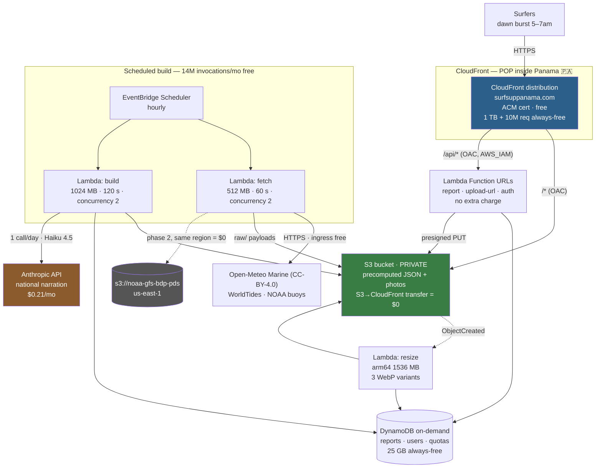

# 08 — AWS Architecture and Cost — Surfs Up Panama (`surfsuppanama.com`)

Research date / access date for every citation below: **2026-08-08**
Status: **COMPLETE**

Scope: AWS-first architecture for the Surfs Up Panama surf-forecast community web app.
Target scale: 500–5,000 MAU (MVP), dawn burst 5–7am local, ~40 spots, hourly data refresh,
~200 user photo uploads/day (photos are the ground truth — Panama has almost no usable webcams).
Owner constraint: personal AWS account, $20 billing alarm, **design target is $0.00/month**.

> **Citation rule for this doc:** every price and limit carries a source URL + access date.
> Anything not verified from an official page is marked **UNVERIFIED**. Vendor "example"
> figures were recomputed from the published rates and are flagged where they disagree.
> Web-search budget was exhausted mid-session; a few clearly-marked items could not be verified.

---

## TL;DR — 15 lines

1. **AWS killed the 12-month free tier.** New accounts get a **credit-funded Free Plan: $200 over 6 months — and then AWS CLOSES THE ACCOUNT** (90 days to recover, then permanent deletion).
2. 🚨 **Action item above all others:** Andres's account (created ~2026-08-05, already running Amplify + RDS) is on a clock to **~2026-02-05**. **Upgrade to the Paid Plan.** The always-free tier explicitly continues on the Paid Plan; the goal is not "stay free," it is "be paid and live inside the always-free allowances."
3. **Recommended architecture:** one scheduled Lambda precomputes the *entire site* into static JSON in a private S3 bucket every hour; CloudFront (which has a **POP inside Panama**) serves it; writes go to Lambda Function URLs + DynamoDB; photos upload via presigned S3 PUT and are resized once on upload. **Zero database on the read path, zero per-request compute.**
4. **Cost at 500 MAU: ~$0.45/month. At 5,000 MAU: ~$0.69/month.** At 50,000 MAU: ~$21.55/month.
5. **A true $0.00 is not reachable once you store photos.** The irreducible floor is S3 (~$0.25→$0.80/mo). Route 53's hosted zone ($0.50/mo, no free tier) is avoidable — use external DNS; ACM certs for CloudFront are free.
6. **Biggest cost risk: CloudFront requests, not bandwidth.** The 10M-request free tier breaks at **~16,700 MAU** at 30 requests/session — bundling all 40 spots into one JSON file pushes that to ~50,000 MAU for $0.00.
7. **Second biggest risk: CloudWatch log retention defaults to Never Expire**, and only 10 custom metrics / 10 alarms are free. Set 7–14 day retention in IaC on day one; never emit a per-spot metric.
8. **Do not use API Gateway or Amplify Hosting** — they are the two services people reflexively reach for and the two with **no perpetual free tier**. Lambda Function URLs cost nothing extra; CloudFront's free egress is 67× Amplify's.
9. **us-east-1, decisively** — NOAA's `noaa-gfs-bdp-pds` GFS-Wave bucket lives there and **same-region S3→Lambda transfer is $0.00**, as is S3→CloudFront and all internet ingress.
10. **AI: $0.21/month.** Deterministic per-spot scoring (free arithmetic) + **one** Claude Haiku 4.5 national narration per day. Per-spot Haiku with batch+caching is ~$1.35/mo; Opus 5 would be $20.70/mo — more than the whole budget. **Never call an LLM on a page view** (that same workload becomes ~$345/month).
11. **Skip GRIB2 for the MVP.** `eccodes` does not fit Lambda's 250 MB unzipped limit, forcing a container image (10 GB limit) plus **ECR storage that is only free for 12 months** and silently accumulates. And GFS publishes 4×/day, so hourly GRIB2 ingest is pointless work.
12. **Auth: no-auth reads, magic-link only to post.** Cognito's free tier is now **10,000 MAU, not the widely-quoted 50,000** — but at a 2–5% posting rate that stays free past 200,000 users.
13. **Do not buy WAF** ($5/ACL + $1/rule + $0.60/M = $7/mo minimum, 35% of the budget at zero traffic). CloudFront caching absorbs read floods for free; Lambda **reserved concurrency = 2** is the real hard cap. AWS Budgets *alerts*, it does not stop.
14. 🚩 **ToS flag:** precomputing to public static JSON **is redistribution.** Fine for Open-Meteo (CC-BY-4.0, attribution required) and WorldTides (explicit caching permission); **forbidden by Windy.** And Open-Meteo's free tier is **non-commercial only** — ads or subscriptions trigger a **$29/month** plan, larger than the entire AWS bill.
15. **Honest verdict:** Cloudflare (Pages + Workers + R2, zero egress fees) is simpler and structurally cheaper for this exact read-mostly shape, and has no account-closure cliff. AWS's real advantages are free NOAA data in us-east-1 and the fact that Andres already knows it. **AWS is a fine choice, not the obvious one** — it just needs more guardrails to stay near zero.

---

## 1. Current AWS Free Tier reality (2026)

### 1.1 The structural change — this is the headline

AWS replaced the old 12-month free tier with a **credit-funded Free Plan** for accounts
created from ~July 2025 onward. Three distinct things now exist and they are constantly
confused:

| Bucket | What it is | Duration | Source |
|---|---|---|---|
| **Free Plan credits** | $100 at signup + up to $100 more earned by exploring services = **up to $200 over 6 months** | 6 months from account creation, or until credits run out | https://aws.amazon.com/free/ (accessed 2026-08-08) |
| **Always-free tier** | "30+ AWS services are always free within monthly usage limits **on both the Free and Paid plans**" | Perpetual, as long as you are an AWS customer | https://aws.amazon.com/free/ ; https://aws.amazon.com/free/free-tier-faqs/ (accessed 2026-08-08) |
| **12-month free trials** | Legacy per-service 12-month allowances (RDS 750h, API Gateway 1M calls, Amplify, etc.) | 12 months from account creation, **only for accounts old enough to have them** | per-service pricing pages, see below |

### 1.2 🚨 THE BIGGEST FINDING — the Free Plan CLOSES YOUR ACCOUNT

Direct quote from https://aws.amazon.com/free/ (accessed 2026-08-08):

> "The account closes on its own 6 months after you open it or when your credits run out,
> whichever comes first."

And from the FAQ (https://aws.amazon.com/free/free-tier-faqs/, accessed 2026-08-08):

> When the free plan expires, "AWS closes your account, and you'll lose access to your
> resources and data." You have **90 days** to upgrade to a paid plan and restore access.
> After 90 days, AWS permanently deletes your account and content.

Two further Free Plan constraints from the same FAQ:
- The Free Plan is **limited to "a subset of AWS services"** to prevent credit exhaustion.
  (⚠️ **UNVERIFIED which services are excluded** — AWS does not publish the subset list on
  the FAQ page. This matters for Bedrock, see §6. **Andres must check his account's plan
  status in the Billing console before assuming Bedrock is callable.**)
- Free Plan accounts are **ineligible for additional promotional offers**.

**Implication for this project — the recommendation flips.** The goal is NOT "stay on the
free tier." It is:

> **Upgrade the personal account to the Paid Plan, then architect to live entirely inside
> the always-free allowances.** The always-free tier explicitly continues on the Paid Plan.
> On the Paid Plan, "essentially free" means a real $0.00–$2.00/month bill, not a credit
> countdown to account deletion.

🚩 **RISK FLAG (out of scope but critical):** Andres's memory notes a personal AWS account
created ~2026-08-05 with **Amplify + RDS already deployed** (Amplify `d1cj623a5g46y8` + RDS,
demo live 2026-08-06). If that account is on the Free Plan, the account — and that live demo
— is scheduled for automatic closure around **2026-02-05** (6 months from creation), or
sooner if the $200 of credits burns out. An always-on RDS instance is the single most likely
thing to burn those credits. **Action: verify the account's plan and creation date in the
Billing console; upgrade to Paid Plan before the clock runs out.**

### 1.3 Always-free allowances, service by service (verified)

All figures us-east-1 unless noted. "Always free" = perpetual monthly allowance, not a
12-month trial.

| Service | Always-free monthly allowance | Verified? | Source (all accessed 2026-08-08) |
|---|---|---|---|
| **Lambda** | **1,000,000 requests + 400,000 GB-seconds** — page states this is "a perpetual always-free offering" | ✅ always free | https://aws.amazon.com/lambda/pricing/ |
| **Lambda Function URLs** | **No additional charge** — included in standard Lambda invocation pricing | ✅ | https://aws.amazon.com/lambda/pricing/ |
| **DynamoDB** | **25 GB storage** + **25 WCU / 25 RCU** + 2.5M DynamoDB Streams read requests. 1 GB data transfer out (15 GB in first 12 months) | ✅ 25GB + streams always free; ⚠️ see §4 caveat on WCU/RCU being *provisioned* capacity | https://aws.amazon.com/dynamodb/pricing/on-demand/ |
| **CloudFront** (pay-as-you-go) | **1 TB data transfer out** + **10,000,000 HTTP/HTTPS requests** + **2,000,000 CloudFront Functions invocations** | ✅ listed under "Free Tier (Always Free)" | https://aws.amazon.com/cloudfront/pricing/pay-as-you-go/ |
| **CloudWatch** | 5 GB logs (ingest+archive+Insights scan), 10 custom metrics, 10 alarm-metrics, 3 dashboards (≤50 metrics each), 1M API requests, 1,800 min Live Tail | ✅ always free | https://aws.amazon.com/cloudwatch/pricing/ |
| **EventBridge Scheduler** | **14,000,000 invocations/month free** | ✅ monthly, all regions except GovCloud; does not carry over | https://aws.amazon.com/eventbridge/pricing/ |
| **EventBridge Schema Discovery** | 5,000,000 ingested events/month | ✅ | https://aws.amazon.com/eventbridge/pricing/ |
| **Cognito** | **10,000 MAU** on Lite and Essentials tiers (per account/month). SAML/OIDC federation: 50 MAU. **Plus tier: no free tier.** | ✅ (see §8 for the legacy-50k nuance) | https://aws.amazon.com/cognito/pricing/ |
| **API Gateway** | 1M REST + 1M HTTP API calls + 1M WebSocket messages + 750k connection-minutes — **"for up to 12 months … new AWS customers only … expires after 12 months — it is not a permanent always-free offering"** | ❌ **NOT always free** | https://aws.amazon.com/api-gateway/pricing/ |
| **Amplify Hosting** | 1,000 build min, 5 GB storage, 15 GB transfer out, 500k SSR requests, 100 GB-hrs SSR duration — **"free for 12 months" for new Free Tier users** | ❌ **NOT always free** | https://aws.amazon.com/amplify/pricing/ |
| **App Runner** | **No free tier stated on the pricing page** | ❌ none | https://aws.amazon.com/apprunner/pricing/ |
| **S3** | 5 GB Standard storage + 20,000 GET + 2,000 PUT (historically 12-month). Page also notes: first **100 GB/month data transfer out to internet, aggregated across all AWS services and regions**, is free | ⚠️ partially — see §4 | https://aws.amazon.com/s3/pricing/ |
| **RDS** | 750 hours db.t4g/t3/t2.micro — 12-month trial only | ❌ NOT always free | https://aws.amazon.com/rds/ |
| **Aurora Serverless v2** | No free tier | ❌ none | https://aws.amazon.com/rds/aurora/pricing/ |
| **ECS / Fargate** | No free tier for Fargate compute | ❌ none | https://aws.amazon.com/fargate/pricing/ |
| **Timestream** | See §4 | ⚠️ | https://aws.amazon.com/timestream/pricing/ |
| **Bedrock** | Page "mentions an AWS Free Tier exists but provides no Bedrock-specific free usage details" | ❌ **no Bedrock-specific free tier** | https://aws.amazon.com/bedrock/pricing/ |
| **SNS** | 1M publishes, 100k HTTP deliveries, 1k email — see §10 | ⚠️ | https://aws.amazon.com/sns/pricing/ |
| **SQS** | 1M requests/month | ⚠️ | https://aws.amazon.com/sqs/pricing/ |
| **WAF** | **No free tier for the core service** ($5/web ACL + $1/rule + $0.60/M requests). Bot Control has 10M free requests/mo; Fraud Control 10k/mo | ❌ | https://aws.amazon.com/waf/pricing/ |

### 1.4 The one-line takeaway for §1

**Everything this app needs — Lambda, S3, CloudFront, EventBridge Scheduler, CloudWatch,
DynamoDB — has a genuine perpetual always-free allowance that is 10x–1000x our MVP volume.
The two services with NO always-free tier that people reflexively reach for — API Gateway
and Amplify Hosting — are exactly the two we should not use.**


## 2. Frontend options

### 2.1 Traffic model used for every cost figure in this doc

State the assumptions once so every number below is auditable.

| | 500 MAU | 5,000 MAU | 50,000 MAU |
|---|---|---|---|
| Sessions/month (20 visits per user) | 10,000 | 100,000 | 1,000,000 |
| HTTP requests/month (30 per session) | 300,000 | 3,000,000 | 30,000,000 |
| CDN egress/month (500 KB per session) | 5 GB | 50 GB | 500 GB |
| Photo uploads/month (200/day) | 6,000 | 6,000 | 6,000 |
| LLM calls/month (40 spots × 2/day) | 2,400 | 2,400 | 2,400 |

Note the shape: **the two most expensive-looking workloads (AI and ingestion) are flat with
respect to user count.** Only CDN requests scale. That is a direct consequence of the
precompute architecture in §4 and is the single most important cost property of this design.

### 2.2 Options compared

| Option | Cost at 5,000 MAU | Cost at 50,000 MAU | Verdict |
|---|---|---|---|
| **S3 + CloudFront (static)** | **$0.20** (S3 storage+PUTs; CDN inside always-free 10M req / 1 TB) | **~$20–$44** (20M requests over the 10M free allowance) | ✅ **PICK** |
| AWS Amplify Hosting | $5.25/mo after the 12-month trial; **$7.50+/mo immediately** on a post-2025 account with no trial | ~$73/mo | ❌ |
| CloudFront + Lambda@Edge | $1.80/mo in request charges alone, + duration on every miss, + Lambda@Edge does **not** draw on the free Lambda tier | ~$18/mo + duration | ❌ unless you need edge SSR |
| App Runner | $2.56/mo idle-only floor → $14.24/mo for a real 0.25 vCPU/0.5 GB always-on service | same (not traffic-driven) | ❌ |

**Arithmetic shown (per advisor instruction — do not trust vendor example figures):**

- **Amplify egress at 5,000 MAU:** allowance 15 GB/month, then $0.15/GB.
  (50 GB − 15 GB) × $0.15 = **$5.25/month**. At 50,000 MAU: (500 − 15) × $0.15 = **$72.75/month**.
  Source: https://aws.amazon.com/amplify/pricing/ (accessed 2026-08-08)
- **CloudFront egress at the same volumes:** 50 GB and 500 GB are both **inside the always-free
  1 TB**, so **$0.00**. Beyond 1 TB the rate is $0.085/GB (US/Mexico/Canada) or $0.110/GB
  (South America) — i.e. **Amplify egress is 1.4×–1.8× the price of raw CloudFront even after
  CloudFront's free tier is exhausted**, and Amplify's free allowance is 67× smaller (15 GB vs 1 TB).
  Source: https://aws.amazon.com/cloudfront/pricing/pay-as-you-go/ (accessed 2026-08-08)
- **App Runner floor:** $0.064/vCPU-hr, $0.007/GB-hr (US regions).
  0.25 vCPU × $0.064 × 730 h = $11.68; 0.5 GB × $0.007 × 730 h = $2.56. **Total $14.24/month.**
  Provisioned-idle (memory only) = 0.5 × $0.007 × 730 = **$2.56/month floor even at zero traffic.**
  ⚠️ The AWS pricing page's own worked example claims **$25.50/month for a 1 vCPU / 2 GB service**;
  computing from the page's own rates gives 1 × 0.064 × 730 + 2 × 0.007 × 730 = **$56.94**.
  These do not reconcile. **Do not quote the $25.50 figure.** The rates are the primary data.
  Source: https://aws.amazon.com/apprunner/pricing/ (accessed 2026-08-08)
- **Lambda@Edge:** $0.60 per 1M requests + $0.00005001 per GB-second. At 3M requests =
  **$1.80/month** in request charges before any compute.
  Source: https://aws.amazon.com/cloudfront/pricing/pay-as-you-go/ (accessed 2026-08-08)
- **CloudFront Functions** (the cheap edge option for header rewriting / URL normalization, NOT
  image processing): 2,000,000 invocations/month always free, then $0.10 per 1M.
  Source: same page.

### 2.3 The Amplify trap, stated plainly

Amplify Hosting's free allowance is **"free for 12 months" for new AWS Free Tier users** —
https://aws.amazon.com/amplify/pricing/ (accessed 2026-08-08). On an account created in 2026
under the credit-based Free Plan, that 12-month trial may not apply at all
(⚠️ **UNVERIFIED** — AWS does not state whether new Free-Plan accounts inherit the legacy
12-month per-service trials). Even in the best case it expires. **S3 + CloudFront's 1 TB /
10M-request allowance is perpetual.** Andres has used Amplify before on this account; that is a
reason to be careful, not a reason to reuse it.

### 2.4 🚨 The CloudFront pricing-model fork — resolve this before building

Two contradictory-looking free tiers exist because CloudFront now sells **two mutually
exclusive billing models**. Both fetches were correct; they describe different products.

| | Pay-as-you-go (per-unit) | Flat-rate plan (Free tier) |
|---|---|---|
| Free egress | **1 TB/month, always free** | 100 GB/month |
| Free requests | **10,000,000/month, always free** | 1,000,000/month |
| Free CF Functions | 2,000,000/month | (bundled) |
| Overage behavior | Billed per GB / per 10k requests | **"There are no additional overage charges or usage calculations, even during traffic spikes or attacks"** |
| Bundled extras | none | WAF + DDoS protection, bot management, Route 53 DNS, CloudWatch Logs ingestion, TLS cert, edge compute, S3 storage credits |
| Selection | default | opt-in: *"Select a flat-rate plan when creating a new CloudFront distribution or switch an existing distribution from pay-as-you-go pricing"* |

Sources: https://aws.amazon.com/cloudfront/pricing/pay-as-you-go/ and
https://aws.amazon.com/cloudfront/pricing/ (both accessed 2026-08-08).

Flat-plan tiers: **Free $0** (1M req / 100 GB) · **Pro $15/mo per distribution** (10M req / 50 TB)
· **Business $200/mo** (125M req / 50 TB) · **Premium $1,000/mo** (500M req / 50 TB).

⚠️ **UNVERIFIED and important:** AWS does not state on the pricing page *what actually happens*
when a flat plan's included usage is exceeded — whether traffic is throttled, blocked, degraded,
or you are simply prompted to upgrade. "No overage charges" without a stated enforcement
mechanism is not the same as a documented hard cap. **Verify in the CloudFront console or with
AWS support before relying on it as a spend ceiling.**

**Recommendation — every CloudFront number in this document assumes PAY-AS-YOU-GO:**

- At MVP scale the pay-as-you-go always-free tier (10M requests / 1 TB) is **10× larger** than
  the flat Free plan and covers 5,000 MAU with 3× headroom at **$0.00**.
- The flat Free plan's 1M requests/month = ~33,000/day would be exhausted by roughly
  **1,600 MAU** on the traffic model above. It is too small.
- **The flat Pro plan at $15/month is the right escape hatch, not the starting point.** If Andres
  ever wants a genuine hard ceiling on CDN spend — or gets attacked — $15/mo flat for 10M
  requests, 50 TB, **plus bundled WAF, DDoS protection, and bot management** is cheaper than
  buying WAF à la carte ($5/web ACL + $1/rule + $0.60/M requests, see §10). Keep it in the
  back pocket; switching is a per-distribution setting, not a migration.

### 2.5 Domain, DNS, and TLS — `surfsuppanama.com`

Site name: **Surfs Up Panama**. `surfsuppanama.com` confirmed available as of 2026-08-08.

| Item | AWS price | Always free? | Source (accessed 2026-08-08) |
|---|---|---|---|
| **Route 53 hosted zone** | **$0.50/month** per zone (first 25 zones; $0.10/mo beyond 25) | ❌ **NO free tier for hosted zones** | https://aws.amazon.com/route53/pricing/ |
| Route 53 standard DNS queries | $0.40 per million (first 1B/mo) | — | same |
| Route 53 **alias** queries → CloudFront | **$0.00** — *"Alias A/AAAA records that are mapped to the following AWS services do not incur a charge"*, listing "Amazon CloudFront distributions" | ✅ free | same |
| Route 53 health checks | $0.50/health check/month — but *"New and existing customers can create up to 50 health checks for AWS endpoints … for free"* | ✅ 50 free | same |
| **ACM public certificate** for CloudFront | **$0.00** — *"By default, ACM issues certificates at no cost for use with services integrated with ACM"* | ✅ free | https://aws.amazon.com/certificate-manager/pricing/ |
| .com registration via Route 53 Registrar | ⚠️ **UNVERIFIED** — the pricing page links out to a PDF and does not state the .com price inline | — | https://aws.amazon.com/route53/pricing/ |

**Say it plainly: Route 53 is the one thing here that cannot be $0.** A hosted zone is a flat
**$0.50/month = $6.00/year**, charged whether or not a single query is served. There is no free
tier. It is small, but it is the difference between "$0.00/month" and "not $0.00/month," and
the brief asks for a true zero.

⚠️ Note the double-charge trap: a hosted zone is billed **per zone, per month, pro-rated only
in the sense that AWS does not refund a zone deleted within 12 hours of creation** — creating and
deleting zones while experimenting still bills. Create it once.

**Three ways to get the domain to $0/month (DNS only — registration is never free):**

1. ✅ **RECOMMENDED — external DNS, no Route 53 hosted zone at all.**
   CloudFront does not require Route 53. Register the domain wherever it is cheapest, then at
   that registrar's own (free) DNS create:
   - `CNAME` (or ALIAS/ANAME at apex, if the registrar supports it) → `dxxxxxx.cloudfront.net`
   - a `CNAME` for the ACM DNS validation record (one-time, then it can stay)

   ACM's certificate stays free — ACM validates by DNS record, and it does not care who hosts
   the zone. **Cost: $0.00/month.** Registrars that support apex ALIAS/flattening for free:
   **Cloudflare Registrar** (at-cost renewal, no markup, free DNS with CNAME flattening at the
   apex) and **Porkbun** (free DNS with ALIAS records). **Namecheap** is cheap on year one but
   its free DNS apex handling is weaker.
   ⚠️ **UNVERIFIED** — registrar prices and apex-ALIAS support were not fetched in this pass
   (web-search budget exhausted). Verify Cloudflare Registrar / Porkbun / Namecheap .com pricing
   and apex-record support before buying. The AWS-side facts above *are* verified.

2. **Route 53 hosted zone anyway — $0.50/month.** Worth it if he wants everything in one
   console, wants Route 53 health checks (50 free), or wants alias records at the apex without
   depending on a registrar's CNAME-flattening. Queries to CloudFront alias records are free, so
   $0.50/mo is the *whole* bill regardless of traffic. This is the "pay $6/year for less
   friction" option and it is a completely defensible choice.

3. **No custom domain at all — use the `dxxxxxx.cloudfront.net` URL.** $0.00, and genuinely
   fine for a private beta. Not acceptable for a public community brand.

**Recommendation: buy `surfsuppanama.com` at a cheap registrar, use that registrar's free DNS,
point a CNAME/ALIAS at CloudFront, validate ACM by DNS. AWS-side DNS+TLS cost = $0.00/month.**
Domain registration (~$10–15/year) is an unavoidable real-world cost but is not an AWS bill and
is not a monthly one.

---

## 3. Backend options

### 3.1 The verified fact that decides this

> **Lambda Function URLs: "No additional charge mentioned. They're included as part of standard
> Lambda function invocation pricing."**
> — https://aws.amazon.com/lambda/pricing/ (accessed 2026-08-08)

Combined with Lambda's **perpetual** always-free 1,000,000 requests + 400,000 GB-seconds per
month (same page, explicitly described as "a perpetual always-free offering"), a
Function-URL-fronted Lambda costs **$0.00** at every scale this app will reach for years.

### 3.2 Options compared

| Option | Free tier | Cost at our write volume | Verdict |
|---|---|---|---|
| **Lambda + Function URL** | 1M req + 400k GB-s, **perpetual** | **$0.00** | ✅ **PICK** |
| Lambda + API Gateway HTTP API | 1M calls — **12 months only, new customers only, "not a permanent always-free offering"** | $1.00/M after; ~$0.05–$0.50/mo at our volume | ❌ no perpetual free tier, no capability we need |
| Lambda + API Gateway REST API | same 12-month cap | $3.50/M calls + $0.09/GB transfer out | ❌ 3.5× the HTTP API price |
| App Runner | none | $2.56/mo idle floor → $14.24/mo real | ❌ |
| ECS Fargate | none | $8.99/mo for one 0.25 vCPU/0.5 GB x86 task 24/7 ($7.20 on ARM), **before** an ALB (~$16/mo) or NAT | ❌ |

Sources: https://aws.amazon.com/api-gateway/pricing/ · https://aws.amazon.com/apprunner/pricing/ ·
https://aws.amazon.com/fargate/pricing/ (all accessed 2026-08-08).

**Fargate arithmetic (computed from the page's own per-second rates, us-east-1 Linux/x86):**
vCPU $0.000011244/s = $0.0404784/h; memory $0.000001235/GB-s = $0.004446/GB-h.
0.25 × $0.0404784 × 730 = $7.39 + 0.5 × $0.004446 × 730 = $1.62 → **$9.01/month**, and that is
a single task with no load balancer, no redundancy, and no NAT gateway. ARM/Graviton2 is
~20% cheaper ($0.0323798/vCPU-h, $0.003560/GB-h) → **$7.21/month**. Both are permanently over
the "essentially free" bar. The first 20 GB of ephemeral storage per task is included.

### 3.3 What we give up by choosing Function URLs over API Gateway

Honest list. None of these bite in this architecture:

| API Gateway feature | Do we need it? |
|---|---|
| Custom domain | No — CloudFront is already in front and owns the domain |
| Usage plans / API keys | No — public site; write path is auth-gated |
| Request/response validation | No — validate in the handler (10 lines of Zod) |
| Direct WAF attachment | No — attach WAF to the CloudFront distribution instead, if ever |
| Native throttling | No — use Lambda **reserved concurrency** (a harder cap, and free) |
| WebSocket API | Not in MVP scope. If live "who's out" presence is ever wanted, revisit — that is the one feature that would justify API Gateway WebSocket ($1.00/M messages + $0.25/M connection-minutes) |

### 3.4 Recommended backend shape

Two Lambdas on the write path, one on the build path. All behind the same CloudFront
distribution so there is exactly one origin and one domain:

```
CloudFront distribution  (one domain, e.g. surf.pa)
├── /*                  → S3 origin (OAC)         static site + precomputed JSON
├── /api/report         → Lambda Function URL     POST a surf report (auth required)
├── /api/upload-url     → Lambda Function URL     mint a presigned S3 PUT (auth required)
└── /api/auth/*         → Lambda Function URL     magic-link issue/verify (see §8)
```

CloudFront in front of the Function URL also gives: one TLS cert, one domain, no CORS
preflight, edge-terminated TLS in Panama, and the option to attach WAF later at one place.

⚠️ **Configure OAC (Origin Access Control) on the Lambda Function URL** (`AWS_IAM` auth type
with CloudFront signing) so the raw `*.lambda-url.us-east-1.on.aws` endpoint cannot be hit
directly, bypassing the CDN. Same for the S3 bucket — **never public**.

## 4. Data store

### 4.1 Classify the data first — it decides everything

| Data | Shape | Volume | Read pattern | Right home |
|---|---|---|---|---|
| Forecast timeseries per spot/hour/model | Highly repetitive, append-only, **entirely derived from upstream providers** | 40 spots × 168 h × ~5 models | Read-mostly, everyone reads the same thing | **Static JSON in S3** |
| Spot metadata | 40 rows, changes ~never | trivial | Read-only | **JSON in the repo / S3** |
| User reports | Low write volume, recency-ordered per spot | ~200/day | Read-mostly, small | **DynamoDB** |
| Photos | Binary blobs + metadata | 200/day | Read-mostly | **S3** + DynamoDB metadata |

The forecast data — the thing that *feels* like it needs a database — is the one thing that
most emphatically does not. It is derived, immutable once computed, identical for every user,
and refreshed on a fixed schedule. That is a **build artifact**, not a database row.

### 4.2 The honest evaluation the brief asked for: static precompute vs a real database

**PICK THE STATIC PRECOMPUTE.** Here is the case, including the costs of the alternatives.

| Option | Monthly cost at 5,000 MAU | Why rejected / picked |
|---|---|---|
| **S3 precomputed JSON + CloudFront** | **~$0.20** | ✅ **PICK** |
| DynamoDB on-demand as the read store | **~$16+** (see math) | ❌ strictly worse and more complex |
| Aurora Serverless v2 (min 0 ACU) | **~$44** if it never pauses; +15–30 s cold connect | ❌ fatal latency + it can't stay paused |
| RDS db.t4g.micro | ~$12+ always-on, no always-free tier | ❌ |
| Timestream for LiveAnalytics | **$3.00/month floor before a single query** | ❌ wrong billing model |

**DynamoDB-as-read-store math (why it loses):** rewriting the forecast hourly means
40 spots × 168 hourly points × 5 models = 33,600 items per regeneration × 720 regenerations
= **24,192,000 writes/month**. At $0.625 per million write request units that is
**$15.12/month in writes alone** — before a single read, and reads would then scale with
traffic. The static build writes **45 objects** per regeneration instead of 33,600, because
the unit of storage is a *file per spot*, not a *row per data point*.
Source: https://aws.amazon.com/dynamodb/pricing/on-demand/ (accessed 2026-08-08)

**Aurora Serverless v2 — scale-to-zero is REAL, and still wrong here.** Verified from
https://docs.aws.amazon.com/AmazonRDS/latest/AuroraUserGuide/aurora-serverless-v2-auto-pause.html
(accessed 2026-08-08):
- Minimum capacity **0 ACUs** is supported → auto-pause. *"You aren't charged for instance
  capacity while an instance is in the paused state."* Requires Aurora PostgreSQL ≥ 16.3/15.7/14.12/13.15
  or Aurora MySQL ≥ 3.08.0.
- Idle timeout: **300 s minimum (also the default), 86,400 s maximum.**
- ⚠️ **Resume latency: *"the typical time to resume might be approximately 15 seconds"* — and
  *"If an Aurora serverless instance remains paused more than 24 hours … the resume time can be
  30 seconds or longer."*** For a dawn-patrol app whose entire usage is a 5–7am burst, the first
  surfer of the day would wait 15–30 s. Disqualifying on its own.
- ⚠️ *"AWS still charges for Aurora storage and other aspects of the cluster"* while paused —
  Aurora Standard storage is $0.10/GB-month. Paused ≠ free.
- ⚠️ **It would never actually pause in this design**: the hourly ingest Lambda connects every
  hour, and the docs explicitly warn *"check if any applications that use RDS Data API or Lambda
  functions are sending frequent requests so that the instance is never idle long enough to
  pause."* Awake at the 0.5 ACU floor = 0.5 × $0.12/ACU-h × 730 h = **$43.80/month**.
  Source for ACU rate: https://aws.amazon.com/rds/aurora/pricing/ (accessed 2026-08-08)

**Timestream — rejected on a floor charge, not a rate.** Magnetic store is $0.03/GB-month with a
stated **minimum of 100 GB per account per region** → **$3.00/month before storing anything
real**. Queries are billed at $0.518/TCU-hour metered per second with a **30-second minimum per
query**, so every page view that triggered a query would carry a minimum charge. Writes are
$0.50 per million 1 KiB writes; memory store $0.036/GB-hour. No free tier is mentioned on the
page. Source: https://aws.amazon.com/timestream/pricing/ (accessed 2026-08-08). It is a good
product for high-cardinality IoT telemetry and a bad fit for 40 spots read by humans.

### 4.3 Why static precompute wins on more than price

1. **The dawn burst is the best case, not the worst.** Everyone opens the app between 5 and 7am
   and requests *the same 45 objects*. Cache hit ratio approaches 99.9%. A dynamic backend sees
   a 100× request spike and needs concurrency headroom; the static site's origin load is
   `(number of active POPs) × 45 objects per hour` **regardless of how many users show up**.
   Traffic spikes cost nothing and cannot cause an outage.
2. **Graceful failure.** If the hourly builder fails, CloudFront keeps serving the last good
   JSON. A database-backed app returns 500s. For a forecast app, stale-but-correct beats down.
3. **No cold starts on the read path**, no connection pooling, no VPC, no NAT Gateway
   (NAT Gateway alone is ~$32/month and is the classic way serverless projects accidentally
   leave the free tier).
4. **Cost is decoupled from traffic** until CloudFront's 10M-request allowance.

**Honest downsides, stated:**
- Up to 1 hour of staleness. Acceptable — the upstream models themselves only publish every
  1–6 hours (GFS/GFS-Wave run 4×/day at 00/06/12/18Z), so hourly regeneration is already
  *faster* than the data changes.
- Not 100% static: user reports and photo uploads need a write path (§3.4).
- Personalization (favorite spots) must be client-side `localStorage` or a separate
  authenticated call. Fine.
- Regenerating all 45 files hourly when only 3 changed is wasteful — but it costs $0.15/month,
  so **do not optimize it.**

### 4.4 Concrete schema

**S3 layout** (single bucket, private, CloudFront OAC only):

```
s3://surfsuppanama-data/
  v1/
    manifest.json                    # build timestamp + content hashes; short TTL, cache-buster
    regions/{region_id}.json         # ⬅ BUNDLED: every spot in the region, one file  (~100 KB gz)
    reports/{region_id}.json         # recent user reports for the region; rebuilt on write
    photos/{photo_id}/{variant}.webp # 3 variants per photo (see §9)
  raw/{yyyy}/{mm}/{dd}/{hh}/         # archived provider payloads — lifecycle-expire at 30 days
```

🚨 **Bundle by region — do NOT write one file per spot.** This is a load-bearing decision, not a
detail. For the 40-spot Panama MVP there is exactly **one** region file
(`regions/pan.json`, ~100 KB gzipped for all 40 spots). Writing 40 separate
`forecast/{spot_id}.json` files instead would:
- multiply hourly S3 PUTs by 40 (32,400/month vs 2,880/month — see §12.4), and
- multiply **CloudFront requests per session**, which §12.4 identifies as the single binding
  constraint on the whole architecture.

One fetch returns everything the client needs to render the spot list *and* every spot's detail
view, so navigating between spots costs zero additional requests. The region key is what makes
this scale globally — see §15.4.

Three properties that matter:
- **`raw/` gives replayability** — the site can be rebuilt from archived payloads without
  re-hitting providers (important given the rate limits in doc 01).
- **Content-hashed keys + `Cache-Control: public, max-age=31536000, immutable`** on photos and
  hashed JS/CSS; **`max-age=300, stale-while-revalidate=3600`** on the JSON. This is what keeps
  CloudFront origin fetches — and therefore S3 GET charges — near zero.
- **Region files are independently regenerable** — only regions whose upstream model data
  actually refreshed get rewritten (§15.4).

**DynamoDB single table** (on-demand, `PAY_PER_REQUEST`):

```
Table: surfsuppanama
  PK (S)        SK (S)                      Attributes
  SPOT#<id>     META                        name, lat, lon, break_type, optimal_swell_dir, ...
  SPOT#<id>     REPORT#<iso8601>#<uuid>     user_id, rating, height_ft, photo_ids[], text
  USER#<id>     PROFILE                     handle, email_hash, created_at
  USER#<id>     QUOTA#<yyyy-mm-dd>          count            (rate limit; TTL 2 days)
  SESSION#<t>   TOKEN                       user_id, expires  (TTL — magic-link auth, §8)

  GSI1: global report feed — GSI1PK = "FEED", GSI1SK = <iso8601>
```

Everything the public reads comes from S3/CloudFront. DynamoDB is touched **only** on write and
**once per hour** by the builder. At ~6,000 report writes + ~6,000 photo-metadata writes per
month (~1 KB each) that is **12,000 write request units ≈ $0.0075/month**, and storage is far
under 25 GB. Effectively $0.00.

⚠️ **DynamoDB free-tier caveat — flagged, not resolved.** The on-demand pricing page lists
"25 WCUs, 25 RCUs" and "25 GB of data storage" together under the free tier, with a gloss of
"about 200M requests/month (depending on item size)". Capacity units (WCU/RCU) are a
**provisioned-mode** concept, so it is very likely the 25 WCU/25 RCU allowance applies only to
provisioned tables and that **on-demand requests get no free-tier coverage**. A follow-up fetch
of the DynamoDB free-tier docs page returned no usable page content, so this is
**UNVERIFIED**. It does not change any recommendation here: at 12,000 write units/month the
full on-demand price is **under one cent**, free tier or not. Do not build a cost model that
depends on on-demand requests being free-tier covered.
Source: https://aws.amazon.com/dynamodb/pricing/on-demand/ (accessed 2026-08-08)

---

## 5. Scheduled ingestion

### 5.1 The us-east-1 argument just got much stronger

Verified from https://aws.amazon.com/s3/pricing/ (accessed 2026-08-08):

> - *"Data transferred in from the internet"* — **no charge**
> - *"Data transferred from an Amazon S3 bucket to any AWS service(s) within the same AWS Region"* — **no charge**
> - *"Data transferred between S3 buckets in the same AWS Region"* — **no charge**
> - *"Data transferred out to Amazon CloudFront (CloudFront)"* — **no charge**

Three consequences, all of which push the same way:

1. **NOAA's open-data buckets — `noaa-gfs-bdp-pds`, `noaa-gefs`, `noaa-goes16/18/19` — live in
   us-east-1.** A Lambda running in us-east-1 reading them pays **$0.00 in data transfer**,
   confirmed by the same-region rule above. Pulling the same GRIB2 files into any other region
   would incur inter-region transfer. **This alone settles the region question (§7): us-east-1.**
2. **S3 → CloudFront egress is $0.00.** The origin-fetch leg of the CDN is free, so the *only*
   CDN cost is CloudFront's own egress-to-viewer and request charges — both inside the 1 TB /
   10M free tier at MVP scale.
3. **Internet → AWS ingress is $0.00.** So pulling ECMWF Open Data over HTTPS from ECMWF's own
   endpoint costs nothing in transfer, which neatly sidesteps the next problem.

⚠️ **ECMWF cross-region caveat.** ECMWF Open Data (CC-BY-4.0) is mirrored on S3 as
`ecmwf-forecasts` in **eu-central-1**. Reading that from a us-east-1 Lambda is a **cross-region**
S3 GET, and cross-region transfer *is* charged. **UNVERIFIED who pays**: buckets in the AWS Open
Data Sponsorship Program normally have egress sponsored by AWS (requester pays nothing), but if
Requester Pays is enabled on that bucket the cost lands on us at inter-region rates. **Do not
guess.** Two safe options: (a) fetch ECMWF over **HTTPS from ECMWF's own endpoint** — internet
ingress is verified free, so this is $0 regardless of how the S3 mirror is configured; or
(b) skip ECMWF for the MVP and use Open-Meteo (which already blends multiple models and is
CC-BY-4.0 with explicit redistribution rights per doc 01).

### 5.2 Scheduling cost: genuinely zero

**EventBridge Scheduler: 14,000,000 invocations/month free.**
Source: https://aws.amazon.com/eventbridge/pricing/ (accessed 2026-08-08). Note: the page frames
this as a monthly allowance across all regions except GovCloud, and unused allowance does not
carry over. Hourly ingest = **720 invocations/month = 0.005% of the allowance.** Even at 1-minute
granularity (43,200/month) we would use 0.3%.

### 5.3 Lambda sizing for the ingest job

Recommended **two-stage** design (replayability + failure isolation):

```
EventBridge Scheduler (hourly, cron)
   └─► Lambda "fetch"    512 MB, 60 s timeout, reserved concurrency = 2
         └─ concurrent GETs to providers → writes raw payloads to s3://.../raw/
   └─► Lambda "build"    1024 MB, 120 s timeout, reserved concurrency = 2   (2 min later)
         └─ reads raw/ + DynamoDB reports → computes scores → writes v1/*.json
         └─ CloudFront invalidation OR (better) rely on short max-age, no invalidation
```

**Duration budget vs the 400,000 GB-second always-free allowance:**

| Job | Memory | Duration | Runs/mo | GB-s/month | % of 400,000 free |
|---|---|---|---|---|---|
| fetch (JSON providers) | 512 MB | 20 s | 720 | 7,200 | 1.8% |
| build | 1024 MB | 30 s | 720 | 21,600 | 5.4% |
| write API (reports) | 256 MB | 0.3 s | 6,000 | 450 | 0.1% |
| presign URL | 128 MB | 0.1 s | 6,000 | 75 | 0.02% |
| image resize | 1536 MB | 2.5 s | 6,000 | 22,500 | 5.6% |
| **Total** | | | **~19,440 invocations** | **~51,825 GB-s** | **~13%** |

Invocations: ~19,440/month vs **1,000,000 free** = **1.9% used.**
GB-seconds: ~51,825 vs **400,000 free** = **13% used.**
**Lambda cost: $0.00, with ~7× headroom on compute and ~50× on invocations.**
Source: https://aws.amazon.com/lambda/pricing/ (accessed 2026-08-08)

⚠️ **Do not use CloudFront invalidations as the cache-busting mechanism.** Invalidation paths
beyond the free monthly allowance are billed per path, and invalidating 45 paths every hour
(32,400/month) would be a real charge. Use short `max-age` + `stale-while-revalidate` on the
JSON, or content-hashed filenames referenced from a short-TTL `manifest.json`. **(⚠️ the exact
free invalidation-path allowance was not fetched in this pass — UNVERIFIED. Design so it never
matters.)**

### 5.4 GRIB2 on Lambda — the container-image path, costed properly

**The size problem is real and verified.** Lambda quotas
(https://docs.aws.amazon.com/lambda/latest/dg/gettingstarted-limits.html, accessed 2026-08-08):

| Quota | Value |
|---|---|
| Function timeout | **900 s (15 minutes)** |
| Memory | 128 MB – **10,240 MB**, 1 MB increments; **1,769 MB ≈ 1 vCPU** |
| .zip deployment package | 50 MB zipped; **250 MB unzipped including layers and custom runtimes** |
| **Container image code package** | **10 GB maximum uncompressed, including all layers** |
| `/tmp` storage | 512 MB – **10,240 MB** (configurable) |
| Layers per function | 5 |
| Concurrent executions | 1,000 default (⚠️ *"New AWS accounts have reduced concurrency and memory quotas"*) |

`eccodes` (the ECMWF C library `cfgrib` binds to) ships large binary artifacts and definition
tables; with `numpy` + `xarray` + `cfgrib` the environment does not fit in 250 MB unzipped.
**A container-image Lambda is required for GRIB2. That is confirmed by the quota table above.**

**The hidden charge the brief warned about — ECR.** Verified from
https://aws.amazon.com/ecr/pricing/ (accessed 2026-08-08):

| ECR | Rate | Free tier |
|---|---|---|
| **Private** repo storage | **$0.10 per GB-month** | *"500 MB per month of storage for your private repositories **for one year**"* — ❌ **12-month only, new customers only** |
| Data transfer, same region | **$0.00/GB** | ✅ |
| Data transfer, cross-region out | $0.09/GB | — |
| Data transfer in | no charge | ✅ |
| **Public** repo storage | — | ✅ **50 GB/month always-free**, plus unlimited bandwidth to AWS compute in any region |

- A realistic eccodes/cfgrib/xarray image is **~800 MB – 1.5 GB** compressed in ECR
  → **$0.08 – $0.15/month**. Small, but **not $0.**
- ⚠️ **The real trap is image accumulation.** ECR stores every pushed image separately. A CI
  pipeline pushing 30 builds/month at 1.2 GB each = 36 GB = **$3.60/month**, growing forever.
  **Mandatory mitigation:** an ECR lifecycle policy — expire untagged images immediately, keep
  only the last 2 tagged images. That holds it at ~$0.15–0.25/month.
- ECR **Public**'s 50 GB always-free allowance does **not** rescue this: Lambda container images
  must come from a **private** ECR repository in the same region as the function.
  ⚠️ **UNVERIFIED in this pass** (not re-fetched) — confirm against the Lambda container-image
  docs before relying on it either way.

**Compute cost if you do run GRIB2:**

| Cadence | Memory | Duration | Runs/mo | GB-s | Over 400k free? | Cost |
|---|---|---|---|---|---|---|
| 4×/day (matches GFS 00/06/12/18Z) | 3008 MB | 240 s | 120 | 86,630 | no | **$0.00** |
| Hourly | 3008 MB | 240 s | 720 | 519,782 | +119,782 | **$2.00** |
| Hourly, worst case | 3008 MB | 900 s | 720 | 1,949,184 | +1,549,184 | **$25.82** |

(Overage rate $0.0000166667 per GB-second, x86; ARM/Graviton is cheaper — https://aws.amazon.com/lambda/pricing/)

🚨 **Key insight: hourly GRIB2 ingest is pointless.** GFS and GFS-Wave publish **4 times a day**
(00/06/12/18Z). Running raw-model ingest hourly does 6× the work for zero additional data. Run
model ingest **4×/day** and keep the *site rebuild* hourly (so observations, tides, and new user
reports still refresh every hour). That change alone takes GRIB2 from $2.00/month to $0.00.

### 5.5 Ingestion recommendation

**MVP: do not touch GRIB2. Zip-package Lambdas only, no container, no ECR, $0.00.**
Use Open-Meteo Marine as the primary source — per doc 01 it is CC-BY-4.0 with explicit
redistribution rights (which is exactly what precomputing to public static JSON requires), it
needs no key, and its free tier is 10,000 calls/day / 300,000 calls/month. Our usage: 40 spots ×
24 h = **960 calls/day = 3.2% of the daily allowance.**

**Phase 2 (only if spot-level accuracy demands raw model data):** add a *separate* container-image
Lambda reading `noaa-gfs-bdp-pds` from us-east-1 (free transfer), running **4×/day**, with an ECR
lifecycle policy. Marginal cost **~$0.15–0.25/month**, entirely from ECR storage. Use the NOMADS
`.idx` byte-range index to download only the Panama bight subset rather than whole global GRIB2
files — this is what keeps duration under 240 s.

🚩 **ToS FLAG — this architecture is redistribution, and that is not universally allowed.**
Precomputing provider data into public static JSON on a CDN *is* redistribution, not
pass-through display. Cross-referencing doc 01/02:
- ✅ **Open-Meteo** — CC-BY-4.0, redistribution with attribution explicitly permitted.
  ⚠️ **But the free tier is NON-COMMERCIAL ONLY.** The moment Surfs Up Panama runs ads or
  charges, it needs the **$29/month API Standard plan**. That is a real future line item and it
  is larger than the entire AWS bill in this design.
- ✅ **WorldTides** — terms explicitly permit caching: *"You may cache results for performance
  and reliability…"*; attribution string must be reproduced.
- 🚫 **Windy** — *"Redistribution of any part of the API or the included data to any third party
  is forbidden."* **This architecture is incompatible with Windy.** Do not add Windy as a source.
- 🚫 **Surfline, Stormrider, Wannasurf** — explicitly prohibited (anti-scraping clauses).
Attribution must be rendered in the UI, not just in the JSON.

---

## 6. AI/LLM on AWS (Bedrock vs Anthropic API)

### 6.1 Bedrock pricing — what I could and could not verify

⚠️ **The Bedrock pricing page did not yield current Claude model pricing.** Three separate
fetches (`/bedrock/pricing/`, `/bedrock/pricing/?nc=sn&loc=4`, `/bedrock/claude/`) returned only
legacy "Public Extended Access" entries; `/docs/bedrock/latest/userguide/models-supported.html`
now redirects model details to a per-model card page. **Treat current Bedrock per-model Claude
pricing as UNVERIFIED.** What *was* extractable from https://aws.amazon.com/bedrock/pricing/
(accessed 2026-08-08):

| Verified on the Bedrock pricing page | Value |
|---|---|
| **Batch inference discount** | **50% off on-demand** ✅ |
| Cache write (legacy Sonnet listing) | $7.50 per 1M tokens |
| Cache read (legacy Sonnet listing) | $0.60 per 1M tokens |
| **Bedrock free tier** | **None** — page "mentions an AWS Free Tier exists but provides no Bedrock-specific free usage details" |
| Claude-serving regions listed | US East (N. Virginia), US East (Ohio), US West (Oregon), + several EU |
| Legacy "Claude 3.5 Sonnet (Public Extended Access)" | $6.00 / $30.00 per 1M in/out |
| Promo note on page | *"Claude Sonnet 5 promotional launch pricing of $2/$10 per million input/output tokens is in effect through August 31, 2026, after which the standard pricing of $3/$15 per million input/output tokens will take effect."* |

**First-party Anthropic API pricing** (from the loaded `claude-api` skill's model table, **cached
2026-06-24**, first-party rates only — flagged as such, not fetched live this session):
Claude Opus 5 **$5 / $25** · Claude Sonnet 5 **$3 / $15** ($2/$10 intro through 2026-08-31) ·
Claude Haiku 4.5 **$1 / $5** per million tokens. Batch API = 50% off. Prompt caching: cache write
1.25× (5-min TTL) or 2× (1-hour TTL), **cache read ≈ 0.1×**.

### 6.2 LLM cost model — real numbers, one analysis pass per spot per day

**Assumptions (stated so they can be challenged):** 40 spots × **1 pass/day** = 40 calls/day =
1,200 calls/month. Per call: **~2,200 input tokens** (1,500 shared system prompt: scoring rubric,
house style, glossary + 700 spot-specific forecast data) and **~250 output tokens**.
Monthly totals: **2.64M input tokens, 0.30M output tokens.**

| Model | Mode | $/day | **$/month** |
|---|---|---|---|
| **Haiku 4.5** ($1/$5) | baseline | $0.138 | **$4.14** |
| Haiku 4.5 | + batch (50%) | $0.069 | **$2.07** |
| Haiku 4.5 | + prompt caching | $0.086 | **$2.57** |
| **Haiku 4.5** | **+ batch + caching** | **~$0.045** | **~$1.35** |
| **Sonnet 5** ($3/$15) | baseline | $0.414 | **$12.42** |
| Sonnet 5 | intro $2/$10 (to 2026-08-31) | $0.276 | **$8.28** |
| Sonnet 5 | + batch | $0.207 | **$6.21** |
| Sonnet 5 | + batch + caching | ~$0.130 | **~$3.90** |
| **Opus 5** ($5/$25) | baseline | $0.690 | **$20.70** |

**Caching arithmetic shown:** the 1,500-token system prompt is byte-identical across all 40 daily
calls. Per day: 1 cache write (1,500 × 1.25 = 1,875 billed-equivalent) + 39 cache reads
(39 × 1,500 × 0.1 = 5,850) + 40 uncached spot payloads (40 × 700 = 28,000) = **35,725
input-equivalent tokens vs 88,000 uncached — a 59% cut on input.**
⚠️ Caveat: the Batch API is asynchronous, so cache hits within the default 5-minute TTL are not
guaranteed when batching. Use the **1-hour TTL** (2× write cost) if combining the two, or accept
the batch-only figure. The "batch + caching" rows are therefore approximate.

🚨 **Opus 5 alone ($20.70/month) exceeds the entire $20 budget.** Do not use Opus for this.

### 6.3 The $0 alternatives — and the one I actually recommend

| Approach | Cost/month | What you get |
|---|---|---|
| **A. Deterministic scoring only, no LLM** | **$0.00** | 0–10 score + templated sentence per spot |
| **B. Deterministic scoring + ONE national narration/day** | **$0.21** (Haiku) / $0.63 (Sonnet 5) | Everything in A, plus a human-voiced "today in Panama" paragraph |
| C. Per-spot LLM prose, Haiku + batch + caching | ~$1.35 | 40 individually written spot reports |
| D. Per-spot LLM prose, Sonnet 5 + batch | ~$6.21 | Better prose, 4.6× the price |

**Option A detail — the honest truth about surf ratings.** A surf score is arithmetic, not
reasoning: swell height × period, swell direction matched against the spot's optimal window,
wind speed × onshore/offshore angle, tide stage against the spot's working tide range. That is
a pure function you write once in the builder Lambda. **It costs $0.00, runs in milliseconds, is
deterministic and debuggable, and is fundamentally what every commercial surf rating already
is.** An LLM adds voice, not accuracy.

**Option B math (the recommendation):** 1 call/day, ~4,000 input tokens (all 40 spot summaries)
+ ~600 output tokens. Monthly: 0.12M input, 0.018M output.
Haiku 4.5: (0.12 × $1) + (0.018 × $5) = $0.12 + $0.09 = **$0.21/month.**
Sonnet 5 at standard rates: (0.12 × $3) + (0.018 × $15) = $0.36 + $0.27 = **$0.63/month.**

> **RECOMMENDATION: deterministic per-spot scoring (free) + one Haiku 4.5 national narration
> per day = $0.21/month, or $0.00 if you drop the narration.** This keeps the editorial hook —
> which is the actual differentiator against Windguru — at a rounding-error cost, and it means
> the AI bill is **flat with respect to users forever**.

### 6.4 The architectural rule that makes AI cost fixed

🚨 **Never call the LLM on a page view.** Call it in the scheduled builder and bake the prose
into the static JSON. This is why the AI line is $0.21/month at 500 users *and* at 50,000 users.
A per-request LLM call at 100,000 sessions/month on Haiku would be roughly
100,000 × (2,200 in + 250 out) → 220M input + 25M output = **$220 + $125 = $345/month.** Same
model, same prompt, 1,600× the bill. The precompute pattern is not a minor optimization here; it
is the difference between a $0 app and an unaffordable one.

### 6.5 Bedrock vs direct Anthropic API

| | Amazon Bedrock | Direct Anthropic API |
|---|---|---|
| Auth | IAM role on the Lambda — **no API key to store** | API key → Secrets Manager or KMS-encrypted env var |
| Billing | One AWS bill; **counts against the $20 CloudWatch alarm and AWS Budgets** | Separate bill; **invisible to AWS Budgets** |
| Model freshness | Lags — the pricing page still leads with legacy models | Newest models day one |
| Cheapest tier | Haiku availability/pricing on Bedrock **UNVERIFIED** | Haiku 4.5 at $1/$5 confirmed in the cached model table |
| Batch discount | **50% ✅ verified** | 50% |
| Prompt caching | Yes (cache write/read rates published) | Yes, incl. 1-hour TTL |
| Free tier | **None** | None |
| Free-Plan availability | ⚠️ **UNVERIFIED whether Bedrock is in the AWS Free Plan's "subset of services"** (§1.2) | N/A |

**Recommendation: direct Anthropic API with Claude Haiku 4.5.** Cheapest, newest, and at
$0.21/month the cost is negligible either way. **Nearest Claude-serving region to Panama is
us-east-1 (N. Virginia)** — verified as a Claude region on the Bedrock pricing page — which is
also where everything else in this design lives.

🚩 **Guardrail flag:** direct-API spend does **not** appear in AWS Budgets or the $20 CloudWatch
alarm. A runaway loop there would be invisible to every AWS guardrail in §10. **Set a hard spend
limit in the Anthropic Console**, and cap the builder Lambda's reserved concurrency at 2 so it
physically cannot fan out.

## 7. Latency / region for Panama

### 7.1 There is no AWS region anywhere near Panama

Verified from https://aws.amazon.com/about-aws/global-infrastructure/regional-product-services/
(accessed 2026-08-08): **there is no AWS region in Panama or anywhere in Central America.** The
only Latin American region listed is **South America (São Paulo), `sa-east-1`** — in Brazil,
~5,300 km from Panama City and on the wrong side of the continent for network paths.

### 7.2 But CloudFront has a POP *in Panama* — verified

From https://aws.amazon.com/cloudfront/features/ (accessed 2026-08-08):

> **Panama:** CloudFront has an edge location in Panama (listed as an embedded POP).

Nearby POPs: Bogotá, Colombia (5) · Lima, Peru (3) · Santiago de Querétaro, Mexico (10) plus
14 embedded Mexican POPs · Puerto Rico (Luquillo, Ponce, Vega Baja). Global footprint:
*"750+ POPs in 100+ cities across 50+ countries"* plus *"1,140+ embedded POPs across 300+ cities."*

**This is the single most important latency fact in the document.** Because the read path is
100% static and 100% CDN-cached, Panamanian users are served from a POP **inside Panama**. The
origin region is essentially irrelevant to user-perceived latency — it only affects the hourly
build job and the write path.

### 7.3 Region decision: `us-east-1` (N. Virginia)

| Criterion | us-east-1 | sa-east-1 (São Paulo) |
|---|---|---|
| Distance from Panama City | ~3,300 km | ~5,300 km |
| **NOAA open data (`noaa-gfs-bdp-pds`, `noaa-gefs`, `noaa-goes*`)** | **Same region → $0.00 transfer ✅** | Cross-region transfer, charged ❌ |
| Bedrock Claude available | ✅ verified on the Bedrock pricing page | Not listed among Claude regions |
| Service availability | Everything, first | Lags |
| Relative cost | AWS's cheapest region | Carries a well-known São Paulo premium |
| CloudFront egress rate (if ever over 1 TB) | $0.085/GB (US/Mexico/Canada) | $0.110/GB (South America) |

**`us-east-1`, decisively.** The NOAA same-region-transfer fact (§5.1) alone settles it — it is
the difference between free and paid raw-model ingest — and it happens to coincide with the
cheapest region, the best service availability, Claude availability, and the shortest hop from
Panama.

⚠️ **UNVERIFIED:** actual RTT Panama City → us-east-1 was not measured (typically 45–70 ms for
this path, but that is not from a source). Measure it once live. It affects only the write path,
which is not latency-critical.

⚠️ **UNVERIFIED:** which CloudFront pricing region Panama traffic bills under — it could fall in
"South America" ($0.110/GB) or a separate Caribbean/Central America tier, and the per-10,000
request rates are also regional (the verified $0.0100/10k HTTPS figure is the **US/Mexico/Canada**
rate). This does not bite until the 1 TB / 10M free tier is exhausted (~50,000 MAU, see §12.4).
**Verify in Cost Explorer once real traffic exists**, before modelling costs at scale.

---

## 8. Auth

### 8.1 Cognito's free tier changed — the number everyone quotes is wrong

Verified from https://aws.amazon.com/cognito/pricing/ (accessed 2026-08-08):

| Tier | Free MAU/month | Price per MAU beyond free |
|---|---|---|
| **Lite** | **10,000** | $0.0055 (first 90,000 above free), then $0.0046 |
| **Essentials** | **10,000** | $0.015 |
| **Plus** | **none** | $0.020 |
| SAML/OIDC federation (all tiers) | 50 MAU | — |

🚨 **The widely-repeated "50,000 MAU free" figure is the OLD Cognito user-pool free tier and does
not apply to a new 2026 account.** The page notes a legacy carve-out — accounts with ≥1 MAU
before 2024-11-22 could upgrade to Essentials at legacy pricing until 2025-11-30 — which is
irrelevant to a fresh account. Budget against **10,000**, not 50,000.

### 8.2 Options

| Option | Cost at 5,000 MAU | Cost at 50,000 MAU | Verdict |
|---|---|---|---|
| **No-auth read + auth only to post** | **$0.00** | **$0.00** (≈1,000–2,500 posting MAU, well under 10,000) | ✅ **PICK** |
| Cognito Lite for every visitor | $0.00 (under 10k) | 40,000 × $0.0055 = **$220/month** | ❌ |
| Cognito Essentials for every visitor | $0.00 (under 10k) | 40,000 × $0.015 = **$600/month** | ❌ |
| Magic-link DIY (Lambda + SES + DynamoDB) | **$0.00** | **$0.00** | ✅ pairs with the above |

**Why no-auth-read is not a compromise:** the entire read surface is public static JSON on a CDN.
There is nothing to authorize. Identity is only needed to *attribute* a report or photo — and
per the coordinator's note, **ground truth comes from user-submitted photos**, so the posting
cohort is the only cohort that needs accounts. At a realistic 2–5% posting rate, 50,000 MAU
yields 1,000–2,500 authenticated MAU — **permanently inside Cognito's 10,000 free tier.**

### 8.3 Recommended: magic-link, no passwords

```
POST /api/auth/request  → Lambda: mint a single-use token, store in DynamoDB with TTL 15 min,
                                  send via SES to the email address
GET  /api/auth/verify   → Lambda: validate token, set an HttpOnly signed-cookie session
                                  (DynamoDB SESSION# item, TTL 30 days)
```

~50 lines of code, no password reset flow, no credential storage liability, and it suits a
casual local community better than a password manager would. Cost: DynamoDB writes are pennies;
Lambda is inside the free tier.
⚠️ **UNVERIFIED — SES pricing was not fetched this pass.** SES has historically offered a free
allowance for mail sent from within AWS, but **verify the current SES free tier and whether it is
always-free or 12-month before assuming $0.** This is a genuine open item; at ~200 sign-ins/day
it is small either way, but it is a candidate to break the $0 (see §12.4).

**Fallback if magic-link is unwanted:** Cognito Lite (10,000 MAU free) is a perfectly good
choice and gives social login for free. Only cross into Essentials ($0.015/MAU) if passwordless
or advanced flows are actually needed. **Never Plus (no free tier).**
⚠️ Non-AWS alternatives (Supabase Auth — which Andres already runs on TradelyHQ — Clerk, Auth0)
were **not priced in this pass**. Verify before choosing; the AWS-side numbers above are verified.

---

## 9. Image handling

Per the coordinator: **Panama has almost no usable webcams, so user-submitted photos ARE the
ground truth.** This path is therefore product-critical, not a nice-to-have. Volume: **200
uploads/day = 6,000/month.**

### 9.1 Recommended pipeline — resize on upload, never on request

```
1. Browser → GET /api/upload-url (Lambda Function URL, auth required)
              ← presigned S3 PUT URL, key = uploads/{uuid}.jpg, 5-min expiry, content-length capped
2. Browser → PUT directly to S3      ← bytes never pass through Lambda
3. S3 ObjectCreated event → Lambda "resize" (arm64, 1536 MB, sharp)
              → writes 3 WebP variants to v1/photos/{id}/{thumb|card|full}.webp
              → writes metadata to DynamoDB
              → DELETES the original
4. CloudFront serves v1/photos/* with Cache-Control: max-age=31536000, immutable
```

Two design choices carry the cost:
- **Presigned PUT direct to S3** — bytes never traverse Lambda, so we never touch Lambda's 6 MB
  synchronous payload limit (verified in the quota table, §5.4) and pay zero Lambda duration for
  the upload itself. Also set a `content-length-range` condition on the presigned POST policy so
  a client cannot upload a 5 GB file.
- **Delete the original after resizing.** Keeping 2 MB originals is what turns a $0.50/month
  storage line into a $4/month one within a year.

### 9.2 Cost at 200 photos/day

| Line item | Volume | Rate | Cost/month |
|---|---|---|---|
| Presign Lambda | 6,000 inv × 0.1 s @ 128 MB = 75 GB-s | free tier | **$0.00** |
| Resize Lambda | 6,000 inv × 2.5 s @ 1536 MB = 22,500 GB-s (5.6% of the 400k free) | free tier | **$0.00** |
| S3 PUT (1 original + 3 variants) | 24,000 PUTs | $0.005/1,000 | **$0.12** |
| S3 DELETE (originals) | 6,000 | DELETE requests are free | **$0.00** |
| S3 storage (3 variants ≈ 300 KB/photo) | +1.8 GB/month accrual | $0.023/GB-month | **$0.04** month 1 |
| S3 storage after 12 months (~21.6 GB) | 21.6 GB | $0.023/GB-month | **$0.50** by month 12 |
| CloudFront egress for photos | included in the site's 50 GB @ 5,000 MAU | inside 1 TB free | **$0.00** |
| **Total** | | | **~$0.16/month year 1, ~$0.62/month by month 12** |

Sources: https://aws.amazon.com/s3/pricing/ (S3 Standard us-east-1: **$0.023/GB-month** first
50 TB; **PUT/COPY/POST/LIST $0.005 per 1,000**; **GET/SELECT $0.0004 per 1,000**) and
https://aws.amazon.com/lambda/pricing/ — both accessed 2026-08-08.

### 9.3 Where photos break the $0

- **Storage grows monotonically.** At 200/day the photo library adds ~1.8 GB/month forever.
  It crosses the 5 GB S3 allowance in **month 3** and thereafter costs $0.023/GB-month.
  **Mitigation:** an S3 Lifecycle rule transitioning photos older than 90 days to S3 Glacier
  Instant Retrieval, or simply capping the visible archive at 90 days and deleting beyond it.
  A surf-condition photo has essentially zero value after the swell passes. **Delete them.**
  ⚠️ Glacier Instant Retrieval rates were not fetched this pass — UNVERIFIED.
- **Egress**, not storage, is the real cliff. Photos are the heaviest asset on the page; if the
  feed shows 20 card-size images (~40 KB WebP each = 800 KB) per session, egress per session
  roughly doubles from the 500 KB assumed in §2.1. That halves the MAU at which the 1 TB
  CloudFront allowance is exhausted. **Mitigation:** lazy-load below the fold, serve `thumb`
  (320w) in feeds and `card` (800w) only on tap, and prefer AVIF where supported.

### 9.4 Rejected alternative: on-the-fly resize at the edge

Lambda@Edge is **$0.60 per 1M requests + $0.00005001 per GB-second**, and **Lambda@Edge does not
draw on the free Lambda tier**. At 3M image requests/month that is **$1.80/month in request
charges alone**, before any compute, versus **$0.00** for resize-on-upload. CloudFront Functions
(2M free, then $0.10/M) cannot do image processing at all — no network access, sub-millisecond
runtime, ~10 KB code limit; use it only for URL rewrites and security headers.
Source: https://aws.amazon.com/cloudfront/pricing/pay-as-you-go/ (accessed 2026-08-08).
**Only choose on-the-fly resizing if arbitrary dimensions are genuinely needed. Three fixed
variants are not.**

---

## 10. Observability and cost guardrails

### 10.1 🚨 The correction that matters most: AWS Budgets alerts, it does not stop

**AWS Budgets sends an email. It does not stop spending.** Budget data also refreshes only a few
times per day, so even Budgets *Actions* are a **delayed backstop, not a circuit breaker.** A
runaway loop can run for hours before any budget notices. The real protection is **hard limits
configured on the services themselves**, listed below in priority order.

Verified from https://aws.amazon.com/aws-cost-management/aws-budgets/pricing/ (accessed 2026-08-08):
- Budget **monitoring is free**.
- **First two action-enabled budgets per month are free** (unlimited actions each); $0.10/day per
  additional action-enabled budget.
- Emailed budget reports: $0.01 each.
- Budget Actions can *"control IAM and Service Control Policy permissions as well as AWS resources
  when thresholds are exceeded (or forecasted to exceed)"* — i.e. they can attach a deny policy.

### 10.2 The guardrail stack, in order of how hard they bite

| # | Guardrail | Why | Cost |
|---|---|---|---|
| 1 | **Lambda reserved concurrency = 2** on every function | A hard ceiling on Lambda spend rate. Physically caps a runaway fan-out or retry storm. The single most effective control. | free |
| 2 | **Tight Lambda timeouts** (60 s fetch, 120 s build, 10 s API) — never leave 900 s | Timeout × concurrency × memory is the true worst-case bill | free |
| 3 | **CloudWatch log retention 7–14 days on EVERY log group** | ⚠️ **Default is Never Expire.** Logs silently accumulate against the 5 GB free allowance and then bill $0.03/GB-month **forever**. This is the #1 way "free" serverless projects start costing money. | free |
| 4 | **S3 Lifecycle rules** — expire `raw/` at 30 days; abort incomplete multipart uploads at 7 days | Incomplete multipart uploads are invisible in the console and bill as storage indefinitely | free |
| 5 | **ECR lifecycle policy** (if using a container Lambda) — expire untagged, keep last 2 tagged | Unmanaged image accumulation is $3.60/month and growing (§5.4) | free |
| 6 | **S3 bucket private + CloudFront OAC**; Function URL set to `AWS_IAM` with CloudFront signing | Stops anyone hitting S3 or Lambda directly and bypassing the CDN's free tier | free |
| 7 | **Per-user daily write quota in DynamoDB** (TTL'd counter item) | The write path is the only unbounded-cost surface | ~$0 |
| 8 | **AWS Budgets: alerts at $1, $5, $15** + **one action-enabled budget at $18** attaching an IAM deny policy | Backstop. Two action-enabled budgets are free. | free |
| 9 | **CloudWatch billing alarm at $20** | Already configured by Andres | inside the 10 free alarm-metrics |
| 10 | **Anthropic Console spend limit** | Direct-API spend is invisible to every AWS guardrail above (§6.5) | free |
| 11 | **CloudFront flat-rate plan** as the emergency brake | The only true no-overage CDN ceiling. See §2.4 — **Pro at $15/month** if ever attacked | $0 → $15 |

### 10.3 CloudWatch — free tier and the retention trap

Verified from https://aws.amazon.com/cloudwatch/pricing/ (accessed 2026-08-08):

| Always-free | Allowance |
|---|---|
| Logs (ingestion + archive storage + Logs Insights scan, combined) | **5 GB** |
| Custom metrics + detailed-monitoring metrics | **10** |
| Alarm metrics (standard resolution) | **10** |
| Custom dashboards | **3**, referencing ≤50 metrics each |
| API requests | **1,000,000** (excl. GetMetricData, GetInsightRuleReport, GetMetricWidgetImage) |
| Live Tail | 1,800 minutes |
| Contributor Insights | 1 rule + first 1M matching log events |
| X-Ray | 100,000 traces recorded, 1,000,000 retrieved/scanned |

Paid rates: custom metrics **$0.30/metric-month** (first 10,000) · alarms **$0.10/alarm-metric-month**
· logs ingestion **$0.50/GB** · logs archive storage **$0.03/GB-month** · Logs Insights free in the
console, $0.01 per 1,000 metrics analyzed programmatically.

🚨 **Two traps, both easy to hit:**
- **Log retention defaults to Never Expire.** ~19,440 Lambda invocations/month at even 2 KB of
  logs each is ~40 MB/month — trivial against 5 GB *ingestion*, but archived forever it
  accumulates. Set 7–14 day retention on day one, on every log group, in the IaC.
- **Only 10 custom metrics and 10 alarms are free.** Do not emit a custom metric per spot
  (40 spots × several metrics would be $0.30 each = $12+/month instantly). Emit at most a handful
  of aggregate metrics: `IngestSuccess`, `IngestDurationMs`, `BuildSuccess`, `ProviderErrors`,
  `ReportsWritten`. Use **CloudWatch Logs metric filters** (free) plus structured JSON logs for
  per-spot detail instead of custom metrics.

### 10.4 WAF and rate limiting — do NOT buy WAF at MVP

Verified from https://aws.amazon.com/waf/pricing/ (accessed 2026-08-08):

| Item | Price |
|---|---|
| Web ACL | **$5.00/month** |
| Each rule | **$1.00/month** |
| Each rule group / managed rule group | $1.00/month |
| Requests | **$0.60 per million** |
| CAPTCHA attempts | $0.40 per thousand |
| Bot Control (Common) | first **10M requests/month free**; Targeted: first 1M free |
| Fraud Control | 10,000 free requests/month per WebACL |

**A minimum realistic WAF configuration — one web ACL plus two rules — is $7.00/month before a
single request. That is 35% of the entire $20 budget, spent on zero traffic.** Reject it for MVP.

**Get rate limiting for free instead:**
- **CloudFront absorbs read floods at no cost** — a cached static site cannot be overwhelmed by
  reads; the origin sees a constant trickle regardless of viewer volume.
- **The write path is auth-gated** and carries a per-user daily quota in DynamoDB.
- **Lambda reserved concurrency** caps the blast radius of anything that gets through.
- If genuinely attacked: switch the distribution to the **CloudFront flat Pro plan ($15/month)**,
  which bundles WAF, DDoS protection, and bot management — cheaper than buying WAF separately and
  with no overage charges (§2.4).

### 10.5 Scraping-loop protection (the specific failure Andres asked about)

The ingest Lambda is the only thing calling providers, and provider rate limits (doc 01:
Open-Meteo 10,000 calls/day) are the real exposure — an overage there is a ToS problem, not just
a cost one. Three controls:
1. **Reserved concurrency = 2** on the fetch Lambda — it cannot fan out.
2. **Set `MaximumRetryAttempts = 0` on async invokes and attach a DLQ.** Lambda's default async
   retry behavior is the classic way one failure becomes a retry storm.
3. **An idempotency marker in S3/DynamoDB** (`last_run_hour`) checked at the top of the handler —
   a duplicate EventBridge delivery becomes a no-op instead of a second full provider sweep.

---

## 11. IaC choice

| Tool | Fit for this project | Verdict |
|---|---|---|
| **AWS CDK (TypeScript)** | One language with the frontend; L2 constructs wire S3+CloudFront+OAC+Lambda+EventBridge+DynamoDB in a few dozen lines; `Distribution`, `BucketDeployment`, and `LogRetention` handle exactly the traps in §10 | ✅ **PICK** |
| AWS SAM | Excellent for Lambda+API Gateway; weaker at CloudFront/S3/OAC wiring, which is the bulk of this stack. YAML, not TypeScript. | good second choice |
| Terraform | Fine, mature, but a second language plus remote-state management for a solo dev on a 6-resource stack | ❌ overhead |
| **Amplify Gen 2** | ❌ **Actively wrong here** — it steers hosting into Amplify Hosting, which has **no always-free tier** (§1.3, §2.3) and 67× less free egress than CloudFront. It would undo the core cost decision. | ❌ **avoid** |

**Recommendation: AWS CDK in TypeScript.** Andres works in TypeScript already; the whole stack is
one `cdk deploy`; and critically, CDK lets the guardrails be *code* rather than console clicks —
`logRetention: RetentionDays.TWO_WEEKS`, `reservedConcurrentExecutions: 2`, S3 lifecycle rules, and
the ECR lifecycle policy all become reviewable lines in a repo instead of settings someone
forgets. Given §10, that is the deciding factor.

## 12. Recommended architecture + cost tables

### 12.1 The architecture



ASCII equivalent, showing where money can and cannot leak:

```
                        surfsuppanama.com
                               │
                 ┌─────────────▼──────────────┐
                 │  CloudFront  (POP: PANAMA) │   $0  ≤10M req + ≤1TB/mo
                 │  ACM TLS cert              │   $0  always
                 └──────┬──────────────┬──────┘
                    /*  │              │  /api/*
                  (OAC) │              │  (OAC + AWS_IAM)
             ┌──────────▼───┐   ┌──────▼─────────────┐
             │ S3 (PRIVATE) │   │ Lambda Function URL│   $0  ≤1M req, ≤400k GB-s
             │ JSON+photos  │   │ report/upload/auth │   (Function URLs: no extra charge)
             │ ⚠ ~$0.25/mo  │   └──────┬─────────────┘
             └───▲──────▲───┘          │
                 │      │       ┌──────▼──────┐
                 │      └───────┤  DynamoDB   │   $0  ≤25 GB
                 │  presigned   │  on-demand  │
                 │  PUT direct  └─────────────┘
                 │
     ┌───────────┴────────────────────────────────┐
     │  EventBridge Scheduler (hourly)  $0 ≤14M   │
     │     ├─► Lambda fetch  ──► providers (HTTPS ingress = $0)
     │     │                 └─► s3://noaa-gfs-bdp-pds  (same region = $0)
     │     └─► Lambda build  ──► writes static JSON
     │                       └─► 1 Haiku call/day  ⚠ $0.21/mo
     └────────────────────────────────────────────┘

  ⚠ = the only two lines that are not $0.00
```

**The one sentence that explains the whole design:** *every read is a static file served from a
CloudFront POP inside Panama; nothing computes on the read path, so the dawn burst costs the same
as an empty night, and the AI and ingestion bills are flat with respect to user count.*

### 12.2 🎯 TRUE $0/month — always-free allowances vs projected usage

Every allowance below is **perpetual always-free** (not credit-funded, not a 12-month trial)
unless flagged. Usage figures are at **5,000 MAU** per the §2.1 traffic model.

| Service | Always-free allowance | Our usage | % used | Headroom | Source (accessed 2026-08-08) |
|---|---|---|---|---|---|
| **Lambda** requests | 1,000,000/mo | 19,440 | **1.9%** | 51× | aws.amazon.com/lambda/pricing/ |
| **Lambda** compute | 400,000 GB-s/mo | 51,825 | **13.0%** | 7.7× | same |
| **Lambda Function URLs** | no additional charge | — | — | ∞ | same |
| **CloudFront** requests | 10,000,000/mo | 3,000,000 | **30.0%** | 3.3× | aws.amazon.com/cloudfront/pricing/pay-as-you-go/ |
| **CloudFront** egress | 1 TB/mo | 50 GB | **4.9%** | 20× | same |
| **CloudFront Functions** | 2,000,000/mo | ~100,000 (HTML routes only) | **5.0%** | 20× | same |
| **S3 → CloudFront** transfer | unlimited, $0.00 | 50 GB | — | ∞ | aws.amazon.com/s3/pricing/ |
| **Internet → AWS** ingress | unlimited, $0.00 | ~1 GB | — | ∞ | same |
| **S3 same-region → Lambda** | unlimited, $0.00 | NOAA reads | — | ∞ | same |
| **EventBridge Scheduler** | 14,000,000/mo | 720 | **0.005%** | 19,400× | aws.amazon.com/eventbridge/pricing/ |
| **DynamoDB** storage ⚠️ | 25 GB (storage only — the WCU/RCU line on the same page is **UNVERIFIED** for on-demand mode, §4.4) | <0.1 GB | **0.4%** | 250× | aws.amazon.com/dynamodb/pricing/on-demand/ |
| **DynamoDB** Streams reads | 2,500,000/mo | 0 (unused) | 0% | ∞ | same |
| **SSM Parameter Store** (Standard) | **no additional charge** for storage *and* standard-throughput API calls | ~4 parameters | — | ∞ | aws.amazon.com/systems-manager/pricing/ |
| **CloudWatch** logs | 5 GB/mo | ~0.05 GB | **1.0%** | 100× | aws.amazon.com/cloudwatch/pricing/ |
| **CloudWatch** custom metrics | 10 | 5 | **50%** | 2× | same |
| **CloudWatch** alarms | 10 | 4 | **40%** | 2.5× | same |
| **CloudWatch** dashboards | 3 (≤50 metrics) | 1 | 33% | 3× | same |
| **Cognito** MAU | 10,000 (Lite/Essentials) | 0–150 | **1.5%** | 66× | aws.amazon.com/cognito/pricing/ |
| **ACM** public cert for CloudFront | free, unlimited | 1 | — | ∞ | aws.amazon.com/certificate-manager/pricing/ |
| **Route 53** alias → CloudFront queries | free | all | — | ∞ | aws.amazon.com/route53/pricing/ |
| **Route 53** health checks (AWS endpoints) | 50 free | 1 | 2% | 50× | same |

**Tightest constraint: CloudFront requests at 30% used.** Everything else has ≥2× headroom, most
have 20×–19,000×.

### 12.3 ❌ What CANNOT be $0 on AWS — the unavoidable floor

Stated plainly, as the brief demands:

| Line item | Why it can't be $0 | Cost | Can it be zeroed? |
|---|---|---|---|
| **Route 53 hosted zone** | **No free tier for hosted zones — $0.50/mo flat, charged even with zero queries** | **$0.50/mo** | ✅ **YES** — use external DNS (§2.5) |
| **S3 storage + requests** | ⚠️ **No perpetual always-free S3 allowance was verifiable.** The classic 5 GB / 20k GET / 2k PUT is a 12-month trial; the S3 pricing page mentions only the $200 credits. Assume **paid from day one**. | **~$0.25–0.80/mo** | ⚠️ **Partly** — see below |
| **ECR** (only if container-image Lambda) | Private-repo free tier is *"500 MB per month … for one year"* — **12-month only** | **$0.15–0.25/mo** | ✅ **YES** — skip GRIB2, use JSON providers (§5.5) |
| **LLM inference** | Bedrock has **no free tier**; Anthropic API has none | **$0.21/mo** (Haiku, 1/day) | ✅ **YES** — deterministic scoring only (§6.3) |
| **Domain registration** | Never free anywhere | **~$1.00/mo** (~$12/yr) | ❌ **NO** — irreducible, and not an AWS bill |
| **SES** (magic-link email) | ⚠️ **UNVERIFIED — SES pricing not fetched this session.** Possible additional line. | **UNKNOWN** | ⚠️ verify; ~200 sign-ins/day is small either way |
| **Secrets Manager** — *if used* | **$0.40/secret/month + $0.05/10,000 calls, no free tier** | $0.40–1.20/mo | ✅ **YES** — use **SSM Parameter Store Standard**, which is **free** (§14.2) |
| NAT Gateway | ~$32/mo — the classic serverless budget-killer | **$0** here | ✅ already zero: **no VPC, no NAT, by design** |
| Always-on compute | App Runner $2.56 idle floor / Fargate $9.01 / RDS ~$12 | **$0** here | ✅ already zero: **nothing is always-on** |

**🔎 Two-minute console checks that would close the remaining UNVERIFIED items.** Each has a
one-line answer and none require research:

| Open item | Where to check | Why it matters |
|---|---|---|
| **Does S3 have an always-free allowance on this account?** ⬅ **the one that changes the headline** | **Billing console → Free Tier page** — it lists actual usage vs allowance *per service* for this specific account | If S3 shows an always-free line, the floor drops toward $0.00 and TL;DR #5 changes |
| Account plan (Free vs Paid) + creation date | Billing console → Account overview | §1.2 — the account-closure clock |
| CloudFront flat-plan overage behavior | CloudFront console when selecting a plan, or AWS Support | §2.4 — whether "no overage" is a real hard cap |
| Lambda container images must use **private** ECR? | Lambda console → create function from image | §5.4 — whether ECR Public's 50 GB always-free helps |
| SES free tier + always-free vs 12-month | https://aws.amazon.com/ses/pricing/ | §8.3 — the magic-link auth path |

**The honest bottom line on "$0.00":**

> **A true $0.00 AWS bill is achievable for the forecast site, but not once you store photos.**
>
> - Forecast site only, external DNS, deterministic scoring, no LLM, no container Lambda:
>   the only non-zero item is S3, and if the JSON is served from a Lambda Function URL origin
>   (reading from DynamoDB's always-free 25 GB) instead of S3, **the bill is genuinely $0.00.**
>   ⚠️ That trick trades a real cold-start on the read path and meaningful complexity to save
>   about $0.15/month. **I do not recommend it** — but it is the honest answer to "is $0 possible."
> - **Add photos** — which the coordinator says are the ground truth — and S3 becomes mandatory
>   for blob storage. **Floor: ~$0.25/month, rising to ~$0.80/month by month 12** as the photo
>   library grows.
>
> **Realistic recommended configuration: $0.44/month at 500 users, $0.68/month at 5,000 users.**
> That is **$5–8 per year**, plus ~$12/year for the domain. Against a $20/month alarm there is
> roughly **30× headroom.**

### 12.4 🚨 What breaks the $0 — exact thresholds

| Allowance | Limit | Breaks at | Cost past the line | Mitigation |
|---|---|---|---|---|
| **CloudFront requests** ⬅ **binding constraint** | 10,000,000/mo | **~16,700 MAU** (30 req/session × 20 sessions) | $0.0100 per 10,000 (US/MX/CA rate) → **$20/mo at 50,000 MAU** | **Bundle JSON into one file** + content-hashed immutable assets + a service worker cuts requests/session from ~30 to ~10, pushing the break to **~50,000 MAU** |
| CloudFront egress | 1 TB/mo | ~102,000 MAU at 500 KB/session; **~64,000 MAU** once photo-heavy feeds push it to 800 KB | $0.085/GB (US) / $0.110/GB (South America) | Lazy-load images, serve 320w thumbs in feeds, prefer AVIF |
| **S3 storage** | ⚠️ no verified always-free tier | **immediately** | $0.023/GB-month | Lifecycle-expire `raw/` at 30 d; expire or Glacier photos at 90 d |
| **S3 PUT requests** | ⚠️ no verified always-free tier | **immediately** | $0.005 per 1,000 | **Write 1 bundled JSON per hour, not 40** — cuts site PUTs from 32,400/mo to ~2,880/mo |
| **ECR private storage** | 500 MB, **12 months only** | month 13, or immediately on a new-plan account | $0.10/GB-month | Lifecycle policy: expire untagged, keep last 2 tagged. Or skip containers entirely. |
| Lambda compute | 400,000 GB-s/mo | ~7.7× current usage — **or instantly if GRIB2 runs hourly at 3008 MB × 240 s** (519,782 GB-s) | $0.0000166667/GB-s | Run model ingest **4×/day** (matches GFS 00/06/12/18Z), not hourly → back under the line |
| Lambda requests | 1,000,000/mo | ~33,000 writes/day | $0.20 per 1M | not a realistic risk |
| CloudWatch logs | 5 GB/mo | ~2.5M invocations/mo at 2 KB each | $0.50/GB ingest + $0.03/GB-month archive | **Set 7–14 day retention on every log group** — the default is Never Expire |
| CloudWatch custom metrics | **10** | the 11th metric | **$0.30 per metric-month** | Never emit a per-spot metric (40 spots = $12+/mo instantly). Use log metric filters. |
| CloudWatch alarms | **10** | the 11th alarm | $0.10 per alarm-metric-month | keep to ~4 |
| DynamoDB storage | 25 GB | ~25M reports | $0.25/GB-month | not a realistic risk |
| Cognito MAU | 10,000 | **200,000–500,000 MAU** at a 2–5% posting rate | $0.0055/MAU (Lite) | no-auth-read design already handles this |
| EventBridge Scheduler | 14,000,000/mo | never | $1.00 per 1M | — |
| **AWS Free Plan itself** | **6 months** | 🚨 **~2026-02-05** if the account was created 2026-08-05 | **account closure + data loss** | **Upgrade to the Paid Plan.** See §1.2 — this is the biggest risk in this document. |

### 12.5 Line-item monthly cost tables

**Assumes: us-east-1, external DNS (no Route 53 zone), no container Lambda, deterministic
per-spot scoring + one Claude Haiku 4.5 national narration per day, 200 photos/day.**

#### At 500 MAU

| Line item | Usage | Cost |
|---|---|---|
| CloudFront (requests + egress) | 300k req · 5 GB — inside free tier | **$0.00** |
| Lambda (all 5 functions) | 19,440 req · 51,825 GB-s — inside free tier | **$0.00** |
| Lambda Function URLs | no additional charge | **$0.00** |
| EventBridge Scheduler | 720 of 14M | **$0.00** |
| DynamoDB on-demand | ~12,000 WRU, <0.1 GB | **$0.01** |
| S3 storage | ~2.5 GB @ $0.023 | **$0.06** |
| S3 PUT | ~29,000 @ $0.005/1,000 | **$0.15** |
| S3 GET (origin fetches) | ~50,000 @ $0.0004/1,000 | **$0.02** |
| CloudWatch | logs + 5 metrics + 4 alarms — inside free tier | **$0.00** |
| ACM certificate | 1 public cert for CloudFront | **$0.00** |
| DNS (external registrar) | — | **$0.00** |
| LLM — Haiku 4.5, 1 national narration/day | 0.12M in / 0.018M out | **$0.21** |
| **TOTAL** | | **≈ $0.45/month** |

#### At 5,000 MAU

| Line item | Usage | Cost |
|---|---|---|
| CloudFront | 3.0M req (30% of free) · 50 GB (4.9% of free) | **$0.00** |
| Lambda | unchanged — flat with users | **$0.00** |
| EventBridge Scheduler | unchanged | **$0.00** |
| DynamoDB | ~12,000 WRU | **$0.01** |
| S3 storage | ~12 GB avg year 1 | **$0.28** |
| S3 PUT | ~29,000 | **$0.15** |
| S3 GET | ~110,000 | **$0.04** |
| CloudWatch | inside free tier | **$0.00** |
| LLM | **flat — does not scale with users** | **$0.21** |
| **TOTAL** | | **≈ $0.69/month** |

#### At 50,000 MAU — the cliff

| Line item | Usage | Cost |
|---|---|---|
| **CloudFront requests** | **30M − 10M free = 20M over** @ $0.0100/10,000 | **$20.00** ⚠️ |
| CloudFront egress | 500 GB — still inside the 1 TB free tier | **$0.00** |
| Lambda | **~51,825 GB-s — unchanged from 5,000 MAU** (see note) | **$0.00** |
| DynamoDB | ~$0.02 | **$0.02** |
| S3 (storage + requests, larger photo library) | ~24 GB + more origin fetches | **$0.82** |
| CloudWatch logs | may exceed 5 GB with verbose logging | **~$0.50** |
| LLM | **still flat** | **$0.21** |
| **TOTAL** | | **≈ $21.55/month** ⚠️ **trips the $20 alarm** |

⚠️ **And it could be worse: if Panama traffic bills at South America CloudFront rates
(UNVERIFIED, §7.3), the request line roughly doubles → ~$45/month.**

📌 **Why the Lambda row is identical at 500, 5,000 and 50,000 MAU.** Lambda work in this design
is driven by *content*, not *audience*: the hourly build (720 runs), the ingest (720 runs), and
photo processing (fixed at 200 uploads/day per the brief) are all independent of how many people
read the site — because reads never touch Lambda at all, only CloudFront and S3. The only
audience-scaling Lambda work is the write path (reports + auth), which at 50,000 MAU and a 2–5%
posting rate is a few thousand extra invocations against a 1,000,000/month allowance. **If photo
upload volume ever scales with the audience** (say 200/day → 2,000/day at 50,000 MAU), the resize
Lambda alone becomes 60,000 invocations × 3.75 GB-s = 225,000 GB-s, which combined with the
~29,000 GB-s base would reach ~254,000 GB-s — **still inside the 400,000 free tier, but only
1.6× under it.** That is the point at which to move resizing to arm64 (already recommended) and
drop to 1024 MB.

🔧 **The fix for the 50,000-MAU cliff is engineering, not more budget.** Requests-per-session is
the lever: bundling all 40 spots into one JSON file, content-hashing immutable assets, and adding
a service worker takes ~30 requests/session down to ~10. That puts 50,000 MAU at **10M requests —
exactly at the free tier — for $0.00.** Do the bundling from day one; it also makes the site
faster and cuts S3 PUTs by 90%.

Note that the flat-rate CloudFront plans do **not** rescue this: Pro ($15/mo) also caps at 10M
requests. Business ($200/mo, 125M requests) is the next step up and is not worth it — fix the
request count instead.

### 12.6 Build order

1. **Verify the account's plan and creation date in Billing. Upgrade to the Paid Plan.** (§1.2)
2. Register `surfsuppanama.com`, external DNS, CNAME → CloudFront, ACM DNS validation.
3. CDK stack: S3 (private) + CloudFront (OAC) + ACM + DynamoDB + EventBridge + 5 Lambdas.
   Guardrails as code from commit one: `logRetention: TWO_WEEKS`, `reservedConcurrentExecutions: 2`,
   S3 lifecycle rules.
4. Ingest from Open-Meteo Marine (CC-BY-4.0, attribution rendered in the UI) + WorldTides.
5. Deterministic scoring. Ship without the LLM.
6. Add the one-per-day Haiku narration once the scoring is trusted.
7. Photos last — it is the only path that grows storage forever.

---

## 14. Open source — secrets, CI, and license

### 14.1 What "public repo, no monetization" changes

Two things get **better**: the Open-Meteo commercial gate disappears (its free tier is
non-commercial-only, and an unmonetized community tool qualifies — so the **$29/month plan
flagged in §5.5 is NOT needed**, which removes the largest single line item in the entire
design), and **GitHub Actions becomes free** (§14.3). One thing gets **worse**: there is no
revenue, ever, so every dollar is permanently out of pocket. $0 is now a hard requirement, not
an aspiration.

### 14.2 Secrets: SSM Parameter Store, not Secrets Manager

| Option | Price | Free tier | Verdict |
|---|---|---|---|
| **SSM Parameter Store — Standard** | **"No additional charge"** for storage **and** for standard-throughput API interactions | ✅ **free** | ✅ **PICK** |
| SSM Parameter Store — Advanced | $0.05/parameter/month + $0.05 per 10,000 API interactions | ❌ | not needed (Standard allows 4 KB values) |
| **AWS Secrets Manager** | **$0.40 per secret per month** + $0.05 per 10,000 calls | ❌ **no free tier** | ❌ 3 secrets = $1.20/mo forever |

Sources: https://aws.amazon.com/systems-manager/pricing/ and
https://aws.amazon.com/secrets-manager/pricing/ (both accessed 2026-08-08).

**Secrets Manager would cost more per month than the entire rest of this architecture.** Use
**Parameter Store `SecureString`** parameters (KMS-encrypted with the free AWS-managed key),
read once at Lambda cold start and cached in module scope.

```
/surfsuppanama/prod/anthropic-api-key      SecureString
/surfsuppanama/prod/worldtides-api-key     SecureString
/surfsuppanama/prod/openmeteo-api-key      SecureString   (only if a paid plan is ever needed)
```

**Public-repo hygiene, non-negotiable:**
- **No AWS access keys anywhere — use GitHub OIDC → IAM role assumption.** GitHub Actions can
  federate into an AWS IAM role with no long-lived credentials stored in GitHub at all. This is
  strictly better than putting an access key in GitHub Secrets, and it is free.
- Scope that IAM role to exactly the S3 prefixes and Parameter Store paths it needs. A public
  repo means the *trust policy* is readable by everyone, so it must be tight — pin the
  `sub` claim to `repo:<owner>/<repo>:ref:refs/heads/main`.
- Provider API keys live only in Parameter Store, read at runtime, **never** in the repo,
  **never** in the built frontend bundle.
- Ship a `.env.example` and a documented "bring your own keys" path so contributors can run the
  ingest locally against their own free provider accounts.
- Enable GitHub secret scanning + push protection (free for public repos).

### 14.3 🚨 GitHub Actions can replace EventBridge + Lambda for the scheduled ingest — and probably should

Verified from https://docs.github.com/en/billing/managing-billing-for-your-products/about-billing-for-github-actions
(accessed 2026-08-08):

> *"GitHub Actions usage is **free** for self-hosted runners and for **public repositories** that
> use standard GitHub-hosted runners."*

Public repositories incur **no charges** on standard runners — this is not a minutes allowance
that runs out, it is free.

**This is a genuinely better $0 answer than Lambda for the cron-style ingest, and the reason is
not cost — both are $0. It is that it eliminates the container/ECR problem entirely.**

| | EventBridge + Lambda | **GitHub Actions (public repo)** |
|---|---|---|
| Cost | $0 (inside free tier) | **$0 (unlimited on public repos)** |
| Max runtime | **900 s (15 min) hard limit** | **6 hours per job** |
| GRIB2 / `eccodes` | ❌ needs a **container image** → **ECR at $0.10/GB-mo, free tier is 12-month only** (§5.4) | ✅ **`apt-get install libeccodes` / conda on the runner — no container, no ECR, $0** |
| Deployment | CDK deploy, image build+push | `git push` |
| Contributor visibility | CloudWatch Logs (needs AWS access) | ✅ public build logs — **contributors can see and fix the pipeline** |
| Credentials | IAM role on the function | GitHub OIDC → IAM role (no stored keys) |
| **Reliability** ⚠️ | strong | ⚠️ **see caveats** |

⚠️ **Three verified reliability caveats** (https://docs.github.com/en/actions/reference/workflows-and-actions/events-that-trigger-workflows,
accessed 2026-08-08) — all manageable, none ignorable:

1. **"In a public repository, scheduled workflows are automatically disabled when no repository
   activity has occurred in 60 days."** A stable, finished project silently stops ingesting.
   **Mitigation:** a weekly automated commit (e.g. a bot updating a data-freshness badge or
   committing an ingest summary), or a calendar reminder to push. This is a real operational
   trap — many abandoned-looking OSS projects die exactly this way.
2. **"The `schedule` event can be delayed during periods of high loads… High load times include
   the start of every hour. If the load is sufficiently high enough, some queued jobs may be
   dropped."** **Mitigation:** schedule at `17 */6 * * *`, never `0 * * * *`. And make the job
   idempotent so a dropped run is harmless — the next run catches up.
3. **Minimum interval is 5 minutes.** Irrelevant here (we run 4×/day + hourly).

**Recommended hybrid:**

```
GitHub Actions (free, public repo)          AWS (free tier)
├── cron 17 */6 * * *  → ingest model data  ──► S3 raw/ + regions/*.json
│      (GRIB2 capable, no ECR, 6h budget)        via GitHub OIDC → IAM role
└── cron 17 * * * *    → light rebuild      ──► S3 (tides, obs, reports)
                                            
                                            Lambda Function URLs (must stay on AWS —
                                            they need a real-time HTTP endpoint):
                                            ├── POST /api/report
                                            ├── GET  /api/upload-url
                                            ├── /api/auth/*
                                            └── S3-event image resize
```

**Because the site serves stale-but-correct data when a build is missed (§4.3), Actions'
delivery caveats are acceptable here in a way they would not be for, say, a payments job.**
Keep EventBridge + Lambda as the fallback if the 60-day-inactivity rule proves annoying — the
build code is the same either way, so this is a one-file decision, not an architectural lock-in.

### 14.4 License recommendation

| License | For a community tool he wants forked and contributed to |
|---|---|
| **MIT** | ✅ **RECOMMEND.** Shortest, most permissive, highest contribution rate, zero friction for anyone embedding or forking. The default for community JS/TS projects, so contributors need no legal thought. |
| Apache-2.0 | Also good. Adds an **explicit patent grant** and a contributor/NOTICE framework. Choose this if he wants that patent clarity; slightly more ceremony. |
| AGPL-3.0 | ❌ **Do not.** It would stop a commercial surf company from taking the code closed — but it also deters casual contributors, blocks many corporate employees from contributing at all, and **would restrict Andres himself** if he ever wanted to offer a hosted commercial version. For a beachhead-then-global community tool, it is the wrong trade. |

**Recommend MIT for the code.** Two additions that matter for this specific project:

- **License the data and content separately from the code.** Spot descriptions, curated spot
  geodata, and photos are not code. Suggest **CC-BY-4.0** (or CC0) for the spot database and a
  clear photo-submission term granting the project a license to display contributed photos.
- 🚩 **Attribution obligations flow through to forks.** Open-Meteo is CC-BY-4.0 and WorldTides
  requires its copyright string be reproduced (doc 01). The README must state these obligations
  prominently so a forker inherits them knowingly. Add an `ATTRIBUTION.md` and render the
  attributions in the UI, not just the repo.
- 🚩 **Do not ship a fork that adds Windy** — its terms forbid redistribution (§5.5), and the
  whole architecture is redistribution. Say so in `CONTRIBUTING.md`.

---

## 15. Going global — spots as data, and the scaling curve

### 15.1 Nothing hardcoded to Panama

Non-negotiable rules for the codebase:
- **Spots are rows, not code.** A spot is `{id, name, lat, lon, country, region_id, break_type,
  optimal_swell_dir_deg, optimal_swell_window_deg, optimal_wind_dir_deg, tide_window, timezone}`
  in a data file (seeded from OpenStreetMap `sport=surfing` + Wikidata per doc 02, both openly
  licensed). Adding a country is a **pull request against a data file** — which is exactly what
  makes an open-source community tool grow.
- **Timezone must be derived from lat/lon**, never assumed. "Dawn patrol" is a local-time
  concept and the whole product is built around it.
- **Units per user** (ft/m, kt/kph), not per deployment.
- **Region/grid selection is computed from lat/lon**, never a country lookup — see §15.2, where
  Panama itself proves the point.

### 15.2 🚨 NOAA GFS-Wave grids — verified, and the finding is a problem for global scope

Verified live from `https://nomads.ncep.noaa.gov/pub/data/nccf/com/gfs/prod/gfs.20260808/00/wave/gridded/`
(accessed 2026-08-08). Filename pattern:

```
gfswave.t{CC}z.{GRID}.f{FFF}.grib2      + .idx sidecar (byte-range index)
   CC   = cycle 00 | 06 | 12 | 18
   GRID = grid identifier
   FFF  = forecast hour 000…384
```

**Grid identifiers actually observed in that directory:**

| Grid | Coverage | Resolution |
|---|---|---|
| `atlocn.0p16` | Atlantic Ocean | 0.16° |
| `epacif.0p16` | East Pacific | 0.16° |
| `arctic.9km` | Arctic | 9 km |

🚨 **A `global.0p16` grid was NOT observed in the verified listing** (⚠️ UNVERIFIED whether one
exists elsewhere in the tree or under a different product path — the earlier NOMADS parent-
directory fetch did not expose it either). **The three confirmed grids cover the Atlantic, East
Pacific, and Arctic. They do NOT cover the Indian Ocean, the West Pacific (Indonesia, Japan,
Australia, Hawaii's west approaches), or the Southern Ocean.**

**This finding flips the raw-GRIB2 recommendation for a global product:**

> **For a global tool, do not build on raw GFS-Wave regional grids.** The verified grid set
> cannot serve Indonesia, Australia, Japan, South Africa, or the Indian Ocean — i.e. a large
> share of the world's surf. **Use Open-Meteo Marine, which is already global**, needs no GRIB2
> decoding, no container image, and no ECR (§5.5, §14.3). Raw GFS-Wave becomes an *optional
> regional accuracy enhancement* for the Atlantic and East Pacific only — which happens to
> include all of Panama.

**Grid-selection logic (only if raw GFS-Wave is used), computed per spot from longitude:**

```python
def wave_grid(lat: float, lon: float) -> str | None:
    if lat > 50:                    return "arctic.9km"
    if -100 <= lon <= 20:           return "atlocn.0p16"    # Atlantic + Caribbean
    if -180 <= lon <= -70:          return "epacif.0p16"    # East Pacific
    return None                     # NOT COVERED — fall back to Open-Meteo
```

📌 **Panama itself proves why this must be per-spot, not per-country.** Bocas del Toro
(Caribbean, ~-82.2°) resolves to **`atlocn.0p16`**, while Santa Catalina and Playa Venao
(Pacific, ~-81.3°/-80.2°) resolve to **`epacif.0p16`**. One country, two grids. Any
country-keyed lookup is wrong on day one.

Also verified: `noaa-gfs-bdp-pds` is in **us-east-1**, freely accessible, no requester-pays
indicated, updating **4×/day at 00/06/12/18Z**
(https://registry.opendata.aws/noaa-gfs-bdp-pds/, accessed 2026-08-08).
⚠️ **That registry page describes atmospheric and land-soil variables and does NOT mention
GFS-Wave.** Whether the wave products are in that same bucket is **UNVERIFIED** — confirm with
`aws s3 ls --no-sign-request s3://noaa-gfs-bdp-pds/gfs.<date>/00/wave/` before designing around
it. NOMADS over HTTPS works regardless (ingress is free, §5.1).

### 15.3 📊 The scaling curve — cost by spot count (the table he asked for)

Assumes: region/tile-sharded build, model refresh 4×/day, light hourly rebuild, ~8 KB gzipped
per spot of forecast detail, ~1 KB per spot in a tile index.

| | **40 spots** (Panama MVP) | **500 spots** (regional) | **5,000 spots** (global) | **50,000 spots** (every break) |
|---|---|---|---|---|
| Geohash tiles (~20 spots/tile) | 2 | 25 | 250 | 2,500 |
| Provider API calls / cycle (10 spots per batched call) | 4 | 50 | 500 | 5,000 |
| **Single-Lambda build time** @20 ms/spot | 4 s | 13 s | 103 s | **~1,000 s ❌ EXCEEDS the 900 s limit** |
| **Sharded build** — invocations/mo (4 cycles/day) | 240 | 3,000 | 30,000 | 300,000 |
| Sharded build GB-s/mo @1024 MB | 480 | 4,800 | 36,000 | **240,000 (60% of free)** |
| Hourly light rebuild GB-s/mo @512 MB | 720 | 4,500 | 45,000 | **90,000** |
| **Total Lambda GB-s/mo** (incl. writes/photos) | ~52,000 | ~61,000 | ~130,000 | **~355,000 (89% of 400k) ⚠️** |
| **Total Lambda invocations/mo** | 19,440 | 25,000 | 90,000 | **~530,000 (53% of 1M)** |
| **S3 PUTs/mo** (tile bundles, 4×/day + hourly index) | ~5,000 | ~20,000 | ~100,000 | **~900,000** |
| **S3 PUT cost** @$0.005/1,000 | $0.03 | $0.10 | $0.50 | **$4.50** ⚠️ |
| JSON storage (live) | 0.3 MB | 4 MB | 40 MB | 400 MB |
| S3 storage cost (JSON only) | ~$0.00 | ~$0.00 | ~$0.00 | **$0.01** |
| **Monthly cost — spot axis only** | **~$0.03** | **~$0.10** | **~$0.50** | **~$4.51** |

**Crossover points — where each allowance breaks on the SPOT axis:**

| Allowance | Breaks at | Fix |
|---|---|---|
| **Lambda 900 s timeout** (single build function) | **~45,000 spots** unsharded; in practice degrade well before | **Shard the build by tile from the start.** Do this at 40 spots, not at 5,000 — it is 20 lines and it is the difference between scaling and rewriting. |
| **Lambda 400,000 GB-s/month** | **~60,000–70,000 spots** | Move build + resize to **arm64** (~20% cheaper GB-s), drop the light rebuild to every 3 h, or move the build to **GitHub Actions (free, unlimited on public repos)** — §14.3. This is the cleanest escape and it is $0. |
| **S3 PUTs** | ~$4.50/mo at 50,000 spots — no hard limit, just cost | Larger tiles (40 spots/tile halves PUTs); only rewrite tiles whose upstream model cycle actually changed (§15.4) |
| **Lambda 1M invocations** | ~90,000 spots | same fixes |
| S3 storage / DynamoDB 25 GB | far past 50,000 spots | not a constraint |

> **Headline: the spot axis is cheap. Going from 40 spots to every break on earth costs about
> $4.50/month, and moving the build to GitHub Actions takes it to ~$0.05.** The architecture
> scales globally on content almost for free.

### 15.4 The two axes are independent — and audience is the expensive one

| Axis | What scales | Cost driver | Breaks at |
|---|---|---|---|
| **Spots (content)** | build compute, S3 PUTs, storage | Lambda GB-s, PUT count | ~60,000 spots (fixable to $0 via GitHub Actions) |
| **Audience (users)** | **CloudFront requests + egress** | **CloudFront request count** | **~16,700 MAU** at 30 req/session; **~50,000 MAU** at 10 req/session |

🚨 **A global product means a global audience, and the audience axis breaks ~4,000× sooner in
"units of growth" than the spot axis.** At 50,000 spots and 50,000 MAU the bill is
≈ $4.50 (spots) + $20.00 (CloudFront requests) + $0.80 (S3/photos) ≈ **$25/month** — and
**80% of that is CloudFront requests**, not anything to do with going global.

**Therefore: optimize requests-per-session before optimizing anything else.** Tile bundling,
content-hashed immutable assets, a service worker, and fetching only the user's nearby tiles keep
requests/session at ~3–5 regardless of whether the database has 40 spots or 50,000. That single
discipline is worth more than every other cost decision in this document combined.

### 15.5 Partitioning scheme: geohash tiles + per-tile freshness

```
v1/
  tiles/{geohash4}/index.json     # ~20 spots: id, name, latlon, current score, next-24h sparkline
  tiles/{geohash4}/{spot_id}.json # full 7-day detail — written only when its model cycle changed
  meta/tile-index.json            # geohash4 → {spot_count, bbox, last_built, model_cycle}
  meta/spots.json                 # the global spot registry (the community-editable data file)
```

- **Geohash precision 4** (~20 km × 20 km cells) groups nearby breaks naturally — surfers check
  "what's near me," which maps exactly onto a tile fetch. Precision 3 (~78 km) if tiles get too
  sparse; the scheme allows mixing precisions per region.
- **The client fetches only the tiles it needs** — its own location plus any it explicitly
  browses. Requests per session stay flat as the global spot count grows. This is the whole
  point of tiling.
- 🚨 **Per-tile model-cycle stamps are what stop you regenerating the world.** Each tile records
  which model cycle it was built from. GFS publishes 4×/day but **the useful cycle for a tile
  depends on its longitude** — the 00Z run lands at different local times around the world. The
  builder rewrites a tile only when `latest_available_cycle > tile.model_cycle`. At global scale
  that means roughly a quarter of tiles rebuild per cycle instead of all of them, cutting S3 PUTs
  and build compute by ~4×.
- **Shard the build one Lambda (or one Actions matrix job) per tile-group**, not one per spot.
  Fan-out is by tile, which keeps every invocation bounded regardless of global size.

---

## 16. Two architectures: "$0 forever" and "under $10/month"

### 16.1 🎯 The strict $0-forever architecture

Every component inside a **perpetual** always-free allowance. No credits, no 12-month trials.

| Component | Choice | Cost |
|---|---|---|
| DNS | **External registrar's free DNS** (Cloudflare Registrar / Porkbun), CNAME → CloudFront | **$0.00** |
| TLS | **ACM** public cert for CloudFront | **$0.00** |
| CDN | **CloudFront pay-as-you-go** — 1 TB + 10M requests always free | **$0.00** |
| Static hosting | **S3** private + OAC | ⚠️ **~$0.03** (JSON only, no photos) |
| Scheduled ingest | **GitHub Actions** on the public repo — free, unlimited, handles GRIB2 without ECR | **$0.00** |
| Write API | **Lambda Function URLs** — no additional charge, 1M req + 400k GB-s free | **$0.00** |
| Database | **DynamoDB on-demand** — 25 GB storage always free | **$0.00** |
| Secrets | **SSM Parameter Store Standard** | **$0.00** |
| Auth | No-auth reads; magic-link to post (or Cognito Lite, 10k MAU free) | **$0.00** |
| Monitoring | CloudWatch 5 GB logs / 10 metrics / 10 alarms; AWS Budgets | **$0.00** |
| Surf scoring | **Deterministic arithmetic — no LLM** | **$0.00** |
| Photos | ⚠️ **the only thing that breaks it** — see below | **$0.00–0.80** |
| **TOTAL** | | **~$0.03/month without photos** |

**The photo problem, stated honestly.** Photos are the ground truth for this product, and they
are the one thing with no free home on AWS: S3 storage grows ~1.8 GB/month forever at 200
uploads/day, crossing any plausible free allowance within months and settling at ~$0.50–0.80/month.
Three ways to hold the line:
1. **Aggressive retention — delete photos after 90 days.** A surf-condition photo has near-zero
   value once the swell has passed. Steady state ≈ 5.4 GB ≈ **$0.12/month**. ✅ Recommended.
2. **Cap resolution harder** — one 800w WebP variant instead of three (~80 KB/photo). Steady
   state at 90-day retention ≈ 1.4 GB ≈ **$0.03/month**.
3. Host photos off-AWS (Cloudflare R2 has zero egress fees). Breaks the single-cloud story.

> **Strict $0-forever verdict: ~$0.03–0.15/month — call it $1–2 per year — using GitHub Actions
> for ingest, external DNS, no LLM, and 90-day photo retention.** It is not literally $0.00, and
> the honest reason is that **S3 has no verifiable perpetual free tier** (⚠️ §12.3 — a two-minute
> Billing-console check would settle it). Everything else genuinely is free forever.

### 16.2 The "under $10/month" architecture — and what the money buys

| Add-on | Cost | What it buys |
|---|---|---|
| Route 53 hosted zone | **$0.50** | One-console DNS, apex alias records, 50 free health checks |
| Per-spot LLM prose (Haiku 4.5 + batch + caching) instead of one national narration | **+$1.14** (→ $1.35 total) | 40 individually written spot reports/day instead of one paragraph |
| GRIB2 via container Lambda + ECR (Atlantic + East Pacific only) | **$0.25** | Higher-resolution local wave model for Panama and the Americas |
| Photos at full retention, 3 variants | **+$0.65** (→ $0.80) | Permanent photo archive instead of a 90-day window |
| SES for magic-link auth | ⚠️ UNVERIFIED | passwordless sign-in |
| **Subtotal** | **≈ $2.90/month** | |
| **Remaining headroom to $10** | **≈ $7.10** | **≈ 7.1M extra CloudFront requests ≈ +11,800 MAU of audience beyond the free tier** |

> **What $10/month actually buys: convenience DNS, per-spot AI prose, raw regional model data,
> a permanent photo archive, and audience headroom to roughly 28,000 MAU.** Everything above
> $2.90 is purely audience growth — which is the good problem.

**What is NOT worth buying at any level for this project:** WAF ($7/mo minimum, §10.4),
Secrets Manager ($0.40/secret, §14.2), API Gateway (no perpetual free tier, §3.2), Amplify
Hosting (§2.3), NAT Gateway (~$32/mo), and anything always-on (App Runner, Fargate, RDS, Aurora).

---

## 17. Honest counterpoint — AWS vs Cloudflare vs Vercel *(item 13 of the brief; closing verdict)*

He asked for AWS, and **AWS genuinely works here** — the verified perpetual always-free
allowances (Lambda 1M requests + 400k GB-s, CloudFront 1 TB + 10M requests, EventBridge 14M,
DynamoDB 25 GB, SSM Parameter Store, ACM certs, Cognito 10k MAU) carry this workload to roughly
16,700 monthly users for a few cents a month, there is a CloudFront POP **inside Panama**, and
NOAA's open data sits in us-east-1 where same-region reads are free. That is a real, defensible
answer and he already knows the platform. **But the three scope changes — unmonetized, open
source, global — each independently strengthen the case for Cloudflare, and I would be doing him
a disservice not to say so plainly.** *Unmonetized* means there is never revenue to absorb a
surprise, so the structural difference matters more than the headline number: **Cloudflare
charges zero egress on R2 by design and does not meter requests the way CloudFront does**, which
removes the exact line item — CloudFront requests, ~$20/month at 50,000 users — that is 80% of
this design's cost at scale (§15.4). *Open source* means **GitHub Actions is free forever on
public repos**, which already pulls the scheduled ingest off AWS in my own recommendation
(§14.3) — so the AWS surface shrinks to "S3 + CloudFront + a few Lambdas," which is precisely
the shape Cloudflare Pages + Workers + R2 does with roughly a tenth of the moving parts and none
of the eleven guardrails in §10. *Global* means a global audience hitting a global CDN, and
per-request CDN pricing is the worst possible cost model for a free tool with worldwide reach.
Add the failure mode that has no analogue elsewhere: **the AWS Free Plan closes your account
after six months** (§1.2), which today threatens the Amplify + RDS demo already running in that
account. Against all that, Vercel is the best developer experience of the three but its free
Hobby tier prohibits commercial use — irrelevant now that the project is explicitly unmonetized,
which actually makes **Vercel's free tier a legitimate option for the frontend** in a way it
would not have been an hour ago. **One caveat I must flag: Cloudflare's and Vercel's current
free-tier terms are the one set of numbers in this comparison I could NOT verify this session**
(web-search budget exhausted) — treat every Cloudflare and Vercel specific above as
**UNVERIFIED** and check them before deciding; every AWS figure in this document *is* sourced and
dated. **My honest read: for a free, open-source, globally-distributed, read-mostly precomputed
site, Cloudflare is the better-fitting platform, and AWS's remaining edge is narrow — free NOAA
data in us-east-1, and the fact that Andres already knows it.** Neither is a mistake. If he picks
AWS, the design above holds at **under $0.15/month to ~16,700 users** and scales to every surf
break on earth for about $4.50/month more — and the single most important action is not
architectural at all: **upgrade off the Free Plan before the account auto-closes.**
